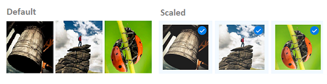

# Scale Effect in .NET MAUI Effects View

## Prerequisites

Before using the [`SfEffectsView`](https://help.syncfusion.com/cr/maui/Syncfusion.Maui.Core.SfEffectsView.html), ensure the following NuGet package is installed in your .NET MAUI project:

- `Syncfusion.Maui.Core`

For a step-by-step setup, refer to the [Getting Started](https://help.syncfusion.com/maui/effects-view/getting-started) documentation.

The [SfEffects.Scale](https://help.syncfusion.com/cr/maui/Syncfusion.Maui.Core.SfEffects.html#Syncfusion_Maui_Core_SfEffects_Scale) effect smoothly scales the `SfEffectsView` and its `Content` from the current size to a new size determined by the [ScaleFactor](https://help.syncfusion.com/cr/maui/Syncfusion.Maui.Core.SfEffectsView.html#Syncfusion_Maui_Core_SfEffectsView_ScaleFactor). The factor is a unit-less multiplier: values below `1` shrink the view, values above `1` grow it.

## Adding a Basic Scale

The example below shrinks the `SfEffectsView` to 85% of its current size when the user long-presses it. The other trigger properties are set to `None` so that only the `Scale` effect fires.

 



<HorizontalStackLayout HorizontalOptions="Center" 
                       Spacing="12">
    <syncEffectsView:SfEffectsView x:Name="EffectsView1"
                                   ScaleFactor="0.85"
                                   LongPressEffects="Scale"
                                   TouchDownEffects="None"
                                   TouchUpEffects="None"
                                   LongPressed="OnEffectsView1LongPressed">
        <Grid WidthRequest="100" 
              HeightRequest="100">
            <Image Source="person3.jpg" 
                   WidthRequest="100" 
                   HeightRequest="100"
                   Aspect="AspectFill" />
            <Border x:Name="Tick1" 
                    Padding="0" 
                    IsVisible="False" 
                    BackgroundColor="Blue"
                    WidthRequest="18" 
                    HeightRequest="18"
                    HorizontalOptions="End" 
                    VerticalOptions="Start"
                    StrokeThickness="0">
                <Border.StrokeShape>
                    <RoundRectangle CornerRadius="9" />
                </Border.StrokeShape>
                <Label Text="✓" 
                       FontSize="12" 
                       TextColor="White" 
                       FontAttributes="Bold" 
                       HorizontalOptions="Center" 
                       VerticalOptions="Center" />
            </Border>
        </Grid>
    </syncEffectsView:SfEffectsView>

    <syncEffectsView:SfEffectsView x:Name="EffectsView2"
                                   ScaleFactor="0.85"
                                   LongPressEffects="Scale"
                                   TouchDownEffects="None"
                                   TouchUpEffects="None"
                                   LongPressed="OnEffectsView2LongPressed">
        <Grid WidthRequest="100" 
              HeightRequest="100">
            <Image Source="person2.jpg" 
                   WidthRequest="100" 
                   HeightRequest="100"
                   Aspect="AspectFill" />
            <Border x:Name="Tick2" 
                    Padding="0" 
                    IsVisible="False" 
                    BackgroundColor="Blue"
                    WidthRequest="18" 
                    HeightRequest="18"
                    HorizontalOptions="End" 
                    VerticalOptions="Start"
                    StrokeThickness="0">
                <Border.StrokeShape>
                    <RoundRectangle CornerRadius="9" />
                </Border.StrokeShape>
                <Label Text="✓" 
                       FontSize="12" 
                       TextColor="White" 
                       FontAttributes="Bold" 
                       HorizontalOptions="Center" 
                       VerticalOptions="Center" />
            </Border>
        </Grid>
    </syncEffectsView:SfEffectsView>

    <syncEffectsView:SfEffectsView x:Name="EffectsView3"
                                   ScaleFactor="0.85"
                                   LongPressEffects="Scale"
                                   TouchDownEffects="None"
                                   TouchUpEffects="None"
                                   LongPressed="OnEffectsView3LongPressed">
        <Grid WidthRequest="100" 
              HeightRequest="100">
            <Image Source="person1.jpg" 
                   WidthRequest="100" 
                   HeightRequest="100"
                   Aspect="AspectFill" />
            <Border x:Name="Tick3" 
                    Padding="0" 
                    IsVisible="False" 
                    BackgroundColor="Blue"
                    WidthRequest="18" 
                    HeightRequest="18"
                    HorizontalOptions="End" 
                    VerticalOptions="Start"
                    StrokeThickness="0">
                <Border.StrokeShape>
                    <RoundRectangle CornerRadius="9" />
                </Border.StrokeShape>
                <Label Text="✓" 
                       FontSize="12" 
                       TextColor="White" 
                       FontAttributes="Bold" 
                       HorizontalOptions="Center" 
                       VerticalOptions="Center" />
            </Border>
        </Grid>
    </syncEffectsView:SfEffectsView>
</HorizontalStackLayout>





/// 

/// Handle LongPressed event for EffectsView1
/// 

private void OnEffectsView1LongPressed(object sender, EventArgs e)
{
    SelectImage(EffectsView1, Tick1);
}

/// 

/// Handle LongPressed event for EffectsView2
/// 

private void OnEffectsView2LongPressed(object sender, EventArgs e)
{
    SelectImage(EffectsView2, Tick2);
}

/// 

/// Handle LongPressed event for EffectsView3
/// 

private void OnEffectsView3LongPressed(object sender, EventArgs e)
{
    SelectImage(EffectsView3, Tick3);
}

/// 

/// Select an image: apply scale effect and show tick mark.
/// 

private async void SelectImage(SfEffectsView effectsView, Border tickFrame)
{
    // Apply scale effect to the newly selected image
    await effectsView.ScaleTo(0.85, 300, Easing.CubicInOut);
    
    // Show the tick mark
    tickFrame.IsVisible = true;
}





## Scaling a Child View

The scale effect also scales the `Content` of the `SfEffectsView`. The example below wraps a styled card in an `SfEffectsView` and shrinks the entire card (border, gradient, and labels) when the user long-presses it.

 



<syncEffectsView:SfEffectsView
    x:Name="effectsView"
    ScaleFactor="0.85"
    ScaleAnimationDuration="400"
    TouchDownEffects="None"
    TouchUpEffects="None"
    LongPressEffects="Scale">
    <Border WidthRequest="280"
            HeightRequest="120"
            StrokeShape="RoundRectangle 18">
        <Border.Background>
            <LinearGradientBrush EndPoint="1,1">
                <GradientStop Color="#FF6B6B" 
                              Offset="0.0" />
                <GradientStop Color="#4ECDC4" 
                              Offset="1.0" />
            </LinearGradientBrush>
        </Border.Background>
        <Grid Padding="16" 
              HorizontalOptions="Center" 
              VerticalOptions="Center">
            <VerticalStackLayout Spacing="4" 
                                 HorizontalOptions="Center" VerticalOptions="Center">
                <Label Text="Long-press to scale"
                       TextColor="White"
                       FontSize="18"
                       FontAttributes="Bold"
                       HorizontalOptions="Center" />
                <Label Text="The whole card shrinks to 85%."
                       TextColor="White"
                       FontSize="13"
                       HorizontalOptions="Center" />
            </VerticalStackLayout>
        </Grid>
    </Border>
</syncEffectsView:SfEffectsView>





var titleLabel = new Label
{
    Text = "Long-press to scale",
    TextColor = Colors.White,
    FontSize = 18,
    FontAttributes = FontAttributes.Bold,
    HorizontalOptions = LayoutOptions.Center
};

var subtitleLabel = new Label
{
    Text = "The whole card shrinks to 85%.",
    TextColor = Colors.White,
    FontSize = 13,
    HorizontalOptions = LayoutOptions.Center
};

var stack = new VerticalStackLayout
{
    Spacing = 4,
    HorizontalOptions = LayoutOptions.Center,
    VerticalOptions = LayoutOptions.Center,
    Children = { titleLabel, subtitleLabel }
};

var grid = new Grid
{
    Padding = new Thickness(16),
    HorizontalOptions = LayoutOptions.Center,
    VerticalOptions = LayoutOptions.Center,
    Children = { stack }
};

var border = new Border
{
    WidthRequest = 280,
    HeightRequest = 120,
    StrokeShape = new RoundRectangle { CornerRadius = 18 },
    Background = new LinearGradientBrush
    {
        EndPoint = new Point(1, 1),
        GradientStops = new GradientStopCollection
        {
            new GradientStop(Color.FromArgb("#FF6B6B"), 0.0f),
            new GradientStop(Color.FromArgb("#4ECDC4"), 1.0f)
        }
    },
    Content = grid
};

var effectsView = new SfEffectsView
{
    ScaleFactor = 0.85,
    ScaleAnimationDuration = 400,
    TouchDownEffects = SfEffects.None,
    TouchUpEffects = SfEffects.None,
    LongPressEffects = SfEffects.Scale,
    Content = border
};

this.Content = effectsView;





## Customizing the Duration

The example below uses a longer animation duration so the scale is easier to see.

 



<syncEffectsView:SfEffectsView x:Name="effectsView"
                               ScaleFactor="0.7"
                               ScaleAnimationDuration="800"
                               TouchDownEffects="None"
                               TouchUpEffects="None"
                               LongPressEffects="Scale">
    <Border WidthRequest="280"
            HeightRequest="120"
            StrokeShape="RoundRectangle 18">
        <Border.Background>
            <LinearGradientBrush EndPoint="1,1">
                <GradientStop Color="#FF6B6B" 
                              Offset="0.0" />
                <GradientStop Color="#4ECDC4" 
                              Offset="1.0" />
            </LinearGradientBrush>
        </Border.Background>
        <Grid Padding="16" 
              HorizontalOptions="Center" 
              VerticalOptions="Center">
            <VerticalStackLayout Spacing="4" 
                                 HorizontalOptions="Center" VerticalOptions="Center">
                <Label Text="Long-press to scale"
                       TextColor="White"
                       FontSize="18"
                       FontAttributes="Bold"
                       HorizontalOptions="Center" />
                <Label Text="The whole card shrinks to 70%."
                       TextColor="White"
                       FontSize="13"
                       HorizontalOptions="Center" />
            </VerticalStackLayout>
        </Grid>
    </Border>
</syncEffectsView:SfEffectsView>





var titleLabel = new Label
{
    Text = "Long-press to scale",
    TextColor = Colors.White,
    FontSize = 18,
    FontAttributes = FontAttributes.Bold,
    HorizontalOptions = LayoutOptions.Center
};

var subtitleLabel = new Label
{
    Text = "The whole card shrinks to 70%.",
    TextColor = Colors.White,
    FontSize = 13,
    HorizontalOptions = LayoutOptions.Center
};

var stack = new VerticalStackLayout
{
    Spacing = 4,
    HorizontalOptions = LayoutOptions.Center,
    VerticalOptions = LayoutOptions.Center,
    Children = { titleLabel, subtitleLabel }
};

var grid = new Grid
{
    Padding = new Thickness(16),
    HorizontalOptions = LayoutOptions.Center,
    VerticalOptions = LayoutOptions.Center,
    Children = { stack }
};

var border = new Border
{
    WidthRequest = 280,
    HeightRequest = 120,
    StrokeShape = new RoundRectangle { CornerRadius = 18 },
    Background = new LinearGradientBrush
    {
        EndPoint = new Point(1, 1),
        GradientStops = new GradientStopCollection
        {
            new GradientStop(Color.FromArgb("#FF6B6B"), 0.0f),
            new GradientStop(Color.FromArgb("#4ECDC4"), 1.0f)
        }
    },
    Content = grid
};

var effectsView = new SfEffectsView
{
    ScaleFactor = 0.7,
    ScaleAnimationDuration = 800,
    TouchDownEffects = SfEffects.None,
    TouchUpEffects = SfEffects.None,
    LongPressEffects = SfEffects.Scale,
    Content = border
};

this.Content = effectsView;





## Combining with Other Effects

`Scale` can be combined with other effects on a different trigger property. The example below plays `Highlight` on press and `Scale` on long-press.

 



<syncEffectsView:SfEffectsView x:Name="effectsView"
                               ScaleFactor="0.85"
                               TouchDownEffects="Highlight"
                               LongPressEffects="Scale">
    <Border WidthRequest="280"
            HeightRequest="120"
            StrokeShape="RoundRectangle 18">
        <Border.Background>
            <LinearGradientBrush EndPoint="1,1">
                <GradientStop Color="#FF6B6B" 
                              Offset="0.0" />
                <GradientStop Color="#4ECDC4" 
                              Offset="1.0" />
            </LinearGradientBrush>
        </Border.Background>
        <Grid Padding="16" 
              HorizontalOptions="Center" 
              VerticalOptions="Center">
            <VerticalStackLayout Spacing="4" 
                                 HorizontalOptions="Center" VerticalOptions="Center">
                <Label Text="Long-press to scale"
                       TextColor="White"
                       FontSize="18"
                       FontAttributes="Bold"
                       HorizontalOptions="Center" />
                <Label Text="The whole card shrinks to 85%."
                       TextColor="White"
                       FontSize="13"
                       HorizontalOptions="Center" />
            </VerticalStackLayout>
        </Grid>
    </Border>
</syncEffectsView:SfEffectsView>





var titleLabel = new Label
{
    Text = "Long-press to scale",
    TextColor = Colors.White,
    FontSize = 18,
    FontAttributes = FontAttributes.Bold,
    HorizontalOptions = LayoutOptions.Center
};

var subtitleLabel = new Label
{
    Text = "The whole card shrinks to 85%.",
    TextColor = Colors.White,
    FontSize = 13,
    HorizontalOptions = LayoutOptions.Center
};

var stack = new VerticalStackLayout
{
    Spacing = 4,
    HorizontalOptions = LayoutOptions.Center,
    VerticalOptions = LayoutOptions.Center,
    Children = { titleLabel, subtitleLabel }
};

var grid = new Grid
{
    Padding = new Thickness(16),
    HorizontalOptions = LayoutOptions.Center,
    VerticalOptions = LayoutOptions.Center,
    Children = { stack }
};

var border = new Border
{
    WidthRequest = 280,
    HeightRequest = 120,
    StrokeShape = new RoundRectangle { CornerRadius = 18 },
    Background = new LinearGradientBrush
    {
        EndPoint = new Point(1, 1),
        GradientStops = new GradientStopCollection
        {
            new GradientStop(Color.FromArgb("#FF6B6B"), 0.0f),
            new GradientStop(Color.FromArgb("#4ECDC4"), 1.0f)
        }
    },
    Content = grid
};

var effectsView = new SfEffectsView
{
    ScaleFactor = 0.85,
    TouchDownEffects = SfEffects.Highlight,
    LongPressEffects = SfEffects.Scale,
    Content = border
};

this.Content = effectsView;





## See also

- [Rotation](https://help.syncfusion.com/maui/effects-view/effects/rotation) covers the other transform-style effect that scales pairs with on a different trigger.  
- [Selection](https://help.syncfusion.com/maui/effects-view/effects/selection) describes the persistent background effect often combined with `Scale` on long-press.  
- [Combining Effects](https://help.syncfusion.com/maui/effects-view/effects/combinations) shows the rules for combining `Scale` with other effects across trigger properties.