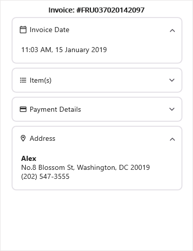

# Getting Started with .NET MAUI Expander (SfExpander)

This section provides a quick overview of how to get started with the SfExpander for .NET MAUI. Walk-through the entire process of creating the real world of this control.

## Creating an application using the .NET MAUI Expander

 1. Create a new .NET MAUI application in Visual Studio.
 2. Syncfusion .NET MAUI components are available on [nuget.org](https://www.nuget.org/). To add SfExpander to your project, open the NuGet package manager in Visual Studio, and search for Syncfusion.Maui.Expander and install it.
 3. Import the control namespace `Syncfusion.Maui.Expander` in XAML or C# code.
 4. Initialize the `SfExpander` control.
 



<ContentPage   
    . . .
    xmlns:syncfusion="clr-namespace:Syncfusion.Maui.Expander;assembly=Syncfusion.Maui.Expander">

    <syncfusion:SfExpander />
</ContentPage>




using Syncfusion.Maui.Expander;
. . .

public partial class MainPage : ContentPage
{
    public MainPage()
    {
        InitializeComponent();
        SfExpander expander = new SfExpander();
    }
}




## Register the handler

The `Syncfusion.Maui.Core` NuGet package is a dependency for all Syncfusion controls in .NET MAUI. In `the MauiProgram.cs` file, register the handler for Syncfusion Core.



using Microsoft.Maui.Controls.Hosting;
using Microsoft.Maui.Controls.Xaml;
using Microsoft.Maui.Hosting;
using Syncfusion.Maui.Core.Hosting;

namespace GettingStarted
{
    public class MauiProgram 
    {
        public static MauiApp CreateMauiApp()
        {
            var builder = MauiApp.CreateBuilder();
            builder
                .UseMauiApp<App>()
                .ConfigureFonts(fonts =>
                {
                    fonts.AddFont("OpenSans-Regular.ttf", "OpenSansRegular");
                });

            builder.ConfigureSyncfusionCore();
            return builder.Build();
        }
    }
}
 


### Defining expander 

The `SfExpander` is a layout control comprised of the Header and Content. Load any View in the `Header` and `Content`. Content visibility of the expander can be set by using the `IsExpanded` property of the `Expander`. Users can expand or collapse the Content view by tapping the Header.

Here, the Grid with Labels is loaded in the Header and Content of the expander. 

N> Loading the `Label` as direct children of the `Header` or `Content` of the Expander will lead to an exception. So, load the Label inside the Grid to overcome the crash.




<?xml version="1.0" encoding="utf-8" ?>
<ContentPage xmlns="http://schemas.microsoft.com/dotnet/2021/maui"
             xmlns:x="http://schemas.microsoft.com/winfx/2009/xaml"
             xmlns:syncfusion="clr-namespace:Syncfusion.Maui.Expander;assembly=Syncfusion.Maui.Expander"
             x:Class="GettingStarted.MainPage">

    <ContentPage.Content>
        <ScrollView >
            <StackLayout  HorizontalOptions="{OnPlatform MacCatalyst=Center,WinUI=Center}"  >
                <Label Text="Invoice: #FRU037020142097"  Opacity="1.0" VerticalTextAlignment="Center" Margin="0,0,0,5" FontAttributes="Bold" VerticalOptions="Center" HorizontalOptions="CenterAndExpand"/>
                <Border StrokeShape="RoundRectangle 8,8,8,8" Margin="{OnPlatform Default='8,0,8,8',WinUI='8,0,6,8',MacCatalyst='8,0,6,8'}" Stroke="#CAC4D0"  StrokeThickness="{OnPlatform MacCatalyst=2,Default=1}" WidthRequest="{OnPlatform MacCatalyst=460,WinUI=340}">
                    <syncfusion:SfExpander AnimationDuration="200" IsExpanded="True" >
                        <syncfusion:SfExpander.Header>
                            <Grid >
                                <Grid.RowDefinitions>
                                    <RowDefinition Height="48"/>
                                </Grid.RowDefinitions>
                                <Grid.ColumnDefinitions>
                                    <ColumnDefinition Width="35"/>
                                    <ColumnDefinition Width="*"/>
                                </Grid.ColumnDefinitions>
                                <Label Text="&#xe703;" FontSize="16" Margin="14,2,2,2"
                                                   FontFamily='{OnPlatform Android=AccordionFontIcons.ttf#,WinUI=AccordionFontIcons.ttf#AccordionFontIcons,MacCatalyst=AccordionFontIcons,iOS=AccordionFontIcons}'
                                                   VerticalOptions="Center" VerticalTextAlignment="Center"/>
                                <Label CharacterSpacing="0.25" FontFamily="Roboto-Regular"  Text="Invoice Date" FontSize="14" Grid.Column="1" VerticalOptions="CenterAndExpand"/>
                            </Grid>
                        </syncfusion:SfExpander.Header>
                        <syncfusion:SfExpander.Content>
                            <Grid Padding="18,8,0,18" >
                                <Label CharacterSpacing="0.25" FontFamily="Roboto-Regular"  Text="11:03 AM, 15 January 2019" FontSize="14" VerticalOptions="CenterAndExpand"/>
                            </Grid>
                        </syncfusion:SfExpander.Content>
                    </syncfusion:SfExpander>
                </Border>
                <Border StrokeShape="RoundRectangle 8,8,8,8" Margin="{OnPlatform Default='8,0,8,8',WinUI='8,0,6,8',MacCatalyst='8,0,6,8'}" Stroke="#CAC4D0"  StrokeThickness="{OnPlatform MacCatalyst=2,Default=1}" WidthRequest="{OnPlatform MacCatalyst=460,WinUI=340}">
                    <syncfusion:SfExpander  AnimationDuration="200" IsExpanded="False">
                        <syncfusion:SfExpander.Header>
                            <Grid>
                                <Grid.RowDefinitions>
                                    <RowDefinition Height="48"/>
                                </Grid.RowDefinitions>
                                <Grid.ColumnDefinitions>
                                    <ColumnDefinition Width="35"/>
                                    <ColumnDefinition Width="*"/>
                                </Grid.ColumnDefinitions>
                                <Label Text="&#xe701;" FontSize="16" Margin="14,2,2,2"
                                                   FontFamily='{OnPlatform Android=AccordionFontIcons.ttf#,WinUI=AccordionFontIcons.ttf#AccordionFontIcons,MacCatalyst=AccordionFontIcons,iOS=AccordionFontIcons}'
                                                   VerticalOptions="Center" VerticalTextAlignment="Center"/>
                                <Label CharacterSpacing="0.25" FontFamily="Roboto-Regular"  Text="Item(s)" FontSize="14" Grid.Column="1" VerticalOptions="CenterAndExpand"/>
                            </Grid>
                        </syncfusion:SfExpander.Header>
                        <syncfusion:SfExpander.Content>
                            <Grid Padding="18,8,18,18">
                                <Grid.RowDefinitions>
                                    <RowDefinition Height="20"/>
                                    <RowDefinition Height="20"/>
                                    <RowDefinition Height="20"/>
                                    <RowDefinition Height="20"/>
                                    <RowDefinition Height="20"/>
                                    <RowDefinition Height="20"/>
                                    <RowDefinition Height="20"/>
                                </Grid.RowDefinitions>
                                <Grid.ColumnDefinitions>
                                    <ColumnDefinition Width="*"/>
                                    <ColumnDefinition Width="*"/>
                                </Grid.ColumnDefinitions>
                                <Label FontSize="14" CharacterSpacing="0.25"  Text="2018 Subaru Outback"/>
                                <Label FontSize="14" CharacterSpacing="0.25"  Text="All-Weather Mats" Grid.Row="1"/>
                                <Label FontSize="14" CharacterSpacing="0.25"  Text="Door Edge Guard Kit" Grid.Row="2"/>
                                <Label FontSize="14" CharacterSpacing="0.25"  Text="Rear Bumper Cover" Grid.Row="3"/>
                                <Label FontSize="14" CharacterSpacing="0.25"  Text="Wheel Locks" Grid.Row="4"/>
                                <Label FontSize="14" CharacterSpacing="0.25"  Text="Gas Full Tank" Grid.Row="5"/>
                                <Label FontSize="14" CharacterSpacing="0.25"  Text="Total Amount" TextColor="{StaticResource Primary}" Grid.Row="6"/>

                                <Label FontSize="14" CharacterSpacing="0.25"  HorizontalOptions="End" Text="$35,705.00" Grid.Row="0" Grid.Column="1"/>
                                <Label FontSize="14" CharacterSpacing="0.25"  HorizontalOptions="End" Text="$101.00" Grid.Row="1" Grid.Column="1"/>
                                <Label FontSize="14" CharacterSpacing="0.25"  HorizontalOptions="End" Text="$162.00" Grid.Row="2" Grid.Column="1"/>
                                <Label FontSize="14" CharacterSpacing="0.25"  HorizontalOptions="End" Text="$107.00" Grid.Row="3" Grid.Column="1"/>
                                <Label FontSize="14" CharacterSpacing="0.25"  HorizontalOptions="End" Text="$81.00" Grid.Row="4" Grid.Column="1"/>
                                <Label FontSize="14" CharacterSpacing="0.25"  HorizontalOptions="End" Text="$64.00" Grid.Row="5" Grid.Column="1"/>
                                <Label FontSize="14" CharacterSpacing="0.25"  HorizontalOptions="End" Text="$36,220.00" TextColor="{StaticResource Primary}" Grid.Row="6" Grid.Column="1"/>
                            </Grid>
                        </syncfusion:SfExpander.Content>
                    </syncfusion:SfExpander>
                </Border>
                <Border StrokeShape="RoundRectangle 8,8,8,8" Margin="{OnPlatform Default='8,0,8,8',WinUI='8,0,6,8',MacCatalyst='8,0,6,8'}" Stroke="#CAC4D0" StrokeThickness="{OnPlatform MacCatalyst=2,Default=1}" WidthRequest="{OnPlatform MacCatalyst=460,WinUI=340}">
                    <syncfusion:SfExpander AnimationDuration="200"  IsExpanded="False">
                        <syncfusion:SfExpander.Header>
                            <Grid>
                                <Grid.RowDefinitions>
                                    <RowDefinition Height="48"/>
                                </Grid.RowDefinitions>
                                <Grid.ColumnDefinitions>
                                    <ColumnDefinition Width="35"/>
                                    <ColumnDefinition Width="*"/>
                                </Grid.ColumnDefinitions>
                                <Label Text="&#xe702;" FontSize="16" Margin="14,2,2,2"
                                                   FontFamily='{OnPlatform Android=AccordionFontIcons.ttf#,WinUI=AccordionFontIcons.ttf#AccordionFontIcons,MacCatalyst=AccordionFontIcons,iOS=AccordionFontIcons}'
                                                   VerticalOptions="Center" VerticalTextAlignment="Center"/>
                                <Label CharacterSpacing="0.25" FontFamily="Roboto-Regular"  Text="Payment Details" FontSize="14" Grid.Column="1" VerticalOptions="CenterAndExpand"/>
                            </Grid>
                        </syncfusion:SfExpander.Header>
                        <syncfusion:SfExpander.Content>
                            <Grid Padding="18,8,18,18"  RowSpacing="6" >
                                <Grid.Resources>
                                    
                                </Grid.Resources>
                                <Grid.RowDefinitions>
                                    <RowDefinition Height="20"/>
                                    <RowDefinition Height="20"/>
                                    <RowDefinition Height="20"/>
                                </Grid.RowDefinitions>
                                <Grid.ColumnDefinitions>
                                    <ColumnDefinition Width="*"/>
                                    <ColumnDefinition Width="*"/>
                                </Grid.ColumnDefinitions>
                                <Label FontSize="14" CharacterSpacing="0.25"  Text="Card Payment"/>
                                <Label FontSize="14" CharacterSpacing="0.25"  Text="Third-Party coupons" Grid.Row="1"/>
                                <Label FontSize="14" CharacterSpacing="0.25"  Text="Total Amount Paid" TextColor="{StaticResource Primary}" Grid.Row="2"/>
                                <Label FontSize="14" CharacterSpacing="0.25"  HorizontalOptions="End" Text="$31,200.00" Grid.Column="1"/>
                                <Label FontSize="14" CharacterSpacing="0.25"  HorizontalOptions="End" Text="$5,000.00" Grid.Row="1" Grid.Column="1"/>
                                <Label FontSize="14" CharacterSpacing="0.25"  HorizontalOptions="End" Text="$36,200.00" TextColor="{StaticResource Primary}" Grid.Row="2" Grid.Column="1"/>
                            </Grid>
                        </syncfusion:SfExpander.Content>
                    </syncfusion:SfExpander>
                </Border>
                <Border StrokeShape="RoundRectangle 8,8,8,8" Margin="{OnPlatform Default='8,0,8,8',WinUI='8,0,6,8',MacCatalyst='8,0,6,8'}" Stroke="#CAC4D0" StrokeThickness="{OnPlatform MacCatalyst=2,Default=1}" WidthRequest="{OnPlatform MacCatalyst=460,WinUI=340}">
                    <syncfusion:SfExpander AnimationDuration="200" IsExpanded="True">
                        <syncfusion:SfExpander.Header>
                            <Grid>
                                <Grid.RowDefinitions>
                                    <RowDefinition Height="48"/>
                                </Grid.RowDefinitions>
                                <Grid.ColumnDefinitions>
                                    <ColumnDefinition Width="35"/>
                                    <ColumnDefinition Width="*"/>
                                </Grid.ColumnDefinitions>
                                <Label Text="&#xe704;" FontSize="16" Margin="14,2,2,2"
                                                   FontFamily='{OnPlatform Android=AccordionFontIcons.ttf#,WinUI=AccordionFontIcons.ttf#AccordionFontIcons,MacCatalyst=AccordionFontIcons,iOS=AccordionFontIcons}'
                                                   VerticalOptions="Center" VerticalTextAlignment="Center"/>
                                <Label CharacterSpacing="0.25" FontFamily="Roboto-Regular" FontSize="14" Text="Address" Grid.Column="1" VerticalOptions="CenterAndExpand"/>
                            </Grid>
                        </syncfusion:SfExpander.Header>
                        <syncfusion:SfExpander.Content>
                            <Grid Padding="18,8,18,18" Grid.Row="1" RowSpacing="1">
                                <Grid.Resources>
                                    
                                </Grid.Resources>
                                <Grid.RowDefinitions >
                                    <RowDefinition Height="Auto"/>
                                    <RowDefinition Height="Auto"/>
                                    <RowDefinition Height="Auto"/>
                                </Grid.RowDefinitions>
                                <Label CharacterSpacing="0.25"  FontSize="14" Text="Alex" FontAttributes="Bold"/>
                                <Label CharacterSpacing="0.25"  FontSize="14" Text="No.8 Blossom St, Washington, DC 20019" Grid.Row="1"/>
                                <Label CharacterSpacing="0.25"  FontSize="14" Text="(202) 547-3555" Grid.Row="2"/>
                            </Grid>
                        </syncfusion:SfExpander.Content>
                    </syncfusion:SfExpander>
                </Border>
            </StackLayout>
        </ScrollView>
    </ContentPage.Content>
</ContentPage>



Now, run the application to render the desired output.

## Animation duration

The `SfExpander` allows you to customize the expanding and collapsing duration by using the `AnimationDuration` property. By default, the animation duration is `200 milliseconds`.



    <syncfusion:SfExpander x:Name="expander" AnimationDuration="250"/>


    expander.AnimationDuration = 250;



## Animation easing

The `SfExpander` allows you to customize the rate of change of parameters over time or animation style by using the `AnimationEasing` property. By default, the animation easing is `Linear`.



    <syncfusion:SfExpander x:Name="expander" AnimationEasing="SinOut"/>       


    expander.AnimationEasing = Syncfusion.Maui.Expander.AnimationEasing.SinOut;



## Expand and collapse 

The `SfExpander` allows you to programmatically expand and collapse by using the `IsExpanded` property of the SfExpander. The user can control the expand and collapse interactions by handling the `Expanding` and `Collapsing` events.



    <syncfusion:SfExpander x:Name="expander" IsExpanded="True"/>        


    expander.IsExpanded = true;



### Customize the expander when collapsing or expanding

Customize the expander by using the `Collapsed` event. This event occurs after a `SfExpander` is collapsed when tapping on the header.



<syncfusion:SfExpander x:Name ="expander" Collapsed="Expander_Collapsed">
    <syncfusion:SfExpander.Header>
        <Grid>
            <Label x:Name="label"  Text="Veggie burger" FontSize="Large"/>
        </Grid>
    </syncfusion:SfExpander.Header>
	
    <syncfusion:SfExpander.Content>
        <Grid>
            <Label Text="Veggie burger, garden burger, or tofu burger uses a meat analogue, a meat substitute such as tofu, textured vegetable protein, seitan (wheat gluten), Quorn, beans, grains or an assortment of vegetables, which are ground up and formed into patties."/>
        </Grid>
    </syncfusion:SfExpander.Content>
</syncfusion:SfExpander> 


private void Expander_Collapsed(object sender, ExpandedAndCollapsedEventArgs e)
{
    label.Text = "Burger and Pizza";
    expander.HeaderBackground = Colors.Aqua;
}



Customize the expander by using the `Expanded` event. It will occur after a `SfExpander` is expanded when tapping the header.



<syncfusion:SfExpander x:Name ="expander" Expanded="Expander_Expanded">
    <syncfusion:SfExpander.Header>
        <Grid >
            <Label x:Name="label"  Text="Veggie burger" FontSize="Large"/>
        </Grid>
    </syncfusion:SfExpander.Header>
	
    <syncfusion:SfExpander.Content>
        <Grid>
            <Label Text="Veggie burger, garden burger, or tofu burger uses a meat analogue, a meat substitute such as tofu, textured vegetable protein, seitan (wheat gluten), Quorn, beans, grains or an assortment of vegetables, which are ground up and formed into patties."/>
        </Grid>
    </syncfusion:SfExpander.Content>
</syncfusion:SfExpander>


private void Expander_Expanded(object sender, ExpandedAndCollapsedEventArgs e)
{
    label.Text = "Burger";
    expander.HeaderBackground = Colors.YellowGreen;
}



### Restricting the expander while expanding and collapsing 

Prevent the Expander from being collapsed by handling the `Collapsing` event. This event occurs when a user attempts to collapse the `SfExpander` by tapping the header. Cancel the user action by setting the `Cancel` property of the `ExpandingAndCollapsingEventArgs`.


<syncfusion:SfExpander x:Name ="expander" Collapsing="Expander_Collapsing" >
</syncfusion:SfExpander>


private void Expander_Collapsing(object sender, ExpandingAndCollapsingEventArgs e)
{
   e.Cancel = true;
}



Restrict the Expander being expanded by the `Expanding` event. This event occurs when a user tries to expand the `SfExpander` while tapping the header. Cancel the user action using the `Cancel` property of the `ExpandingAndCollapsingEventArgs`.



<syncfusion:SfExpander x:Name ="expander" Expanding="Expander_Expanding" >
</syncfusion:SfExpander>


private void Expander_Expanding(object sender, ExpandingAndCollapsingEventArgs e)
{
   e.Cancel = true;
}

 

