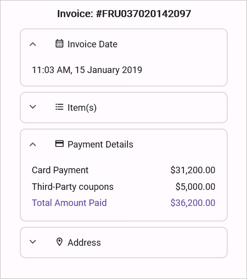
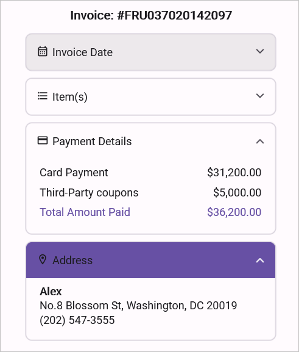

# Appearance in .NET MAUI Expander (SfExpander)

The Expander allows to customize the appearance of the Icon and provides various functionalities to the users.

## Header icon position 

The `SfExpander` allows you to customize the position of the header icon by using the `HeaderIconPosition` property. By default, the header icon position is `End`. 



    <syncfusion:SfExpander x:Name="expander" HeaderIconPosition="Start" />


    expander.HeaderIconPosition = Syncfusion.Maui.Expander.ExpanderIconPosition.Start;



## Header background color customization

The `SfExpander` allows you to customize the background color of the expander header by using the `HeaderBackgroundColor` property.



    <syncfusion:SfExpander x:Name="expander" HeaderBackground="Pink"/>


    expander.HeaderBackground = Colors.Pink;



## Icon color customization

The `SfExpander` allows you to customize the color of the expander icon by using the `HeaderIconColor` property.



    <syncfusion:SfExpander x:Name="expander" HeaderIconColor="Brown"/>


    expander.HeaderIconColor = Colors.Brown;



## Visual State Manager

The appearance of the `SfExpander` can be customized using the following two `VisualStates`:

* Expanded
* Collapsed



<syncfusion:SfExpander x:Name="expander1" IsExpanded="True" >
    <syncfusion:SfExpander.Header>
        <Grid >
            <Grid.RowDefinitions>
                <RowDefinition Height="48"/>
            </Grid.RowDefinitions>
            <Grid.ColumnDefinitions>
                <ColumnDefinition Width="35"/>
                <ColumnDefinition Width="*"/>
            </Grid.ColumnDefinitions>
            <Label Text="&#xe703;" FontSize="16" Margin="14,2,2,2"
                                    TextColor="{Binding Path=HeaderIconColor,Source={x:Reference expander1}}"
                                    FontFamily='{OnPlatform Android=AccordionFontIcons.ttf#,WinUI=AccordionFontIcons.ttf#AccordionFontIcons,MacCatalyst=AccordionFontIcons,iOS=AccordionFontIcons}'
                                    VerticalOptions="Center" VerticalTextAlignment="Center"/>
            <Label CharacterSpacing="0.25" TextColor="{Binding Path=HeaderIconColor,Source={x:Reference expander1}}" FontFamily="Roboto-Regular"  Text="Invoice Date" FontSize="14" Grid.Column="1" VerticalOptions="CenterAndExpand"/>
            </Grid>
    </syncfusion:SfExpander.Header>
    <syncfusion:SfExpander.Content>
        <Grid Padding="18,8,0,18" >
            <Label CharacterSpacing="0.25" FontFamily="Roboto-Regular"  Text="11:03 AM, 15 January 2019" FontSize="14" VerticalOptions="CenterAndExpand"/>
        </Grid>
    </syncfusion:SfExpander.Content>
    <VisualStateManager.VisualStateGroups>
        <VisualStateGroupList>
            <VisualStateGroup>
                <VisualState Name="Expanded">
                    <VisualState.Setters>
                            <Setter Property="HeaderBackground" Value="#6750A4"/>
                            <Setter Property="HeaderIconColor" Value="#FFFFFF"/>
                        </VisualState.Setters>
                </VisualState>
                <VisualState Name="Collapsed">
                    <VisualState.Setters>
                            <Setter Property="HeaderBackground" Value="#141C1B1F"/>
                            <Setter Property="HeaderIconColor" Value="#49454F"/>
                        </VisualState.Setters>
                </VisualState>
            </VisualStateGroup>
        </VisualStateGroupList>
    </VisualStateManager.VisualStateGroups>
</syncfusion:SfExpander>


SfExpander expander = new SfExpander();
expander.IsExpanded = true;

Grid headerGrid = new Grid();
headerGrid.RowDefinitions.Add(new RowDefinition { Height = 48 });
headerGrid.ColumnDefinitions.Add(new ColumnDefinition { Width = 35 });
headerGrid.ColumnDefinitions.Add(new ColumnDefinition { Width = GridLength.Star });
Label headerIconLabel = new Label { Text = "\ue703", Margin = new Thickness(14, 2, 2, 2), FontSize = 16, VerticalOptions = LayoutOptions.Center, VerticalTextAlignment = TextAlignment.Center, FontFamily = DeviceInfo.Platform == DevicePlatform.WinUI ? "AccordionFontIcons.ttf#AccordionFontIcons" : DeviceInfo.Platform == DevicePlatform.Android ? "AccordionFontIcons.ttf#" : DeviceInfo.Platform == DevicePlatform.iOS ? "AccordionFontIcons" : "AccordionFontIcons" };
headerIconLabel.Margin = new Thickness(14, 2, 2, 2);
headerIconLabel.FontSize = 16;
headerIconLabel.SetBinding(Label.TextColorProperty, new Binding("HeaderIconColor", source: expander));

Label headerTextLabel = new Label { Text = "Invoice Date", CharacterSpacing = 0.25, FontSize = 14, FontFamily = "Roboto-Regular", VerticalOptions = LayoutOptions.CenterAndExpand };
headerGrid.Children.Add(headerIconLabel);
headerGrid.Children.Add(headerTextLabel);
headerGrid.SetColumn(headerTextLabel, 1);
expander.Header = headerGrid;
headerTextLabel.SetBinding(Label.TextColorProperty, new Binding("HeaderIconColor", source: expander));
headerTextLabel.CharacterSpacing = 0.25;
headerTextLabel.FontSize = 14;

Grid contentGrid = new Grid();
contentGrid.Padding = new Thickness(18, 8, 0, 18);
Label contentLabel = new Label { Text = "11:03 AM, 15 January 2019", FontSize = 14, FontFamily = "Roboto-Regular", VerticalOptions = LayoutOptions.CenterAndExpand };
contentLabel.FontSize = 14;
contentGrid.Children.Add(contentLabel);
expander.Content = contentGrid;

VisualStateGroupList visualStateGroupList = new VisualStateGroupList();
VisualStateGroup commonStateGroup = new VisualStateGroup();

VisualState expanded = new VisualState
{
    Name = "Expanded"
};
expanded.Setters.Add(new Setter { Property = SfExpander.HeaderBackgroundProperty, Value = Color.FromHex("#6750A4") });
expanded.Setters.Add(new Setter { Property = SfExpander.HeaderIconColorProperty, Value = Color.FromHex("#FFFFFF") });

VisualState collapsed = new VisualState
{
    Name = "Collapsed"
};
collapsed.Setters.Add(new Setter { Property = SfExpander.HeaderBackgroundProperty, Value = Color.FromHex("#141C1B1F") });
collapsed.Setters.Add(new Setter { Property = SfExpander.HeaderIconColorProperty, Value = Color.FromHex("#49454F") });

commonStateGroup.States.Add(expanded);
commonStateGroup.States.Add(collapsed);

visualStateGroupList.Add(commonStateGroup);
VisualStateManager.SetVisualStateGroups(expander, visualStateGroupList);
this.Content = expander;



