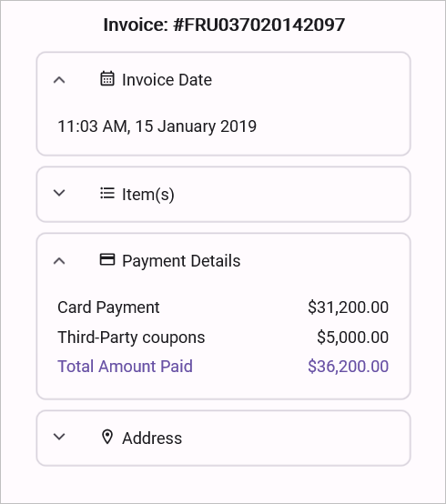
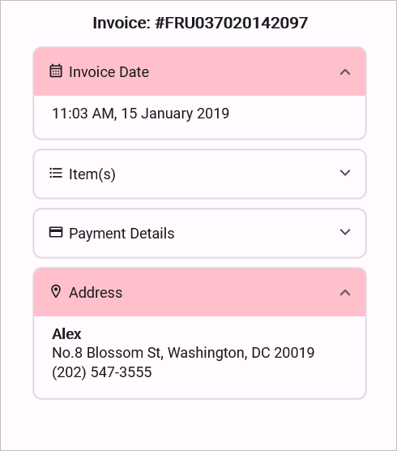
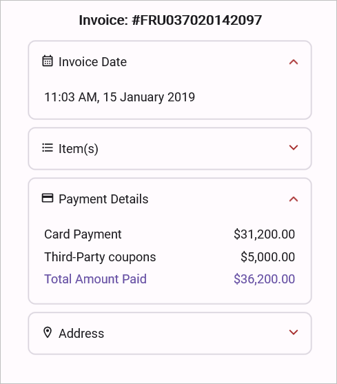
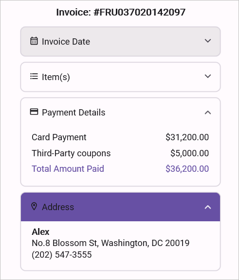

# Appearance in .NET MAUI Expander (SfExpander)

The .NET MAUI SfExpander comes with built-in support for customizing the appearance of the header.

## Header icon position 

The [SfExpander](https://help.syncfusion.com/cr/maui/Syncfusion.Maui.Expander.SfExpander.html) allows you to customize the position of the header icon by using the [HeaderIconPosition](https://help.syncfusion.com/cr/maui/Syncfusion.Maui.Expander.SfExpander.html#Syncfusion_Maui_Expander_SfExpander_HeaderIconPosition) property. By default, the header icon position is [End](https://help.syncfusion.com/cr/maui/Syncfusion.Maui.Expander.ExpanderIconPosition.html#Syncfusion_Maui_Expander_ExpanderIconPosition_End). 



<ContentPage.Content>
    <ScrollView>
        <StackLayout HorizontalOptions="{OnPlatform MacCatalyst=Center,WinUI=Center}" >
            <Label Text="Invoice: #FRU037020142097" Opacity="1.0" VerticalTextAlignment="Center" Margin="0,0,0,5" FontAttributes="Bold" VerticalOptions="Center" HorizontalOptions="Center"/>
            <Border StrokeShape="RoundRectangle 8,8,8,8" Margin="{OnPlatform Default='8,0,8,8',WinUI='8,0,6,8',MacCatalyst='8,0,6,8'}" Stroke="#CAC4D0"  StrokeThickness="{OnPlatform MacCatalyst=2,Default=1}" WidthRequest="{OnPlatform MacCatalyst=460,WinUI=340}">
                <syncfusion:SfExpander x:Name="expander"
                                       IsExpanded="true"
                                       HeaderIconPosition="Start">
                    <syncfusion:SfExpander.Header>
                        <Grid RowDefinitions="48" ColumnDefinitions="35,*">
                            <Label Text="&#xe703;" FontSize="16" Margin="14,2,2,2" FontFamily='{OnPlatform Android=AccordionFontIcons.ttf#,WinUI=AccordionFontIcons.ttf#AccordionFontIcons,MacCatalyst=AccordionFontIcons,iOS=AccordionFontIcons}'
                                   VerticalOptions="Center" VerticalTextAlignment="Center"/>
                            <Label CharacterSpacing="0.25" FontFamily="Roboto-Regular"  Text="Invoice Date" FontSize="14" Grid.Column="1" VerticalOptions="Center"/>
                        </Grid>
                    </syncfusion:SfExpander.Header>
                    <syncfusion:SfExpander.Content>
                        <Grid Padding="18,8,0,18" >
                            <Label CharacterSpacing="0.25" FontFamily="Roboto-Regular" Text="11:03 AM, 15 January 2019" FontSize="14" VerticalOptions="Center"/>
                        </Grid>
                    </syncfusion:SfExpander.Content>
                </syncfusion:SfExpander>
            </Border>
            <Border StrokeShape="RoundRectangle 8,8,8,8" Margin="{OnPlatform Default='8,0,8,8',WinUI='8,0,6,8',MacCatalyst='8,0,6,8'}" Stroke="#CAC4D0"  StrokeThickness="{OnPlatform MacCatalyst=2,Default=1}" WidthRequest="{OnPlatform MacCatalyst=460,WinUI=340}">
                <syncfusion:SfExpander AnimationDuration="200" 
                                       IsExpanded="False"
                                       HeaderIconPosition="Start">
                    <syncfusion:SfExpander.Header>
                        <Grid RowDefinitions="48" ColumnDefinitions="35,*">
                            <Label Text="&#xe701;" FontSize="16" Margin="14,2,2,2" FontFamily='{OnPlatform Android=AccordionFontIcons.ttf#,WinUI=AccordionFontIcons.ttf#AccordionFontIcons,MacCatalyst=AccordionFontIcons,iOS=AccordionFontIcons}' VerticalOptions="Center" VerticalTextAlignment="Center"/>
                            <Label CharacterSpacing="0.25" FontFamily="Roboto-Regular" Text="Item(s)" FontSize="14" Grid.Column="1" VerticalOptions="Center"/>
                        </Grid>
                    </syncfusion:SfExpander.Header>
                    <syncfusion:SfExpander.Content>
                        <Grid Padding="18,8,18,18" RowDefinitions="20,20,20,20,20,20,20" ColumnDefinitions="*,*">
                            <Label FontSize="14" CharacterSpacing="0.25" Text="2018 Subaru Outback"/>
                            <Label FontSize="14" CharacterSpacing="0.25" Text="All-Weather Mats" Grid.Row="1"/>
                            <Label FontSize="14" CharacterSpacing="0.25" Text="Door Edge Guard Kit" Grid.Row="2"/>
                            <Label FontSize="14" CharacterSpacing="0.25" Text="Rear Bumper Cover" Grid.Row="3"/>
                            <Label FontSize="14" CharacterSpacing="0.25" Text="Wheel Locks" Grid.Row="4"/>
                            <Label FontSize="14" CharacterSpacing="0.25" Text="Gas Full Tank" Grid.Row="5"/>
                            <Label FontSize="14" CharacterSpacing="0.25" Text="Total Amount" TextColor="{StaticResource Primary}" Grid.Row="6"/>
                            <Label FontSize="14" CharacterSpacing="0.25" HorizontalOptions="End" Text="$35,705.00" Grid.Row="0" Grid.Column="1"/>
                            <Label FontSize="14" CharacterSpacing="0.25" HorizontalOptions="End" Text="$101.00" Grid.Row="1" Grid.Column="1"/>
                            <Label FontSize="14" CharacterSpacing="0.25" HorizontalOptions="End" Text="$162.00" Grid.Row="2" Grid.Column="1"/>
                            <Label FontSize="14" CharacterSpacing="0.25" HorizontalOptions="End" Text="$107.00" Grid.Row="3" Grid.Column="1"/>
                            <Label FontSize="14" CharacterSpacing="0.25" HorizontalOptions="End" Text="$81.00" Grid.Row="4" Grid.Column="1"/>
                            <Label FontSize="14" CharacterSpacing="0.25" HorizontalOptions="End" Text="$64.00" Grid.Row="5" Grid.Column="1"/>
                            <Label FontSize="14" CharacterSpacing="0.25" HorizontalOptions="End" Text="$36,220.00" TextColor="{StaticResource Primary}" Grid.Row="6" Grid.Column="1"/>
                        </Grid>
                    </syncfusion:SfExpander.Content>
                </syncfusion:SfExpander>
            </Border>
            <Border StrokeShape="RoundRectangle 8,8,8,8" Margin="{OnPlatform Default='8,0,8,8',WinUI='8,0,6,8',MacCatalyst='8,0,6,8'}" Stroke="#CAC4D0" StrokeThickness="{OnPlatform MacCatalyst=2,Default=1}" WidthRequest="{OnPlatform MacCatalyst=460,WinUI=340}">
                <syncfusion:SfExpander AnimationDuration="200"  
                                       IsExpanded="False"
                                       HeaderIconPosition="Start">
                    <syncfusion:SfExpander.Header>
                        <Grid RowDefinitions="48" ColumnDefinitions="35,*">
                            <Label Text="&#xe702;" FontSize="16" Margin="14,2,2,2" FontFamily='{OnPlatform Android=AccordionFontIcons.ttf#,WinUI=AccordionFontIcons.ttf#AccordionFontIcons,MacCatalyst=AccordionFontIcons,iOS=AccordionFontIcons}' VerticalOptions="Center" VerticalTextAlignment="Center"/>
                            <Label CharacterSpacing="0.25" FontFamily="Roboto-Regular" Text="Payment Details" FontSize="14" Grid.Column="1" VerticalOptions="Center"/>
                        </Grid>
                    </syncfusion:SfExpander.Header>
                    <syncfusion:SfExpander.Content>
                        <Grid Padding="18,8,18,18" RowSpacing="6" RowDefinitions="20,20,20" ColumnDefinitions="*,*">
                            <Grid.Resources>
                                
                            </Grid.Resources>
                            <Label FontSize="14" CharacterSpacing="0.25" Text="Card Payment"/>
                            <Label FontSize="14" CharacterSpacing="0.25" Text="Third-Party coupons" Grid.Row="1"/>
                            <Label FontSize="14" CharacterSpacing="0.25" Text="Total Amount Paid" TextColor="{StaticResource Primary}" Grid.Row="2"/>
                            <Label FontSize="14" CharacterSpacing="0.25" HorizontalOptions="End" Text="$31,200.00" Grid.Column="1"/>
                            <Label FontSize="14" CharacterSpacing="0.25" HorizontalOptions="End" Text="$5,000.00" Grid.Row="1" Grid.Column="1"/>
                            <Label FontSize="14" CharacterSpacing="0.25" HorizontalOptions="End" Text="$36,200.00" TextColor="{StaticResource Primary}" Grid.Row="2" Grid.Column="1"/>
                        </Grid>
                    </syncfusion:SfExpander.Content>
                </syncfusion:SfExpander>
            </Border>
            <Border StrokeShape="RoundRectangle 8,8,8,8" Margin="{OnPlatform Default='8,0,8,8',WinUI='8,0,6,8',MacCatalyst='8,0,6,8'}" Stroke="#CAC4D0" StrokeThickness="{OnPlatform MacCatalyst=2,Default=1}" WidthRequest="{OnPlatform MacCatalyst=460,WinUI=340}">
                <syncfusion:SfExpander AnimationDuration="200" 
                                       IsExpanded="True"
                                       HeaderIconPosition="Start">
                    <syncfusion:SfExpander.Header>
                        <Grid RowDefinitions="48" ColumnDefinitions="35,*">
                            <Label Text="&#xe704;" FontSize="16" Margin="14,2,2,2" FontFamily='{OnPlatform Android=AccordionFontIcons.ttf#,WinUI=AccordionFontIcons.ttf#AccordionFontIcons,MacCatalyst=AccordionFontIcons,iOS=AccordionFontIcons}' VerticalOptions="Center" VerticalTextAlignment="Center"/>
                            <Label CharacterSpacing="0.25" FontFamily="Roboto-Regular" FontSize="14" Text="Address" Grid.Column="1" VerticalOptions="Center"/>
                        </Grid>
                    </syncfusion:SfExpander.Header>
                    <syncfusion:SfExpander.Content>
                        <Grid Padding="18,8,18,18" Grid.Row="1" RowSpacing="1" RowDefinitions="Auto,Auto,Auto">
                            <Grid.Resources>
                                
                            </Grid.Resources>
                            <Label CharacterSpacing="0.25" FontSize="14" Text="Alex" FontAttributes="Bold"/>
                            <Label CharacterSpacing="0.25" FontSize="14" Text="No.8 Blossom St, Washington, DC 20019" Grid.Row="1"/>
                            <Label CharacterSpacing="0.25" FontSize="14" Text="(202) 547-3555" Grid.Row="2"/>
                        </Grid>
                    </syncfusion:SfExpander.Content>
                </syncfusion:SfExpander>
            </Border>
        </StackLayout>
    </ScrollView>
</ContentPage.Content>


public partial class MainPage : ContentPage
{
    public MainPage()
    {
        InitializeComponent();
        Title = "Invoice";

        Content = new ScrollView
        {
            Content = new StackLayout
            {
                HorizontalOptions = LayoutOptions.Center,
                Children =
                {
                    CreateInvoiceHeader(),
                    CreateInvoiceDate(),
                    CreateItems(),
                    CreatePaymentDetails(),
                    CreateAddress()
                }
            }
        };
    }

    private SfExpander CreateExpander(bool expanded, string icon, string title, View content)
    {
        var headerGrid = new Grid
        {
            ColumnDefinitions =
        {
            new ColumnDefinition { Width = 35 },
            new ColumnDefinition { Width = GridLength.Star }
        },
            HeightRequest = 48
        };

        headerGrid.Add(
            new Label
            {
                Text = icon,
                FontFamily = "AccordionFontIcons",
                FontSize = 16,
                Margin = new Thickness(14, 2),
                VerticalTextAlignment = TextAlignment.Center
            },
            column: 0,
            row: 0
        );

        headerGrid.Add(
            new Label
            {
                Text = title,
                FontFamily = "Roboto-Regular",
                FontSize = 14,
                VerticalOptions = LayoutOptions.Center
            },
            column: 1,
            row: 0
        );

        return new SfExpander
        {
            IsExpanded = expanded,
            HeaderIconPosition = Syncfusion.Maui.Expander.ExpanderIconPosition.Start,
            Header = headerGrid,
            Content = content
        };
    }

    private View CreateInvoiceHeader()
    {
        return new Label
        {
            Text = "Invoice: #FRU037020142097",
            FontAttributes = FontAttributes.Bold,
            Margin = new Thickness(0, 0, 0, 5),
            HorizontalOptions = LayoutOptions.Center,
            VerticalOptions = LayoutOptions.Center
        };
    }

    private View CreateInvoiceDate()
    {
        return CreateBorder(CreateExpander(true, "\ue703", "Invoice Date",
                new Grid
                {
                    Padding = new Thickness(18, 8, 0, 18),
                    Children =
                    {
                        new Label
                        {
                            Text = "11:03 AM, 15 January 2019",
                            FontFamily = "Roboto-Regular",
                            FontSize = 14
                        }
                    }
                }
            )
        );
    }

    private View CreateItems()
    {
        var grid = new Grid
        {
            Padding = new Thickness(18, 8, 18, 18),
            ColumnDefinitions = { new ColumnDefinition(), new ColumnDefinition() }
        };

        string[] items =
        {
            "2018 Subaru Outback",
            "All-Weather Mats",
            "Door Edge Guard Kit",
            "Rear Bumper Cover",
            "Wheel Locks",
            "Gas Full Tank",
            "Total Amount"
        };

        string[] prices =
        {
            "$35,705.00",
            "$101.00",
            "$162.00",
            "$107.00",
            "$81.00",
            "$64.00",
            "$36,220.00"
        };

        for (int i = 0; i < items.Length; i++)
        {
            grid.Add(new Label
            {
                Text = items[i],
                FontSize = 14,
                FontFamily = "Roboto-Regular",
                TextColor = i == 6 ? Colors.Blue : Colors.Black
            }, 0, i);

            grid.Add(new Label
            {
                Text = prices[i],
                FontSize = 14,
                HorizontalOptions = LayoutOptions.End,
                TextColor = i == 6 ? Colors.Blue : Colors.Black
            }, 1, i);
        }

        return CreateBorder(CreateExpander(false, "\ue701", "Item(s)", grid));
    }

    private View CreatePaymentDetails()
    {
        var grid = new Grid
        {
            Padding = new Thickness(18, 8, 18, 18),
            ColumnDefinitions = { new ColumnDefinition(), new ColumnDefinition() },
            RowDefinitions =
            {
                new RowDefinition(),
                new RowDefinition(),
                new RowDefinition()
            }
        };

        grid.Add(new Label { Text = "Card Payment" }, 0, 0);
        grid.Add(new Label { Text = "$31,200.00", HorizontalOptions = LayoutOptions.End }, 1, 0);

        grid.Add(new Label { Text = "Third-Party coupons" }, 0, 1);
        grid.Add(new Label { Text = "$5,000.00", HorizontalOptions = LayoutOptions.End }, 1, 1);

        grid.Add(new Label
        {
            Text = "Total Amount Paid",
            TextColor = Colors.Blue,
            FontAttributes = FontAttributes.Bold
        }, 0, 2);

        grid.Add(new Label
        {
            Text = "$36,200.00",
            TextColor = Colors.Blue,
            HorizontalOptions = LayoutOptions.End
        }, 1, 2);

        return CreateBorder(CreateExpander(false, "\ue702", "Payment Details", grid));
    }

    private View CreateAddress()
    {
        var grid = new Grid
        {
            Padding = new Thickness(18, 8, 18, 18),
            RowDefinitions =
            {
                new RowDefinition(),
                new RowDefinition(),
                new RowDefinition()
            }
        };

        grid.Add(new Label { Text = "Alex", FontAttributes = FontAttributes.Bold }, 0, 0);
        grid.Add(new Label { Text = "No.8 Blossom St, Washington, DC 20019" }, 0, 1);
        grid.Add(new Label { Text = "(202) 547-3555" }, 0, 2);

        return CreateBorder(CreateExpander(true, "\ue704", "Address", grid));
    }

    private View CreateBorder(View content)
    {
        return new Border
        {
            Stroke = Color.FromArgb("#CAC4D0"),
            StrokeThickness = DeviceInfo.Platform == DevicePlatform.MacCatalyst ? 2 : 1,
            StrokeShape = new RoundRectangle { CornerRadius = 8 },
            WidthRequest = DeviceInfo.Platform == DevicePlatform.MacCatalyst ? 460 : DeviceInfo.Platform == DevicePlatform.WinUI ? 340 : -1,
            Margin = new Thickness(8, 0, 8, 8),
            Content = content
        };
    }
}



## Header background color customization

The [SfExpander](https://help.syncfusion.com/cr/maui/Syncfusion.Maui.Expander.SfExpander.html) allows you to customize the background color of the expander header by using the [HeaderBackground](https://help.syncfusion.com/cr/maui/Syncfusion.Maui.Expander.SfExpander.html#Syncfusion_Maui_Expander_SfExpander_HeaderBackground) property.



<ContentPage.Content>
    <ScrollView>
        <StackLayout HorizontalOptions="{OnPlatform MacCatalyst=Center,WinUI=Center}" >
            <Label Text="Invoice: #FRU037020142097" Opacity="1.0" VerticalTextAlignment="Center" Margin="0,0,0,5" FontAttributes="Bold" VerticalOptions="Center" HorizontalOptions="Center"/>
            <Border StrokeShape="RoundRectangle 8,8,8,8" Margin="{OnPlatform Default='8,0,8,8',WinUI='8,0,6,8',MacCatalyst='8,0,6,8'}" Stroke="#CAC4D0"  StrokeThickness="{OnPlatform MacCatalyst=2,Default=1}" WidthRequest="{OnPlatform MacCatalyst=460,WinUI=340}">
                <syncfusion:SfExpander x:Name="expander"
                                       IsExpanded="true"
                                       HeaderBackground="Pink">
                    <syncfusion:SfExpander.Header>
                        <Grid RowDefinitions="48" ColumnDefinitions="35,*">
                            <Label Text="&#xe703;" FontSize="16" Margin="14,2,2,2" FontFamily='{OnPlatform Android=AccordionFontIcons.ttf#,WinUI=AccordionFontIcons.ttf#AccordionFontIcons,MacCatalyst=AccordionFontIcons,iOS=AccordionFontIcons}'
                                   VerticalOptions="Center" VerticalTextAlignment="Center"/>
                            <Label CharacterSpacing="0.25" FontFamily="Roboto-Regular" Text="Invoice Date" FontSize="14" Grid.Column="1" VerticalOptions="Center"/>
                        </Grid>
                    </syncfusion:SfExpander.Header>
                    <syncfusion:SfExpander.Content>
                        <Grid Padding="18,8,0,18" >
                            <Label CharacterSpacing="0.25" FontFamily="Roboto-Regular" Text="11:03 AM, 15 January 2019" FontSize="14" VerticalOptions="Center"/>
                        </Grid>
                    </syncfusion:SfExpander.Content>
                </syncfusion:SfExpander>
            </Border>
            <Border StrokeShape="RoundRectangle 8,8,8,8" Margin="{OnPlatform Default='8,0,8,8',WinUI='8,0,6,8',MacCatalyst='8,0,6,8'}" Stroke="#CAC4D0"  StrokeThickness="{OnPlatform MacCatalyst=2,Default=1}" WidthRequest="{OnPlatform MacCatalyst=460,WinUI=340}">
                <syncfusion:SfExpander AnimationDuration="200" 
                                       IsExpanded="False">
                    <syncfusion:SfExpander.Header>
                        <Grid RowDefinitions="48" ColumnDefinitions="35,*">
                            <Label Text="&#xe701;" FontSize="16" Margin="14,2,2,2" FontFamily='{OnPlatform Android=AccordionFontIcons.ttf#,WinUI=AccordionFontIcons.ttf#AccordionFontIcons,MacCatalyst=AccordionFontIcons,iOS=AccordionFontIcons}' VerticalOptions="Center" VerticalTextAlignment="Center"/>
                            <Label CharacterSpacing="0.25" FontFamily="Roboto-Regular" Text="Item(s)" FontSize="14" Grid.Column="1" VerticalOptions="Center"/>
                        </Grid>
                    </syncfusion:SfExpander.Header>
                    <syncfusion:SfExpander.Content>
                        <Grid Padding="18,8,18,18" RowDefinitions="20,20,20,20,20,20,20" ColumnDefinitions="*,*">
                            <Label FontSize="14" CharacterSpacing="0.25" Text="2018 Subaru Outback"/>
                            <Label FontSize="14" CharacterSpacing="0.25" Text="All-Weather Mats" Grid.Row="1"/>
                            <Label FontSize="14" CharacterSpacing="0.25" Text="Door Edge Guard Kit" Grid.Row="2"/>
                            <Label FontSize="14" CharacterSpacing="0.25" Text="Rear Bumper Cover" Grid.Row="3"/>
                            <Label FontSize="14" CharacterSpacing="0.25" Text="Wheel Locks" Grid.Row="4"/>
                            <Label FontSize="14" CharacterSpacing="0.25" Text="Gas Full Tank" Grid.Row="5"/>
                            <Label FontSize="14" CharacterSpacing="0.25" Text="Total Amount" TextColor="{StaticResource Primary}" Grid.Row="6"/>
                            <Label FontSize="14" CharacterSpacing="0.25" HorizontalOptions="End" Text="$35,705.00" Grid.Row="0" Grid.Column="1"/>
                            <Label FontSize="14" CharacterSpacing="0.25" HorizontalOptions="End" Text="$101.00" Grid.Row="1" Grid.Column="1"/>
                            <Label FontSize="14" CharacterSpacing="0.25" HorizontalOptions="End" Text="$162.00" Grid.Row="2" Grid.Column="1"/>
                            <Label FontSize="14" CharacterSpacing="0.25" HorizontalOptions="End" Text="$107.00" Grid.Row="3" Grid.Column="1"/>
                            <Label FontSize="14" CharacterSpacing="0.25" HorizontalOptions="End" Text="$81.00" Grid.Row="4" Grid.Column="1"/>
                            <Label FontSize="14" CharacterSpacing="0.25" HorizontalOptions="End" Text="$64.00" Grid.Row="5" Grid.Column="1"/>
                            <Label FontSize="14" CharacterSpacing="0.25" HorizontalOptions="End" Text="$36,220.00" TextColor="{StaticResource Primary}" Grid.Row="6" Grid.Column="1"/>
                        </Grid>
                    </syncfusion:SfExpander.Content>
                </syncfusion:SfExpander>
            </Border>
            <Border StrokeShape="RoundRectangle 8,8,8,8" Margin="{OnPlatform Default='8,0,8,8',WinUI='8,0,6,8',MacCatalyst='8,0,6,8'}" Stroke="#CAC4D0" StrokeThickness="{OnPlatform MacCatalyst=2,Default=1}" WidthRequest="{OnPlatform MacCatalyst=460,WinUI=340}">
                <syncfusion:SfExpander AnimationDuration="200"  
                                       IsExpanded="False">
                    <syncfusion:SfExpander.Header>
                        <Grid RowDefinitions="48" ColumnDefinitions="35,*">
                            <Label Text="&#xe702;" FontSize="16" Margin="14,2,2,2" FontFamily='{OnPlatform Android=AccordionFontIcons.ttf#,WinUI=AccordionFontIcons.ttf#AccordionFontIcons,MacCatalyst=AccordionFontIcons,iOS=AccordionFontIcons}' VerticalOptions="Center" VerticalTextAlignment="Center"/>
                            <Label CharacterSpacing="0.25" FontFamily="Roboto-Regular" Text="Payment Details" FontSize="14" Grid.Column="1" VerticalOptions="Center"/>
                        </Grid>
                    </syncfusion:SfExpander.Header>
                    <syncfusion:SfExpander.Content>
                        <Grid Padding="18,8,18,18" RowSpacing="6" RowDefinitions="20,20,20" ColumnDefinitions="*,*">
                            <Grid.Resources>
                                
                            </Grid.Resources>
                            <Label FontSize="14" CharacterSpacing="0.25" Text="Card Payment"/>
                            <Label FontSize="14" CharacterSpacing="0.25" Text="Third-Party coupons" Grid.Row="1"/>
                            <Label FontSize="14" CharacterSpacing="0.25" Text="Total Amount Paid" TextColor="{StaticResource Primary}" Grid.Row="2"/>
                            <Label FontSize="14" CharacterSpacing="0.25" HorizontalOptions="End" Text="$31,200.00" Grid.Column="1"/>
                            <Label FontSize="14" CharacterSpacing="0.25" HorizontalOptions="End" Text="$5,000.00" Grid.Row="1" Grid.Column="1"/>
                            <Label FontSize="14" CharacterSpacing="0.25" HorizontalOptions="End" Text="$36,200.00" TextColor="{StaticResource Primary}" Grid.Row="2" Grid.Column="1"/>
                        </Grid>
                    </syncfusion:SfExpander.Content>
                </syncfusion:SfExpander>
            </Border>
            <Border StrokeShape="RoundRectangle 8,8,8,8" Margin="{OnPlatform Default='8,0,8,8',WinUI='8,0,6,8',MacCatalyst='8,0,6,8'}" Stroke="#CAC4D0" StrokeThickness="{OnPlatform MacCatalyst=2,Default=1}" WidthRequest="{OnPlatform MacCatalyst=460,WinUI=340}">
                <syncfusion:SfExpander AnimationDuration="200" 
                                       IsExpanded="True"
                                       HeaderBackground="Pink">
                    <syncfusion:SfExpander.Header>
                        <Grid RowDefinitions="48" ColumnDefinitions="35,*">
                            <Label Text="&#xe704;" FontSize="16" Margin="14,2,2,2" FontFamily='{OnPlatform Android=AccordionFontIcons.ttf#,WinUI=AccordionFontIcons.ttf#AccordionFontIcons,MacCatalyst=AccordionFontIcons,iOS=AccordionFontIcons}' VerticalOptions="Center" VerticalTextAlignment="Center"/>
                            <Label CharacterSpacing="0.25" FontFamily="Roboto-Regular" FontSize="14" Text="Address" Grid.Column="1" VerticalOptions="Center"/>
                        </Grid>
                    </syncfusion:SfExpander.Header>
                    <syncfusion:SfExpander.Content>
                        <Grid Padding="18,8,18,18" Grid.Row="1" RowSpacing="1" RowDefinitions="Auto,Auto,Auto">
                            <Grid.Resources>
                                
                            </Grid.Resources>
                            <Label CharacterSpacing="0.25" FontSize="14" Text="Alex" FontAttributes="Bold"/>
                            <Label CharacterSpacing="0.25" FontSize="14" Text="No.8 Blossom St, Washington, DC 20019" Grid.Row="1"/>
                            <Label CharacterSpacing="0.25" FontSize="14" Text="(202) 547-3555" Grid.Row="2"/>
                        </Grid>
                    </syncfusion:SfExpander.Content>
                </syncfusion:SfExpander>
            </Border>
        </StackLayout>
    </ScrollView>
</ContentPage.Content>


public partial class MainPage : ContentPage
{
    public MainPage()
    {
        InitializeComponent();
        Title = "Invoice";

        Content = new ScrollView
        {
            Content = new StackLayout
            {
                HorizontalOptions = LayoutOptions.Center,
                Children =
                {
                    CreateInvoiceHeader(),
                    CreateInvoiceDate(),
                    CreateItems(),
                    CreatePaymentDetails(),
                    CreateAddress()
                }
            }
        };
    }

    private SfExpander CreateExpander(bool expanded, string icon, string title, View content)
    {
        var headerGrid = new Grid
        {
            ColumnDefinitions =
        {
            new ColumnDefinition { Width = 35 },
            new ColumnDefinition { Width = GridLength.Star }
        },
            HeightRequest = 48
        };

        headerGrid.Add(
            new Label
            {
                Text = icon,
                FontFamily = "AccordionFontIcons",
                FontSize = 16,
                Margin = new Thickness(14, 2),
                VerticalTextAlignment = TextAlignment.Center
            },
            column: 0,
            row: 0
        );

        headerGrid.Add(
            new Label
            {
                Text = title,
                FontFamily = "Roboto-Regular",
                FontSize = 14,
                VerticalOptions = LayoutOptions.Center
            },
            column: 1,
            row: 0
        );

        return new SfExpander
        {
            IsExpanded = expanded,
            HeaderBackground = Colors.Pink,
            Header = headerGrid,
            Content = content
        };
    }

    private View CreateInvoiceHeader()
    {
        return new Label
        {
            Text = "Invoice: #FRU037020142097",
            FontAttributes = FontAttributes.Bold,
            Margin = new Thickness(0, 0, 0, 5),
            HorizontalOptions = LayoutOptions.Center,
            VerticalOptions = LayoutOptions.Center
        };
    }

    private View CreateInvoiceDate()
    {
        return CreateBorder(CreateExpander(true, "\ue703", "Invoice Date",
                new Grid
                {
                    Padding = new Thickness(18, 8, 0, 18),
                    Children =
                    {
                        new Label
                        {
                            Text = "11:03 AM, 15 January 2019",
                            FontFamily = "Roboto-Regular",
                            FontSize = 14
                        }
                    }
                }
            )
        );
    }

    private View CreateItems()
    {
        var grid = new Grid
        {
            Padding = new Thickness(18, 8, 18, 18),
            ColumnDefinitions = { new ColumnDefinition(), new ColumnDefinition() }
        };

        string[] items =
        {
            "2018 Subaru Outback",
            "All-Weather Mats",
            "Door Edge Guard Kit",
            "Rear Bumper Cover",
            "Wheel Locks",
            "Gas Full Tank",
            "Total Amount"
        };

        string[] prices =
        {
            "$35,705.00",
            "$101.00",
            "$162.00",
            "$107.00",
            "$81.00",
            "$64.00",
            "$36,220.00"
        };

        for (int i = 0; i < items.Length; i++)
        {
            grid.Add(new Label
            {
                Text = items[i],
                FontSize = 14,
                FontFamily = "Roboto-Regular",
                TextColor = i == 6 ? Colors.Blue : Colors.Black
            }, 0, i);

            grid.Add(new Label
            {
                Text = prices[i],
                FontSize = 14,
                HorizontalOptions = LayoutOptions.End,
                TextColor = i == 6 ? Colors.Blue : Colors.Black
            }, 1, i);
        }

        return CreateBorder(CreateExpander(false, "\ue701", "Item(s)", grid));
    }

    private View CreatePaymentDetails()
    {
        var grid = new Grid
        {
            Padding = new Thickness(18, 8, 18, 18),
            ColumnDefinitions = { new ColumnDefinition(), new ColumnDefinition() },
            RowDefinitions =
            {
                new RowDefinition(),
                new RowDefinition(),
                new RowDefinition()
            }
        };

        grid.Add(new Label { Text = "Card Payment" }, 0, 0);
        grid.Add(new Label { Text = "$31,200.00", HorizontalOptions = LayoutOptions.End }, 1, 0);

        grid.Add(new Label { Text = "Third-Party coupons" }, 0, 1);
        grid.Add(new Label { Text = "$5,000.00", HorizontalOptions = LayoutOptions.End }, 1, 1);

        grid.Add(new Label
        {
            Text = "Total Amount Paid",
            TextColor = Colors.Blue,
            FontAttributes = FontAttributes.Bold
        }, 0, 2);

        grid.Add(new Label
        {
            Text = "$36,200.00",
            TextColor = Colors.Blue,
            HorizontalOptions = LayoutOptions.End
        }, 1, 2);

        return CreateBorder(CreateExpander(false, "\ue702", "Payment Details", grid));
    }

    private View CreateAddress()
    {
        var grid = new Grid
        {
            Padding = new Thickness(18, 8, 18, 18),
            RowDefinitions =
            {
                new RowDefinition(),
                new RowDefinition(),
                new RowDefinition()
            }
        };

        grid.Add(new Label { Text = "Alex", FontAttributes = FontAttributes.Bold }, 0, 0);
        grid.Add(new Label { Text = "No.8 Blossom St, Washington, DC 20019" }, 0, 1);
        grid.Add(new Label { Text = "(202) 547-3555" }, 0, 2);

        return CreateBorder(CreateExpander(true, "\ue704", "Address", grid));
    }

    private View CreateBorder(View content)
    {
        return new Border
        {
            Stroke = Color.FromArgb("#CAC4D0"),
            StrokeThickness = DeviceInfo.Platform == DevicePlatform.MacCatalyst ? 2 : 1,
            StrokeShape = new RoundRectangle { CornerRadius = 8 },
            WidthRequest = DeviceInfo.Platform == DevicePlatform.MacCatalyst ? 460 : DeviceInfo.Platform == DevicePlatform.WinUI ? 340 : -1,
            Margin = new Thickness(8, 0, 8, 8),
            Content = content
        };
    }
}



## Icon color customization

The [SfExpander](https://help.syncfusion.com/cr/maui/Syncfusion.Maui.Expander.SfExpander.html) allows you to customize the color of the expander icon by using the [HeaderIconColor](https://help.syncfusion.com/cr/maui/Syncfusion.Maui.Expander.SfExpander.html#Syncfusion_Maui_Expander_SfExpander_HeaderIconColor) property.



<ContentPage.Content>
    <ScrollView>
        <StackLayout HorizontalOptions="{OnPlatform MacCatalyst=Center,WinUI=Center}" >
            <Label Text="Invoice: #FRU037020142097" Opacity="1.0" VerticalTextAlignment="Center" Margin="0,0,0,5" FontAttributes="Bold" VerticalOptions="Center" HorizontalOptions="Center"/>
            <Border StrokeShape="RoundRectangle 8,8,8,8" Margin="{OnPlatform Default='8,0,8,8',WinUI='8,0,6,8',MacCatalyst='8,0,6,8'}" Stroke="#CAC4D0"  StrokeThickness="{OnPlatform MacCatalyst=2,Default=1}" WidthRequest="{OnPlatform MacCatalyst=460,WinUI=340}">
                <syncfusion:SfExpander x:Name="expander"
                                       IsExpanded="true"
                                       HeaderIconColor="Brown">
                    <syncfusion:SfExpander.Header>
                        <Grid RowDefinitions="48" ColumnDefinitions="35,*">
                            <Label Text="&#xe703;" FontSize="16" Margin="14,2,2,2" FontFamily='{OnPlatform Android=AccordionFontIcons.ttf#,WinUI=AccordionFontIcons.ttf#AccordionFontIcons,MacCatalyst=AccordionFontIcons,iOS=AccordionFontIcons}'
                                   VerticalOptions="Center" VerticalTextAlignment="Center"/>
                            <Label CharacterSpacing="0.25" FontFamily="Roboto-Regular" Text="Invoice Date" FontSize="14" Grid.Column="1" VerticalOptions="Center"/>
                        </Grid>
                    </syncfusion:SfExpander.Header>
                    <syncfusion:SfExpander.Content>
                        <Grid Padding="18,8,0,18" >
                            <Label CharacterSpacing="0.25" FontFamily="Roboto-Regular" Text="11:03 AM, 15 January 2019" FontSize="14" VerticalOptions="Center"/>
                        </Grid>
                    </syncfusion:SfExpander.Content>
                </syncfusion:SfExpander>
            </Border>
            <Border StrokeShape="RoundRectangle 8,8,8,8" Margin="{OnPlatform Default='8,0,8,8',WinUI='8,0,6,8',MacCatalyst='8,0,6,8'}" Stroke="#CAC4D0"  StrokeThickness="{OnPlatform MacCatalyst=2,Default=1}" WidthRequest="{OnPlatform MacCatalyst=460,WinUI=340}">
                <syncfusion:SfExpander AnimationDuration="200" 
                                       IsExpanded="False"
                                       HeaderIconColor="Brown">
                    <syncfusion:SfExpander.Header>
                        <Grid RowDefinitions="48" ColumnDefinitions="35,*">
                            <Label Text="&#xe701;" FontSize="16" Margin="14,2,2,2" FontFamily='{OnPlatform Android=AccordionFontIcons.ttf#,WinUI=AccordionFontIcons.ttf#AccordionFontIcons,MacCatalyst=AccordionFontIcons,iOS=AccordionFontIcons}' VerticalOptions="Center" VerticalTextAlignment="Center"/>
                            <Label CharacterSpacing="0.25" FontFamily="Roboto-Regular" Text="Item(s)" FontSize="14" Grid.Column="1" VerticalOptions="Center"/>
                        </Grid>
                    </syncfusion:SfExpander.Header>
                    <syncfusion:SfExpander.Content>
                        <Grid Padding="18,8,18,18" RowDefinitions="20,20,20,20,20,20,20" ColumnDefinitions="*,*">
                            <Label FontSize="14" CharacterSpacing="0.25" Text="2018 Subaru Outback"/>
                            <Label FontSize="14" CharacterSpacing="0.25" Text="All-Weather Mats" Grid.Row="1"/>
                            <Label FontSize="14" CharacterSpacing="0.25" Text="Door Edge Guard Kit" Grid.Row="2"/>
                            <Label FontSize="14" CharacterSpacing="0.25" Text="Rear Bumper Cover" Grid.Row="3"/>
                            <Label FontSize="14" CharacterSpacing="0.25" Text="Wheel Locks" Grid.Row="4"/>
                            <Label FontSize="14" CharacterSpacing="0.25" Text="Gas Full Tank" Grid.Row="5"/>
                            <Label FontSize="14" CharacterSpacing="0.25" Text="Total Amount" TextColor="{StaticResource Primary}" Grid.Row="6"/>
                            <Label FontSize="14" CharacterSpacing="0.25" HorizontalOptions="End" Text="$35,705.00" Grid.Row="0" Grid.Column="1"/>
                            <Label FontSize="14" CharacterSpacing="0.25" HorizontalOptions="End" Text="$101.00" Grid.Row="1" Grid.Column="1"/>
                            <Label FontSize="14" CharacterSpacing="0.25" HorizontalOptions="End" Text="$162.00" Grid.Row="2" Grid.Column="1"/>
                            <Label FontSize="14" CharacterSpacing="0.25" HorizontalOptions="End" Text="$107.00" Grid.Row="3" Grid.Column="1"/>
                            <Label FontSize="14" CharacterSpacing="0.25" HorizontalOptions="End" Text="$81.00" Grid.Row="4" Grid.Column="1"/>
                            <Label FontSize="14" CharacterSpacing="0.25" HorizontalOptions="End" Text="$64.00" Grid.Row="5" Grid.Column="1"/>
                            <Label FontSize="14" CharacterSpacing="0.25" HorizontalOptions="End" Text="$36,220.00" TextColor="{StaticResource Primary}" Grid.Row="6" Grid.Column="1"/>
                        </Grid>
                    </syncfusion:SfExpander.Content>
                </syncfusion:SfExpander>
            </Border>
            <Border StrokeShape="RoundRectangle 8,8,8,8" Margin="{OnPlatform Default='8,0,8,8',WinUI='8,0,6,8',MacCatalyst='8,0,6,8'}" Stroke="#CAC4D0" StrokeThickness="{OnPlatform MacCatalyst=2,Default=1}" WidthRequest="{OnPlatform MacCatalyst=460,WinUI=340}">
                <syncfusion:SfExpander AnimationDuration="200"  
                                       IsExpanded="False"
                                       HeaderIconColor="Brown">
                    <syncfusion:SfExpander.Header>
                        <Grid RowDefinitions="48" ColumnDefinitions="35,*">
                            <Label Text="&#xe702;" FontSize="16" Margin="14,2,2,2" FontFamily='{OnPlatform Android=AccordionFontIcons.ttf#,WinUI=AccordionFontIcons.ttf#AccordionFontIcons,MacCatalyst=AccordionFontIcons,iOS=AccordionFontIcons}' VerticalOptions="Center" VerticalTextAlignment="Center"/>
                            <Label CharacterSpacing="0.25" FontFamily="Roboto-Regular" Text="Payment Details" FontSize="14" Grid.Column="1" VerticalOptions="Center"/>
                        </Grid>
                    </syncfusion:SfExpander.Header>
                    <syncfusion:SfExpander.Content>
                        <Grid Padding="18,8,18,18" RowSpacing="6" RowDefinitions="20,20,20" ColumnDefinitions="*,*">
                            <Grid.Resources>
                                
                            </Grid.Resources>
                            <Label FontSize="14" CharacterSpacing="0.25" Text="Card Payment"/>
                            <Label FontSize="14" CharacterSpacing="0.25" Text="Third-Party coupons" Grid.Row="1"/>
                            <Label FontSize="14" CharacterSpacing="0.25" Text="Total Amount Paid" TextColor="{StaticResource Primary}" Grid.Row="2"/>
                            <Label FontSize="14" CharacterSpacing="0.25" HorizontalOptions="End" Text="$31,200.00" Grid.Column="1"/>
                            <Label FontSize="14" CharacterSpacing="0.25" HorizontalOptions="End" Text="$5,000.00" Grid.Row="1" Grid.Column="1"/>
                            <Label FontSize="14" CharacterSpacing="0.25" HorizontalOptions="End" Text="$36,200.00" TextColor="{StaticResource Primary}" Grid.Row="2" Grid.Column="1"/>
                        </Grid>
                    </syncfusion:SfExpander.Content>
                </syncfusion:SfExpander>
            </Border>
            <Border StrokeShape="RoundRectangle 8,8,8,8" Margin="{OnPlatform Default='8,0,8,8',WinUI='8,0,6,8',MacCatalyst='8,0,6,8'}" Stroke="#CAC4D0" StrokeThickness="{OnPlatform MacCatalyst=2,Default=1}" WidthRequest="{OnPlatform MacCatalyst=460,WinUI=340}">
                <syncfusion:SfExpander AnimationDuration="200" 
                                       IsExpanded="True"
                                       HeaderIconColor="Brown">
                    <syncfusion:SfExpander.Header>
                        <Grid RowDefinitions="48" ColumnDefinitions="35,*">
                            <Label Text="&#xe704;" FontSize="16" Margin="14,2,2,2" FontFamily='{OnPlatform Android=AccordionFontIcons.ttf#,WinUI=AccordionFontIcons.ttf#AccordionFontIcons,MacCatalyst=AccordionFontIcons,iOS=AccordionFontIcons}' VerticalOptions="Center" VerticalTextAlignment="Center"/>
                            <Label CharacterSpacing="0.25" FontFamily="Roboto-Regular" FontSize="14" Text="Address" Grid.Column="1" VerticalOptions="Center"/>
                        </Grid>
                    </syncfusion:SfExpander.Header>
                    <syncfusion:SfExpander.Content>
                        <Grid Padding="18,8,18,18" Grid.Row="1" RowSpacing="1" RowDefinitions="Auto,Auto,Auto">
                            <Grid.Resources>
                                
                            </Grid.Resources>
                            <Label CharacterSpacing="0.25" FontSize="14" Text="Alex" FontAttributes="Bold"/>
                            <Label CharacterSpacing="0.25" FontSize="14" Text="No.8 Blossom St, Washington, DC 20019" Grid.Row="1"/>
                            <Label CharacterSpacing="0.25" FontSize="14" Text="(202) 547-3555" Grid.Row="2"/>
                        </Grid>
                    </syncfusion:SfExpander.Content>
                </syncfusion:SfExpander>
            </Border>
        </StackLayout>
    </ScrollView>
</ContentPage.Content>


public partial class MainPage : ContentPage
{
    public MainPage()
    {
        InitializeComponent();
        Title = "Invoice";

        Content = new ScrollView
        {
            Content = new StackLayout
            {
                HorizontalOptions = LayoutOptions.Center,
                Children =
                {
                    CreateInvoiceHeader(),
                    CreateInvoiceDate(),
                    CreateItems(),
                    CreatePaymentDetails(),
                    CreateAddress()
                }
            }
        };
    }

    private SfExpander CreateExpander(bool expanded, string icon, string title, View content)
    {
        var headerGrid = new Grid
        {
            ColumnDefinitions =
        {
            new ColumnDefinition { Width = 35 },
            new ColumnDefinition { Width = GridLength.Star }
        },
            HeightRequest = 48
        };

        headerGrid.Add(
            new Label
            {
                Text = icon,
                FontFamily = "AccordionFontIcons",
                FontSize = 16,
                Margin = new Thickness(14, 2),
                VerticalTextAlignment = TextAlignment.Center
            },
            column: 0,
            row: 0
        );

        headerGrid.Add(
            new Label
            {
                Text = title,
                FontFamily = "Roboto-Regular",
                FontSize = 14,
                VerticalOptions = LayoutOptions.Center
            },
            column: 1,
            row: 0
        );

        return new SfExpander
        {
            IsExpanded = expanded,
            HeaderIconColor = Colors.Brown,
            Header = headerGrid,
            Content = content
        };
    }

    private View CreateInvoiceHeader()
    {
        return new Label
        {
            Text = "Invoice: #FRU037020142097",
            FontAttributes = FontAttributes.Bold,
            Margin = new Thickness(0, 0, 0, 5),
            HorizontalOptions = LayoutOptions.Center,
            VerticalOptions = LayoutOptions.Center
        };
    }

    private View CreateInvoiceDate()
    {
        return CreateBorder(CreateExpander(true, "\ue703", "Invoice Date",
                new Grid
                {
                    Padding = new Thickness(18, 8, 0, 18),
                    Children =
                    {
                        new Label
                        {
                            Text = "11:03 AM, 15 January 2019",
                            FontFamily = "Roboto-Regular",
                            FontSize = 14
                        }
                    }
                }
            )
        );
    }

    private View CreateItems()
    {
        var grid = new Grid
        {
            Padding = new Thickness(18, 8, 18, 18),
            ColumnDefinitions = { new ColumnDefinition(), new ColumnDefinition() }
        };

        string[] items =
        {
            "2018 Subaru Outback",
            "All-Weather Mats",
            "Door Edge Guard Kit",
            "Rear Bumper Cover",
            "Wheel Locks",
            "Gas Full Tank",
            "Total Amount"
        };

        string[] prices =
        {
            "$35,705.00",
            "$101.00",
            "$162.00",
            "$107.00",
            "$81.00",
            "$64.00",
            "$36,220.00"
        };

        for (int i = 0; i < items.Length; i++)
        {
            grid.Add(new Label
            {
                Text = items[i],
                FontSize = 14,
                FontFamily = "Roboto-Regular",
                TextColor = i == 6 ? Colors.Blue : Colors.Black
            }, 0, i);

            grid.Add(new Label
            {
                Text = prices[i],
                FontSize = 14,
                HorizontalOptions = LayoutOptions.End,
                TextColor = i == 6 ? Colors.Blue : Colors.Black
            }, 1, i);
        }

        return CreateBorder(CreateExpander(false, "\ue701", "Item(s)", grid));
    }

    private View CreatePaymentDetails()
    {
        var grid = new Grid
        {
            Padding = new Thickness(18, 8, 18, 18),
            ColumnDefinitions = { new ColumnDefinition(), new ColumnDefinition() },
            RowDefinitions =
            {
                new RowDefinition(),
                new RowDefinition(),
                new RowDefinition()
            }
        };

        grid.Add(new Label { Text = "Card Payment" }, 0, 0);
        grid.Add(new Label { Text = "$31,200.00", HorizontalOptions = LayoutOptions.End }, 1, 0);

        grid.Add(new Label { Text = "Third-Party coupons" }, 0, 1);
        grid.Add(new Label { Text = "$5,000.00", HorizontalOptions = LayoutOptions.End }, 1, 1);

        grid.Add(new Label
        {
            Text = "Total Amount Paid",
            TextColor = Colors.Blue,
            FontAttributes = FontAttributes.Bold
        }, 0, 2);

        grid.Add(new Label
        {
            Text = "$36,200.00",
            TextColor = Colors.Blue,
            HorizontalOptions = LayoutOptions.End
        }, 1, 2);

        return CreateBorder(CreateExpander(false, "\ue702", "Payment Details", grid));
    }

    private View CreateAddress()
    {
        var grid = new Grid
        {
            Padding = new Thickness(18, 8, 18, 18),
            RowDefinitions =
            {
                new RowDefinition(),
                new RowDefinition(),
                new RowDefinition()
            }
        };

        grid.Add(new Label { Text = "Alex", FontAttributes = FontAttributes.Bold }, 0, 0);
        grid.Add(new Label { Text = "No.8 Blossom St, Washington, DC 20019" }, 0, 1);
        grid.Add(new Label { Text = "(202) 547-3555" }, 0, 2);

        return CreateBorder(CreateExpander(true, "\ue704", "Address", grid));
    }

    private View CreateBorder(View content)
    {
        return new Border
        {
            Stroke = Color.FromArgb("#CAC4D0"),
            StrokeThickness = DeviceInfo.Platform == DevicePlatform.MacCatalyst ? 2 : 1,
            StrokeShape = new RoundRectangle { CornerRadius = 8 },
            WidthRequest = DeviceInfo.Platform == DevicePlatform.MacCatalyst ? 460 : DeviceInfo.Platform == DevicePlatform.WinUI ? 340 : -1,
            Margin = new Thickness(8, 0, 8, 8),
            Content = content
        };
    }
}



 

## Visual State Manager

The appearance of the [SfExpander](https://help.syncfusion.com/cr/maui/Syncfusion.Maui.Expander.SfExpander.html) can be customized using the following `VisualStates`:

* Expanded
* Collapsed
* PointerOver
* Normal



<ContentPage.Content>
    <ScrollView>
        <StackLayout HorizontalOptions="{OnPlatform MacCatalyst=Center,WinUI=Center}" >
            <Label Text="Invoice: #FRU037020142097" Opacity="1.0" VerticalTextAlignment="Center" Margin="0,0,0,5" FontAttributes="Bold" VerticalOptions="Center" HorizontalOptions="Center"/>
            <Border StrokeShape="RoundRectangle 8,8,8,8" Margin="{OnPlatform Default='8,0,8,8',WinUI='8,0,6,8',MacCatalyst='8,0,6,8'}" Stroke="#CAC4D0"  StrokeThickness="{OnPlatform MacCatalyst=2,Default=1}" WidthRequest="{OnPlatform MacCatalyst=460,WinUI=340}">
                <syncfusion:SfExpander x:Name="expander"
                                       IsExpanded="true">
                    <syncfusion:SfExpander.Header>
                        <Grid RowDefinitions="48" ColumnDefinitions="35,*">
                            <Label Text="&#xe703;" FontSize="16" Margin="14,2,2,2" FontFamily='{OnPlatform Android=AccordionFontIcons.ttf#,WinUI=AccordionFontIcons.ttf#AccordionFontIcons,MacCatalyst=AccordionFontIcons,iOS=AccordionFontIcons}'
                                   VerticalOptions="Center" VerticalTextAlignment="Center"/>
                            <Label CharacterSpacing="0.25" FontFamily="Roboto-Regular" Text="Invoice Date" FontSize="14" Grid.Column="1" VerticalOptions="Center"/>
                        </Grid>
                    </syncfusion:SfExpander.Header>
                    <syncfusion:SfExpander.Content>
                        <Grid Padding="18,8,0,18" >
                            <Label CharacterSpacing="0.25" FontFamily="Roboto-Regular" Text="11:03 AM, 15 January 2019" FontSize="14" VerticalOptions="Center"/>
                        </Grid>
                    </syncfusion:SfExpander.Content>
                    <VisualStateManager.VisualStateGroups>
                        <VisualStateGroupList>
                            <VisualStateGroup>
                                <VisualState Name="Expanded">
                                    <VisualState.Setters>
                                        <Setter Property="HeaderBackground" Value="#6750A4"/>
                                        <Setter Property="HeaderIconColor" Value="#FFFFFF"/>
                                    </VisualState.Setters>
                                </VisualState>
                                <VisualState Name="Collapsed">
                                    <VisualState.Setters>
                                        <Setter Property="HeaderBackground" Value="#141C1B1F"/>
                                        <Setter Property="HeaderIconColor" Value="#49454F"/>
                                    </VisualState.Setters>
                                </VisualState>
                                <VisualState Name="PointerOver">
                                    <VisualState.Setters>
                                        <Setter Property="HeaderBackground" Value="#ded6d5"/>
                                        <Setter Property="HeaderIconColor" Value="#524f4f"/>
                                    </VisualState.Setters>
                                </VisualState>
                                <VisualState Name="Normal">
                                    <VisualState.Setters>
                                        <Setter Property="HeaderBackground" Value="#faf8f7"/>
                                        <Setter Property="HeaderIconColor" Value="#000000"/>
                                    </VisualState.Setters>
                                </VisualState>
                            </VisualStateGroup>
                        </VisualStateGroupList>
                    </VisualStateManager.VisualStateGroups>
                </syncfusion:SfExpander>
            </Border>
            <Border StrokeShape="RoundRectangle 8,8,8,8" Margin="{OnPlatform Default='8,0,8,8',WinUI='8,0,6,8',MacCatalyst='8,0,6,8'}" Stroke="#CAC4D0"  StrokeThickness="{OnPlatform MacCatalyst=2,Default=1}" WidthRequest="{OnPlatform MacCatalyst=460,WinUI=340}">
                <syncfusion:SfExpander AnimationDuration="200" 
                                       IsExpanded="False"
                                       HeaderIconColor="Brown">
                    <syncfusion:SfExpander.Header>
                        <Grid RowDefinitions="48" ColumnDefinitions="35,*">
                            <Label Text="&#xe701;" FontSize="16" Margin="14,2,2,2" FontFamily='{OnPlatform Android=AccordionFontIcons.ttf#,WinUI=AccordionFontIcons.ttf#AccordionFontIcons,MacCatalyst=AccordionFontIcons,iOS=AccordionFontIcons}' VerticalOptions="Center" VerticalTextAlignment="Center"/>
                            <Label CharacterSpacing="0.25" FontFamily="Roboto-Regular" Text="Item(s)" FontSize="14" Grid.Column="1" VerticalOptions="Center"/>
                        </Grid>
                    </syncfusion:SfExpander.Header>
                    <syncfusion:SfExpander.Content>
                        <Grid Padding="18,8,18,18" RowDefinitions="20,20,20,20,20,20,20" ColumnDefinitions="*,*">
                            <Label FontSize="14" CharacterSpacing="0.25" Text="2018 Subaru Outback"/>
                            <Label FontSize="14" CharacterSpacing="0.25" Text="All-Weather Mats" Grid.Row="1"/>
                            <Label FontSize="14" CharacterSpacing="0.25" Text="Door Edge Guard Kit" Grid.Row="2"/>
                            <Label FontSize="14" CharacterSpacing="0.25" Text="Rear Bumper Cover" Grid.Row="3"/>
                            <Label FontSize="14" CharacterSpacing="0.25" Text="Wheel Locks" Grid.Row="4"/>
                            <Label FontSize="14" CharacterSpacing="0.25" Text="Gas Full Tank" Grid.Row="5"/>
                            <Label FontSize="14" CharacterSpacing="0.25" Text="Total Amount" TextColor="{StaticResource Primary}" Grid.Row="6"/>
                            <Label FontSize="14" CharacterSpacing="0.25" HorizontalOptions="End" Text="$35,705.00" Grid.Row="0" Grid.Column="1"/>
                            <Label FontSize="14" CharacterSpacing="0.25" HorizontalOptions="End" Text="$101.00" Grid.Row="1" Grid.Column="1"/>
                            <Label FontSize="14" CharacterSpacing="0.25" HorizontalOptions="End" Text="$162.00" Grid.Row="2" Grid.Column="1"/>
                            <Label FontSize="14" CharacterSpacing="0.25" HorizontalOptions="End" Text="$107.00" Grid.Row="3" Grid.Column="1"/>
                            <Label FontSize="14" CharacterSpacing="0.25" HorizontalOptions="End" Text="$81.00" Grid.Row="4" Grid.Column="1"/>
                            <Label FontSize="14" CharacterSpacing="0.25" HorizontalOptions="End" Text="$64.00" Grid.Row="5" Grid.Column="1"/>
                            <Label FontSize="14" CharacterSpacing="0.25" HorizontalOptions="End" Text="$36,220.00" TextColor="{StaticResource Primary}" Grid.Row="6" Grid.Column="1"/>
                        </Grid>
                    </syncfusion:SfExpander.Content>
                </syncfusion:SfExpander>
            </Border>
            <Border StrokeShape="RoundRectangle 8,8,8,8" Margin="{OnPlatform Default='8,0,8,8',WinUI='8,0,6,8',MacCatalyst='8,0,6,8'}" Stroke="#CAC4D0" StrokeThickness="{OnPlatform MacCatalyst=2,Default=1}" WidthRequest="{OnPlatform MacCatalyst=460,WinUI=340}">
                <syncfusion:SfExpander AnimationDuration="200"  
                                       IsExpanded="False"
                                       HeaderIconColor="Brown">
                    <syncfusion:SfExpander.Header>
                        <Grid RowDefinitions="48" ColumnDefinitions="35,*">
                            <Label Text="&#xe702;" FontSize="16" Margin="14,2,2,2" FontFamily='{OnPlatform Android=AccordionFontIcons.ttf#,WinUI=AccordionFontIcons.ttf#AccordionFontIcons,MacCatalyst=AccordionFontIcons,iOS=AccordionFontIcons}' VerticalOptions="Center" VerticalTextAlignment="Center"/>
                            <Label CharacterSpacing="0.25" FontFamily="Roboto-Regular" Text="Payment Details" FontSize="14" Grid.Column="1" VerticalOptions="Center"/>
                        </Grid>
                    </syncfusion:SfExpander.Header>
                    <syncfusion:SfExpander.Content>
                        <Grid Padding="18,8,18,18" RowSpacing="6" RowDefinitions="20,20,20" ColumnDefinitions="*,*">
                            <Grid.Resources>
                                
                            </Grid.Resources>
                            <Label FontSize="14" CharacterSpacing="0.25" Text="Card Payment"/>
                            <Label FontSize="14" CharacterSpacing="0.25" Text="Third-Party coupons" Grid.Row="1"/>
                            <Label FontSize="14" CharacterSpacing="0.25" Text="Total Amount Paid" TextColor="{StaticResource Primary}" Grid.Row="2"/>
                            <Label FontSize="14" CharacterSpacing="0.25" HorizontalOptions="End" Text="$31,200.00" Grid.Column="1"/>
                            <Label FontSize="14" CharacterSpacing="0.25" HorizontalOptions="End" Text="$5,000.00" Grid.Row="1" Grid.Column="1"/>
                            <Label FontSize="14" CharacterSpacing="0.25" HorizontalOptions="End" Text="$36,200.00" TextColor="{StaticResource Primary}" Grid.Row="2" Grid.Column="1"/>
                        </Grid>
                    </syncfusion:SfExpander.Content>
                </syncfusion:SfExpander>
            </Border>
            <Border StrokeShape="RoundRectangle 8,8,8,8" Margin="{OnPlatform Default='8,0,8,8',WinUI='8,0,6,8',MacCatalyst='8,0,6,8'}" Stroke="#CAC4D0" StrokeThickness="{OnPlatform MacCatalyst=2,Default=1}" WidthRequest="{OnPlatform MacCatalyst=460,WinUI=340}">
                <syncfusion:SfExpander AnimationDuration="200" 
                                       IsExpanded="True"
                                       HeaderIconColor="Brown">
                    <syncfusion:SfExpander.Header>
                        <Grid RowDefinitions="48" ColumnDefinitions="35,*">
                            <Label Text="&#xe704;" FontSize="16" Margin="14,2,2,2" FontFamily='{OnPlatform Android=AccordionFontIcons.ttf#,WinUI=AccordionFontIcons.ttf#AccordionFontIcons,MacCatalyst=AccordionFontIcons,iOS=AccordionFontIcons}' VerticalOptions="Center" VerticalTextAlignment="Center"/>
                            <Label CharacterSpacing="0.25" FontFamily="Roboto-Regular" FontSize="14" Text="Address" Grid.Column="1" VerticalOptions="Center"/>
                        </Grid>
                    </syncfusion:SfExpander.Header>
                    <syncfusion:SfExpander.Content>
                        <Grid Padding="18,8,18,18" Grid.Row="1" RowSpacing="1" RowDefinitions="Auto,Auto,Auto">
                            <Grid.Resources>
                                
                            </Grid.Resources>
                            <Label CharacterSpacing="0.25" FontSize="14" Text="Alex" FontAttributes="Bold"/>
                            <Label CharacterSpacing="0.25" FontSize="14" Text="No.8 Blossom St, Washington, DC 20019" Grid.Row="1"/>
                            <Label CharacterSpacing="0.25" FontSize="14" Text="(202) 547-3555" Grid.Row="2"/>
                        </Grid>
                    </syncfusion:SfExpander.Content>
                    <VisualStateManager.VisualStateGroups>
                        <VisualStateGroupList>
                            <VisualStateGroup>
                                <VisualState Name="Expanded">
                                    <VisualState.Setters>
                                        <Setter Property="HeaderBackground" Value="#6750A4"/>
                                        <Setter Property="HeaderIconColor" Value="#FFFFFF"/>
                                    </VisualState.Setters>
                                </VisualState>
                                <VisualState Name="Collapsed">
                                    <VisualState.Setters>
                                        <Setter Property="HeaderBackground" Value="#141C1B1F"/>
                                        <Setter Property="HeaderIconColor" Value="#49454F"/>
                                    </VisualState.Setters>
                                </VisualState>
                                <VisualState Name="PointerOver">
                                    <VisualState.Setters>
                                        <Setter Property="HeaderBackground" Value="#ded6d5"/>
                                        <Setter Property="HeaderIconColor" Value="#524f4f"/>
                                    </VisualState.Setters>
                                </VisualState>
                                <VisualState Name="Normal">
                                    <VisualState.Setters>
                                        <Setter Property="HeaderBackground" Value="#faf8f7"/>
                                        <Setter Property="HeaderIconColor" Value="#000000"/>
                                    </VisualState.Setters>
                                </VisualState>
                            </VisualStateGroup>
                        </VisualStateGroupList>
                    </VisualStateManager.VisualStateGroups>
                </syncfusion:SfExpander>
            </Border>
        </StackLayout>
    </ScrollView>
</ContentPage.Content>



 

N> [View Sample in GitHub](https://github.com/SyncfusionExamples/customize-the-appearance-using-visual-state-manager-in-.net-maui-expander).

