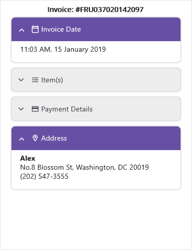
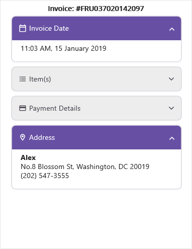

# Appearance in .NET MAUI Expander (SfExpander)

The .NET MAUI SfExpander comes with built-in support for customizing the appearance of the header.

## Header icon position 

The `SfExpander` allows you to customize the position of the header icon by using the `HeaderIconPosition` property. By default, the header icon position is `End`. 



    <syncfusion:SfExpander x:Name="expander" HeaderIconPosition="Start" />


    expander.HeaderIconPosition = Syncfusion.Maui.Expander.ExpanderIconPosition.Start;



## Header background color customization

The `SfExpander` allows you to customize the background color of the expander header by using the `HeaderBackgroundColor` property.



    <syncfusion:SfExpander x:Name="expander" HeaderBackground="Pink"/>


    expander.HeaderBackground = Colors.Pink;



## Icon color customization

The `SfExpander` allows you to customize the color of the expander icon by using the `HeaderIconColor` property.



    <syncfusion:SfExpander x:Name="expander" HeaderIconColor="Brown"/>


    expander.HeaderIconColor = Colors.Brown;



## Visual State Manager

The appearance of the `SfExpander` can be customized using the following two `VisualStates`:

* Expanded
* Collapsed



<syncfusion:SfExpander x:Name="expander1" IsExpanded="True" >
    <syncfusion:SfExpander.Header>
        <Grid >
            <Grid.RowDefinitions>
                <RowDefinition Height="48"/>
            </Grid.RowDefinitions>
            <Grid.ColumnDefinitions>
                <ColumnDefinition Width="35"/>
                <ColumnDefinition Width="*"/>
            </Grid.ColumnDefinitions>
            <Label Text="&#xe703;" FontSize="16" Margin="14,2,2,2"
                                    TextColor="{Binding Path=HeaderIconColor,Source={x:Reference expander1}}"
                                    FontFamily='{OnPlatform Android=AccordionFontIcons.ttf#,WinUI=AccordionFontIcons.ttf#AccordionFontIcons,MacCatalyst=AccordionFontIcons,iOS=AccordionFontIcons}'
                                    VerticalOptions="Center" VerticalTextAlignment="Center"/>
            <Label CharacterSpacing="0.25" TextColor="{Binding Path=HeaderIconColor,Source={x:Reference expander1}}" FontFamily="Roboto-Regular"  Text="Invoice Date" FontSize="14" Grid.Column="1" VerticalOptions="CenterAndExpand"/>
            </Grid>
    </syncfusion:SfExpander.Header>
    <syncfusion:SfExpander.Content>
        <Grid Padding="18,8,0,18" >
            <Label CharacterSpacing="0.25" FontFamily="Roboto-Regular"  Text="11:03 AM, 15 January 2019" FontSize="14" VerticalOptions="CenterAndExpand"/>
        </Grid>
    </syncfusion:SfExpander.Content>
    <VisualStateManager.VisualStateGroups>
        <VisualStateGroupList>
            <VisualStateGroup>
                <VisualState Name="Expanded">
                    <VisualState.Setters>
                            <Setter Property="HeaderBackground" Value="#6750A4"/>
                            <Setter Property="HeaderIconColor" Value="#FFFFFF"/>
                        </VisualState.Setters>
                </VisualState>
                <VisualState Name="Collapsed">
                    <VisualState.Setters>
                            <Setter Property="HeaderBackground" Value="#141C1B1F"/>
                            <Setter Property="HeaderIconColor" Value="#49454F"/>
                        </VisualState.Setters>
                </VisualState>
            </VisualStateGroup>
        </VisualStateGroupList>
    </VisualStateManager.VisualStateGroups>
</syncfusion:SfExpander>



You can download the entire source of this demo [here](https://github.com/SyncfusionExamples/customize-the-appearance-using-visual-state-manager-in-.net-maui-expander).

