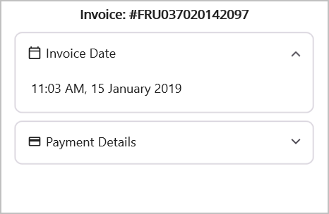

# Getting Started with .NET MAUI Expander (SfExpander)

This section guides you through setting up and configuring a [Expander](https://help.syncfusion.com/cr/maui/Syncfusion.Maui.Expander.SfExpander.html) in your .NET MAUI application. Follow the steps below to add a basic Expander to your project.

To quickly get started with the .NET MAUI Expander, watch this video:
 <iframe id='MAUIExpanderVideoTutorial' src='https://www.youtube.com/embed/zTVbps0m8i0'></iframe>




## Prerequisites
Before proceeding, ensure the following are set up:

1. Install [.NET 9 SDK](https://dotnet.microsoft.com/en-us/download/dotnet/9.0) or later.
2. Set up a .NET MAUI environment with Visual Studio 2022 v17.12 or later.

## Step 1: Create a new .NET MAUI Project

1. Go to **File > New > Project** and choose the **.NET MAUI App** template.
2. Name the project and choose a location. Then, click **Next.**
3. Select the .NET framework version and click **Create.**

## Step 2: Install the Syncfusion® MAUI TreeView NuGet package

1. In **Solution Explorer,** right-click the project and choose **Manage NuGet Packages.**
2. Search for [Syncfusion.Maui.Expander](https://www.nuget.org/packages/Syncfusion.Maui.Expander/) and install the latest version.
3. Ensure the necessary dependencies are installed correctly, and the project is restored. If not, Open the Terminal in Rider and manually run: `dotnet restore`




## Prerequisites

Before proceeding, ensure the following are set up:

1. Install [.NET 9 SDK](https://dotnet.microsoft.com/en-us/download/dotnet/9.0) or later.
2. Set up a .NET MAUI environment with Visual Studio Code.
3. Ensure that the .NET MAUI workloads are installed and configured as described [here](https://learn.microsoft.com/en-us/dotnet/maui/get-started/installation?view=net-maui-9.0&tabs=visual-studio-code).

## Step 1: Create a .NET MAUI project

1. Open the command palette by pressing `Ctrl+Shift+P` and type **.NET:New Project** and enter.
2. Choose the **.NET MAUI App** template.
3. Select the project location, type the project name and press **Enter.**
4. Then choose **Create project.**

## Step 2: Install the Syncfusion® MAUI TreeView NuGet package

1. In **Solution Explorer,** right-click the project and choose **Manage NuGet Packages.**
2. Search for [Syncfusion.Maui.Expander](https://www.nuget.org/packages/Syncfusion.Maui.Expander/) and install the latest version.
3. Ensure the necessary dependencies are installed correctly, and the project is restored. If not, Open the Terminal in Rider and manually run: `dotnet restore`




## Prerequisites

Before proceeding, ensure the following are set up:

1. Install [.NET 9 SDK](https://dotnet.microsoft.com/en-us/download/dotnet/9.0) or later.
2. Set up a .NET MAUI environment with JetBrains Rider 2024.3 or later.
3. Make sure the MAUI workloads are installed and configured as described [here.](https://www.jetbrains.com/help/rider/MAUI.html#before-you-start)

## Step 1: Create a new .NET MAUI project

1. Go to **File > New Solution,** Select .NET (C#) and choose the .NET MAUI App template.
2. Enter the Project Name, Solution Name, and Location.
3. Select the .NET framework version and click Create.

## Step 2: Install the Syncfusion® MAUI TreeView NuGet package

1. In **Solution Explorer,** right-click the project and choose **Manage NuGet Packages.**
2. Search for [Syncfusion.Maui.Expander](https://www.nuget.org/packages/Syncfusion.Maui.Expander/) and install the latest version.
3. Ensure the necessary dependencies are installed correctly, and the project is restored. If not, Open the Terminal in Rider and manually run: `dotnet restore`




## Step 3: Register Syncfusion handler

Make sure to add the namespace.


using Syncfusion.Maui.Core.Hosting;
 

Register the Syncfusion core handler in your `CreateMauiApp` method of `MauiProgram.cs` file to use Syncfusion controls.


builder.ConfigureSyncfusionCore();
 
 
## Step 4: Import the Expander namespace
 
Add the following namespace in your XAML or C#.
 


 
xmlns:syncfusion="clr-namespace:Syncfusion.Maui.Expander;assembly=Syncfusion.Maui.Expander"
 


 
using Syncfusion.Maui.Expander;
 



## Step 5: Create a Expander component

Initialize the [SfExpander](https://help.syncfusion.com/cr/maui/Syncfusion.Maui.Expander.SfExpander.html). which is a layout control that contains a Header and Content section. Load any View in the [Header](https://help.syncfusion.com/cr/maui/Syncfusion.Maui.Expander.SfExpander.html#Syncfusion_Maui_Expander_SfExpander_Header) and [Content](https://help.syncfusion.com/cr/maui/Syncfusion.Maui.Expander.SfExpander.html#Syncfusion_Maui_Expander_SfExpander_Content). Content visibility of the expander can be set by using the [IsExpanded](https://help.syncfusion.com/cr/maui/Syncfusion.Maui.Expander.SfExpander.html#Syncfusion_Maui_Expander_SfExpander_IsExpanded) property of the `Expander`. Users can expand or collapse the Content view by tapping the Header.

Here, the Grid with Labels is loaded in the Header and Content of the expander. 

N> Loading the `Label` as direct children of the `Header` or `Content` of the Expander will lead to an exception. So, load the Label inside the Grid to overcome the crash.



    <StackLayout>
    <Label Text="Invoice: #FRU037020142097"
           FontAttributes="Bold"
           HorizontalOptions="Center" />
    <Border StrokeShape="RoundRectangle 8"
            Margin="8,0,8,8"
            Stroke="#CAC4D0">
        <Border.Resources>
            
        </Border.Resources>
        <syncfusion:SfExpander IsExpanded="True">
            <syncfusion:SfExpander.Header>
                <Grid RowDefinitions="48"
                      ColumnDefinitions="35,*">
                    <Label Text="&#xe703;"
                           FontSize="16"
                           Margin="14,2,2,2"
                           VerticalOptions="Center" />
                    <Label Text="Invoice Date"
                           FontSize="14"
                           Grid.Column="1"
                           VerticalOptions="Center" />
                </Grid>
            </syncfusion:SfExpander.Header>
            <syncfusion:SfExpander.Content>
                <Grid Padding="18,8,0,18">
                    <Label Text="11:03 AM, 15 January 2019"
                           FontSize="14" />
                </Grid>
            </syncfusion:SfExpander.Content>
        </syncfusion:SfExpander>
    </Border>
    <Border StrokeShape="RoundRectangle 8,8,8,8"
            Margin="{OnPlatform Default='8,0,8,8',WinUI='8,0,6,8',MacCatalyst='8,0,6,8'}"
            Stroke="#CAC4D0"
            StrokeThickness="{OnPlatform MacCatalyst=2,Default=1}"
            WidthRequest="{OnPlatform MacCatalyst=460,WinUI=340}">
        <syncfusion:SfExpander AnimationDuration="200"
                               IsExpanded="False">
            <syncfusion:SfExpander.Header>
                <Grid>
                    <Grid.RowDefinitions>
                        <RowDefinition Height="48" />
                    </Grid.RowDefinitions>
                    <Grid.ColumnDefinitions>
                        <ColumnDefinition Width="35" />
                        <ColumnDefinition Width="*" />
                    </Grid.ColumnDefinitions>
                    <Label Text="&#xe702;"
                           FontSize="16"
                           Margin="14,2,2,2"
                           FontFamily='{OnPlatform Android=AccordionFontIcons.ttf#,WinUI=AccordionFontIcons.ttf#AccordionFontIcons,MacCatalyst=AccordionFontIcons,iOS=AccordionFontIcons}'
                           VerticalOptions="Center"
                           VerticalTextAlignment="Center" />
                    <Label CharacterSpacing="0.25"
                           FontFamily="Roboto-Regular"
                           Text="Payment Details"
                           FontSize="14"
                           Grid.Column="1"
                           VerticalOptions="CenterAndExpand" />
                </Grid>
            </syncfusion:SfExpander.Header>
            <syncfusion:SfExpander.Content>
                <Grid Padding="18,8,18,18"
                      RowSpacing="6">
                    <Grid.Resources>
                        
                    </Grid.Resources>
                    <Grid.RowDefinitions>
                        <RowDefinition Height="20" />
                        <RowDefinition Height="20" />
                        <RowDefinition Height="20" />
                    </Grid.RowDefinitions>
                    <Grid.ColumnDefinitions>
                        <ColumnDefinition Width="*" />
                        <ColumnDefinition Width="*" />
                    </Grid.ColumnDefinitions>
                    <Label FontSize="14"
                           CharacterSpacing="0.25"
                           Text="Card Payment" />
                    <Label FontSize="14"
                           CharacterSpacing="0.25"
                           Text="Third-Party coupons"
                           Grid.Row="1" />
                    <Label FontSize="14"
                           CharacterSpacing="0.25"
                           Text="Total Amount Paid"
                           TextColor="{StaticResource Primary}"
                           Grid.Row="2" />
                    <Label FontSize="14"
                           CharacterSpacing="0.25"
                           HorizontalOptions="End"
                           Text="$31,200.00"
                           Grid.Column="1" />
                    <Label FontSize="14"
                           CharacterSpacing="0.25"
                           HorizontalOptions="End"
                           Text="$5,000.00"
                           Grid.Row="1"
                           Grid.Column="1" />
                    <Label FontSize="14"
                           CharacterSpacing="0.25"
                           HorizontalOptions="End"
                           Text="$36,200.00"
                           TextColor="{StaticResource Primary}"
                           Grid.Row="2"
                           Grid.Column="1" />
                </Grid>
            </syncfusion:SfExpander.Content>
        </syncfusion:SfExpander>
    </Border>
</StackLayout>



    Content = new ScrollView
    {
        Content = new StackLayout
        {
            HorizontalOptions = LayoutOptions.Center,
            Children =
            {
                CreateInvoiceHeader(),
                CreateInvoiceDate(),
                CreatePaymentDetails(),
            }
        }
    };

    private SfExpander CreateExpander(bool expanded, string icon, string title, View content)
    {
        var headerGrid = new Grid
        {
            ColumnDefinitions =
        {
            new ColumnDefinition { Width = 35 },
            new ColumnDefinition { Width = GridLength.Star }
        },
            HeightRequest = 48
        };

        headerGrid.Add(
            new Label
            {
                Text = icon,
                FontFamily = "AccordionFontIcons",
                FontSize = 16,
                Margin = new Thickness(14, 2),
                VerticalTextAlignment = TextAlignment.Center
            },
            column: 0,
            row: 0
        );

        headerGrid.Add(
            new Label
            {
                Text = title,
                FontFamily = "Roboto-Regular",
                FontSize = 14,
                VerticalOptions = LayoutOptions.Center
            },
            column: 1,
            row: 0
        );

        return new SfExpander
        {
            IsExpanded = expanded,
            Header = headerGrid,
            Content = content
        };
    }

    private View CreateInvoiceHeader()
    {
        return new Label
        {
            Text = "Invoice: #FRU037020142097",
            FontAttributes = FontAttributes.Bold,
            Margin = new Thickness(0, 0, 0, 5),
            HorizontalOptions = LayoutOptions.Center,
            VerticalOptions = LayoutOptions.Center
        };
    }

    private View CreateInvoiceDate()
    {
        return CreateBorder(CreateExpander(true, "\ue703", "Invoice Date",
                new Grid
                {
                    Padding = new Thickness(18, 8, 0, 18),
                    Children =
                    {
                        new Label
                        {
                            Text = "11:03 AM, 15 January 2019",
                            FontFamily = "Roboto-Regular",
                            FontSize = 14
                        }
                    }
                }
            )
        );
    }

    private View CreatePaymentDetails()
    {
        var grid = new Grid
        {
            Padding = new Thickness(18, 8, 18, 18),
            ColumnDefinitions = { new ColumnDefinition(), new ColumnDefinition() },
            RowDefinitions =
            {
                new RowDefinition(),
                new RowDefinition(),
                new RowDefinition()
            }
        };

        grid.Add(new Label { Text = "Card Payment" }, 0, 0);
        grid.Add(new Label { Text = "$31,200.00", HorizontalOptions = LayoutOptions.End }, 1, 0);

        grid.Add(new Label { Text = "Third-Party coupons" }, 0, 1);
        grid.Add(new Label { Text = "$5,000.00", HorizontalOptions = LayoutOptions.End }, 1, 1);

        grid.Add(new Label
        {
            Text = "Total Amount Paid",
            TextColor = Colors.Blue,
            FontAttributes = FontAttributes.Bold
        }, 0, 2);

        grid.Add(new Label
        {
            Text = "$36,200.00",
            TextColor = Colors.Blue,
            HorizontalOptions = LayoutOptions.End
        }, 1, 2);

        return CreateBorder(CreateExpander(false, "\ue702", "Payment Details", grid));
    }

    private View CreateBorder(View content)
    {
        return new Border
        {
            Stroke = Color.FromArgb("#CAC4D0"),
            StrokeThickness = DeviceInfo.Platform == DevicePlatform.MacCatalyst ? 2 : 1,
            StrokeShape = new RoundRectangle { CornerRadius = 8 },
            WidthRequest = DeviceInfo.Platform == DevicePlatform.MacCatalyst ? 460 : DeviceInfo.Platform == DevicePlatform.WinUI ? 340 : -1,
            Margin = new Thickness(8, 0, 8, 8),
            Content = content
        };
    }



The following screenshot illustrates the result of the above code.

 

N> [View Sample in GitHub](https://github.com/SyncfusionExamples/getting-started-with-.net-maui-expander).

You can download the Expander Getting Started sample from [GitHub](https://github.com/SyncfusionExamples/getting-started-with-.net-maui-expander)

N> You can refer to our [.NET MAUI Expander](https://www.syncfusion.com/maui-controls/maui-expander) feature tour page for its groundbreaking feature representations. You can also explore our [.NET MAUI Expander Example](https://github.com/syncfusion/maui-demos/tree/master/MAUI/Expander) that shows you how to render and configure the Expander in .NET MAUI.