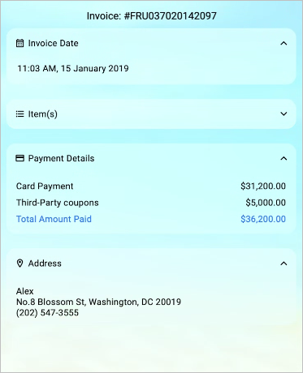

# Liquid Glass Effect in .NET MAUI Expander (SfExpander)

The Liquid Glass Effect introduces a modern, translucent design with adaptive color tinting and light refraction, creating a sleek, glass like user experience that remains clear and accessible. This section explains how to enable and customize the effect in the Syncfusion® .NET MAUI Expander (SfExpander) control.

## Apply liquid glass effect

Follow these steps to enable and configure the Liquid Glass Effect in the Expander control:

### Step 1: Wrap the control inside glass effect view

To apply the Liquid Glass Effect to Syncfusion® .NET MAUI [SfExpander](https://help.syncfusion.com/cr/maui/Syncfusion.Maui.Expander.SfExpander.html), wrap it inside the [SfGlassEffectView](https://help.syncfusion.com/cr/maui/Syncfusion.Maui.Core.SfGlassEffectView.html).

For more details, refer to the [Liquid Glass Getting Started documentation](https://help.syncfusion.com/maui/liquid-glass-ui/getting-started).

### Step 2: Enable the liquid glass effect on Expander

Set the [EnableLiquidGlassEffect](https://help.syncfusion.com/cr/maui/Syncfusion.Maui.Expander.SfExpander.html#Syncfusion_Maui_Expander_SfExpander_EnableLiquidGlassEffect) property to `true` in the [SfExpander](https://help.syncfusion.com/cr/maui/Syncfusion.Maui.Expander.SfExpander.html) control. When enabled, the effect is applied to the header and content, providing a smooth and engaging user experience.

### Step 3: Customize the background

To achieve a glass like background, set the `Background` property to `Transparent`. The background will then be treated as a tinted color, ensuring a consistent glass effect across the controls.

The following code snippet demonstrates how to apply the Liquid Glass Effect to the [SfExpander](https://help.syncfusion.com/cr/maui/Syncfusion.Maui.Expander.SfExpander.html) control:



<Grid>
    <Grid.Background>
        <LinearGradientBrush StartPoint="0,0"
                             EndPoint="0,1">
            <GradientStop Color="#0F4C75" Offset="0.0"/>
            <GradientStop Color="#3282B8" Offset="0.5"/>
            <GradientStop Color="#1B262C" Offset="1.0"/>
        </LinearGradientBrush>
    </Grid.Background>

    <core:SfGlassEffectView EffectType="Regular"
                            CornerRadius="20">
        <ScrollView>
            <StackLayout HorizontalOptions="{OnPlatform MacCatalyst=Center,WinUI=Center}">
                <Label Text="Invoice: #FRU037020142097"
                       HeightRequest="40"
                       FontSize="16"
                       FontFamily="Roboto-Regular"
                       Opacity="1.0"
                       VerticalTextAlignment="Center"
                       FontAttributes="Bold"
                       VerticalOptions="Center"
                       HorizontalOptions="Center"
                       Margin="{OnPlatform Default='8,12,8,8',WinUI='8,12,6,8',MacCatalyst='8,12,6,8'}"/>

                <!-- Expander 1: Invoice Date -->
                <syncfusion:SfExpander AnimationDuration="200"
                                       IsExpanded="True"
                                       Background="Transparent"
                                       EnableLiquidGlassEffect="True"
                                       Margin="{OnPlatform Default='8,0,8,8',WinUI='8,0,8,8',MacCatalyst='8,0,8,8'}">
                    <syncfusion:SfExpander.Header>
                        <Grid>
                            <Grid.RowDefinitions>
                                <RowDefinition Height="48"/>
                            </Grid.RowDefinitions>
                            <Grid.ColumnDefinitions>
                                <ColumnDefinition Width="35"/>
                                <ColumnDefinition Width="*"/>
                            </Grid.ColumnDefinitions>
                            <Label Text="&#xe703;" FontSize="16" Margin="14,2,2,2"
                                   FontFamily="AccordionFontIcons.ttf#"
                                   VerticalOptions="Center" VerticalTextAlignment="Center"/>
                            <Label CharacterSpacing="0.25" FontFamily="Roboto-Regular" Text="Invoice Date" FontSize="14" Grid.Column="1" VerticalOptions="Center"/>
                        </Grid>
                    </syncfusion:SfExpander.Header>
                    <syncfusion:SfExpander.Content>
                        <Grid Padding="18,8,0,18">
                            <Label CharacterSpacing="0.25" FontFamily="Roboto-Regular" Text="11:03 AM, 15 January 2019" FontSize="14" VerticalOptions="Center"/>
                        </Grid>
                    </syncfusion:SfExpander.Content>
                </syncfusion:SfExpander>

                <!-- Expander 2: Items -->
                <syncfusion:SfExpander AnimationDuration="200"
                                       IsExpanded="False"
                                       Background="Transparent"
                                       EnableLiquidGlassEffect="True"
                                       Margin="{OnPlatform Default='8,12,8,8',WinUI='8,12,8,8',MacCatalyst='8,12,8,8'}">
                    <syncfusion:SfExpander.Header>
                        <Grid>
                            <Grid.RowDefinitions>
                                <RowDefinition Height="48"/>
                            </Grid.RowDefinitions>
                            <Grid.ColumnDefinitions>
                                <ColumnDefinition Width="35"/>
                                <ColumnDefinition Width="*"/>
                            </Grid.ColumnDefinitions>
                            <Label Text="&#xe701;" FontSize="16" Margin="14,2,2,2"
                                   FontFamily="AccordionFontIcons.ttf#"
                                   VerticalOptions="Center" VerticalTextAlignment="Center"/>
                            <Label CharacterSpacing="0.25" FontFamily="Roboto-Regular" Text="Item(s)" FontSize="14" Grid.Column="1" VerticalOptions="Center"/>
                        </Grid>
                    </syncfusion:SfExpander.Header>
                    <syncfusion:SfExpander.Content>
                        <Grid Padding="16,12,16,12">
                            <Grid.RowDefinitions>
                                <RowDefinition Height="Auto"/>
                                <RowDefinition Height="Auto"/>
                            </Grid.RowDefinitions>
                            <Grid Grid.Row="1">
                                <Grid.RowDefinitions>
                                    <RowDefinition Height="20"/>
                                </Grid.RowDefinitions>
                                <Grid.ColumnDefinitions>
                                    <ColumnDefinition Width="*"/>
                                    <ColumnDefinition Width="*"/>
                                </Grid.ColumnDefinitions>
                                <Label Text="Total Amount" CharacterSpacing="0.25" VerticalTextAlignment="Center" FontSize="14"/>
                                <Label Text="$36,220.00" CharacterSpacing="0.25" HorizontalTextAlignment="End" VerticalTextAlignment="Center" FontSize="14" Grid.Column="1"/>
                            </Grid>
                        </Grid>
                    </syncfusion:SfExpander.Content>
                </syncfusion:SfExpander>

                <!-- Expander 3: Payment Details -->
                <syncfusion:SfExpander AnimationDuration="200"
                                       IsExpanded="False"
                                       Background="Transparent"
                                       EnableLiquidGlassEffect="True"
                                       Margin="{OnPlatform Default='8,12,8,8',WinUI='8,12,8,8',MacCatalyst='8,12,8,8'}">
                    <syncfusion:SfExpander.Header>
                        <Grid>
                            <Grid.RowDefinitions>
                                <RowDefinition Height="48"/>
                            </Grid.RowDefinitions>
                            <Grid.ColumnDefinitions>
                                <ColumnDefinition Width="35"/>
                                <ColumnDefinition Width="*"/>
                            </Grid.ColumnDefinitions>
                            <Label Text="&#xe702;" FontSize="16" Margin="14,2,2,2"
                                   FontFamily="AccordionFontIcons.ttf#"
                                   VerticalOptions="Center" VerticalTextAlignment="Center"/>
                            <Label CharacterSpacing="0.25" FontFamily="Roboto-Regular" Text="Payment Details" FontSize="14" Grid.Column="1" VerticalOptions="Center"/>
                        </Grid>
                    </syncfusion:SfExpander.Header>
                    <syncfusion:SfExpander.Content>
                        <Grid Padding="16,12,16,12" RowSpacing="6">
                            <Grid.RowDefinitions>
                                <RowDefinition Height="20"/>
                                <RowDefinition Height="20"/>
                                <RowDefinition Height="20"/>
                            </Grid.RowDefinitions>
                            <Grid.ColumnDefinitions>
                                <ColumnDefinition Width="*"/>
                                <ColumnDefinition Width="*"/>
                            </Grid.ColumnDefinitions>
                            <Label FontSize="14" CharacterSpacing="0.25" FontFamily="Roboto-Regular" Text="Card Payment"/>
                            <Label FontSize="14" CharacterSpacing="0.25" FontFamily="Roboto-Regular" Text="Third-Party coupons" Grid.Row="1"/>
                            <Label FontSize="14" CharacterSpacing="0.25" FontFamily="Roboto-Regular" Text="Total Amount Paid" Grid.Row="2"/>
                            <Label FontSize="14" CharacterSpacing="0.25" FontFamily="Roboto-Regular" HorizontalOptions="End" Text="$31,200.00" Grid.Column="1"/>
                            <Label FontSize="14" CharacterSpacing="0.25" FontFamily="Roboto-Regular" HorizontalOptions="End" Text="$5,000.00" Grid.Row="1" Grid.Column="1"/>
                            <Label FontSize="14" CharacterSpacing="0.25" FontFamily="Roboto-Regular" HorizontalOptions="End" Text="$36,200.00" Grid.Row="2" Grid.Column="1"/>
                        </Grid>
                    </syncfusion:SfExpander.Content>
                </syncfusion:SfExpander>

                <!-- Expander 4: Address -->
                <syncfusion:SfExpander AnimationDuration="200"
                                       IsExpanded="True"
                                       Background="Transparent"
                                       EnableLiquidGlassEffect="True"
                                       Margin="{OnPlatform Default='8,12,8,8',WinUI='8,12,8,8',MacCatalyst='8,12,8,8'}">
                    <syncfusion:SfExpander.Header>
                        <Grid>
                            <Grid.RowDefinitions>
                                <RowDefinition Height="48"/>
                            </Grid.RowDefinitions>
                            <Grid.ColumnDefinitions>
                                <ColumnDefinition Width="35"/>
                                <ColumnDefinition Width="*"/>
                            </Grid.ColumnDefinitions>
                            <Label Text="&#xe704;" FontSize="16" Margin="14,2,2,2"
                                   FontFamily="AccordionFontIcons.ttf#"
                                   VerticalOptions="Center" VerticalTextAlignment="Center"/>
                            <Label CharacterSpacing="0.25" FontFamily="Roboto-Regular" FontSize="14" Text="Address" Grid.Column="1" VerticalOptions="Center"/>
                        </Grid>
                    </syncfusion:SfExpander.Header>
                    <syncfusion:SfExpander.Content>
                        <Grid Padding="16,12,16,12" RowSpacing="1">
                            <Grid.RowDefinitions>
                                <RowDefinition Height="Auto"/>
                                <RowDefinition Height="Auto"/>
                                <RowDefinition Height="Auto"/>
                            </Grid.RowDefinitions>
                            <Label CharacterSpacing="0.25" FontFamily="Roboto-Regular" FontSize="14" Text="Alex" FontAttributes="Bold"/>
                            <Label CharacterSpacing="0.25" FontFamily="Roboto-Regular" FontSize="14" Text="No.8 Blossom St, Washington, DC 20019" Grid.Row="1"/>
                            <Label CharacterSpacing="0.25" FontFamily="Roboto-Regular" FontSize="14" Text="(202) 547-3555" Grid.Row="2"/>
                        </Grid>
                    </syncfusion:SfExpander.Content>
                </syncfusion:SfExpander>
            </StackLayout>
        </ScrollView>
    </core:SfGlassEffectView>
</Grid>


using Syncfusion.Maui.Core;
using Syncfusion.Maui.Expander;

var gradientBrush = new LinearGradientBrush
{
    StartPoint = new Point(0, 0),
    EndPoint = new Point(0, 1),
    GradientStops = new GradientStopCollection
    {
        new GradientStop { Color = Color.FromArgb("#0F4C75"), Offset = 0.0f },
        new GradientStop { Color = Color.FromArgb("#3282B8"), Offset = 0.5f },
        new GradientStop { Color = Color.FromArgb("#1B262C"), Offset = 1.0f }
    }
};

var root = new Grid { Background = gradientBrush };
var glass = new SfGlassEffectView
{
    CornerRadius = 20,
    EffectType = LiquidGlassEffectType.Regular
};

var scroll = new ScrollView();
var stack = new VerticalStackLayout
{
    HorizontalOptions = DeviceInfo.Platform == DevicePlatform.WinUI || DeviceInfo.Platform == DevicePlatform.MacCatalyst ? LayoutOptions.Center : LayoutOptions.Fill
};

stack.Add(new Label
{
    Text = "Invoice: #FRU037020142097",
    HeightRequest = 40,
    FontSize = 16,
    FontFamily = "Roboto-Regular",
    Opacity = 1.0,
    VerticalTextAlignment = TextAlignment.Center,
    FontAttributes = FontAttributes.Bold,
    VerticalOptions = LayoutOptions.Center,
    HorizontalOptions = LayoutOptions.Center,
    Margin = new Thickness(8, 12, 8, 8)
});

// Expander 1: Invoice Date
var header1 = new Grid();
header1.RowDefinitions.Add(new RowDefinition { Height = 48 });
header1.ColumnDefinitions.Add(new ColumnDefinition { Width = 35 });
header1.ColumnDefinitions.Add(new ColumnDefinition { Width = GridLength.Star });

var icon1 = new Label
{
    Text = "\uE703",
    FontSize = 16,
    Margin = new Thickness(14, 2, 2, 2),
    FontFamily = "AccordionFontIcons.ttf#",
    VerticalOptions = LayoutOptions.Center,
    VerticalTextAlignment = TextAlignment.Center
};

header1.Children.Add(icon1);
var label1 = new Label
{
    Text = "Invoice Date",
    FontSize = 14,
    CharacterSpacing = 0.25,
    FontFamily = "Roboto-Regular",
    VerticalOptions = LayoutOptions.Center
};

Grid.SetColumn(label1, 1);
header1.Children.Add(label1);

var content1 = new Grid { Padding = new Thickness(18, 8, 0, 18) };
content1.Children.Add(new Label
{
    Text = "11:03 AM, 15 January 2019",
    FontSize = 14,
    CharacterSpacing = 0.25,
    FontFamily = "Roboto-Regular",
    VerticalOptions = LayoutOptions.Center
});

stack.Add(new SfExpander
{
    AnimationDuration = 200,
    IsExpanded = true,
    Background = Colors.Transparent,
    EnableLiquidGlassEffect = true,
    Margin = new Thickness(8, 0, 8, 8),
    Header = header1,
    Content = content1
});

// Expander 2: Items
var header2 = new Grid();
header2.RowDefinitions.Add(new RowDefinition { Height = 48 });
header2.ColumnDefinitions.Add(new ColumnDefinition { Width = 35 });
header2.ColumnDefinitions.Add(new ColumnDefinition { Width = GridLength.Star });

var icon2 = new Label
{
    Text = "\uE701",
    FontSize = 16,
    Margin = new Thickness(14, 2, 2, 2),
    FontFamily = "AccordionFontIcons.ttf#",
    VerticalOptions = LayoutOptions.Center,
    VerticalTextAlignment = TextAlignment.Center
};

header2.Children.Add(icon2);

var label2 = new Label
{
    Text = "Item(s)",
    FontSize = 14,
    CharacterSpacing = 0.25,
    FontFamily = "Roboto-Regular",
    VerticalOptions = LayoutOptions.Center
};

Grid.SetColumn(label2, 1);
header2.Children.Add(label2);

var content2 = new Grid { Padding = new Thickness(16, 12, 16, 12) };
content2.RowDefinitions.Add(new RowDefinition { Height = GridLength.Auto });
content2.RowDefinitions.Add(new RowDefinition { Height = GridLength.Auto });

var itemsGrid = new Grid();
itemsGrid.RowDefinitions.Add(new RowDefinition { Height = 20 });
itemsGrid.ColumnDefinitions.Add(new ColumnDefinition { Width = GridLength.Star });
itemsGrid.ColumnDefinitions.Add(new ColumnDefinition { Width = GridLength.Star });

var totalLabel = new Label
{
    Text = "Total Amount",
    CharacterSpacing = 0.25,
    VerticalTextAlignment = TextAlignment.Center,
    FontSize = 14
};

itemsGrid.Children.Add(totalLabel);

var amountLabel = new Label
{
    Text = "$36,220.00",
    CharacterSpacing = 0.25,
    HorizontalTextAlignment = TextAlignment.End,
    VerticalTextAlignment = TextAlignment.Center,
    FontSize = 14
};

Grid.SetColumn(amountLabel, 1);
itemsGrid.Children.Add(amountLabel);
Grid.SetRow(itemsGrid, 1);
content2.Children.Add(itemsGrid);

stack.Add(new SfExpander
{
    AnimationDuration = 200,
    IsExpanded = false,
    Background = Colors.Transparent,
    EnableLiquidGlassEffect = true,
    Margin = new Thickness(8, 12, 8, 8),
    Header = header2,
    Content = content2
});

// Expander 3: Payment Details
var header3 = new Grid();
header3.RowDefinitions.Add(new RowDefinition { Height = 48 });
header3.ColumnDefinitions.Add(new ColumnDefinition { Width = 35 });
header3.ColumnDefinitions.Add(new ColumnDefinition { Width = GridLength.Star });

var icon3 = new Label
{
    Text = "\uE702",
    FontSize = 16,
    Margin = new Thickness(14, 2, 2, 2),
    FontFamily = "AccordionFontIcons.ttf#",
    VerticalOptions = LayoutOptions.Center,
    VerticalTextAlignment = TextAlignment.Center
};

header3.Children.Add(icon3);

var label3 = new Label
{
    Text = "Payment Details",
    FontSize = 14,
    CharacterSpacing = 0.25,
    FontFamily = "Roboto-Regular",
    VerticalOptions = LayoutOptions.Center
};

Grid.SetColumn(label3, 1);
header3.Children.Add(label3);

var content3 = new Grid { Padding = new Thickness(16, 12, 16, 12), RowSpacing = 6 };
content3.RowDefinitions.Add(new RowDefinition { Height = 20 });
content3.RowDefinitions.Add(new RowDefinition { Height = 20 });
content3.RowDefinitions.Add(new RowDefinition { Height = 20 });
content3.ColumnDefinitions.Add(new ColumnDefinition { Width = GridLength.Star });
content3.ColumnDefinitions.Add(new ColumnDefinition { Width = GridLength.Star });
content3.Children.Add(new Label { FontSize = 14, CharacterSpacing = 0.25, FontFamily = "Roboto-Regular", Text = "Card Payment" });

var couponLabel = new Label { FontSize = 14, CharacterSpacing = 0.25, FontFamily = "Roboto-Regular", Text = "Third-Party coupons" };
Grid.SetRow(couponLabel, 1);
content3.Children.Add(couponLabel);

var totalPaidLabel = new Label { FontSize = 14, CharacterSpacing = 0.25, FontFamily = "Roboto-Regular", Text = "Total Amount Paid" };
Grid.SetRow(totalPaidLabel, 2);
content3.Children.Add(totalPaidLabel);

var cardAmount = new Label { FontSize = 14, CharacterSpacing = 0.25, FontFamily = "Roboto-Regular", HorizontalOptions = LayoutOptions.End, Text = "$31,200.00" };
Grid.SetColumn(cardAmount, 1);
content3.Children.Add(cardAmount);

var couponAmount = new Label { FontSize = 14, CharacterSpacing = 0.25, FontFamily = "Roboto-Regular", HorizontalOptions = LayoutOptions.End, Text = "$5,000.00" };
Grid.SetRow(couponAmount, 1);
Grid.SetColumn(couponAmount, 1);
content3.Children.Add(couponAmount);

var totalAmount = new Label { FontSize = 14, CharacterSpacing = 0.25, FontFamily = "Roboto-Regular", HorizontalOptions = LayoutOptions.End, Text = "$36,200.00" };
Grid.SetRow(totalAmount, 2);
Grid.SetColumn(totalAmount, 1);
content3.Children.Add(totalAmount);

stack.Add(new SfExpander
{
    AnimationDuration = 200,
    IsExpanded = false,
    Background = Colors.Transparent,
    EnableLiquidGlassEffect = true,
    Margin = new Thickness(8, 12, 8, 8),
    Header = header3,
    Content = content3
});

// Expander 4: Address
var header4 = new Grid();
header4.RowDefinitions.Add(new RowDefinition { Height = 48 });
header4.ColumnDefinitions.Add(new ColumnDefinition { Width = 35 });
header4.ColumnDefinitions.Add(new ColumnDefinition { Width = GridLength.Star });

var icon4 = new Label
{
    Text = "\uE704",
    FontSize = 16,
    Margin = new Thickness(14, 2, 2, 2),
    FontFamily = "AccordionFontIcons.ttf#",
    VerticalOptions = LayoutOptions.Center,
    VerticalTextAlignment = TextAlignment.Center
};

header4.Children.Add(icon4);
var label4 = new Label
{
    Text = "Address",
    FontSize = 14,
    CharacterSpacing = 0.25,
    FontFamily = "Roboto-Regular",
    VerticalOptions = LayoutOptions.Center
};

Grid.SetColumn(label4, 1);
header4.Children.Add(label4);

var content4 = new Grid { Padding = new Thickness(16, 12, 16, 12), RowSpacing = 1 };
content4.RowDefinitions.Add(new RowDefinition { Height = GridLength.Auto });
content4.RowDefinitions.Add(new RowDefinition { Height = GridLength.Auto });
content4.RowDefinitions.Add(new RowDefinition { Height = GridLength.Auto });
content4.Children.Add(new Label
{
    CharacterSpacing = 0.25,
    FontFamily = "Roboto-Regular",
    FontSize = 14,
    Text = "Alex",
    FontAttributes = FontAttributes.Bold
});

var addressLabel = new Label
{
    CharacterSpacing = 0.25,
    FontFamily = "Roboto-Regular",
    FontSize = 14,
    Text = "No.8 Blossom St, Washington, DC 20019"
};

Grid.SetRow(addressLabel, 1);
content4.Children.Add(addressLabel);

var phoneLabel = new Label
{
    CharacterSpacing = 0.25,
    FontFamily = "Roboto-Regular",
    FontSize = 14,
    Text = "(202) 547-3555"
};

Grid.SetRow(phoneLabel, 2);
content4.Children.Add(phoneLabel);
stack.Add(new SfExpander
{
    AnimationDuration = 200,
    IsExpanded = true,
    Background = Colors.Transparent,
    EnableLiquidGlassEffect = true,
    Margin = new Thickness(8, 12, 8, 8),
    Header = header4,
    Content = content4
});

scroll.Content = stack;
glass.Content = scroll;
root.Children.Add(glass);
this.Content = root;



This The following screenshot illustrates SfDataGrid within SfGlassEffectView.

   

N>
* Supported on `macOS 26 or higher` and `iOS 26 or higher`.
* This feature is available only in `.NET 10.`