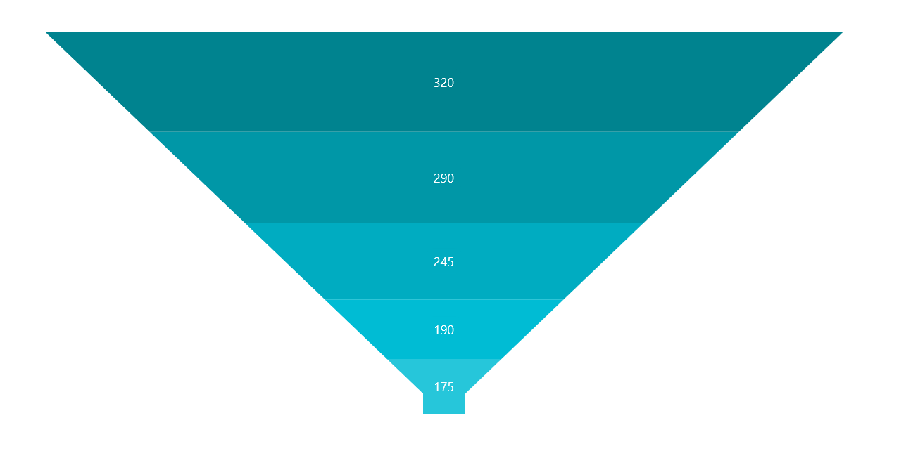
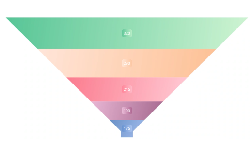

# Appearance in .NET MAUI Funnel Chart

The appearance of the [SfFunnelChart](https://help.syncfusion.com/cr/maui/Syncfusion.Maui.Charts.SfFunnelChart.html) can be customized by using the custom palettes and gradients that enhance the visual appeal of the application.

N> **Prerequisite:** Ensure that the required NuGet package is installed, the necessary namespaces are imported, and the **Funnel Chart** control is properly configured in your application. For detailed setup and configuration instructions, refer to the **[Getting Started](https://help.syncfusion.com/maui/funnel-charts/getting-started)** guide.

## Add a title

The chart title provides quick information to the user about the data being plotted in the chart. You can set the title using the [Title](https://help.syncfusion.com/cr/maui/Syncfusion.Maui.Charts.ChartBase.html#Syncfusion_Maui_Charts_ChartBase_Title) property of the funnel chart as follows.

 



<chart:SfFunnelChart ItemsSource="{Binding Data}"
                     XBindingPath="XValue"
                     YBindingPath="YValue">
    <chart:SfFunnelChart.Title>
        <Label Text="School Admission"/>
    </chart:SfFunnelChart.Title>
</chart:SfFunnelChart>





SfFunnelChart chart = new SfFunnelChart()
{
    ItemsSource = new ViewModel().Data,
    XBindingPath = "XValue",
    YBindingPath = "YValue",
    Title = new Label()
    {
        Text = "School Admission"
    }
};

this.Content = chart;



  

## Custom PaletteBrushes

The [SfFunnelChart](https://help.syncfusion.com/cr/maui/Syncfusion.Maui.Charts.SfFunnelChart.html) allows you to define your own brushes with preferred order by using the [PaletteBrushes](https://help.syncfusion.com/cr/maui/Syncfusion.Maui.Charts.SfFunnelChart.html#Syncfusion_Maui_Charts_SfFunnelChart_PaletteBrushes) property, as shown in the code below.





<chart:SfFunnelChart ItemsSource="{Binding Data}" 
                     XBindingPath="XValue"
                     YBindingPath="YValue"
                     PaletteBrushes="{Binding CustomBrushes}">
</chart:SfFunnelChart>





public class ViewModel
{
    public ObservableCollection<Model> Data { get; set; }

    public List<Brush> CustomBrushes { get; set; }
    
    public ViewModel()
    {
        CustomBrushes = new List<Brush>();
        CustomBrushes.Add(new SolidColorBrush(Color.FromRgb(38, 198, 218)));
        CustomBrushes.Add(new SolidColorBrush(Color.FromRgb(0, 188, 212)));
        CustomBrushes.Add(new SolidColorBrush(Color.FromRgb(0, 172, 193)));
        CustomBrushes.Add(new SolidColorBrush(Color.FromRgb(0, 151, 167)));
        CustomBrushes.Add(new SolidColorBrush(Color.FromRgb(0, 131, 143)));
    }
}





## Apply gradient

The gradient for the funnel chart can be set by using the [PaletteBrushes](https://help.syncfusion.com/cr/maui/Syncfusion.Maui.Charts.SfFunnelChart.html#Syncfusion_Maui_Charts_SfFunnelChart_PaletteBrushes) property of the chart with the help of the [LinearGradientBrush](https://learn.microsoft.com/en-us/dotnet/maui/user-interface/brushes/lineargradient) or [RadialGradientBrush](https://learn.microsoft.com/en-us/dotnet/maui/user-interface/brushes/radialgradient).





<chart:SfFunnelChart ItemsSource="{Binding Data}" 
                     XBindingPath="XValue"
                     YBindingPath="YValue"
                     PaletteBrushes="{Binding CustomBrushes}">
</chart:SfFunnelChart>





public class ViewModel
{
    public ObservableCollection<Model> Data { get; set; }

    public List<Brush> CustomBrushes { get; set; }
    
    public ViewModel()
    {
        CustomBrushes = new List<Brush>();
        
        LinearGradientBrush gradientColor1 = new LinearGradientBrush();
        gradientColor1.GradientStops = new GradientStopCollection()
        {
            new GradientStop() { Offset = 1, Color = Color.FromArgb("#a3bded") },
            new GradientStop() { Offset = 0, Color = Color.FromArgb("#6991c7") }
        };

        LinearGradientBrush gradientColor2 = new LinearGradientBrush();
        gradientColor2.GradientStops = new GradientStopCollection()
        {
            new GradientStop() { Offset = 1, Color = Color.FromArgb("#A5678E") },
            new GradientStop() { Offset = 0, Color = Color.FromArgb("#E8B7D4") }
        };

        LinearGradientBrush gradientColor3 = new LinearGradientBrush();
        gradientColor3.GradientStops = new GradientStopCollection()
        {
            new GradientStop() { Offset = 1, Color = Color.FromArgb("#FFCAD4") },
            new GradientStop() { Offset = 0, Color = Color.FromArgb("#FB7B8E") }
        };

        LinearGradientBrush gradientColor4 = new LinearGradientBrush();
        gradientColor4.GradientStops = new GradientStopCollection()
        {
            new GradientStop() { Offset = 1, Color = Color.FromArgb("#FDC094") },
            new GradientStop() { Offset = 0, Color = Color.FromArgb("#FFE5D8") }
        };

        LinearGradientBrush gradientColor5 = new LinearGradientBrush();
        gradientColor5.GradientStops = new GradientStopCollection()
        {
            new GradientStop() { Offset = 1, Color = Color.FromArgb("#CFF4D2") },
            new GradientStop() { Offset = 0, Color = Color.FromArgb("#56C596") }
        };

        CustomBrushes.Add(gradientColor1);
        CustomBrushes.Add(gradientColor2);
        CustomBrushes.Add(gradientColor3);
        CustomBrushes.Add(gradientColor4);
        CustomBrushes.Add(gradientColor5);
    }
}





