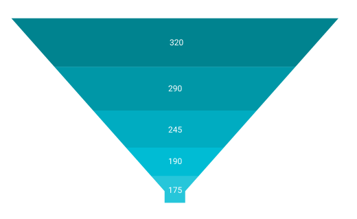
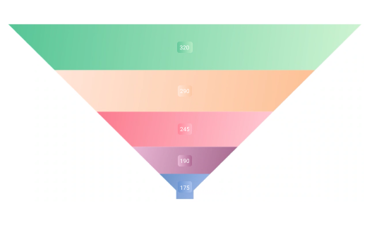

# Appearance in .NET MAUI Funnel Chart

The appearance of the [SfFunnelChart](https://help.syncfusion.com/cr/maui/Syncfusion.Maui.Charts.SfFunnelChart.html) can be customized by using the predefined palettes, custom palettes, and gradient which allows enriching the application.

## Custom PaletteBrushes

The [SfFunnelChart](https://help.syncfusion.com/cr/maui/Syncfusion.Maui.Charts.SfFunnelChart.html) allows you to define your own brushes with preferred order by using the [PaletteBrushes](https://help.syncfusion.com/cr/maui/Syncfusion.Maui.Charts.SfFunnelChart.html#Syncfusion_Maui_Charts_SfFunnelChart_PaletteBrushes) property, as shown in the code below.





<chart:SfFunnelChart ItemsSource="{Binding Data}" 
                     XBindingPath="XValue"
                     YBindingPath="YValue"
                     PaletteBrushes="{Binding CustomBrushes}">
. . .
</chart:SfFunnelChart>





public class ViewModel
{
	public ObservableCollection<Model> Data { get; set; }

	public List<Brush> CustomBrushes { get; set; }
	public ViewModel()
	{
		CustomBrushes = new List<Brush>();
		CustomBrushes.Add(new SolidColorBrush(Color.FromRgb(38, 198, 218)));
		CustomBrushes.Add(new SolidColorBrush(Color.FromRgb(0, 188, 212)));
		CustomBrushes.Add(new SolidColorBrush(Color.FromRgb(0, 172, 193)));
		CustomBrushes.Add(new SolidColorBrush(Color.FromRgb(0, 151, 167)));
		CustomBrushes.Add(new SolidColorBrush(Color.FromRgb(0, 131, 143)));
	}
. . .
}





## Applying Gradient

The gradient for the funnel chart can be set by using the [PaletteBrushes](https://help.syncfusion.com/cr/maui/Syncfusion.Maui.Charts.SfFunnelChart.html#Syncfusion_Maui_Charts_SfFunnelChart_PaletteBrushes) property of the chart with the help of the `LinearGradientBrush` or `RadialGradientBrush`.





<chart:SfFunnelChart ItemsSource="{Binding Data}" 
                     XBindingPath="XValue"
                     YBindingPath="YValue"
                     PaletteBrushes="{Binding CustomBrushes}">
. . .
</chart:SfFunnelChart>





public class ViewModel
{
	public ObservableCollection<Model> Data { get; set; }

	public List<Brush> CustomBrushes { get; set; }
	public ViewModel()
	{
		CustomBrushes = new List<Brush>();
		LinearGradientBrush gradientColor1 = new LinearGradientBrush();
		gradientColor1.GradientStops = new GradientStopCollection()
		{
			new GradientStop() { Offset = 1, Color = Color.FromArgb("#a3bded") },
			new GradientStop() { Offset = 0, Color = Color.FromArgb("#6991c7") }
		};

		LinearGradientBrush gradientColor2 = new LinearGradientBrush();
		gradientColor2.GradientStops = new GradientStopCollection()
		{
			new GradientStop() { Offset = 1, Color = Color.FromArgb("#A5678E") },
			new GradientStop() { Offset = 0, Color = Color.FromArgb("#E8B7D4") }
		};

		LinearGradientBrush gradientColor3 = new LinearGradientBrush();
		gradientColor3.GradientStops = new GradientStopCollection()
		{
			new GradientStop() { Offset = 1, Color = Color.FromArgb("#FFCAD4") },
			new GradientStop() { Offset = 0, Color = Color.FromArgb("#FB7B8E") }
		};

		LinearGradientBrush gradientColor4 = new LinearGradientBrush();
		gradientColor4.GradientStops = new GradientStopCollection()
		{
			new GradientStop() { Offset = 1, Color = Color.FromArgb("#FDC094") },
			new GradientStop() { Offset = 0, Color = Color.FromArgb("#FFE5D8") }
		};

		LinearGradientBrush gradientColor5 = new LinearGradientBrush();
		gradientColor5.GradientStops = new GradientStopCollection()
		{
			new GradientStop() { Offset = 1, Color = Color.FromArgb("#CFF4D2") },
			new GradientStop() { Offset = 0, Color = Color.FromArgb("#56C596") }
		};

		CustomBrushes.Add(gradientColor1);
		CustomBrushes.Add(gradientColor2);
		CustomBrushes.Add(gradientColor3);
		CustomBrushes.Add(gradientColor4);
		CustomBrushes.Add(gradientColor5);
	}
. . .
}





