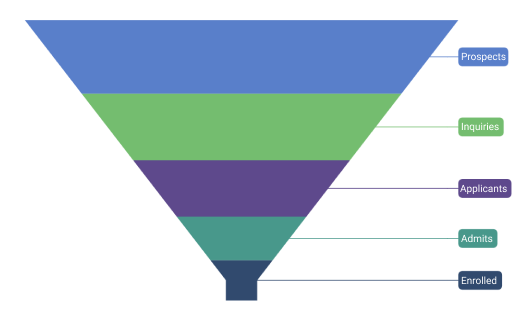

# Data Labels in .NET MAUI Chart

Data labels are used to display values related to a chart segment. Values from data point(x, y) or other custom properties from a data source can be displayed. 

## Enable Data Labels 

To define the data label in the chart, set the [ShowDataLabels](https://help.syncfusion.com/cr/maui/Syncfusion.Maui.Charts.SfFunnelChart.html#Syncfusion_Maui_Charts_SfFunnelChart_ShowDataLabels) property to true. The default value of [ShowDataLabels](https://help.syncfusion.com/cr/maui/Syncfusion.Maui.Charts.SfFunnelChart.html#Syncfusion_Maui_Charts_SfFunnelChart_ShowDataLabels) property is false. 





<chart:SfFunnelChart ShowDataLabels="True"/>
. . .
</chart:SfFunnelChart>





SfFunnelChart chart = new SfFunnelChart();
. . .
chart.ShowDataLabels = true;



 

## Data label customization

 Data labels can be customized by using the [DataLabelSettings](https://help.syncfusion.com/cr/maui/Syncfusion.Maui.Charts.SfFunnelChart.html#Syncfusion_Maui_Charts_SfFunnelChart_DataLabelSettings) property of the chart. For customizing, need to create an instance of [FunnelDataLabelSettings](https://help.syncfusion.com/cr/maui/Syncfusion.Maui.Charts.FunnelDataLabelSettings.html) and set to the [DataLabelSettings](https://help.syncfusion.com/cr/maui/Syncfusion.Maui.Charts.SfFunnelChart.html#Syncfusion_Maui_Charts_SfFunnelChart_DataLabelSettings) property.The following properties, which are available in [FunnelDataLabelSettings](https://help.syncfusion.com/cr/maui/Syncfusion.Maui.Charts.FunnelDataLabelSettings.html), are used to customise the data labels. 

 * [`LabelPlacement`](https://help.syncfusion.com/cr/maui/Syncfusion.Maui.Charts.ChartDataLabelSettings.html#Syncfusion_Maui_Charts_ChartDataLabelSettings_LabelPlacement) - It used to position the funnel chart data labels at [Auto](https://help.syncfusion.com/cr/maui/Syncfusion.Maui.Charts.DataLabelPlacement.html#Syncfusion_Maui_Charts_DataLabelPlacement_Auto), [Inner](https://help.syncfusion.com/cr/maui/Syncfusion.Maui.Charts.DataLabelPlacement.html#Syncfusion_Maui_Charts_DataLabelPlacement_Inner), [Center](https://help.syncfusion.com/cr/maui/Syncfusion.Maui.Charts.DataLabelPlacement.html#Syncfusion_Maui_Charts_DataLabelPlacement_Center) and [Outer](https://help.syncfusion.com/cr/maui/Syncfusion.Maui.Charts.DataLabelPlacement.html#Syncfusion_Maui_Charts_DataLabelPlacement_Outer).
 * [`UseSeriesPalette`](https://help.syncfusion.com/cr/maui/Syncfusion.Maui.Charts.ChartDataLabelSettings.html#Syncfusion_Maui_Charts_ChartDataLabelSettings_UseSeriesPalette) - It used to set the interior of the chart to the data label background.
 * [`Context`](https://help.syncfusion.com/cr/maui/Syncfusion.Maui.Charts.FunnelDataLabelSettings.html#Syncfusion_Maui_Charts_FunnelDataLabelSettings_Context) of type `FunnelDataLabelContext`, indicates weather to show x or y value in the label content.
 * [`LabelStyle`](https://help.syncfusion.com/cr/maui/Syncfusion.Maui.Charts.ChartDataLabelSettings.html#Syncfusion_Maui_Charts_ChartDataLabelSettings_LabelStyle) - It used to customise the data label's appearance. The following properties, which are available in [LabelStyle](https://help.syncfusion.com/cr/maui/Syncfusion.Maui.Charts.ChartDataLabelSettings.html#Syncfusion_Maui_Charts_ChartDataLabelSettings_LabelStyle).
    * [Margin](https://help.syncfusion.com/cr/maui/Syncfusion.Maui.Charts.ChartLabelStyle.html#Syncfusion_Maui_Charts_ChartLabelStyle_Margin) of type `Thickness`, indicates the label's margin.
    * [Background](https://help.syncfusion.com/cr/maui/Syncfusion.Maui.Charts.ChartLabelStyle.html#Syncfusion_Maui_Charts_ChartLabelStyle_Background), of type `Brush`, indicates the label background color.
    * [FontAttributes](https://help.syncfusion.com/cr/maui/Syncfusion.Maui.Charts.ChartLabelStyle.html#Syncfusion_Maui_Charts_ChartLabelStyle_FontAttributes), of type `FontAttributes`, indicates the font style of the data label.
    * [FontSize](https://help.syncfusion.com/cr/maui/Syncfusion.Maui.Charts.ChartLabelStyle.html#Syncfusion_Maui_Charts_ChartLabelStyle_FontSize), of type `double`, indicates the font size.
    * [Stroke](https://help.syncfusion.com/cr/maui/Syncfusion.Maui.Charts.ChartLabelStyle.html#Syncfusion_Maui_Charts_ChartLabelStyle_Stroke), of type `Brush`, indicates the brush used to paint the border of the data label.
    * [StrokeWidth](https://help.syncfusion.com/cr/maui/Syncfusion.Maui.Charts.ChartLabelStyle.html#Syncfusion_Maui_Charts_ChartLabelStyle_StrokeWidth), of type `double`, indicates the width of the label's border.
    * [CornerRadius](https://help.syncfusion.com/cr/maui/Syncfusion.Maui.Charts.ChartLabelStyle.html#Syncfusion_Maui_Charts_ChartLabelStyle_CornerRadius), of type `CornerRadius`, indicates the rounded corner for label.
    * [TextColor](https://help.syncfusion.com/cr/maui/Syncfusion.Maui.Charts.ChartLabelStyle.html#Syncfusion_Maui_Charts_ChartLabelStyle_TextColor), of type `Color`, indicates color of the displayed text.





<chart:SfFunnelChart ShowDataLabels="True">
. . .
 <chart:SfFunnelChart.DataLabelSettings>
    <chart:FunnelDataLabelSettings LabelPlacement="Outer" 
                                   Context="XValue" 
                                   UseSeriesPalette="True">
        <chart:FunnelDataLabelSettings.LabelStyle>
            <chart:ChartDataLabelStyle Margin="2"/>
        </chart:FunnelDataLabelSettings.LabelStyle>
    </chart:FunnelDataLabelSettings>
 </chart:SfFunnelChart.DataLabelSettings>
</chart:SfFunnelChart>





SfFunnelChart chart = new SfFunnelChart();
. . .
chart.ShowDataLabels = true;
chart.DataLabelSettings = new FunnelDataLabelSettings()
{
    Context=FunnelDataLabelContext.XValue,
    LabelPlacement=DataLabelPlacement.Outer,
    UseSeriesPalette=true,
};
chart.DataLabelSettings.LabelStyle = new ChartDataLabelStyle()
{
    Margin = 2,
};



 

