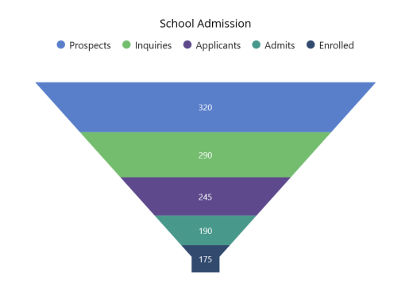

# Getting Started with .NET MAUI Funnel Chart

This section explains how to populate the funnel chart with data, a title, data labels, a legend, and tooltips, as well as the essential aspects for getting started with the funnel chart.

To get start quickly with our [.NET MAUI Funnel Chart](https://help.syncfusion.com/cr/maui/Syncfusion.Maui.Charts.SfFunnelChart.html), you can check the below video.






## Prerequisites
Before proceeding, ensure the following are set up:

1. Install [.NET 9 SDK](https://dotnet.microsoft.com/en-us/download/dotnet/9.0) or later.
2. Set up a .NET MAUI environment with Visual Studio 2022 v17.12 or later.

## Step 1: Create a new .NET MAUI Project

1. Go to **File > New > Project** and choose the **.NET MAUI App** template.
2. Name the project and choose a location. Then, click **Next.**
3. Select the .NET framework version and click **Create.**

## Step 2: Install the Syncfusion® MAUI TreeView NuGet package

1. In **Solution Explorer,** right-click the project and choose **Manage NuGet Packages.**
2. Search for [Syncfusion.Maui.Charts](https://www.nuget.org/packages/Syncfusion.Maui.Charts/) and install the latest version.
3. Ensure the necessary dependencies are installed correctly, and the project is restored. If not, Open the Terminal in Rider and manually run: `dotnet restore`




## Prerequisites

Before proceeding, ensure the following are set up:

1. Install [.NET 9 SDK](https://dotnet.microsoft.com/en-us/download/dotnet/9.0) or later.
2. Set up a .NET MAUI environment with Visual Studio Code.
3. Ensure that the .NET MAUI workloads are installed and configured as described [here](https://learn.microsoft.com/en-us/dotnet/maui/get-started/installation?view=net-maui-9.0&tabs=visual-studio-code).

## Step 1: Create a .NET MAUI project

1. Open the command palette by pressing `Ctrl+Shift+P` and type **.NET:New Project** and enter.
2. Choose the **.NET MAUI App** template.
3. Select the project location, type the project name and press **Enter.**
4. Then choose **Create project.**

## Step 2: Install the Syncfusion® MAUI TreeView NuGet package

1. In **Solution Explorer,** right-click the project and choose **Manage NuGet Packages.**
2. Search for [Syncfusion.Maui.Charts](https://www.nuget.org/packages/Syncfusion.Maui.Charts/) and install the latest version.
3. Ensure the necessary dependencies are installed correctly, and the project is restored. If not, Open the Terminal in Rider and manually run: `dotnet restore`




## Prerequisites

Before proceeding, ensure the following are set up:

1. Install [.NET 9 SDK](https://dotnet.microsoft.com/en-us/download/dotnet/9.0) or later.
2. Set up a .NET MAUI environment with JetBrains Rider 2024.3 or later.
3. Make sure the MAUI workloads are installed and configured as described [here.](https://www.jetbrains.com/help/rider/MAUI.html#before-you-start)

## Step 1: Create a new .NET MAUI project

1. Go to **File > New Solution,** Select .NET (C#) and choose the .NET MAUI App template.
2. Enter the Project Name, Solution Name, and Location.
3. Select the .NET framework version and click Create.

## Step 2: Install the Syncfusion® MAUI TreeView NuGet package

1. In **Solution Explorer,** right-click the project and choose **Manage NuGet Packages.**
2. Search for [Syncfusion.Maui.Charts](https://www.nuget.org/packages/Syncfusion.Maui.Charts/) and install the latest version.
3. Ensure the necessary dependencies are installed correctly, and the project is restored. If not, Open the Terminal in Rider and manually run: `dotnet restore`




## Step 3: Register Syncfusion handler

Make sure to add the namespace.
 


using Syncfusion.Maui.Core.Hosting;


 
Register the Syncfusion core handler in your `CreateMauiApp` method of `MauiProgram.cs` file to use Syncfusion controls.
 


builder.ConfigureSyncfusionCore();



## Step 4: Initialize the view model

Now, let us define a simple data model that represents a data point in the chart.

  



public class AdmissionModel
{
    public string XValue { get; set; }
    public double YValue { get; set; }
}

 

 

Next, create a view AdmissionViewModel class and initialize a list of `AdmissionModel` objects as follows.

  



public class AdmissionViewModel
{
    public List<AdmissionModel> Data { get; set; }

    public AdmissionViewModel()
    {
        Data = new List<AdmissionModel>()
        {
            new AdmissionModel() {XValue = "Enrolled", YValue=175},
            new AdmissionModel() {XValue = "Admits", YValue=190},
            new AdmissionModel() {XValue = "Applicants", YValue=245},
            new AdmissionModel() {XValue = "Inquiries ", YValue=290},
            new AdmissionModel() {XValue = "Prospects ", YValue=320},
        };
    }
}

 

 

Create a `AdmissionViewModel` instance and set it as the chart's `BindingContext`. This enables property binding from `AdmissionViewModel` class.

N> Add the namespace of `AdmissionViewModel` class to your XAML Page, if you prefer to set `BindingContext` in XAML.

## Step 5: Import the Funnel Chart namespace
 
Add the following namespace in your XAML or C#.
 


 
xmlns:chart="clr-namespace:Syncfusion.Maui.Charts;assembly=Syncfusion.Maui.Charts"
 


 
using Syncfusion.Maui.Charts;
 



## Step 6: Populate chart with data

Initialize the [SfFunnelChart](https://help.syncfusion.com/cr/maui/Syncfusion.Maui.Charts.SfFunnelChart.html#constructors) and bind the `Data` to it by using the [ItemsSource](https://help.syncfusion.com/cr/maui/Syncfusion.Maui.Charts.SfFunnelChart.html#Syncfusion_Maui_Charts_SfFunnelChart_ItemsSource) property. The data can be provided through the BindingContext, enabling you to create a customized funnel chart with your own data.

 



<chart:SfFunnelChart ItemsSource="{Binding Data}" 
                        XBindingPath="XValue" 
                        YBindingPath="YValue"
                        ShowDataLabels="True" 
                        EnableTooltip="True">

    <chart:SfFunnelChart.Title>
        <Label Text="School Admission"/>
    </chart:SfFunnelChart.Title>

    <chart:SfFunnelChart.BindingContext>
        <model:AdmissionViewModel/>
    </chart:SfFunnelChart.BindingContext>

    <chart:SfFunnelChart.Legend>
        <chart:ChartLegend/>
    </chart:SfFunnelChart.Legend>

</chart:SfFunnelChart>
 




    SfFunnelChart chart = new SfFunnelChart();
    chart.Title = new Label()
    {
        Text = "School Admission"
    };
    chart.Legend = new ChartLegend();
    AdmissionViewModel viewModel = new AdmissionViewModel();
    chart.BindingContext = viewModel;

    chart.ItemsSource = viewModel.Data;
    chart.XBindingPath = "XValue";
    chart.YBindingPath = "YValue";
    chart.EnableTooltip = true;
    chart.ShowDataLabels = true;





The following screenshot illustrates the result of the above code.

You can download the FunnelCharts Getting Started sample from [GitHub](https://github.com/SyncfusionExamples/GettingStarted_FunnelChart_MAUI).