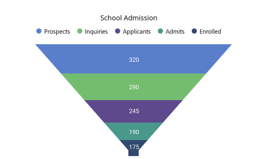

> **Notice**: After **Volume 1 2025 (Mid of March 2025)**, updates, bug fixes, and feature enhancements for this control will no longer be available in the Syncfusion® package. Please switch to the **Syncfusion® Toolkit for .NET MAUI** for continued support. For a smooth transition refer this [migration document](https://help.syncfusion.com/maui-toolkit/migration).

# Getting Started with .NET MAUI Chart

This section explains how to populate the funnel chart with data, a title, data labels, a legend, and tooltips, as well as the essential aspects for getting started with the funnel chart.

To get start quickly with our [.NET MAUI Funnel Chart](https://help.syncfusion.com/cr/maui/Syncfusion.Maui.Charts.SfFunnelChart.html), you can check the below video.






## Prerequisites

Before proceeding, ensure that the following are set up:

1. Install [.NET 8 SDK](https://dotnet.microsoft.com/en-us/download/dotnet/8.0) or later is installed.
2. Set up a .NET MAUI environment with Visual Studio 2022 (v17.8 or later).

## Step 1: Create a new .NET MAUI project

1. Go to **File > New > Project** and choose the **.NET MAUI App** template.
2. Name the project and choose a location. Click **Next**.
3. Select the .NET framework version and click **Create**.

## Step 2: Install the Syncfusion® .NET MAUI Charts Package

1. In **Solution Explorer**, right-click the project and choose **Manage NuGet Packages**.
2. Search for [Syncfusion.Maui.Charts](https://www.nuget.org/packages/Syncfusion.Maui.Charts/) and install the latest version.
3. Ensure the necessary dependencies are installed correctly, and the project is restored.

## Step 3: Register the handler

Syncfusion.Maui.Core nuget is a dependent package for all Syncfusion® controls of .NET MAUI. In the **MauiProgram.cs** file, register the handler for Syncfusion® core.




using Microsoft.Maui;
using Microsoft.Maui.Hosting;
using Microsoft.Maui.Controls.Compatibility;
using Microsoft.Maui.Controls.Hosting;
using Microsoft.Maui.Controls.Xaml;
using Syncfusion.Maui.Core.Hosting;

namespace ChartGettingStarted
{
    public static class MauiProgram
    {
        public static MauiApp CreateMauiApp()
        {
            var builder = MauiApp.CreateBuilder();
            builder
            .UseMauiApp<App>()
            .ConfigureSyncfusionCore()
            .ConfigureFonts(fonts =>
            {
                fonts.AddFont("OpenSans-Regular.ttf", "OpenSansRegular");
            });

            return builder.Build();
        }
    }
}


 

## Step 4: Add .NET MAUI Funnel Chart

1. To initialize the control, import the `Syncfusion.Maui.Charts` namespace.
2. Initialize [SfFunnelChart](https://help.syncfusion.com/cr/maui/Syncfusion.Maui.Charts.SfFunnelChart.html).

 


<ContentPage   
    . . .
    xmlns:chart="clr-namespace:Syncfusion.Maui.Charts;assembly=Syncfusion.Maui.Charts">

    <chart:SfFunnelChart/>
</ContentPage>
 




using Syncfusion.Maui.Charts;
. . .

public partial class MainPage : ContentPage
{
    public MainPage()
    {
        this.InitializeComponent();
        SfFunnelChart chart = new SfFunnelChart();
        this.Content = chart;
    }
}   







## Prerequisites

Before proceeding, ensure that the following are set up:

1. Install [.NET 8 SDK](https://dotnet.microsoft.com/en-us/download/dotnet/8.0) or later is installed.
2. Set up a .NET MAUI environment with Visual Studio Code.
3. Ensure that the .NET MAUI extension is installed and configured as described [here.](https://learn.microsoft.com/en-us/dotnet/maui/get-started/installation?view=net-maui-8.0&tabs=visual-studio-code)

## Step 1: Create a new .NET MAUI project

1. Open the command palette by pressing `Ctrl+Shift+P` and type **.NET:New Project** and enter.
2. Choose the **.NET MAUI App** template.
3. Select the project location, type the project name and press **Enter.**
4. Then choose **Create project.**

## Step 2: Install the Syncfusion® .NET MAUI Charts Package

1. Press <kbd>Ctrl</kbd> + <kbd>`</kbd> (backtick) to open the integrated terminal in Visual Studio Code.
2. Ensure you're in the project root directory where your .csproj file is located.
3. Run the command `dotnet add package Syncfusion.Maui.Charts` to install the Syncfusion® .NET MAUI Charts NuGet package.
4. To ensure all dependencies are installed, run `dotnet restore`.

## Step 3: Register the handler

Syncfusion.Maui.Core nuget is a dependent package for all Syncfusion® controls of .NET MAUI. In the **MauiProgram.cs** file, register the handler for Syncfusion® core.




using Microsoft.Maui;
using Microsoft.Maui.Hosting;
using Microsoft.Maui.Controls.Compatibility;
using Microsoft.Maui.Controls.Hosting;
using Microsoft.Maui.Controls.Xaml;
using Syncfusion.Maui.Core.Hosting;

namespace ChartGettingStarted
{
    public static class MauiProgram
    {
        public static MauiApp CreateMauiApp()
        {
            var builder = MauiApp.CreateBuilder();
            builder
            .UseMauiApp<App>()
            .ConfigureSyncfusionCore()
            .ConfigureFonts(fonts =>
            {
                fonts.AddFont("OpenSans-Regular.ttf", "OpenSansRegular");
            });

            return builder.Build();
        }
    }
}

 


## Step 4: Add .NET MAUI Funnel Chart

1. To initialize the control, import the `Syncfusion.Maui.Charts` namespace.
2. Initialize [SfFunnelChart](https://help.syncfusion.com/cr/maui/Syncfusion.Maui.Charts.SfFunnelChart.html).

 


<ContentPage   
    . . .
    xmlns:chart="clr-namespace:Syncfusion.Maui.Charts;assembly=Syncfusion.Maui.Charts">

    <chart:SfFunnelChart/>
</ContentPage>
 




using Syncfusion.Maui.Charts;
. . .

public partial class MainPage : ContentPage
{
    public MainPage()
    {
        this.InitializeComponent();
        SfFunnelChart chart = new SfFunnelChart();
        this.Content = chart;
    }
}   







## Prerequisites

Before proceeding, ensure the following are set up:

1. Ensure you have the latest version of JetBrains Rider.
2. Install [.NET 8 SDK](https://dotnet.microsoft.com/en-us/download/dotnet/8.0) or later is installed.
3. Make sure the MAUI workloads are installed and configured as described [here.](https://www.jetbrains.com/help/rider/MAUI.html#before-you-start)

## Step 1: Create a new .NET MAUI Project

1. Go to **File > New Solution,** Select .NET (C#) and choose the .NET MAUI App template.
2. Enter the Project Name, Solution Name, and Location.
3. Select the .NET framework version and click Create.

## Step 2: Install the Syncfusion® MAUI Charts NuGet Package

1. In **Solution Explorer,** right-click the project and choose **Manage NuGet Packages.**
2. Search for [Syncfusion.Maui.Charts](https://www.nuget.org/packages/Syncfusion.Maui.Charts/) and install the latest version.
3. Ensure the necessary dependencies are installed correctly, and the project is restored. If not, Open the Terminal in Rider and manually run: `dotnet restore`

## Step 3: Register the handler

[Syncfusion.Maui.Core](https://www.nuget.org/packages/Syncfusion.Maui.Core/) NuGet is a dependent package for all Syncfusion® controls of .NET MAUI. In the MauiProgram.cs file, register the handler for Syncfusion® core.


using Microsoft.Maui;
using Microsoft.Maui.Hosting;
using Microsoft.Maui.Controls.Compatibility;
using Microsoft.Maui.Controls.Hosting;
using Microsoft.Maui.Controls.Xaml;
using Syncfusion.Maui.Core.Hosting;

namespace FunnelChartsSample
{
  public static class MauiProgram
  {
	public static MauiApp CreateMauiApp()
	{
		var builder = MauiApp.CreateBuilder();
		builder
		.UseMauiApp<App>()
		.ConfigureSyncfusionCore()
		.ConfigureFonts(fonts =>
		{
			fonts.AddFont("OpenSans-Regular.ttf", "OpenSansRegular");
		});

		return builder.Build();
	 }

  }

}     



## Step 4: Add a Basic Avatar View

1. To initialize the control, import the Charts namespace into your code.
2. Initialize [SfFunnelCharts](https://help.syncfusion.com/cr/maui/Syncfusion.Maui.Charts.SfFunnelCharts.html?tabs=tabid-1).





<ContentPage
    . . .    
    xmlns:sfcharts="clr-namespace:Syncfusion.Maui.Charts;assembly=Syncfusion.Maui.Charts">
    <Grid>
        <sfcharts:SfFunnelCharts />
    </Grid>
</ContentPage>





    using Syncfusion.Maui.Charts;
    namespace FunnelChartsGettingStarted
    {
        public partial class MainPage : ContentPage
        {
            public MainPage()
            {
                InitializeComponent();           
                SfFunnelCharts funnelCharts = new SfFunnelCharts();
            }
        }   
    }








### Initialize view model

Now, let us define a simple data model that represents a data point in the chart.

  



public class AdmissionModel
{
    public string XValue { get; set; }
    public double YValue { get; set; }
}

 

 

Next, create a view AdmissionViewModel class and initialize a list of `AdmissionModel` objects as follows.

  



public class AdmissionViewModel
{
    public List<AdmissionModel> Data { get; set; }

    public AdmissionViewModel()
    {
        Data = new List<AdmissionModel>()
        {
            new AdmissionModel() {XValue = "Enrolled", YValue=175},
            new AdmissionModel() {XValue = "Admits", YValue=190},
            new AdmissionModel() {XValue = "Applicants", YValue=245},
            new AdmissionModel() {XValue = "Inquiries ", YValue=290},
            new AdmissionModel() {XValue = "Prospects ", YValue=320},
        };
    }
}

 

 

Create a `AdmissionViewModel` instance and set it as the chart's `BindingContext`. This enables property binding from `AdmissionViewModel` class.

N> Add the namespace of `AdmissionViewModel` class to your XAML Page, if you prefer to set `BindingContext` in XAML.

 



<ContentPage
    . . .
    xmlns:chart="clr-namespace:Syncfusion.Maui.Charts;assembly=Syncfusion.Maui.Charts"
    xmlns:model="clr-namespace:ChartGettingStarted">

    <chart:SfFunnelChart>
        <chart:SfFunnelChart.BindingContext>
            <model:AdmissionViewModel/>
        </chart:SfFunnelChart.BindingContext>
    </chart:SfFunnelChart>
</ContentPage>





SfFunnelChart chart = new SfFunnelChart();
AdmissionViewModel viewModel = new AdmissionViewModel();
chart.BindingContext = viewModel;



 

### Populate chart with data

Binding `Data` to the funnel chart [ItemsSource](https://help.syncfusion.com/cr/maui/Syncfusion.Maui.Charts.SfFunnelChart.html#Syncfusion_Maui_Charts_SfFunnelChart_ItemsSource) property from its BindingContext to create our own funnel chart.

   



<chart:SfFunnelChart ItemsSource="{Binding Data}" 
                     XBindingPath="XValue" 
                     YBindingPath="YValue">
. . .            
</chart:SfFunnelChart>





SfFunnelChart chart = new SfFunnelChart();
AdmissionViewModel viewModel = new AdmissionViewModel();
chart.ItemsSource = viewModel.Data;
chart.XBindingPath = "XValue";
chart.YBindingPath = "YValue";
this.Content = chart;



 

### Add a title

The title of the chart acts as the title to provide quick information to the user about the data being plotted in the chart. You can set the title using the [Title](https://help.syncfusion.com/cr/maui/Syncfusion.Maui.Charts.ChartBase.html#Syncfusion_Maui_Charts_ChartBase_Title) property of the funnel chart as follows.

 



<chart:SfFunnelChart>
    <chart:SfFunnelChart.Title>
        <Label Text="School Admission"/>
    </chart:SfFunnelChart.Title>
    . . .
</chart:SfFunnelChart>





SfFunnelChart chart = new SfFunnelChart();
chart.Title = new Label()
{
    Text = "School Admission"
};
. . .
this.Content = chart;



  

### Enable the data labels

The [ShowDataLabels](https://help.syncfusion.com/cr/maui/Syncfusion.Maui.Charts.SfFunnelChart.html#Syncfusion_Maui_Charts_SfFunnelChart_ShowDataLabels) property of the chart can be used to enable data labels to improve the readability of the funnel chart. The label visibility is set to `False` by default.

 



<chart:SfFunnelChart ShowDataLabels="True">
    . . .
</chart:SfFunnelChart>





SfFunnelChart chart = new SfFunnelChart();
. . .
chart.ShowDataLabels = true;
this.Content = chart;



 

### Enable a legend

The legend provides information about the data point displayed in the funnel chart. The [Legend](https://help.syncfusion.com/cr/maui/Syncfusion.Maui.Charts.ChartBase.html#Syncfusion_Maui_Charts_ChartBase_Legend) property of the chart was used to enable it.

 



<chart:SfFunnelChart>
    . . .
    <chart:SfFunnelChart.Legend>
        <chart:ChartLegend/>
    </chart:SfFunnelChart.Legend>
</chart:SfFunnelChart>





SfFunnelChart chart = new SfFunnelChart();
. . .
chart.Legend = new ChartLegend();
this.Content = chart;



 

### Enable Tooltip

Tooltips are used to show information about the segment, when mouse over on it. Enable tooltip by setting the chart [EnableTooltip](https://help.syncfusion.com/cr/maui/Syncfusion.Maui.Charts.SfFunnelChart.html#Syncfusion_Maui_Charts_SfFunnelChart_EnableTooltip) property as `true`.

 



<chart:SfFunnelChart EnableTooltip="True">
    . . .
</chart:SfFunnelChart>





SfFunnelChart chart = new SfFunnelChart();
. . .
chart.EnableTooltip = true;
this.Content = chart;





The following code example gives you the complete code of above configurations.

 



<ContentPage
    xmlns="http://schemas.microsoft.com/dotnet/2021/maui"
    xmlns:x="http://schemas.microsoft.com/winfx/2009/xaml"
    x:Class="ChartGettingStarted.MainPage"
    xmlns:chart="clr-namespace:Syncfusion.Maui.Charts;assembly=Syncfusion.Maui.Charts"
    xmlns:model="clr-namespace:ChartGettingStarted">

    <chart:SfFunnelChart ItemsSource="{Binding Data}" 
                         XBindingPath="XValue" 
                         YBindingPath="YValue"
                         ShowDataLabels="True" 
                         EnableTooltip="True">

        <chart:SfFunnelChart.Title>
            <Label Text="School Admission"/>
        </chart:SfFunnelChart.Title>

        <chart:SfFunnelChart.BindingContext>
            <model:AdmissionViewModel/>
        </chart:SfFunnelChart.BindingContext>

        <chart:SfFunnelChart.Legend>
            <chart:ChartLegend/>
        </chart:SfFunnelChart.Legend>

    </chart:SfFunnelChart>

</ContentPage>
 




using Syncfusion.Maui.Charts;
. . .
public partial class MainPage : ContentPage
{   
    public MainWindow()
    {
        SfFunnelChart chart = new SfFunnelChart();
        chart.Title = new Label()
        {
            Text = "School Admission"
        };
        chart.Legend = new ChartLegend();
        AdmissionViewModel viewModel = new AdmissionViewModel();
        chart.BindingContext = viewModel;

        chart.ItemsSource = viewModel.Data;
        chart.XBindingPath = "XValue";
        chart.YBindingPath = "YValue";
        chart.EnableTooltip = true;
        chart.ShowDataLabels = true;
        this.Content = chart;
    }
}





You can find the complete getting started sample from this [link](https://github.com/SyncfusionExamples/GettingStarted_FunnelChart_MAUI).