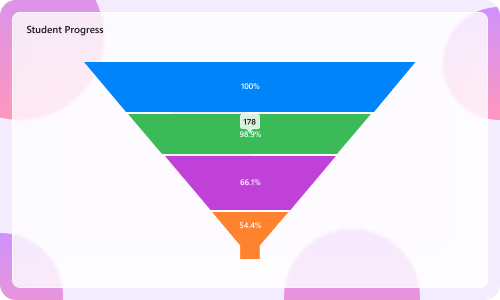

# Liquid Glass Effect in .NET MAUI Funnel Chart

The Liquid Glass Effect is a modern design style that provides a sleek, minimalist appearance with clean lines, subtle visual effects, and elegant styling. It features smooth rounded corners and sophisticated visual treatments that create a polished, professional look for your charts.

> **Prerequisite:** 
>- Ensure that the required NuGet package is installed, the necessary namespaces are imported, and the **Funnel Chart** control is properly configured in your application. For detailed setup and configuration instructions, refer to the **[Getting Started](https://help.syncfusion.com/maui/funnel-charts/getting-started)** guide.
>- To use **SfGlassEffectView**, ensure that the Syncfusion.Maui.Core package is installed and import the Syncfusion.Maui.Core namespace.

N> The liquid glass effect is supported with `.NET 10` and on iOS and macOS versions 26 or later.

## How it Enhances Chart UI on macOS and iOS

The Liquid Glass Effect enhances MAUI [SfFunnelChart](https://help.syncfusion.com/cr/maui/Syncfusion.Maui.Charts.SfFunnelChart.html) with a sleek, glassy look and improved interactivity.

- **Tooltip:** Applies a glassy appearance to tooltips for clearer data highlights.
- **Chart Background:** Wrap the chart in an [SfGlassEffectView](https://help.syncfusion.com/cr/maui/Syncfusion.Maui.Core.SfGlassEffectView.html) to give the chart surface a blurred or clear glass background.

## Apply Liquid Glass Effect to SfFunnelChart

Wrap the [SfFunnelChart](https://help.syncfusion.com/cr/maui/Syncfusion.Maui.Charts.SfFunnelChart.html) inside an [SfGlassEffectView](https://help.syncfusion.com/cr/maui/Syncfusion.Maui.Core.SfGlassEffectView.html) to give the chart surface a glass (blurred or clear) appearance. `SfGlassEffectView` is available in the [Syncfusion.Maui.Core](https://www.nuget.org/packages/Syncfusion.Maui.Core/) package.





<core:SfGlassEffectView CornerRadius="20"
                        Padding="12"
                        EffectType="Regular"
                        EnableShadowEffect="True">
    <chart:SfFunnelChart ItemsSource="{Binding Data}" 
                         XBindingPath="XValue" 
                         YBindingPath="YValue"/>
</core:SfGlassEffectView>





SfFunnelChart chart = new SfFunnelChart();
chart.ItemsSource = viewModel.Data;
chart.XBindingPath = "XValue";
chart.YBindingPath = "YValue";

var glass = new SfGlassEffectView
{
    CornerRadius = 20,
    Padding = new Thickness(12),
    EffectType = GlassEffectType.Regular, // Regular (blurrier) or Clear (glassy)
    EnableShadowEffect = true,
    Content = chart
};

this.Content = glass;





For detailed guidance on [SfGlassEffectView](https://help.syncfusion.com/cr/maui/Syncfusion.Maui.Core.SfGlassEffectView.html), refer to the Getting Started [documentation](https://help.syncfusion.com/maui/liquid-glass-ui/getting-started).

### Enable Liquid Glass Effect for the Tooltip

To enable the liquid glass effect for the tooltip, set the [EnableLiquidGlassEffect](https://help.syncfusion.com/cr/maui/Syncfusion.Maui.Charts.ChartBase.html#Syncfusion_Maui_Charts_ChartBase_EnableLiquidGlassEffect) and [EnableTooltip](https://help.syncfusion.com/cr/maui/Syncfusion.Maui.Charts.SfFunnelChart.html#Syncfusion_Maui_Charts_SfFunnelChart_EnableTooltip) properties to `true` on the [SfFunnelChart](https://help.syncfusion.com/cr/maui/Syncfusion.Maui.Charts.SfFunnelChart.html).





<chart:SfFunnelChart ItemsSource="{Binding Data}" 
                     XBindingPath="XValue" 
                     YBindingPath="YValue"
                     EnableLiquidGlassEffect="True"
                     EnableTooltip="True">
</chart:SfFunnelChart>





SfFunnelChart chart = new SfFunnelChart();
chart.ItemsSource = viewModel.Data;
chart.XBindingPath = "XValue";
chart.YBindingPath = "YValue";
chart.EnableLiquidGlassEffect = true;
chart.EnableTooltip = true;

this.Content = chart;





### Best Practices and Tips

- Liquid glass effects are most visible over images or colorful backgrounds.
- Set [EffectType](https://help.syncfusion.com/cr/maui/Syncfusion.Maui.Core.SfGlassEffectView.html#Syncfusion_Maui_Core_SfGlassEffectView_EffectType) property of [SfGlassEffectView](https://help.syncfusion.com/cr/maui/Syncfusion.Maui.Core.SfGlassEffectView.html) to `Regular` for a blurrier look and `Clear` for a crisper, glassy look.
- Adjust [CornerRadius](https://help.syncfusion.com/cr/maui/Syncfusion.Maui.Core.SfGlassEffectView.html#Syncfusion_Maui_Core_SfGlassEffectView_CornerRadius) and [Padding](https://help.syncfusion.com/cr/maui/Syncfusion.Maui.Core.SfGlassEffectView.html#Syncfusion_Maui_Core_SfGlassEffectView_Padding) properties to balance content density and visual polish.
- When using a custom template for tooltip with [TooltipTemplate](https://help.syncfusion.com/cr/maui/Syncfusion.Maui.Charts.SfFunnelChart.html#Syncfusion_Maui_Charts_SfFunnelChart_TooltipTemplate), set the background to `Transparent` to display the liquid glass effect properly.

The following code example shows how to use a custom tooltip template with a transparent background:





<Grid x:Name="grid">
    <Grid.Resources>
        <DataTemplate x:Key="tooltipTemplate">
            <Label Text="{Binding Item.YValue}"
                   TextColor="White"
                   FontAttributes="Bold"
                   Padding="8"/>
        </DataTemplate>
    </Grid.Resources>

    <chart:SfFunnelChart ItemsSource="{Binding Data}"
                         XBindingPath="XValue"
                         YBindingPath="YValue"
                         EnableLiquidGlassEffect="True"
                         EnableTooltip="True"
                         TooltipTemplate="{StaticResource tooltipTemplate}">
    </chart:SfFunnelChart>
</Grid>





// In your DataTemplate for the tooltip, set Background to Transparent
var tooltipTemplate = new DataTemplate(() =>
{
    var label = new Label
    {
        TextColor = Colors.White,
        FontAttributes = FontAttributes.Bold,
        Padding = 8,
        BackgroundColor = Colors.Transparent  // Ensure transparent background
    };
    label.SetBinding(Label.TextProperty, "Item.YValue");
    return label;
});

SfFunnelChart chart = new SfFunnelChart();
chart.ItemsSource = viewModel.Data;
chart.XBindingPath = "XValue";
chart.YBindingPath = "YValue";
chart.EnableLiquidGlassEffect = true;
chart.EnableTooltip = true;
chart.TooltipTemplate = tooltipTemplate;

this.Content = chart;




