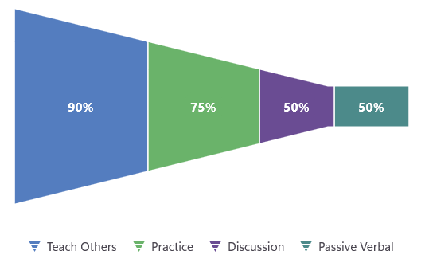

# Orientation in .NET MAUI Funnel Chart

The rendering direction of the funnel chart can be changed using the [Orientation](https://help.syncfusion.com/cr/maui/Syncfusion.Maui.Charts.SfFunnelChart.html#Syncfusion_Maui_Charts_SfFunnelChart_Orientation) property. The default value of this property is `Vertical`, which arranges segments from bottom to top. It can be set to `Horizontal` to render segments from right to left.

N> **Prerequisite:** Ensure that the required NuGet package is installed, the necessary namespaces are imported, and the **Funnel Chart** control is properly configured in your application. For detailed setup and configuration instructions, refer to the **[Getting Started](https://help.syncfusion.com/maui/funnel-charts/getting-started)** guide.





<chart:SfFunnelChart ItemsSource="{Binding Data}" 
                     XBindingPath="XValue" 
                     YBindingPath="YValue"
                     Orientation="Horizontal">
</chart:SfFunnelChart>





SfFunnelChart chart = new SfFunnelChart();
AdmissionViewModel viewModel = new AdmissionViewModel();
chart.BindingContext = viewModel;

chart.ItemsSource = viewModel.Data;
chart.XBindingPath = "XValue";
chart.YBindingPath = "YValue";
chart.Orientation = ChartOrientation.Horizontal;

this.Content = chart;





