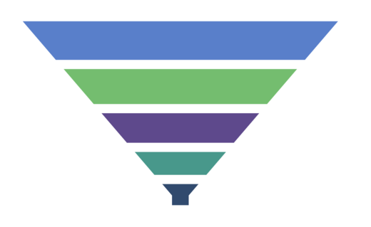

# Segment spacing in .NET MAUI Funnel Chart

The gap between each segment in the funnel chart can be set using the [GapRatio](https://help.syncfusion.com/cr/maui/Syncfusion.Maui.Charts.SfFunnelChart.html#Syncfusion_Maui_Charts_SfFunnelChart_GapRatio) property. The default value of the [GapRatio](https://help.syncfusion.com/cr/maui/Syncfusion.Maui.Charts.SfFunnelChart.html#Syncfusion_Maui_Charts_SfFunnelChart_GapRatio) property is `0`, and its value ranges from `0` to `1`. This ratio represents the spacing relative to the segment height; a value of `0.2` means the gap is 20% of the segment's height.

N> **Prerequisite:** Ensure that the required NuGet package is installed, the necessary namespaces are imported, and the **Funnel Chart** control is properly configured in your application. For detailed setup and configuration instructions, refer to the **[Getting Started](https://help.syncfusion.com/maui/funnel-charts/getting-started)** guide.





<chart:SfFunnelChart ItemsSource="{Binding Data}" 
                     XBindingPath="XValue" 
                     YBindingPath="YValue"
                     GapRatio="0.2">
</chart:SfFunnelChart>





SfFunnelChart chart = new SfFunnelChart();
ViewModel viewModel = new ViewModel();
chart.BindingContext = viewModel;

chart.ItemsSource = viewModel.Data;
chart.XBindingPath = "XValue";
chart.YBindingPath = "YValue";
chart.GapRatio = 0.2;

this.Content = chart;





