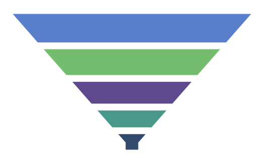

# Segment spacing in .NET MAUI Funnel Chart

The gap between each segment in the funnel chart can be set using the [GapRatio](https://help.syncfusion.com/cr/maui/Syncfusion.Maui.Charts.SfFunnelChart.html#Syncfusion_Maui_Charts_SfFunnelChart_GapRatio) property. The default value of [GapRatio](https://help.syncfusion.com/cr/maui/Syncfusion.Maui.Charts.SfFunnelChart.html#Syncfusion_Maui_Charts_SfFunnelChart_GapRatio) property is `0` and its value ranges from `0` to `1`.





<chart:SfFunnelChart GapRatio="0.2">
    . . .
</chart:SfFunnelChart>





SfFunnelChart chart = new SfFunnelChart();
. . .
chart.GapRatio = 0.2;
this.Content = chart;





