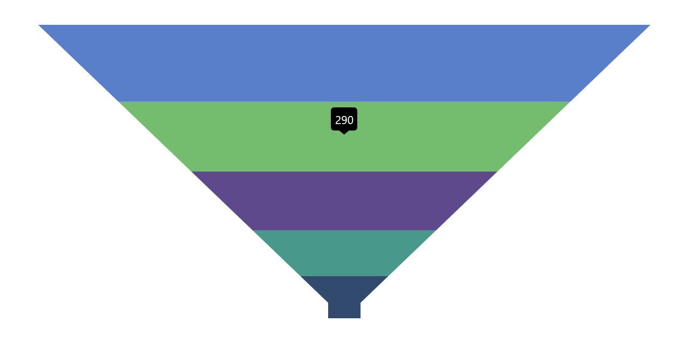

# Tooltip in .NET MAUI Funnel Chart

The tooltip provides additional information when hovering over a funnel segment. By default, the segment's Y value will be shown in the tooltip.

N> **Prerequisite:** Ensure that the required NuGet package is installed, the necessary namespaces are imported, and the **Funnel Chart** control is properly configured in your application. For detailed setup and configuration instructions, refer to the **[Getting Started](https://help.syncfusion.com/maui/funnel-charts/getting-started)** guide.

## Enable Tooltip

To enable the tooltip in the chart, set the [EnableTooltip](https://help.syncfusion.com/cr/maui/Syncfusion.Maui.Charts.SfFunnelChart.html#Syncfusion_Maui_Charts_SfFunnelChart_EnableTooltip) property of [SfFunnelChart](https://help.syncfusion.com/cr/maui/Syncfusion.Maui.Charts.SfFunnelChart.html) to `true`.





<chart:SfFunnelChart ItemsSource="{Binding Data}" 
                     XBindingPath="XValue" 
                     YBindingPath="YValue"
                     EnableTooltip="True">
</chart:SfFunnelChart>





SfFunnelChart chart = new SfFunnelChart();
chart.ItemsSource = viewModel.Data;
chart.XBindingPath = "XValue";
chart.YBindingPath = "YValue";
chart.EnableTooltip = true;

this.Content = chart;





## Tooltip Customization

The [ChartTooltipBehavior](https://help.syncfusion.com/cr/maui/Syncfusion.Maui.Charts.ChartTooltipBehavior.html) is used to customize the tooltip. To customize the tooltip, create an instance of [ChartTooltipBehavior](https://help.syncfusion.com/cr/maui/Syncfusion.Maui.Charts.ChartTooltipBehavior.html) and set it to the [TooltipBehavior](https://help.syncfusion.com/cr/maui/Syncfusion.Maui.Charts.ChartBase.html#Syncfusion_Maui_Charts_ChartBase_TooltipBehavior) property of [SfFunnelChart](https://help.syncfusion.com/cr/maui/Syncfusion.Maui.Charts.SfFunnelChart.html). The following properties are used to customize the tooltip:

* [Background](https://help.syncfusion.com/cr/maui/Syncfusion.Maui.Charts.ChartTooltipBehavior.html#Syncfusion_Maui_Charts_ChartTooltipBehavior_Background) of type `Brush` — indicates the background color of the tooltip label.
* [FontAttributes](https://help.syncfusion.com/cr/maui/Syncfusion.Maui.Charts.ChartTooltipBehavior.html#Syncfusion_Maui_Charts_ChartTooltipBehavior_FontAttributes) of type `FontAttributes` — indicates the font style of the label.
* [FontFamily](https://help.syncfusion.com/cr/maui/Syncfusion.Maui.Charts.ChartTooltipBehavior.html#Syncfusion_Maui_Charts_ChartTooltipBehavior_FontFamily) of type `string` — indicates the font family for the label.
* [FontSize](https://help.syncfusion.com/cr/maui/Syncfusion.Maui.Charts.ChartTooltipBehavior.html#Syncfusion_Maui_Charts_ChartTooltipBehavior_FontSize) of type `float` — indicates the font size.
* [Duration](https://help.syncfusion.com/cr/maui/Syncfusion.Maui.Charts.ChartTooltipBehavior.html#Syncfusion_Maui_Charts_ChartTooltipBehavior_Duration) of type `int` — indicates the duration for displaying the tooltip.
* [Margin](https://help.syncfusion.com/cr/maui/Syncfusion.Maui.Charts.ChartTooltipBehavior.html#Syncfusion_Maui_Charts_ChartTooltipBehavior_Margin) of type `Thickness` — indicates the label's margin.
* [TextColor](https://help.syncfusion.com/cr/maui/Syncfusion.Maui.Charts.ChartTooltipBehavior.html#Syncfusion_Maui_Charts_ChartTooltipBehavior_TextColor) of type `Color` — indicates the color of the displayed text.
* [Stroke](https://help.syncfusion.com/cr/maui/Syncfusion.Maui.Charts.ChartTooltipBehavior.html#Syncfusion_Maui_Charts_ChartTooltipBehavior_Stroke) of type `Brush` — indicates the border color of the tooltip.
* [StrokeWidth](https://help.syncfusion.com/cr/maui/Syncfusion.Maui.Charts.ChartTooltipBehavior.html#Syncfusion_Maui_Charts_ChartTooltipBehavior_StrokeWidth) of type `double` — indicates the thickness of the tooltip border.
* [UseSeriesFillColor](https://help.syncfusion.com/cr/maui/Syncfusion.Maui.Charts.ChartTooltipBehavior.html#Syncfusion_Maui_Charts_ChartTooltipBehavior_UseSeriesFillColor) of type `bool` — indicates whether the tooltip background should use the fill color of the associated segment; when `true`, the tooltip adopts the segment color as its background.





<chart:SfFunnelChart ItemsSource="{Binding Data}" 
                     XBindingPath="XValue" 
                     YBindingPath="YValue"
                     EnableTooltip="True">
    <chart:SfFunnelChart.TooltipBehavior>
        <chart:ChartTooltipBehavior Duration="4"/>
    </chart:SfFunnelChart.TooltipBehavior>
</chart:SfFunnelChart>





SfFunnelChart chart = new SfFunnelChart();
chart.ItemsSource = viewModel.Data;
chart.XBindingPath = "XValue";
chart.YBindingPath = "YValue";
chart.EnableTooltip = true;
chart.TooltipBehavior = new ChartTooltipBehavior()
{
    Duration = 4,
};

this.Content = chart;





## Tooltip Template

[TooltipTemplate](https://help.syncfusion.com/cr/maui/Syncfusion.Maui.Charts.SfFunnelChart.html#Syncfusion_Maui_Charts_SfFunnelChart_TooltipTemplate) is used to customize the tooltip with additional information beyond the default display. The template binding context is the chart segment's `TooltipInfo` object, which contains an `Item` property for the data point.





<Grid x:Name="grid">
    <Grid.Resources>
        <DataTemplate x:Key="tooltipTemplate">
            <HorizontalStackLayout Padding="8" Spacing="4">
                <Label Text="{Binding Item.XValue}"
                       TextColor="White"
                       FontAttributes="Bold"
                       VerticalOptions="Center"/>
                <Label Text="{Binding Item.YValue, StringFormat=': {0}'}"
                       TextColor="White"
                       FontAttributes="Bold"
                       VerticalOptions="Center"/>
            </HorizontalStackLayout>
        </DataTemplate>
    </Grid.Resources>

    <chart:SfFunnelChart ItemsSource="{Binding Data}" 
                         XBindingPath="XValue" 
                         YBindingPath="YValue"
                         EnableTooltip="True"
                         TooltipTemplate="{StaticResource tooltipTemplate}">
    </chart:SfFunnelChart>
</Grid>





SfFunnelChart chart = new SfFunnelChart();
chart.ItemsSource = viewModel.Data;
chart.XBindingPath = "XValue";
chart.YBindingPath = "YValue";
chart.EnableTooltip = true;
chart.TooltipTemplate = grid.Resources["tooltipTemplate"] as DataTemplate;

grid.Children.Add(chart);
this.Content = grid;





