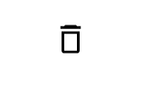

# .NET MAUI Icons Library

The Syncfusion<sup style="font-size:70%">&reg;</sup> .NET MAUI library contains a comprehensive set of icons bundled in the `MauiMaterialAssets.ttf` file. These icons are readily available for use in .NET MAUI applications once the Syncfusion<sup style="font-size:70%">&reg;</sup> MAUI package is installed.

## Getting Started with Icon Integration

To start using the icons, first ensure that the font is registered in your application. Here is a walkthrough on setting up the `MauiMaterialAssets.ttf`:

> **Note**: The `MauiMaterialAssets.ttf` font file will automatically be added to your project's font folder upon installation of the Syncfusion<sup style="font-size:70%">&reg;</sup> MAUI package, simplifying initial setup. Make sure to register this font in `MauiProgram.cs` to utilize the whole icon set effectively.

1. **Install the Syncfusion<sup style="font-size:70%">&reg;</sup> MAUI Package**: Once installed, the `MauiMaterialAssets.ttf` will be added to your project's font folder.

2. **Register the Font**: Modify your `MauiProgram.cs` to register the icon font. Here is an example:

    ```csharp
    // ... existing code ...
    public static class MauiProgram
    {
        public static MauiApp CreateMauiApp()
        {
            var builder = MauiApp.CreateBuilder();
            // ... existing code ...
            builder.ConfigureFonts(fonts =>
            {
                fonts.AddFont("MauiMaterialAssets.ttf", "MaterialAssets");
            });
            return builder.Build();
        }
    }
    ```

3. **Using Icons in the Project**: To use icons in your MAUI project, simply refer to them using the designated font family. Below is an example of how you might integrate an icon into a Label.

    
    

        <Label Text="&#xE70F;"
                FontFamily="MaterialAssets"
                FontSize="24"
                TextColor="Black"/>
            
    
    

        Label label = new Label
        {
            Text = "\ue70f", // Unicode character representation
            FontFamily = "MaterialAssets",
            FontSize = 24,
            TextColor = Colors.Black 
        };

    
    

    The following image illustrates the result of the above code. 
    
    

### Icons List

The following icons are available in the `MauiMaterialAssets.ttf` file:

<div style="overflow-y: scroll; height: 300px; border: 1px solid #ddd; padding: 10px;">

  <ul>
    <li><strong>Adjustment</strong>: `"\ue748"`</li>
    <li><strong>AlignCenter</strong>: `"\ue752"`</li>
    <li><strong>AlignLeft</strong>: `"\ue751"`</li>
    <li><strong>AlignRight</strong>: `"\ue753"`</li>
    <li><strong>ArrowDown</strong>: `"\ue792"`</li>
    <li><strong>ArrowLeft</strong>: `"\ue72d"`</li>
    <li><strong>ArrowRightUp</strong>: `"\ue73c"`</li>
    <li><strong>ArrowUp</strong>: `"\ue791"`</li>
    <li><strong>Attachment</strong>: `"\ue785"`</li>
    <li><strong>Audio</strong>: `"\ue7a1"`</li>
    <li><strong>Bold</strong>: `"\ue770"`</li>
    <li><strong>Bookmark</strong>: `"\ue728"`</li>
    <li><strong>BookmarkAdd</strong>: `"\ue729"`</li>
    <li><strong>BookmarkRemove</strong>: `"\ue72a"`</li>
    <li><strong>Calendar</strong>: `"\ue71d"`</li>
    <li><strong>CheckLarge</strong>: `"\ue75b"`</li>
    <li><strong>CheckTick</strong>: `"\ue70c"`</li>
    <li><strong>ChevronDown</strong>: `"\ue705"`</li>
    <li><strong>ChevronDownFill</strong>: `"\ue701"`</li>
    <li><strong>ChevronLeft</strong>: `"\ue707"`</li>
    <li><strong>ChevronLeftFill</strong>: `"\ue703"`</li>
    <li><strong>ChevronRight</strong>: `"\ue706"`</li>
    <li><strong>ChevronRightDouble</strong>: `"\ue700"`</li>
    <li><strong>ChevronRightFill</strong>: `"\ue704"`</li>
    <li><strong>ChevronUp</strong>: `"\ue708"`</li>
    <li><strong>ChevronUpFill</strong>: `"\ue702"`</li>
    <li><strong>Circle</strong>: `"\ue73f"`</li>
    <li><strong>CircleCheck</strong>: `"\ue78b"`</li>
    <li><strong>CircleCheckFill</strong>: `"\ue78c"`</li>
    <li><strong>CircleClose</strong>: `"\ue70e"`</li>
    <li><strong>CircleError</strong>: `"\ue78f"`</li>
    <li><strong>Clock</strong>: `"\ue71e"`</li>
    <li><strong>Close</strong>: `"\ue70b"`</li>
    <li><strong>Cloud</strong>: `"\ue783"`</li>
    <li><strong>ColorPalette</strong>: `"\ue767"`</li>
    <li><strong>ContinuousPage</strong>: `"\ue796"`</li>
    <li><strong>Contrast</strong>: `"\ue74b"`</li>
    <li><strong>CornerRadius</strong>: `"\ue757"`</li>
    <li><strong>Copy</strong>: `"\ue7a0"`</li>
    <li><strong>Crop</strong>: `"\ue72f"`</li>
    <li><strong>CustomBookmark</strong>: `"\ue794"`</li>
    <li><strong>DateRange</strong>: `"\ue75e"`</li>
    <li><strong>DateTime</strong>: `"\ue774"`</li>
    <li><strong>DefaultBookmark</strong>: `"\ue793"`</li>
    <li><strong>Description</strong>: `"\ue711"`</li>
    <li><strong>DottedArrow</strong>: `"\ue769"`</li>
    <li><strong>DottedDoubleHeadArrow</strong>: `"\ue76a"`</li>
    <li><strong>DottedLine</strong>: `"\ue76b"`</li>
    <li><strong>DoubleHeadArrow</strong>: `"\ue768"`</li>
    <li><strong>DragAndDrop</strong>: `"\ue724"`</li>
    <li><strong>Edit</strong>: `"\ue710"`</li>
    <li><strong>Ellipse</strong>: `"\ue76f"`</li>
    <li><strong>Email</strong>: `"\ue717"`</li>
    <li><strong>ErrorTreeView</strong>: `"\ue79e"`</li>
    <li><strong>Erase</strong>: `"\ue764"`</li>
    <li><strong>ExportAnnotation</strong>: `"\ue781"`</li>
    <li><strong>ExportExcel</strong>: `"\ue79a"`</li>
    <li><strong>ExportPdf</strong>: `"\ue799"`</li>
    <li><strong>Eye</strong>: `"\ue78e"`</li>
    <li><strong>EyeSlash</strong>: `"\ue758"`</li>
    <li><strong>Fade</strong>: `"\ue74d"`</li>
    <li><strong>FileDocument</strong>: `"\ue797"`</li>
    <li><strong>FileNew</strong>: `"\ue77d"`</li>
    <li><strong>Filter</strong>: `"\ue721"`</li>
    <li><strong>FilterActive</strong>: `"\ue723"`</li>
    <li><strong>FilterClear</strong>: `"\ue722"`</li>
    <li><strong>Filters</strong>: `"\ue747"`</li>
    <li><strong>FitHeight</strong>: `"\ue79d"`</li>
    <li><strong>FitSize</strong>: `"\ue79f"`</li>
    <li><strong>FitWidth</strong>: `"\ue79c"`</li>
    <li><strong>FirstPage</strong>: `"\ue709"`</li>
    <li><strong>FlipHorizontal</strong>: `"\ue741"`</li>
    <li><strong>FlipVertical</strong>: `"\ue740"`</li>
    <li><strong>Folder</strong>: `"\ue712"`</li>
    <li><strong>FontFamily</strong>: `"\ue754"`</li>
    <li><strong>FontSize</strong>: `"\ue755"`</li>
    <li><strong>FontSize1</strong>: `"\ue787"`</li>
    <li><strong>Frame1</strong>: `"\ue731"`</li>
    <li><strong>Frame2</strong>: `"\ue732"`</li>
    <li><strong>Frame3</strong>: `"\ue733"`</li>
    <li><strong>Frame4</strong>: `"\ue734"`</li>
    <li><strong>Frame5</strong>: `"\ue735"`</li>
    <li><strong>Frame6</strong>: `"\ue736"`</li>
    <li><strong>Frame7</strong>: `"\ue76e"`</li>
    <li><strong>FrameCustom</strong>: `"\ue730"`</li>
    <li><strong>FreeDraw</strong>: `"\ue766"`</li>
    <li><strong>Grain</strong>: `"\ue75a"`</li>
    <li><strong>Help</strong>: `"\ue778"`</li>
    <li><strong>HighlightColor</strong>: `"\ue760"`</li>
    <li><strong>Hue</strong>: `"\ue773"`</li>
    <li><strong>Image</strong>: `"\ue76c"`</li>
    <li><strong>ImportAnnotation</strong>: `"\ue782"`</li>
    <li><strong>IntermediateState2</strong>: `"\ue72b"`</li>
    <li><strong>Italic</strong>: `"\ue771"`</li>
    <li><strong>Justify</strong>: `"\ue74f"`</li>
    <li><strong>Key</strong>: `"\ue777"`</li>
    <li><strong>LastPage</strong>: `"\ue70a"`</li>
    <li><strong>Line</strong>: `"\ue73d"`</li>
    <li><strong>LineSpacing</strong>: `"\ue750"`</li>
    <li><strong>Link</strong>: `"\ue78d"`</li>
    <li><strong>Location</strong>: `"\ue71c"`</li>
    <li><strong>Lock</strong>: `"\ue77b"`</li>
    <li><strong>Lunch</strong>: `"\ue75d"`</li>
    <li><strong>Menu</strong>: `"\ue719"`</li>
    <li><strong>MoreHorizontal1</strong>: `"\ue725"`</li>
    <li><strong>MoreVertical</strong>: `"\ue759"`</li>
    <li><strong>MousePointer</strong>: `"\ue738"`</li>
    <li><strong>NewParagraph</strong>: `"\ue77a"`</li>
    <li><strong>None</strong>: `"\ue772"`</li>
    <li><strong>Notes</strong>: `"\ue775"`</li>
    <li><strong>Opacity</strong>: `"\ue76d"`</li>
    <li><strong>PaintBucket</strong>: `"\ue73a"`</li>
    <li><strong>Pan</strong>: `"\ue739"`</li>
    <li><strong>Paragraph</strong>: `"\ue776"`</li>
    <li><strong>PathDraw</strong>: `"\ue78a"`</li>
    <li><strong>People</strong>: `"\ue71a"`</li>
    <li><strong>PdfFile</strong>: `"\ue780"`</li>
    <li><strong>Phone</strong>: `"\ue718"`</li>
    <li><strong>Plus</strong>: `"\ue70d"`</li>
    <li><strong>Polygon</strong>: `"\ue789"`</li>
    <li><strong>Polyline</strong>: `"\ue786"`</li>
    <li><strong>Print</strong>: `"\ue77f"`</li>
    <li><strong>RecurrenceEdit</strong>: `"\ue727"`</li>
    <li><strong>Rectangle</strong>: `"\ue73e"`</li>
    <li><strong>Redo</strong>: `"\ue745"`</li>
    <li><strong>Refresh</strong>: `"\ue7a2"`</li>
    <li><strong>Rename</strong>: `"\ue756"`</li>
    <li><strong>Repeat</strong>: `"\ue726"`</li>
    <li><strong>Reset</strong>: `"\ue746"`</li>
    <li><strong>Save</strong>: `"\ue75f"`</li>
    <li><strong>SaveAs</strong>: `"\ue77e"`</li>
    <li><strong>Saturation</strong>: `"\ue74c"`</li>
    <li><strong>Search</strong>: `"\ue715"`</li>
    <li><strong>Send</strong>: `"\ue784"`</li>
    <li><strong>Settings</strong>: `"\ue716"`</li>
    <li><strong>Shapes</strong>: `"\ue73b"`</li>
    <li><strong>Sharpness</strong>: `"\ue75c"`</li>
    <li><strong>Signature</strong>: `"\ue737"`</li>
    <li><strong>Sorting</strong>: `"\ue720"`</li>
    <li><strong>Squiggly</strong>: `"\ue765"`</li>
    <li><strong>Stamp</strong>: `"\ue761"`</li>
    <li><strong>StopRectangle</strong>: `"\ue7a5"`</li>
    <li><strong>Strikethrough</strong>: `"\ue763"`</li>
    <li><strong>StrokeWidth</strong>: `"\ue74e"`</li>
    <li><strong>TableOfContent</strong>: `"\ue72c"`</li>
    <li><strong>TextAnnotation</strong>: `"\ue788"`</li>
    <li><strong>ThumbsDown</strong>: `"\ue7a4"`</li>
    <li><strong>ThumbsUp</strong>: `"\ue7a3"`</li>
    <li><strong>Tint</strong>: `"\ue749"`</li>
    <li><strong>Title</strong>: `"\ue72e"`</li>
    <li><strong>TimeZone</strong>: `"\ue71f"`</li>
    <li><strong>Trash</strong>: `"\ue70f"`</li>
    <li><strong>TransformLeft</strong>: `"\ue742"`</li>
    <li><strong>TransformRight</strong>: `"\ue743"`</li>
    <li><strong>Triangle</strong>: `"\ue779"`</li>
    <li><strong>Undo</strong>: `"\ue744"`</li>
    <li><strong>Underline</strong>: `"\ue762"`</li>
    <li><strong>Unlock</strong>: `"\ue77c"`</li>
    <li><strong>User</strong>: `"\ue71b"`</li>
    <li><strong>Warning</strong>: `"\ue790"`</li>
    <li><strong>ZoomIn</strong>: `"\ue713"`</li>
    <li><strong>ZoomOut</strong>: `"\ue714"`</li>
  </ul>
</div>

This list represents the wide variety of icons available. These icons can be adapted to suit the UI needs of any application, providing consistent and visually pleasing interface elements.
