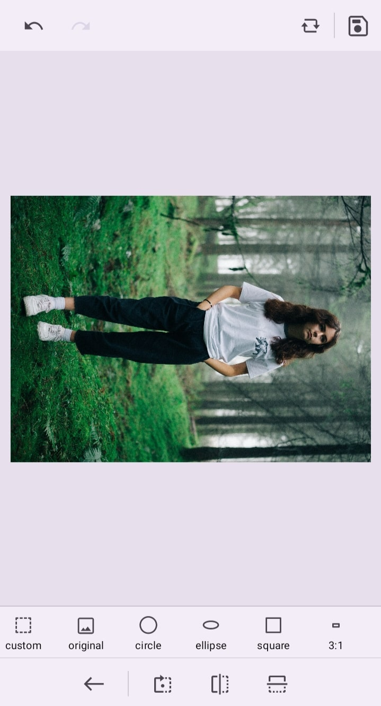

# Transform in Image Editor control

The Image Editor has the rotate, flip, and zoom transformation options and it transforms the image editor with annotations.

## Rotate

Rotate images with annotation to 90, 180, 270, and 360 degrees clockwise and anti-clockwise. Rotating the image can be done by either using a toolbar or `rotate` method.

In the `rotate` method, the image can be rotated left or right. The rotate method has the following parameters. A Positive integer value for clockwise and a negative integer value for anti-clockwise rotation.

* degree - Specifies a degree to rotate an image.

In the toolbar, rotate the image by clicking the Transform dropdown button and picking the RotateLeft/ RotateRight option from that popup.

In the following example, the `rotate` method is used to rotate the image.
























Output be like the below.

## Flip

Flip images with annotations horizontally/vertically. Flipping the image can be done by either using a toolbar or the flip method.

In the flip method, the image can be flipped horizontally or vertically. The `flip` method has the following parameters:

    * direction - Specifies the direction to flip the image.

In the toolbar, flip the image by clicking the Transform dropdown button and picking the Horizontal Flip/Vertical Flip  option from that popup.

In the following example, the `flip` method is used to flip the image.
























Output be like the below.

## Zoom

Magnify the image using zooming, and panning to see the hidden zones of an image. To Zoom the image can be done by either using a toolbar or the `zoom` method.

In `zoom` method, the image can be zoom in and zoom out. The zoom method has the following parameters.

* value - Specifies a value to be zoomed on the image.

### Zoom in

To perform the Zoom in the image. In toolbar, you can clicking the Zoom In button in toolbar.

### Zoom out

To perform the Zoom out the image, In toolbar, you can clicking the Zoom out button in toolbar.

### Panning

To Perform the panning. Enabled or disables the panning option. In toolbar, you can clicking the Zoom in button in toolbar, then pan button enabled

In the following example, you can using the `zoom` method and `pan` method in the button click event.
























Output be like the below.

