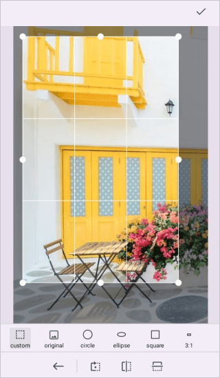
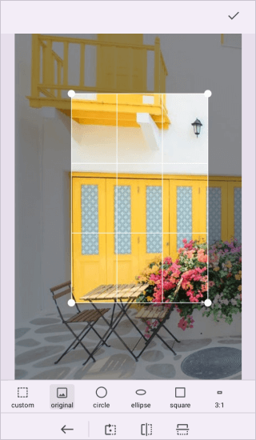
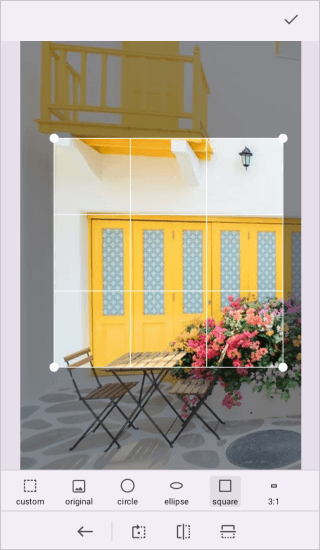
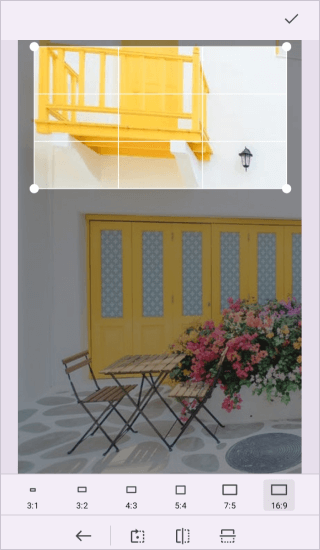
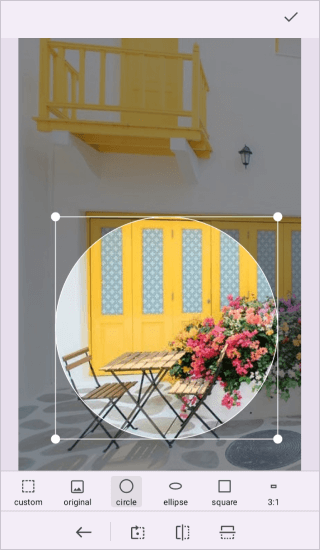
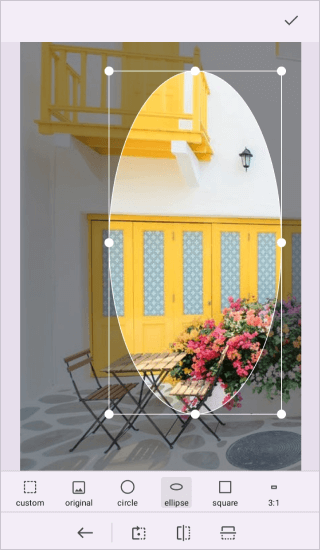

# Crop in .NET MAUI Image Editor (SfImageEditor)

Using the Image Editor's cropping tool, you can select and crop a particular section of an image.

## Image cropping ratio

The Image Editor control provides a range of selection choices for cropping images, such as custom, square, circle, and different aspect ratios. To crop a specific area of an image, simply drag and resize the selection region.

The following are two methods to perform the cropping operation:

* Enable cropping and visually choose the cropping area.
* Input the cropping region manually.

## Handling the cropping tool

The [Crop](https://help.syncfusion.com/cr/maui/Syncfusion.Maui.ImageEditor.SfImageEditor.html#Syncfusion_Maui_ImageEditor_SfImageEditor_Crop_Syncfusion_Maui_ImageEditor_ImageCropType_) method in the image editor control crops the image based on the [ImageCropType](https://help.syncfusion.com/cr/maui/Syncfusion.Maui.ImageEditor.ImageCropType.html). It allows users to enable or disable the cropping region displayed over the image, making it easier to visually choose the area for cropping.

* ImageCropType - Specify the selection type for cropping the image.

 The following code shows cropping the image to any desired size.




   <Grid RowDefinitions="0.9*, 0.1*">
        <imageEditor:SfImageEditor x:Name="imageEditor"
                                   Source="image.jpeg" />
        <Button Grid.Row="1"
                Text="Crop"
                Clicked="OnCropImageClicked" />
    </Grid>  




    private void OnCropImageClicked(object sender, EventArgs e)
    {
        this.imageEditor.Crop(ImageCropType.Free);
    }




After the cropping area has been selected, the [SaveEdits](https://help.syncfusion.com/cr/maui/Syncfusion.Maui.ImageEditor.SfImageEditor.html#Syncfusion_Maui_ImageEditor_SfImageEditor_SaveEdits) method is called, which in turn crops the selected region and displays the cropped image on the image editor.




   <Grid RowDefinitions="0.9*, 0.1*">
        <imageEditor:SfImageEditor x:Name="imageEditor"
                                   Source="image.jpeg" />
        <Button Grid.Row="1"
                Text="SaveEdits"
                Clicked="OnSaveEditsClicked" />
    </Grid>  




    private void OnSaveEditsClicked(object sender, EventArgs e)
    {
        this.imageEditor.SaveEdits();
    }




After selecting the cropping area, if you decide to cancel the edits and revert back to the original image, you can use the [CancelEdits](https://help.syncfusion.com/cr/maui/Syncfusion.Maui.ImageEditor.SfImageEditor.html#Syncfusion_Maui_ImageEditor_SfImageEditor_CancelEdits) method. It discards the changes made during the cropping process and restores the image to its initial state.




   <Grid RowDefinitions="0.9*, 0.1*">
        <imageEditor:SfImageEditor x:Name="imageEditor"
                                   Source="image.jpeg" />
        <Button Grid.Row="1"
                Text="CancelEdits"
                Clicked="OnCancelEditsClicked" />
    </Grid>  




    private void OnCancelEditsClicked(object sender, EventArgs e)
    {
        this.imageEditor.CancelEdits();
    }




## Freehand Crop

The selected region can be customized by dragging and resizing an image.




   <Grid RowDefinitions="0.9*, 0.1*">
        <imageEditor:SfImageEditor x:Name="imageEditor"
                                   Source="image.jpeg" />
        <Button Grid.Row="1"
                Text="FreeCrop"
                Clicked="OnFreeCropClicked" />
    </Grid>  




    private void OnFreeCropClicked(object sender, EventArgs e)
    {
        this.imageEditor.Crop(ImageCropType.Free);
    }




## Original Crop

With the original crop, the image is cropped to its original dimensions. This means that no aspect ratio and the cropped image retains its original width and height ratio.




   <Grid RowDefinitions="0.9*, 0.1*">
        <imageEditor:SfImageEditor x:Name="imageEditor"
                                   Source="image.jpeg" />
        <Button Grid.Row="1"
                Text="Original"
                Clicked="OnOriginalClicked" />
    </Grid>  




    private void OnOriginalClicked(object sender, EventArgs e)
    {
        this.imageEditor.Crop(ImageCropType.Original);
    }




## Square Crop

The square crop option allows you to crop the image into a perfect square shape.




   <Grid RowDefinitions="0.9*, 0.1*">
        <imageEditor:SfImageEditor x:Name="imageEditor"
                                   Source="image.jpeg" />
        <Button Grid.Row="1"
                Text="Square"
                Clicked="OnSquareCropClicked" />
    </Grid>  




    private void OnSquareCropClicked(object sender, EventArgs e)
    {
        this.imageEditor.Crop(ImageCropType.Square);
    }




## Ratio Crop

The ratio crop enables you to crop the image with a specific aspect ratio. You can specify the desired ratio using the width and height values. The default ratio is 4:3 when using the [ImageCropType.Ratio](https://help.syncfusion.com/cr/maui/Syncfusion.Maui.ImageEditor.ImageCropType.html#Syncfusion_Maui_ImageEditor_ImageCropType_Ratio), but you can change it by using the Crop method with the ratio parameter.  




   <Grid RowDefinitions="0.9*, 0.1*">
        <imageEditor:SfImageEditor x:Name="imageEditor"
                                   Source="image.jpeg" />
        <Button Grid.Row="1"
                Text="Ratio"
                Clicked="OnRatioCropClicked" />
    </Grid>  




    private void OnRatioCropClicked(object sender, EventArgs e)
    {
        this.imageEditor.Crop(16,9);
    }




## Circle crop

You can crop an image in a circular format using the [ImageCropType.Circle](https://help.syncfusion.com/cr/maui/Syncfusion.Maui.ImageEditor.ImageCropType.html#Syncfusion_Maui_ImageEditor_ImageCropType_Circle) crop type. This method ensures that the image is cropped into a perfect circle with a 1:1 ratio.

The following code shows cropping an image in circle format.




   <Grid RowDefinitions="0.9*, 0.1*">
        <imageEditor:SfImageEditor x:Name="imageEditor"
                                   Source="image.jpeg" />
        <Button Grid.Row="1"
                Text="Circle"
                Clicked="OnCircleCropClicked" />
    </Grid>  




    private void OnCircleCropClicked(object sender, EventArgs e)
    {
        this.imageEditor.Crop(ImageCropType.Circle);
    }




## Ellipse crop

To crop an image in an elliptical format you can use the [ImageCropType.Ellipse](https://help.syncfusion.com/cr/maui/Syncfusion.Maui.ImageEditor.ImageCropType.html#Syncfusion_Maui_ImageEditor_ImageCropType_Ellipse) crop type. This allows for free-style cropping in an elliptical shape.

The following code shows cropping an image in elliptical format.




   <Grid RowDefinitions="0.9*, 0.1*">
        <imageEditor:SfImageEditor x:Name="imageEditor"
                                   Source="image.jpeg" />
        <Button Grid.Row="1"
                Text="Ellipse"
                Clicked="OnEllipseCropClicked" />
    </Grid>  




    private void OnEllipseCropClicked(object sender, EventArgs e)
    {
        this.imageEditor.Crop(ImageCropType.Ellipse);
    }




## Entering the cropping area manually

To manually enter the cropping area, use the [Crop(Rect rect)](https://help.syncfusion.com/cr/maui/Syncfusion.Maui.ImageEditor.SfImageEditor.html#Syncfusion_Maui_ImageEditor_SfImageEditor_Crop_Microsoft_Maui_Graphics_Rect_System_Boolean_) method. It can be done by simply defining a rectangle and passing it to the [Crop](https://help.syncfusion.com/cr/maui/Syncfusion.Maui.ImageEditor.SfImageEditor.html#Syncfusion_Maui_ImageEditor_SfImageEditor_Crop_Syncfusion_Maui_ImageEditor_ImageCropType_) method. If the `isEllipse` parameter is set to true, it will perform an elliptical crop. The default value of the `isEllipse` parameter is `false`.




   <Grid RowDefinitions="0.9*, 0.1*">
        <imageEditor:SfImageEditor x:Name="imageEditor"
                                   Source="image.jpeg" />
        <Button Grid.Row="1"
                Text="Bounds"
                Clicked="OnBoundsClicked" />
    </Grid>  




    private void OnBoundsClicked(object sender, EventArgs e)
    {
        this.imageEditor.Crop(new Rect(50,50,150,200));
        this.imageEditor.SaveEdits();
    }




* To crop an image in an ellipse with a specific rectangle, use [Crop](https://help.syncfusion.com/cr/maui/Syncfusion.Maui.ImageEditor.SfImageEditor.html#Syncfusion_Maui_ImageEditor_SfImageEditor_Crop_Syncfusion_Maui_ImageEditor_ImageCropType_) with a rectangle value and an optional parameter of true, which specifies whether the cropping panel should be added in an elliptical or rectangle shape.




   <Grid RowDefinitions="0.9*, 0.1*">
        <imageEditor:SfImageEditor x:Name="imageEditor"
                                   Source="image.jpeg" />
        <Button Grid.Row="1"
                Text="Bounds"
                Clicked="OnBoundsClicked" />
    </Grid>  




    private void OnBoundsClicked(object sender, EventArgs e)
    {
        this.imageEditor.Crop(new Rect(20,20,50,50), true);
        this.imageEditor.SaveEdits(); 
    }




## Programmatically selecting the cropping ratio

Programmatically, you can select the desired cropping ratio from the various aspect ratios available in the built-in cropping toolbar by specifying the corresponding index of the toolbar item using the [Crop](https://help.syncfusion.com/cr/maui/Syncfusion.Maui.ImageEditor.SfImageEditor.html#Syncfusion_Maui_ImageEditor_SfImageEditor_Crop_Syncfusion_Maui_ImageEditor_ImageCropType_) method.

The following code sample will add the cropping preview on the image in a square shape.




   <Grid RowDefinitions="0.9*, 0.1*">
        <imageEditor:SfImageEditor x:Name="imageEditor"
                                   Source="image.jpeg" />
        <Button Grid.Row="1"
                Text="Ratio"
                Clicked="OnRatioCropClicked" />
    </Grid>  




    private void OnRatioCropClicked(object sender, EventArgs e)
    {
        this.imageEditor.Crop(1, 1);
    }



