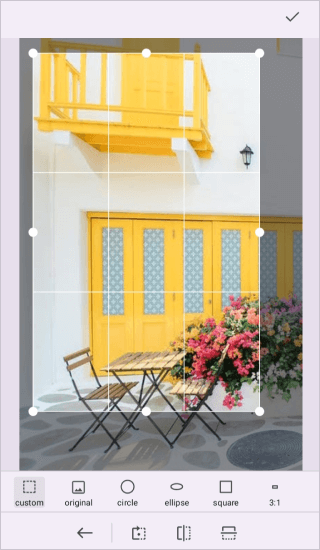
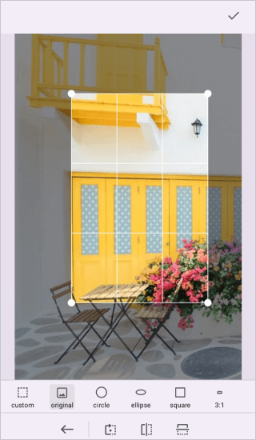
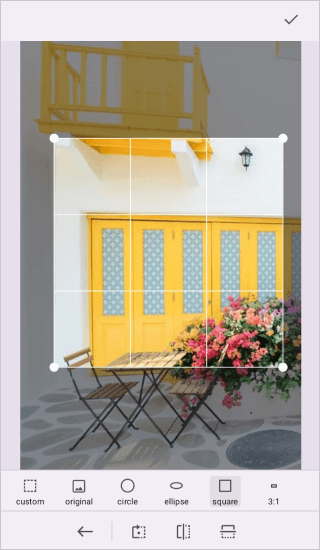
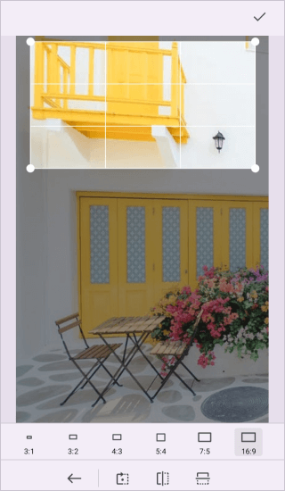
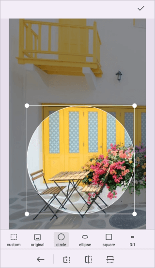
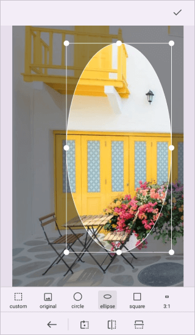

# Crop in .NET MAUI Image Editor (SfImageEditor)

Using the .NET MAUI Image Editor's cropping tool, you can select and crop a section of an image.

## Image cropping ratio

The .NET MAUI Image Editor control provides a range of selection choices for cropping images, such as custom, square, circle, and various aspect ratios. To crop a specific area of an image, drag and resize the selection region.

The following are two methods to perform the cropping operation:

* Enable cropping and visually choose the cropping area.
* Input the cropping region manually.

## Handling the cropping tool

The [Crop](https://help.syncfusion.com/cr/maui/Syncfusion.Maui.ImageEditor.SfImageEditor.html#Syncfusion_Maui_ImageEditor_SfImageEditor_Crop_Syncfusion_Maui_ImageEditor_ImageCropType_) method in the image editor control crops the image based on the [ImageCropType](https://help.syncfusion.com/cr/maui/Syncfusion.Maui.ImageEditor.ImageCropType.html). It allows you to enable or disable the cropping region displayed over the image, making it easier to choose the area visually for cropping.

* **`ImageCropType`** - Specifies the selection type for cropping the image.

The following code crops the image to the desired size.




<Grid RowDefinitions="0.9*, 0.1*">
    <imageEditor:SfImageEditor x:Name="imageEditor"
                               Source="image.jpeg" />
    <Button Grid.Row="1"
            Text="Crop"
            Clicked="OnCropImageClicked" />
</Grid>




using Syncfusion.Maui.ImageEditor;

private void OnCropImageClicked(object sender, EventArgs e)
{
    this.imageEditor.Crop(ImageCropType.Free);
}




After the cropping area has been selected, call the [SaveEdits](https://help.syncfusion.com/cr/maui/Syncfusion.Maui.ImageEditor.SfImageEditor.html#Syncfusion_Maui_ImageEditor_SfImageEditor_SaveEdits) method to crop the selected region and display the cropped image in the image editor.




<Grid RowDefinitions="0.9*, 0.1*">
    <imageEditor:SfImageEditor x:Name="imageEditor"
                               Source="image.jpeg" />
    <Button Grid.Row="1"
            Text="SaveEdits"
            Clicked="OnSaveEditsClicked" />
</Grid>




using Syncfusion.Maui.ImageEditor;

private void OnSaveEditsClicked(object sender, EventArgs e)
{
    this.imageEditor.SaveEdits();
}




To cancel the cropping and revert to the original image, use the [CancelEdits](https://help.syncfusion.com/cr/maui/Syncfusion.Maui.ImageEditor.SfImageEditor.html#Syncfusion_Maui_ImageEditor_SfImageEditor_CancelEdits) method. This discards the changes and restores the image to its initial state.




<Grid RowDefinitions="0.9*, 0.1*">
    <imageEditor:SfImageEditor x:Name="imageEditor"
                               Source="image.jpeg" />
    <Button Grid.Row="1"
            Text="CancelEdits"
            Clicked="OnCancelEditsClicked" />
</Grid>




using Syncfusion.Maui.ImageEditor;

private void OnCancelEditsClicked(object sender, EventArgs e)
{
    this.imageEditor.CancelEdits();
}




## Freehand crop

The selection region can be customized by dragging and resizing the selection handles.




<Grid RowDefinitions="0.9*, 0.1*">
    <imageEditor:SfImageEditor x:Name="imageEditor"
                               Source="image.jpeg" />
    <Button Grid.Row="1"
            Text="FreeCrop"
            Clicked="OnFreeCropClicked" />
</Grid>




using Syncfusion.Maui.ImageEditor;

private void OnFreeCropClicked(object sender, EventArgs e)
{
    this.imageEditor.Crop(ImageCropType.Free);
}




## Original crop

Crops the image to its original dimensions, preserving the original aspect ratio.




<Grid RowDefinitions="0.9*, 0.1*">
    <imageEditor:SfImageEditor x:Name="imageEditor"
                               Source="image.jpeg" />
    <Button Grid.Row="1"
            Text="Original"
            Clicked="OnOriginalClicked" />
</Grid>




using Syncfusion.Maui.ImageEditor;

private void OnOriginalClicked(object sender, EventArgs e)
{
    this.imageEditor.Crop(ImageCropType.Original);
}




## Square crop

Crops the image into a square shape.




<Grid RowDefinitions="0.9*, 0.1*">
    <imageEditor:SfImageEditor x:Name="imageEditor"
                               Source="image.jpeg" />
    <Button Grid.Row="1"
            Text="Square"
            Clicked="OnSquareCropClicked" />
</Grid>




using Syncfusion.Maui.ImageEditor;

private void OnSquareCropClicked(object sender, EventArgs e)
{
    this.imageEditor.Crop(ImageCropType.Square);
}




## Ratio crop

Crops the image to a specific aspect ratio by specifying the width and height values. The default ratio is 4:3 when using the [ImageCropType.Ratio](https://help.syncfusion.com/cr/maui/Syncfusion.Maui.ImageEditor.ImageCropType.html#Syncfusion_Maui_ImageEditor_ImageCropType_Ratio), but you can change it by using the Crop method with the ratio parameter.




<Grid RowDefinitions="0.9*, 0.1*">
    <imageEditor:SfImageEditor x:Name="imageEditor"
                               Source="image.jpeg" />
    <Button Grid.Row="1"
            Text="Ratio"
            Clicked="OnRatioCropClicked" />
</Grid>




using Syncfusion.Maui.ImageEditor;

private void OnRatioCropClicked(object sender, EventArgs e)
{
    this.imageEditor.Crop(16, 9);
}




## Circle crop

Crops the image into a circle shape with a 1:1 ratio using the [ImageCropType.Circle](https://help.syncfusion.com/cr/maui/Syncfusion.Maui.ImageEditor.ImageCropType.html#Syncfusion_Maui_ImageEditor_ImageCropType_Circle) crop type.

The following code crops an image in a circular format.




<Grid RowDefinitions="0.9*, 0.1*">
    <imageEditor:SfImageEditor x:Name="imageEditor"
                               Source="image.jpeg" />
    <Button Grid.Row="1"
            Text="Circle"
            Clicked="OnCircleCropClicked" />
</Grid>




using Syncfusion.Maui.ImageEditor;

private void OnCircleCropClicked(object sender, EventArgs e)
{
    this.imageEditor.Crop(ImageCropType.Circle);
}




## Ellipse crop

Crops the image into an elliptical shape using the [ImageCropType.Ellipse](https://help.syncfusion.com/cr/maui/Syncfusion.Maui.ImageEditor.ImageCropType.html#Syncfusion_Maui_ImageEditor_ImageCropType_Ellipse) crop type.

The following code crops an image in an elliptical format.




<Grid RowDefinitions="0.9*, 0.1*">
    <imageEditor:SfImageEditor x:Name="imageEditor"
                               Source="image.jpeg" />
    <Button Grid.Row="1"
            Text="Ellipse"
            Clicked="OnEllipseCropClicked" />
</Grid>




using Syncfusion.Maui.ImageEditor;

private void OnEllipseCropClicked(object sender, EventArgs e)
{
    this.imageEditor.Crop(ImageCropType.Ellipse);
}




## Entering the cropping area manually

To manually enter the cropping area, use the [Crop(Rect rect)](https://help.syncfusion.com/cr/maui/Syncfusion.Maui.ImageEditor.SfImageEditor.html#Syncfusion_Maui_ImageEditor_SfImageEditor_Crop_Microsoft_Maui_Graphics_Rect_System_Boolean_) method by defining a rectangle and passing it to the [Crop](https://help.syncfusion.com/cr/maui/Syncfusion.Maui.ImageEditor.SfImageEditor.html#Syncfusion_Maui_ImageEditor_SfImageEditor_Crop_Syncfusion_Maui_ImageEditor_ImageCropType_) method. When the `isEllipse` parameter is `true`, the crop is performed in an elliptical shape. The default value of the `isEllipse` parameter is `false`.




<Grid RowDefinitions="0.9*, 0.1*">
    <imageEditor:SfImageEditor x:Name="imageEditor"
                               Source="image.jpeg" />
    <Button Grid.Row="1"
            Text="Bounds"
            Clicked="OnBoundsClicked" />
</Grid>




using Microsoft.Maui.Graphics;
using Syncfusion.Maui.ImageEditor;

private void OnBoundsClicked(object sender, EventArgs e)
{
    this.imageEditor.Crop(new Rect(50, 50, 150, 200));
    this.imageEditor.SaveEdits();
}




* To crop an image in an ellipse with a specific rectangle, use [Crop](https://help.syncfusion.com/cr/maui/Syncfusion.Maui.ImageEditor.SfImageEditor.html#Syncfusion_Maui_ImageEditor_SfImageEditor_Crop_Syncfusion_Maui_ImageEditor_ImageCropType_) with a rectangle value and the `isEllipse` parameter set to `true`, which specifies whether the cropping panel is added in an elliptical or rectangular shape.




<Grid RowDefinitions="0.9*, 0.1*">
    <imageEditor:SfImageEditor x:Name="imageEditor"
                               Source="image.jpeg" />
    <Button Grid.Row="1"
            Text="Bounds"
            Clicked="OnBoundsClicked" />
</Grid>




using Microsoft.Maui.Graphics;
using Syncfusion.Maui.ImageEditor;

private void OnBoundsClicked(object sender, EventArgs e)
{
    this.imageEditor.Crop(new Rect(20, 20, 50, 50), true);
    this.imageEditor.SaveEdits();
}




## Programmatically selecting the cropping ratio

You can select a cropping ratio programmatically by specifying the corresponding index of the toolbar item using the [Crop](https://help.syncfusion.com/cr/maui/Syncfusion.Maui.ImageEditor.SfImageEditor.html#Syncfusion_Maui_ImageEditor_SfImageEditor_Crop_Syncfusion_Maui_ImageEditor_ImageCropType_) method.

The following code sample adds the cropping preview to the image in a square shape.




<Grid RowDefinitions="0.9*, 0.1*">
    <imageEditor:SfImageEditor x:Name="imageEditor"
                               Source="image.jpeg" />
    <Button Grid.Row="1"
            Text="Ratio"
            Clicked="OnRatioCropClicked" />
</Grid>




using Syncfusion.Maui.ImageEditor;

private void OnRatioCropClicked(object sender, EventArgs e)
{
    this.imageEditor.Crop(1, 1);
}



