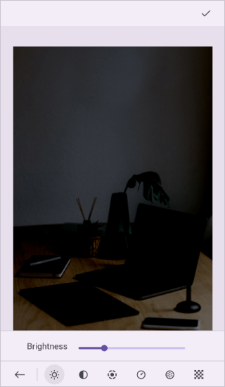
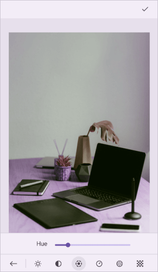
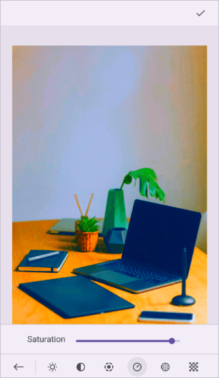
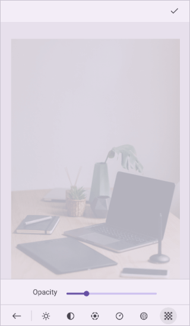

# Image Effect in .NET MAUI Image Editor (SfImageEditor)

Using the image editor control, apply various effects such as Brightness, Hue, Saturation, Contrast, Blur, Opacity, and Sharpen to your image. These effects can be applied using the toolbar or by utilizing the [ImageEffect](https://help.syncfusion.com/cr/maui/Syncfusion.Maui.ImageEditor.ImageEffect.html) method. The [ImageEffect](https://help.syncfusion.com/cr/maui/Syncfusion.Maui.ImageEditor.ImageEffect.html) method consists of two arguments: [ImageEffect](https://help.syncfusion.com/cr/maui/Syncfusion.Maui.ImageEditor.ImageEffect.html) and `EffectValue`. The [ImageEffect](https://help.syncfusion.com/cr/maui/Syncfusion.Maui.ImageEditor.ImageEffect.html) is an enumeration that includes the following effects:

* Brightness
* Blur
* Contrast
* Exposure
* Hue
* Saturation
* Sharpen 
* Opacity
* None

The `EffectValue` are the corresponding [ImageEffect](https://help.syncfusion.com/cr/maui/Syncfusion.Maui.ImageEditor.ImageEffect.html) values, which varies for each effect, and they are explained as follows.

N> The [ImageEffect](https://help.syncfusion.com/cr/maui/Syncfusion.Maui.ImageEditor.ImageEffect.html) enum also contains [None](https://help.syncfusion.com/cr/maui/Syncfusion.Maui.ImageEditor.ImageEffect.html#Syncfusion_Maui_ImageEditor_ImageEffect_None) option, which removes all the previously applied effects, which are not saved.
The [ImageEffect](https://help.syncfusion.com/cr/maui/Syncfusion.Maui.ImageEditor.ImageEffect.html) method only applies the effect to the preview image. If you want to save the applied effect, call the [SaveEdits](https://help.syncfusion.com/cr/maui/Syncfusion.Maui.ImageEditor.SfImageEditor.html#Syncfusion_Maui_ImageEditor_SfImageEditor_SaveEdits) method.

## Brightness

Brightness is used to adjust the overall lightness or darkness of the image. The value of the brightness effect ranges from -1 to 1, and the default value is 0.




   <Grid RowDefinitions="0.9*, 0.1*">
        <imageEditor:SfImageEditor x:Name="imageEditor"
                                   Source="image.jpeg" />
        <Button Grid.Row="1"
                Text="Brightness"
                Clicked="OnBrightnessClicked" />
    </Grid>  




    private void OnBrightnessClicked(object sender, EventArgs e)
    {
        this.imageEditor.ImageEffect(ImageEffect.Brightness, -0.6);
    }




## Blur

Blur creates a soft and unfocused appearance by reducing the image's sharpness. The value of the blur effect ranges from 0 to 1, and the default value is 0.




   <Grid RowDefinitions="0.9*, 0.1*">
        <imageEditor:SfImageEditor x:Name="imageEditor"
                                   Source="image.jpeg" />
        <Button Grid.Row="1"
                Text="Blur"
                Clicked="OnBlurClicked" />
    </Grid>  




    private void OnBlurClicked(object sender, EventArgs e)
    {
        this.imageEditor.ImageEffect(ImageEffect.Blur, 0.5);
    }




## Contrast

Contrast increases or decreases the difference between light and dark areas, making the image more visually distinct. The value of the contrast effect ranges from -1 to 1, and the default value is 0.




   <Grid RowDefinitions="0.9*, 0.1*">
        <imageEditor:SfImageEditor x:Name="imageEditor"
                                   Source="image.jpeg" />
        <Button Grid.Row="1"
                Text="Contrast"
                Clicked="OnContrastClicked" />
    </Grid>  




    private void OnContrastClicked(object sender, EventArgs e)
    {
        this.imageEditor.ImageEffect(ImageEffect.Contrast, -0.8);
    }




## Exposure

Exposure is used to alter the overall brightness and darkness levels of the image. The value of the exposure effect ranges from -1 to 1, and the default value is 0.




   <Grid RowDefinitions="0.9*, 0.1*">
        <imageEditor:SfImageEditor x:Name="imageEditor"
                                   Source="image.jpeg" />
        <Button Grid.Row="1"
                Text="Exposure"
                Clicked="OnExposureClicked" />
    </Grid>  




    private void OnExposureClicked(object sender, EventArgs e)
    {
        this.imageEditor.ImageEffect(ImageEffect.Exposure, -0.4);
    }




## Hue

Hue is used to change the overall color tone of the image by shifting the color spectrum. The value of the hue effect ranges from -1 to 1, and the default value is 0.




   <Grid RowDefinitions="0.9*, 0.1*">
        <imageEditor:SfImageEditor x:Name="imageEditor"
                                   Source="image.jpeg" />
        <Button Grid.Row="1"
                Text="Hue"
                Clicked="OnHueClicked" />
    </Grid>  




    private void OnHueClicked(object sender, EventArgs e)
    {
        this.imageEditor.ImageEffect(ImageEffect.Hue, 0.2);
    }




## Saturation

Saturation enhances or reduces the intensity and vividness of colors in the image. The value of the saturation effect ranges from -1 to 1, and the default value is 0.




   <Grid RowDefinitions="0.9*, 0.1*">
        <imageEditor:SfImageEditor x:Name="imageEditor"
                                   Source="image.jpeg" />
        <Button Grid.Row="1"
                Text="Saturation"
                Clicked="OnSaturationClicked" />
    </Grid>  




    private void OnSaturationClicked(object sender, EventArgs e)
    {
        this.imageEditor.ImageEffect(ImageEffect.Saturation, -0.8);
    }




## Sharpen

Sharpen enhances the clarity and definition of edges and details in the image. The value of the sharpen effect ranges from 0 to 6, and the default value is 0.




   <Grid RowDefinitions="0.9*, 0.1*">
        <imageEditor:SfImageEditor x:Name="imageEditor"
                                   Source="image.jpeg" />
        <Button Grid.Row="1"
                Text="Sharpen"
                Clicked="OnSharpenClicked" />
    </Grid>  




    private void OnSharpenClicked(object sender, EventArgs e)
    {
        this.imageEditor.ImageEffect(ImageEffect.Sharpen, 0.5);
    }




## Opacity

Opacity is used to control the transparency or visibility of the image. The value of the opacity effect ranges from 0 to 1, and the default value is 1.




   <Grid RowDefinitions="0.9*, 0.1*">
        <imageEditor:SfImageEditor x:Name="imageEditor"
                                   Source="image.jpeg" />
        <Button Grid.Row="1"
                Text="Opacity"
                Clicked="OnOpacityClicked" />
    </Grid>  




    private void OnOpacityClicked(object sender, EventArgs e)
    {
        this.imageEditor.ImageEffect(ImageEffect.Opacity, 0.5);
    }




## Save or Cancel applied effects

Call the [SaveEdits](https://help.syncfusion.com/cr/maui/Syncfusion.Maui.ImageEditor.SfImageEditor.html#Syncfusion_Maui_ImageEditor_SfImageEditor_SaveEdits) method to save the applied effects in view; otherwise, the effects will be reset on the next action.




   <Grid RowDefinitions="0.9*, 0.1*">
        <imageEditor:SfImageEditor x:Name="imageEditor"
                                   Source="image.jpeg" />
        <Button Grid.Row="1"
                Text="SaveEdits"
                Clicked="OnSaveEditsClicked" />
    </Grid>  




    private void OnSaveEditsClicked(object sender, EventArgs e)
    {
        this.imageEditor.SaveEdits();
    }




The applied effects can be canceled using the [CancelEdits](https://help.syncfusion.com/cr/maui/Syncfusion.Maui.ImageEditor.SfImageEditor.html#Syncfusion_Maui_ImageEditor_SfImageEditor_CancelEdits) method or by calling the [ImageEffect](https://help.syncfusion.com/cr/maui/Syncfusion.Maui.ImageEditor.ImageEffect.html) method with [ImageEffect.None](https://help.syncfusion.com/cr/maui/Syncfusion.Maui.ImageEditor.ImageEffect.html#Syncfusion_Maui_ImageEditor_ImageEffect_None).




   <Grid RowDefinitions="0.9*, 0.1*">
        <imageEditor:SfImageEditor x:Name="imageEditor"
                                   Source="image.jpeg" />
        <Button Grid.Row="1"
                Text="CancelEdits"
                Clicked="OnCancelEditsClicked" />
    </Grid>  




    private void OnCancelEditsClicked(object sender, EventArgs e)
    {
        this.imageEditor.CancelEdits();
    }







this.imageEditor.ImageEffect(ImageEffect.None, 0);


