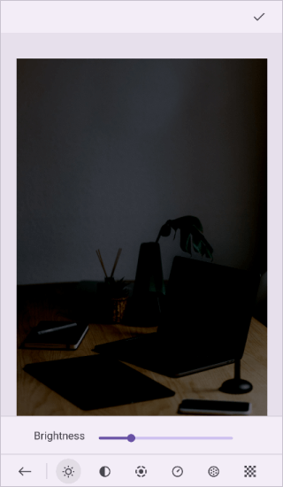
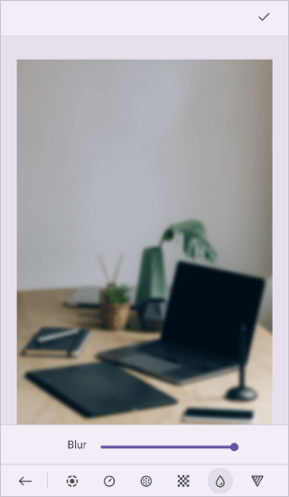
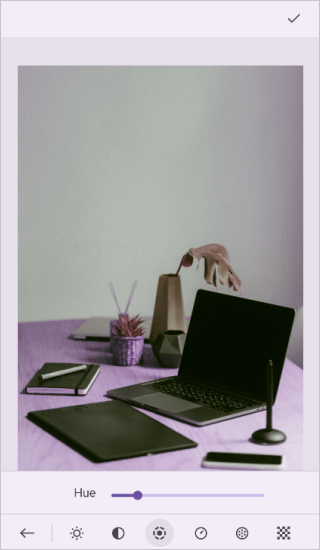
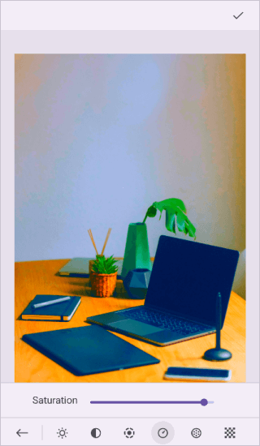
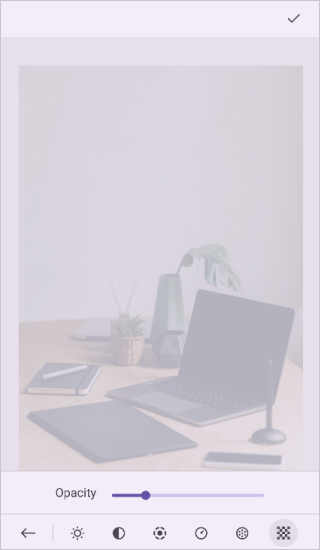

# Image Effects in .NET MAUI Image Editor (SfImageEditor)

Using the .NET MAUI Image Editor control, you can apply effects such as Brightness, Hue, Saturation, Contrast, Blur, Opacity, Exposure, and Sharpen to an image. You can apply these effects by using the built-in toolbar or by calling the [ImageEffect](https://help.syncfusion.com/cr/maui/Syncfusion.Maui.ImageEditor.ImageEffect.html) method, which accepts two arguments: an [ImageEffect](https://help.syncfusion.com/cr/maui/Syncfusion.Maui.ImageEditor.ImageEffect.html) enum value and an `EffectValue` (a `double`).

The [ImageEffect](https://help.syncfusion.com/cr/maui/Syncfusion.Maui.ImageEditor.ImageEffect.html) enum includes the following values:

* `Brightness`
* `Blur`
* `Contrast`
* `Exposure`
* `Hue`
* `Saturation`
* `Sharpen`
* `Opacity`
* `None`

The valid range of the `EffectValue` argument varies for each effect, as explained in the following sections.

N> The [ImageEffect](https://help.syncfusion.com/cr/maui/Syncfusion.Maui.ImageEditor.ImageEffect.html) enum includes a [None](https://help.syncfusion.com/cr/maui/Syncfusion.Maui.ImageEditor.ImageEffect.html#Syncfusion_Maui_ImageEditor_ImageEffect_None) value that removes all applied effects that have not been saved.

N> The [ImageEffect](https://help.syncfusion.com/cr/maui/Syncfusion.Maui.ImageEditor.ImageEffect.html) method only applies the effect to the preview image. To save the applied effect, call the [SaveEdits](https://help.syncfusion.com/cr/maui/Syncfusion.Maui.ImageEditor.SfImageEditor.html#Syncfusion_Maui_ImageEditor_SfImageEditor_SaveEdits) method.

## Brightness

Adjusts the overall lightness or darkness of the image. The value ranges from -1 to 1, with a default of 0.




<Grid RowDefinitions="0.9*, 0.1*">
    <imageEditor:SfImageEditor x:Name="imageEditor"
                               Source="image.jpeg" />
    <Button Grid.Row="1"
            Text="Brightness"
            Clicked="OnBrightnessClicked" />
</Grid>




using Syncfusion.Maui.ImageEditor;

private void OnBrightnessClicked(object sender, EventArgs e)
{
    this.imageEditor.ImageEffect(ImageEffect.Brightness, -0.6);
}




## Blur

Creates a soft, unfocused appearance by reducing the image's sharpness. The value ranges from 0 to 1, with a default of 0.




<Grid RowDefinitions="0.9*, 0.1*">
    <imageEditor:SfImageEditor x:Name="imageEditor"
                               Source="image.jpeg" />
    <Button Grid.Row="1"
            Text="Blur"
            Clicked="OnBlurClicked" />
</Grid>




using Syncfusion.Maui.ImageEditor;

private void OnBlurClicked(object sender, EventArgs e)
{
    this.imageEditor.ImageEffect(ImageEffect.Blur, 0.5);
}




## Contrast

Increases or decreases the difference between the light and dark areas of the image, making it more visually distinct. The value ranges from -1 to 1, with a default of 0.




<Grid RowDefinitions="0.9*, 0.1*">
    <imageEditor:SfImageEditor x:Name="imageEditor"
                               Source="image.jpeg" />
    <Button Grid.Row="1"
            Text="Contrast"
            Clicked="OnContrastClicked" />
</Grid>




using Syncfusion.Maui.ImageEditor;

private void OnContrastClicked(object sender, EventArgs e)
{
    this.imageEditor.ImageEffect(ImageEffect.Contrast, -0.8);
}




## Exposure

Alters the overall brightness and darkness levels of the image. The value ranges from -1 to 1, with a default of 0.




<Grid RowDefinitions="0.9*, 0.1*">
    <imageEditor:SfImageEditor x:Name="imageEditor"
                               Source="image.jpeg" />
    <Button Grid.Row="1"
            Text="Exposure"
            Clicked="OnExposureClicked" />
</Grid>




using Syncfusion.Maui.ImageEditor;

private void OnExposureClicked(object sender, EventArgs e)
{
    this.imageEditor.ImageEffect(ImageEffect.Exposure, -0.4);
}




## Hue

Shifts the color spectrum of the image. The value ranges from -1 to 1, with a default of 0.




<Grid RowDefinitions="0.9*, 0.1*">
    <imageEditor:SfImageEditor x:Name="imageEditor"
                               Source="image.jpeg" />
    <Button Grid.Row="1"
            Text="Hue"
            Clicked="OnHueClicked" />
</Grid>




using Syncfusion.Maui.ImageEditor;

private void OnHueClicked(object sender, EventArgs e)
{
    this.imageEditor.ImageEffect(ImageEffect.Hue, 0.2);
}




## Saturation

Enhances or reduces the intensity and vividness of colors in the image. The value ranges from -1 to 1, with a default of 0.




<Grid RowDefinitions="0.9*, 0.1*">
    <imageEditor:SfImageEditor x:Name="imageEditor"
                               Source="image.jpeg" />
    <Button Grid.Row="1"
            Text="Saturation"
            Clicked="OnSaturationClicked" />
</Grid>




using Syncfusion.Maui.ImageEditor;

private void OnSaturationClicked(object sender, EventArgs e)
{
    this.imageEditor.ImageEffect(ImageEffect.Saturation, -0.8);
}




## Sharpen

Enhances the clarity and definition of edges and details in the image. The value ranges from 0 to 6, with a default of 0.




<Grid RowDefinitions="0.9*, 0.1*">
    <imageEditor:SfImageEditor x:Name="imageEditor"
                               Source="image.jpeg" />
    <Button Grid.Row="1"
            Text="Sharpen"
            Clicked="OnSharpenClicked" />
</Grid>




using Syncfusion.Maui.ImageEditor;

private void OnSharpenClicked(object sender, EventArgs e)
{
    this.imageEditor.ImageEffect(ImageEffect.Sharpen, 0.5);
}




## Opacity

Controls the transparency or visibility of the image. The value ranges from 0 to 1, with a default of 1.




<Grid RowDefinitions="0.9*, 0.1*">
    <imageEditor:SfImageEditor x:Name="imageEditor"
                               Source="image.jpeg" />
    <Button Grid.Row="1"
            Text="Opacity"
            Clicked="OnOpacityClicked" />
</Grid>




using Syncfusion.Maui.ImageEditor;

private void OnOpacityClicked(object sender, EventArgs e)
{
    this.imageEditor.ImageEffect(ImageEffect.Opacity, 0.5);
}




## Save or cancel applied effects

Call the [SaveEdits](https://help.syncfusion.com/cr/maui/Syncfusion.Maui.ImageEditor.SfImageEditor.html#Syncfusion_Maui_ImageEditor_SfImageEditor_SaveEdits) method to save the applied effects to the view; otherwise, the effects will be reset on the next action.




<Grid RowDefinitions="0.9*, 0.1*">
    <imageEditor:SfImageEditor x:Name="imageEditor"
                               Source="image.jpeg" />
    <Button Grid.Row="1"
            Text="SaveEdits"
            Clicked="OnSaveEditsClicked" />
</Grid>




using Syncfusion.Maui.ImageEditor;

private void OnSaveEditsClicked(object sender, EventArgs e)
{
    this.imageEditor.SaveEdits();
}




Cancel the applied effects by using the [CancelEdits](https://help.syncfusion.com/cr/maui/Syncfusion.Maui.ImageEditor.SfImageEditor.html#Syncfusion_Maui_ImageEditor_SfImageEditor_CancelEdits) method or by calling the [ImageEffect](https://help.syncfusion.com/cr/maui/Syncfusion.Maui.ImageEditor.ImageEffect.html) method with [ImageEffect.None](https://help.syncfusion.com/cr/maui/Syncfusion.Maui.ImageEditor.ImageEffect.html#Syncfusion_Maui_ImageEditor_ImageEffect_None).




<Grid RowDefinitions="0.9*, 0.1*">
    <imageEditor:SfImageEditor x:Name="imageEditor"
                               Source="image.jpeg" />
    <Button Grid.Row="1"
            Text="CancelEdits"
            Clicked="OnCancelEditsClicked" />
</Grid>




using Syncfusion.Maui.ImageEditor;

private void OnCancelEditsClicked(object sender, EventArgs e)
{
    this.imageEditor.CancelEdits();
}







using Syncfusion.Maui.ImageEditor;

this.imageEditor.ImageEffect(ImageEffect.None, 0);


