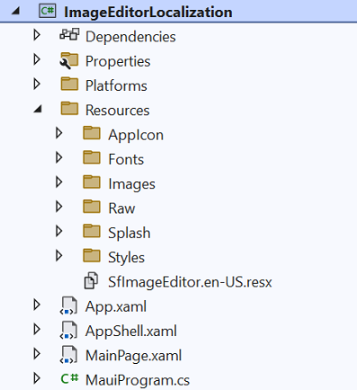
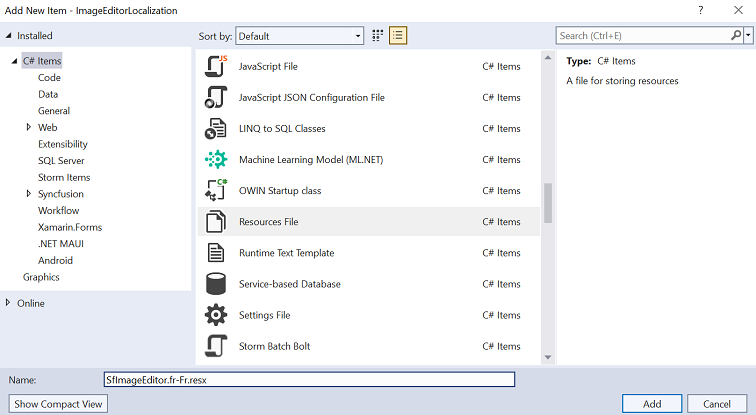
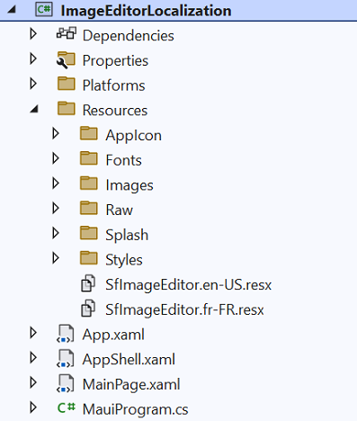
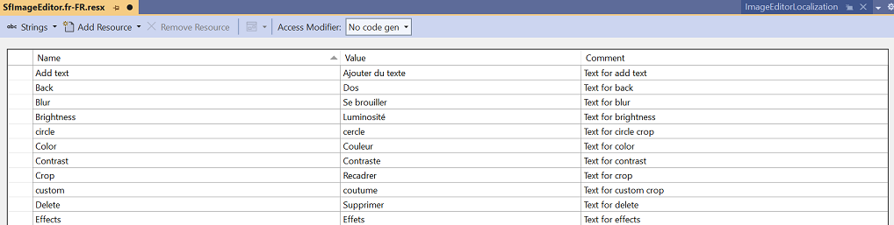

# The Localization in .NET MAUI Image Editor (SfImageEditor)

Localization is translating the application resources into different languages for specific cultures. The Image Editor can be localized by adding a `resource` file.

## Setting CurrentUICulture to the application

Application culture can be changed by setting `CurrentUICulture`. in the `App.xaml.cs` file.




using Syncfusion.Maui.ImageEditor;
using System.Resources;

public partial class App : Application
{
	public App()
	{	    
        CultureInfo.CurrentUICulture = new CultureInfo("fr-FR");
        //// ResXPath => Full path of the resx file; For example : //SfImageEditorResources.ResourceManager = new ResourceManager
        // ("MauiImageEditorDemo.Resources.SfImageEditor", Application.Current.GetType().Assembly);

        SfImageEditorResources.ResourceManager = new ResourceManager("ImageEditorLocalization.Resources.SfImageEditor", Application.Current.GetType().Assembly);
        MainPage = new MainPage();
	}
}




## Localize application level

To localize the [`ImageEditor`](https://help.syncfusion.com/cr/maui/Syncfusion.Maui.ImageEditor.SfImageEditor.html) based on the `CurrentUICulture` using `resource` files, follow the steps below.

   1. Add the default resource file of [`ImageEditor`](https://help.syncfusion.com/cr/maui/Syncfusion.Maui.ImageEditor.SfImageEditor.html) to the `Resources` folder of the application.

   

   2. Right-click on the `Resources` folder, select `Add`, and then choose `NewItem`.

   3. In the Add New Item wizard, select the Resource File option and name the filename as `SfImageEditor.<culture name>.resx.` For example, name it `SfImageEditor.fr-FR.resx` for the French culture.

   4. The culture name indicates the name of the language and country.

   

   5. Now, select the `Add` option to add the resource file in the **Resources** folder.

   

   6. Add the Name/Value pair in the Resource Designer of the `SfImageEditor.fr-FR.resx` file and change its corresponding value to the corresponding culture.

   

N> [View sample in GitHub](https://github.com/SyncfusionExamples/maui-image-editor-examples/tree/master/ImageEditorLocalization)