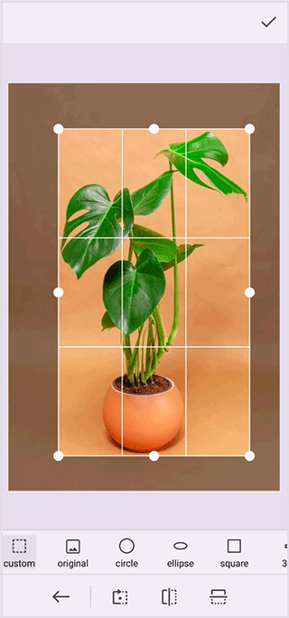

# Reset image using the .NET MAUI Image Editor (SfImageEditor)

The Image Editor control in the .NET MAUI allows you to reset the edited image to the original loaded image.

## Reset method

The [`Reset`](https://help.syncfusion.com/cr/maui/Syncfusion.Maui.ImageEditor.SfImageEditor.html#Syncfusion_Maui_ImageEditor_SfImageEditor_Reset) method, resets an image to its original state by discarding the changes performed to it. You can start fresh and explore different creative possibilities. The complete set of changes made in the image and also resets the image to the original loaded image.




   <Grid RowDefinitions="0.9*, 0.1*">
        <imageEditor:SfImageEditor x:Name="imageEditor"
                                   Source="image.jpeg" />
        <Button Grid.Row="1"
                Text="Reset"
                Clicked="OnResetClicked" />
    </Grid>  




    private void OnResetClicked(object sender, EventArgs e)
    {
        this.imageEditor.Reset();
    }




## Reset action event

This [`BeginReset`](https://help.syncfusion.com/cr/maui/Syncfusion.Maui.ImageEditor.SfImageEditor.html#Syncfusion_Maui_ImageEditor_SfImageEditor_BeginReset) event occurs before resetting the changes made in an image. You can control the reset functionality using the cancel argument.





    <imageEditor:SfImageEditor Source="image.png" BeginReset = "OnBeginReset" />




            
    private void OnBeginReset(object sender, CancelEventArgs e)
    {
         e.Cancel = true;
    }




