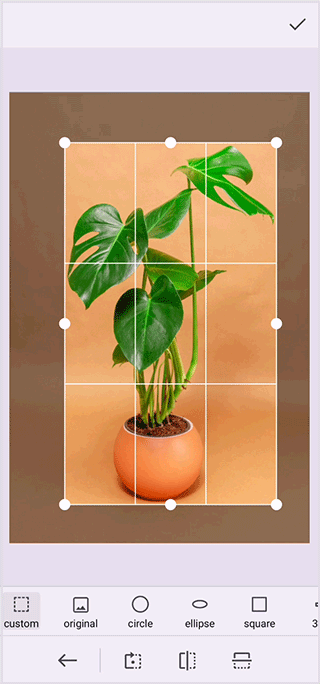

# Reset an image using the .NET MAUI Image Editor (SfImageEditor)

The .NET MAUI Image Editor allows you to reset the edited image to the originally loaded image.

## Reset method

The [`Reset`](https://help.syncfusion.com/cr/maui/Syncfusion.Maui.ImageEditor.SfImageEditor.html#Syncfusion_Maui_ImageEditor_SfImageEditor_Reset) method resets an image to its original state by discarding the changes performed on it.




<Grid RowDefinitions="0.9*, 0.1*">
    <imageEditor:SfImageEditor x:Name="imageEditor"
                               Source="image.jpeg" />
    <Button Grid.Row="1"
            Text="Reset"
            Clicked="OnResetClicked" />
</Grid>




using Syncfusion.Maui.ImageEditor;

private void OnResetClicked(object sender, EventArgs e)
{
    this.imageEditor.Reset();
}




## Reset action event

Occurs before resetting the changes made to an image.

You can control the reset functionality using the `Cancel` argument.





<imageEditor:SfImageEditor Source="image.png" BeginReset="OnBeginReset" />





using System.ComponentModel;
using Syncfusion.Maui.ImageEditor;

private void OnBeginReset(object sender, CancelEventArgs e)
{
    e.Cancel = true;
}




