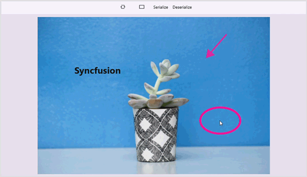

# Serialization in .NET MAUI Image Editor (SfImageEditor)

The Image Editor control provides support to serialize and deserialize the shape, text and pen annotations along with their settings. You can save the current state of the image editor annotations and load it back when it is needed.

## Serialization

The [Serialize](https://help.syncfusion.com/cr/maui/Syncfusion.Maui.ImageEditor.SfImageEditor.html#Syncfusion_Maui_ImageEditor_SfImageEditor_Serialize_System_IO_Stream_) method is used to serialize the current edits of annotations. It allows you to store the [SfImageEditor](https://help.syncfusion.com/cr/maui/Syncfusion.Maui.ImageEditor.SfImageEditor.html) annotations to the stream by passing the stream as a parameter to the [Serialize](https://help.syncfusion.com/cr/maui/Syncfusion.Maui.ImageEditor.SfImageEditor.html#Syncfusion_Maui_ImageEditor_SfImageEditor_Serialize_System_IO_Stream_) method.




   <Grid RowDefinitions="0.9*, 0.1*">
        <imageEditor:SfImageEditor x:Name="imageEditor"
                                   Source="image.jpeg" />
        <Button Grid.Row="1"
                Text="Serialize"
                Clicked="OnSerializeClicked" />
    </Grid>  



    
    private void OnSerializeClicked(object sender, EventArgs e)
    {
        string filePath = Path.Combine(FileSystem.Current.CacheDirectory, "ImageEditor.xml");
        using (var fileStream = new FileStream(filePath, FileMode.Create, FileAccess.Write))
        {
            this.imageEditor.Serialize(fileStream);
        }
    }




## Deserialization

The [Deserialize](https://help.syncfusion.com/cr/maui/Syncfusion.Maui.ImageEditor.SfImageEditor.html#Syncfusion_Maui_ImageEditor_SfImageEditor_Deserialize_System_IO_Stream_) method is used to deserialize the annotations over an image. It allows you to reload the [SfImageEditor](https://help.syncfusion.com/cr/maui/Syncfusion.Maui.ImageEditor.SfImageEditor.html) control with the annotations available in the stream.




   <Grid RowDefinitions="0.9*, 0.1*">
        <imageEditor:SfImageEditor x:Name="imageEditor"
                                   Source="image.jpeg" />
        <Button Grid.Row="1"
                Text="Deserialize"
                Clicked="OnDeserializeClicked" />
    </Grid>  




    private async void OnDeserializeClicked(object sender, EventArgs e)
    {
        var result = await FilePicker.PickAsync();
    
        if (result != null)
        {
            using (Stream stream = await result.OpenReadAsync())
            {
                this.imageEditor.Deserialize(stream);
            }
        }
    }




N> Serialization and deserialization is not applicable for custom annotation views.
