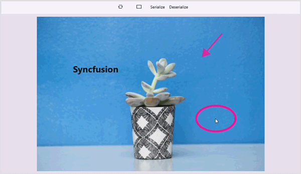

# Serialization in .NET MAUI Image Editor (SfImageEditor)

The Image Editor control supports serializing and deserializing the shape, text, and pen annotations along with their settings. You can save the current state of the annotations and load it back when needed.

## Serialization

The [`Serialize`](https://help.syncfusion.com/cr/maui/Syncfusion.Maui.ImageEditor.SfImageEditor.html#Syncfusion_Maui_ImageEditor_SfImageEditor_Serialize_System_IO_Stream_) method serializes the current edits of annotations. Pass a stream as a parameter to store the [`SfImageEditor`](https://help.syncfusion.com/cr/maui/Syncfusion.Maui.ImageEditor.SfImageEditor.html) annotations in the stream.




<Grid RowDefinitions="0.9*, 0.1*">
    <imageEditor:SfImageEditor x:Name="imageEditor"
                               Source="image.jpeg" />
    <Button Grid.Row="1"
            Text="Serialize"
            Clicked="OnSerializeClicked" />
</Grid>




using System.IO;
using Microsoft.Maui.Storage;
using Syncfusion.Maui.ImageEditor;

private void OnSerializeClicked(object sender, EventArgs e)
{
    string filePath = Path.Combine(FileSystem.Current.CacheDirectory, "ImageEditor.xml");
    using (var fileStream = new FileStream(filePath, FileMode.Create, FileAccess.Write))
    {
        this.imageEditor.Serialize(fileStream);
    }
}




## Deserialization

The [`Deserialize`](https://help.syncfusion.com/cr/maui/Syncfusion.Maui.ImageEditor.SfImageEditor.html#Syncfusion_Maui_ImageEditor_SfImageEditor_Deserialize_System_IO_Stream_) method deserialize the annotations over an image. It reloads the [`SfImageEditor`](https://help.syncfusion.com/cr/maui/Syncfusion.Maui.ImageEditor.SfImageEditor.html) control with the annotations stored in the stream.




<Grid RowDefinitions="0.9*, 0.1*">
    <imageEditor:SfImageEditor x:Name="imageEditor"
                               Source="image.jpeg" />
    <Button Grid.Row="1"
            Text="Deserialize"
            Clicked="OnDeserializeClicked" />
</Grid>




using System.IO;
using Microsoft.Maui.Storage;
using Syncfusion.Maui.ImageEditor;

private async void OnDeserializeClicked(object sender, EventArgs e)
{
    var result = await FilePicker.PickAsync();
    if (result != null)
    {
        using (Stream stream = await result.OpenReadAsync())
        {
            this.imageEditor.Deserialize(stream);
        }
    }
}




N> Serialization and deserialization are not applicable for custom annotation views.

N> Due to limitations in Ahead-of-Time (AOT) compilation, reflection-based operations like serialization and deserialization are not supported in AOT-compiled environments.
