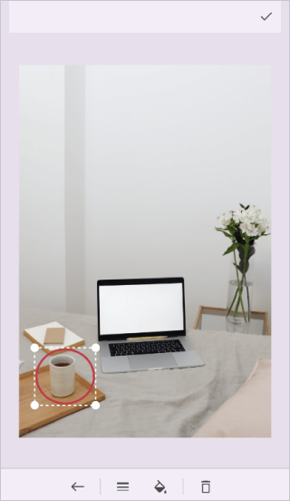
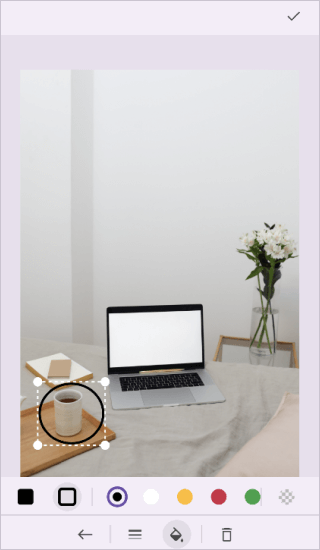
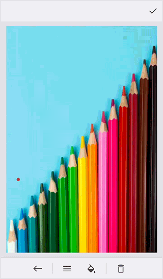

# Shape Annotations in .NET MAUI Image Editor (SfImageEditor)

The image editor control allows you to add various shapes with customizable settings.

## Add shape annotation

Annotate any shapes over an image using the [`AddShape`](https://help.syncfusion.com/cr/maui/Syncfusion.Maui.ImageEditor.SfImageEditor.html#Syncfusion_Maui_ImageEditor_SfImageEditor_AddShape_Syncfusion_Maui_ImageEditor_AnnotationShape_Syncfusion_Maui_ImageEditor_ImageEditorShapeSettings_) method.




   <Grid RowDefinitions="0.9*, 0.1*">
        <imageEditor:SfImageEditor x:Name="imageEditor"
                                   Source="image.jpeg" />
        <Button Grid.Row="1"
                Text="AddShape"
                Clicked="OnAddShapeClicked" />
    </Grid>  




    private void OnAddShapeClicked(object sender, EventArgs e)
    {
        this.imageEditor.AddShape(AnnotationShape.Arrow)
    }




## Shape types

The [`AnnotationShape`](https://help.syncfusion.com/cr/maui/Syncfusion.Maui.ImageEditor.AnnotationShape.html) enum contains the following shape types.

* Circle
* Rectangle
* Arrow
* Line
* Dotted
* DoubleArrow
* DottedArrow
* DottedDoubleArrow
* Polygon
* Polyline

## Polygon

A [`Polygon`](https://help.syncfusion.com/cr/maui/Syncfusion.Maui.ImageEditor.AnnotationShape.html#Syncfusion_Maui_ImageEditor_AnnotationShape_Polygon) is formed by connecting a series of straight lines, and in addition to the [`Points`](https://help.syncfusion.com/cr/maui/Syncfusion.Maui.ImageEditor.ImageEditorShapeSettings.html#Syncfusion_Maui_ImageEditor_ImageEditorShapeSettings_Points) collection including specific points, a line automatically connects the first and last points. 




   <Grid RowDefinitions="0.9*, 0.1*">
        <imageEditor:SfImageEditor x:Name="imageEditor" />
        <Button Grid.Row="1"
                Text="Polygon"
                Clicked="OnPolygonClicked" />
    </Grid>  




    private void OnPolygonClicked(object sender, EventArgs e)
    {
        this.imageEditor.AddShape(AnnotationShape.Polygon,
            new ImageEditorShapeSettings()
            {
                StrokeThickness = 5,
                Points = new PointCollection
                {
                    new Point(50, 0),
                    new Point(150, 0),
                    new Point(200, 100),
                    new Point(150, 200),
                    new Point(50, 200),
                    new Point(0, 100)
                },
            });
    }




## Polyline

A [`Polyline`](https://help.syncfusion.com/cr/maui/Syncfusion.Maui.ImageEditor.AnnotationShape.html#Syncfusion_Maui_ImageEditor_AnnotationShape_Polyline) draws a series of connected straight lines. It is similar to a [`Polygon`](https://help.syncfusion.com/cr/maui/Syncfusion.Maui.ImageEditor.AnnotationShape.html#Syncfusion_Maui_ImageEditor_AnnotationShape_Polygon), except the last point in a polyline is not connected to the first point.




   <Grid RowDefinitions="0.9*, 0.1*">
        <imageEditor:SfImageEditor x:Name="imageEditor" />
        <Button Grid.Row="1"
                Text="Polyline"
                Clicked="OnPolylineClicked" />
    </Grid>  




    private void OnPolylineClicked(object sender, EventArgs e)
    {
        this.imageEditor.AddShape(AnnotationShape.Polyline,
            new ImageEditorShapeSettings()
            {
                Points = new PointCollection
                {
                    new Point(0, 100),
                    new Point(50, 250), 
                    new Point(75, 100),   
                    new Point(90, 400),  
                    new Point(115, 250), 
                    new Point(175, 250), 
                    new Point(200, 100),
                    new Point(215, 400), 
                    new Point(240, 250),
                    new Point(300, 250)
                },
            });
    }




## Customize shape settings

Customize the appearance of each shape using the [`ImageEditorShapeSettings`](https://help.syncfusion.com/cr/maui/Syncfusion.Maui.ImageEditor.ImageEditorShapeSettings.html).

* [AnnotationID](https://help.syncfusion.com/cr/maui/Syncfusion.Maui.ImageEditor.ImageEditorAnnotationSettings.html#Syncfusion_Maui_ImageEditor_ImageEditorAnnotationSettings_Id) : A unique ID is generated for shape annotations when they are added to the image editor. You can retrieve this unique ID from the ItemsSelected event arguments or from the serialized JSON.
* [`AllowDrag`](https://help.syncfusion.com/cr/maui/Syncfusion.Maui.ImageEditor.ImageEditorAnnotationSettings.html#Syncfusion_Maui_ImageEditor_ImageEditorAnnotationSettings_AllowDrag): Enables or disables the dragging for shape annotation. The default value is `true`.
* [`AllowResize`](https://help.syncfusion.com/cr/maui/Syncfusion.Maui.ImageEditor.ImageEditorAnnotationSettings.html#Syncfusion_Maui_ImageEditor_ImageEditorAnnotationSettings_AllowResize): Enables or disables the resizing for shape annotation. The default value is `true`.
* [`Bounds`](https://help.syncfusion.com/cr/maui/Syncfusion.Maui.ImageEditor.ImageEditorAnnotationSettings.html#Syncfusion_Maui_ImageEditor_ImageEditorAnnotationSettings_Bounds): Specifies the bounds of the shapes. Position the shapes wherever you want on the image. The value of the shape bounds should fall between 0 and 1.
* [`Color`](https://help.syncfusion.com/cr/maui/Syncfusion.Maui.ImageEditor.ImageEditorShapeSettings.html#Syncfusion_Maui_ImageEditor_ImageEditorShapeSettings_Color) - Specifies the color of the shape annotation.
* [`IsFilled`](https://help.syncfusion.com/cr/maui/Syncfusion.Maui.ImageEditor.ImageEditorShapeSettings.html#Syncfusion_Maui_ImageEditor_ImageEditorShapeSettings_IsFilled) - Enables or disables the fill color of the shapes. This is applicable only for [`AnnotationShape.Rectangle`](https://help.syncfusion.com/cr/maui/Syncfusion.Maui.ImageEditor.AnnotationShape.html#Syncfusion_Maui_ImageEditor_AnnotationShape_Rectangle), [`AnnotationShape.Circle`](https://help.syncfusion.com/cr/maui/Syncfusion.Maui.ImageEditor.AnnotationShape.html#Syncfusion_Maui_ImageEditor_AnnotationShape_Circle), and [`AnnotationShape.Polygon`](https://help.syncfusion.com/cr/maui/Syncfusion.Maui.ImageEditor.AnnotationShape.html#Syncfusion_Maui_ImageEditor_AnnotationShape_Polygon) shape types.
* [`StrokeThickness`](https://help.syncfusion.com/cr/maui/Syncfusion.Maui.ImageEditor.ImageEditorShapeSettings.html#Syncfusion_Maui_ImageEditor_ImageEditorShapeSettings_StrokeThickness) - Specifies the stroke width of the shapes. It is not applicable for [`AnnotationShape.Rectangle`](https://help.syncfusion.com/cr/maui/Syncfusion.Maui.ImageEditor.AnnotationShape.html#Syncfusion_Maui_ImageEditor_AnnotationShape_Rectangle), [`AnnotationShape.Circle`](https://help.syncfusion.com/cr/maui/Syncfusion.Maui.ImageEditor.AnnotationShape.html#Syncfusion_Maui_ImageEditor_AnnotationShape_Circle), and [`AnnotationShape.Polygon`](https://help.syncfusion.com/cr/maui/Syncfusion.Maui.ImageEditor.AnnotationShape.html#Syncfusion_Maui_ImageEditor_AnnotationShape_Polygon) in the filled state.
* [`Opacity`](https://help.syncfusion.com/cr/maui/Syncfusion.Maui.ImageEditor.ImageEditorAnnotationSettings.html#Syncfusion_Maui_ImageEditor_ImageEditorAnnotationSettings_Opacity): Specifies the opacity of shape annotation. This value ranges from 0 to 1.
* [`Points`](https://help.syncfusion.com/cr/maui/Syncfusion.Maui.ImageEditor.ImageEditorShapeSettings.html#Syncfusion_Maui_ImageEditor_ImageEditorShapeSettings_Points): Specifies the coordinates of the vertices that make up the shape. Arrange the shapes at your desired location within the image. This attribute applies to only [`AnnotationShape.Polygon`](https://help.syncfusion.com/cr/maui/Syncfusion.Maui.ImageEditor.AnnotationShape.html#Syncfusion_Maui_ImageEditor_AnnotationShape_Polygon) and [`AnnotationShape.Polyline`](https://help.syncfusion.com/cr/maui/Syncfusion.Maui.ImageEditor.AnnotationShape.html#Syncfusion_Maui_ImageEditor_AnnotationShape_Polyline) shape types.




   <Grid RowDefinitions="0.9*, 0.1*">
        <imageEditor:SfImageEditor x:Name="imageEditor"
                                   Source="image.jpeg" />
        <Button Grid.Row="1"
                Text="AddShape"
                Clicked="OnAddShapeClicked" />
    </Grid>  




    private void OnAddShapeClicked(object sender, EventArgs e)
    {
        this.imageEditor.AddShape(AnnotationShape.Rectangle,
             new ImageEditorShapeSettings()
             {
                 Color = Colors.Blue,
                 StrokeThickness = 5,
                 IsFilled = false
             });
    }




## Select a particular annotation programmatically using annotation ID

By passing the unique `ID` of an annotation to the [SelectAnnotation](https://help.syncfusion.com/cr/maui/Syncfusion.Maui.ImageEditor.SfImageEditor.html#Syncfusion_Maui_ImageEditor_SfImageEditor_SelectAnnotation_System_Object_) method of `SfImageEditor`, you can select the particular annotation programmatically.





 <Grid>
    <Grid.RowDefinitions>
        <RowDefinition Height="*" />
        <RowDefinition Height="Auto" />
    </Grid.RowDefinitions>
    <imageEditor:SfImageEditor x:Name="imageEditor"
                               Source="image.png"
                               ImageLoaded="imageEditor_ImageLoaded" />
    <StackLayout Grid.Row="1" Margin="10"
                 Orientation="Horizontal">
        <Label Text="ShapeID :" VerticalOptions="Center" />
        <Entry x:Name="shapeID" WidthRequest ="50"/>
        <Button Text="SelectShape" Margin="25,0,0,0"
                Clicked="SelectShape_Clicked" WidthRequest="150" />
    </StackLayout>
</Grid>





private void SelectShape_Clicked(object sender, EventArgs e)
{
    int shapeId;
    if (int.TryParse(this.shapeID.Text, out shapeId))
    {
        this.imageEditor.SelectAnnotation(shapeId);
    }
}
 
private void imageEditor_ImageLoaded(object sender, EventArgs e)
{
    imageEditor.AddShape(AnnotationShape.Rectangle, new ImageEditorShapeSettings() { Id = 2, Color = Colors.Violet, Bounds = new Rect(0, 0, 0.3, 0.3) });
    imageEditor.SaveEdits();
}





## Delete the selected shape

Delete the selected shape using either the toolbar or the [`DeleteAnnotation`](https://help.syncfusion.com/cr/maui/Syncfusion.Maui.ImageEditor.SfImageEditor.html#Syncfusion_Maui_ImageEditor_SfImageEditor_DeleteAnnotation) method.




   <Grid RowDefinitions="0.9*, 0.1*">
        <imageEditor:SfImageEditor x:Name="imageEditor"
                                   Source="image.jpeg" />
        <Button Grid.Row="1"
                Text="DeleteAnnotation"
                Clicked="OnDeleteAnnotationClicked" />
    </Grid>  




    private void OnDeleteAnnotationClicked(object sender, EventArgs e)
    {
        this.imageEditor.DeleteAnnotation();
    }




## Clear all annotations

Remove all the annotations using the [`ClearAnnotations`](https://help.syncfusion.com/cr/maui/Syncfusion.Maui.ImageEditor.SfImageEditor.html#Syncfusion_Maui_ImageEditor_SfImageEditor_ClearAnnotations) method.

N> It will remove text, pen and custom view annotations as well.




   <Grid RowDefinitions="0.9*, 0.1*">
        <imageEditor:SfImageEditor x:Name="imageEditor"
                                   Source="image.jpeg" />
        <Button Grid.Row="1"
                Text="ClearAnnotations"
                Clicked="OnClearAnnotationsClicked" />
    </Grid>  




    private void OnClearAnnotationsClicked(object sender, EventArgs e)
    {
        this.imageEditor.ClearAnnotations();
    }




## Annotation selected event

The [`AnnotationSelected`](https://help.syncfusion.com/cr/maui/Syncfusion.Maui.ImageEditor.SfImageEditor.html#Syncfusion_Maui_ImageEditor_SfImageEditor_AnnotationSelected) event occurs when an annotation is selected.

N> The event is common for text and shape annotations.





    <imageEditor:SfImageEditor Source="image.png" AnnotationSelected = "OnAnnotationSelected" />





    private void OnAnnotationSelected(object sender, AnnotationSelectedEventArgs e)
    {
        if (e.AnnotationSettings is ImageEditorShapeSettings shapeSettings)
        {
            shapeSettings.Color = Colors.Black;
        }
    }





## Annotation unselected event

This [AnnotationUnselected](https://help.syncfusion.com/cr/maui/Syncfusion.Maui.ImageEditor.SfImageEditor.html#Syncfusion_Maui_ImageEditor_SfImageEditor_AnnotationUnselected) event occurs when the annotation is unselected.

N> This is common for Shape, Text and CustomView annotations.





    <imageEditor:SfImageEditor Source="image.png" AnnotationUnselected="OnAnnotationUnSelected" />





    private void OnAnnotationUnSelected(object sender, AnnotationUnselectedEventArgs e)
    {
        if(e.AnnotationSettings is ImageEditorShapeSettings shapeSettings)
        {
            shapeSettings.IsFilled = true;
        }
    }





## Add shape on initial loading

Annotate a shape on image loading using the [`ImageLoaded`](https://help.syncfusion.com/cr/maui/Syncfusion.Maui.ImageEditor.SfImageEditor.html#Syncfusion_Maui_ImageEditor_SfImageEditor_ImageLoaded) event.





    <imageEditor:SfImageEditor x:Name="imageEditor" Source="image.png" ImageLoaded = "OnImageLoaded" />





    private void OnImageLoaded(object sender, EventArgs e)
    {
        this.imageEditor.AddShape(AnnotationShape.Circle);
    }





N> [View sample in GitHub](https://github.com/SyncfusionExamples/maui-image-editor-examples/tree/master/ImageLoadedSample)

## Add shape with manual bounds

Shapes can be added by user-defined view bounds. The [`Bounds`](https://help.syncfusion.com/cr/maui/Syncfusion.Maui.ImageEditor.ImageEditorAnnotationSettings.html#Syncfusion_Maui_ImageEditor_ImageEditorAnnotationSettings_Bounds) are treated as ratio values of image width and height, so you have to specify bounds rectangle values in the range of 0 to 1.




    <imageEditor:SfImageEditor x:Name="imageEditor" Source="image.png" ImageLoaded = "OnImageLoaded" />





    private void OnImageLoaded(object sender, EventArgs e)
    {
        imageEditor.AddShape(AnnotationShape.Arrow, new ImageEditorShapeSettings()
        {
            Bounds = new Rect(0.1, 0.1, 0.5, 0.5)
        });
    }





## Restrict shape drag and resize

To restrict the drag action on a shape, set the [`AllowDrag`](https://help.syncfusion.com/cr/maui/Syncfusion.Maui.ImageEditor.ImageEditorAnnotationSettings.html#Syncfusion_Maui_ImageEditor_ImageEditorAnnotationSettings_AllowDrag) property to `false`.




    imageEditor.AddShape(AnnotationShape.Circle, new ImageEditorShapeSettings() { AllowDrag = false });




To restrict the resize action on a shape, set the [`AllowResize`](https://help.syncfusion.com/cr/maui/Syncfusion.Maui.ImageEditor.ImageEditorAnnotationSettings.html#Syncfusion_Maui_ImageEditor_ImageEditorAnnotationSettings_AllowResize) property to `false`.




    imageEditor.AddShape(AnnotationShape.Circle, new ImageEditorShapeSettings() { AllowResize = false });




## Freehand Draw

The image editor control allows you to create freehand drawings such as signature, pen drawing with customizable settings. The [`AddShape`](https://help.syncfusion.com/cr/maui/Syncfusion.Maui.ImageEditor.SfImageEditor.html#Syncfusion_Maui_ImageEditor_SfImageEditor_AddShape_Syncfusion_Maui_ImageEditor_AnnotationShape_Syncfusion_Maui_ImageEditor_ImageEditorShapeSettings_) method enables the canvas view, in which you can draw objects.




   <Grid RowDefinitions="0.9*, 0.1*">
        <imageEditor:SfImageEditor x:Name="imageEditor"
                                   Source="image.jpeg" />
        <Button Grid.Row="1"
                Text="FreeHandDraw"
                Clicked="OnFreeHandDrawClicked" />
    </Grid>  




    private void OnFreeHandDrawClicked(object sender, EventArgs e)
    {
        this.imageEditor.AddShape(AnnotationShape.Pen);
    }




## Customize the pen drawing settings

*  [`StrokeThickness`](https://help.syncfusion.com/cr/maui/Syncfusion.Maui.ImageEditor.ImageEditorShapeSettings.html#Syncfusion_Maui_ImageEditor_ImageEditorShapeSettings_StrokeThickness) - Specifies the stroke width of the drawing pen.
*  [`Color`](https://help.syncfusion.com/cr/maui/Syncfusion.Maui.ImageEditor.ImageEditorShapeSettings.html#Syncfusion_Maui_ImageEditor_ImageEditorShapeSettings_Color) - Specifies the stroke color of the drawing pen.

N> The other shape settings are not applicable for freehand draw.

In the following example, the [`AddShape`](https://help.syncfusion.com/cr/maui/Syncfusion.Maui.ImageEditor.SfImageEditor.html#Syncfusion_Maui_ImageEditor_SfImageEditor_AddShape_Syncfusion_Maui_ImageEditor_AnnotationShape_Syncfusion_Maui_ImageEditor_ImageEditorShapeSettings_) method is used to toggle the freehand drawings.




   <Grid RowDefinitions="0.9*, 0.1*">
        <imageEditor:SfImageEditor x:Name="imageEditor"
                                   Source="image.jpeg" />
        <Button Grid.Row="1"
                Text="FreeHandDraw"
                Clicked="OnFreeHandDrawClicked" />
    </Grid>  




    private void OnFreeHandDrawClicked(object sender, EventArgs e)
    {
        imageEditor.AddShape(AnnotationShape.Pen, new ImageEditorShapeSettings() {Color=Colors.Blue, StrokeThickness=5});
    }


