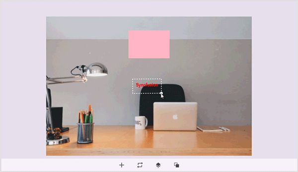

# Z-Ordering in .NET MAUI Image Editor (SfImageEditor)

The .NET MAUI Image Editor allows you to change the position of annotations arranged over the image. This can be achieved using the following methods:

* `BringToFront`
* `SendToBack`
* `BringForward`
* `SendBackward`

## BringToFront

Brings the selected annotation to the front of all annotations over the image.




<Grid RowDefinitions="0.9*, 0.1*">
    <imageEditor:SfImageEditor x:Name="imageEditor"
                               Source="image.jpeg" />
    <Button Grid.Row="1"
            Text="BringToFront"
            Clicked="OnBringToFrontClicked" />
</Grid>




using Syncfusion.Maui.ImageEditor;

private void OnBringToFrontClicked(object sender, EventArgs e)
{
    this.imageEditor.BringToFront();
}




## SendToBack

Sends the selected annotation to the back of all annotations.




<Grid RowDefinitions="0.9*, 0.1*">
    <imageEditor:SfImageEditor x:Name="imageEditor"
                               Source="image.jpeg" />
    <Button Grid.Row="1"
            Text="SendToBack"
            Clicked="OnSendToBackClicked" />
</Grid>




using Syncfusion.Maui.ImageEditor;

private void OnSendToBackClicked(object sender, EventArgs e)
{
    this.imageEditor.SendToBack();
}




## BringForward

Brings the selected annotation one step forward over the image.




<Grid RowDefinitions="0.9*, 0.1*">
    <imageEditor:SfImageEditor x:Name="imageEditor"
                               Source="image.jpeg" />
    <Button Grid.Row="1"
            Text="BringForward"
            Clicked="OnBringForwardClicked" />
</Grid>




using Syncfusion.Maui.ImageEditor;

private void OnBringForwardClicked(object sender, EventArgs e)
{
    this.imageEditor.BringForward();
}




## SendBackward

Sends the selected annotation one step backward over the image.




<Grid RowDefinitions="0.9*, 0.1*">
    <imageEditor:SfImageEditor x:Name="imageEditor"
                               Source="image.jpeg" />
    <Button Grid.Row="1"
            Text="SendBackward"
            Clicked="OnSendBackwardClicked" />
</Grid>




using Syncfusion.Maui.ImageEditor;

private void OnSendBackwardClicked(object sender, EventArgs e)
{
    this.imageEditor.SendBackward();
}




