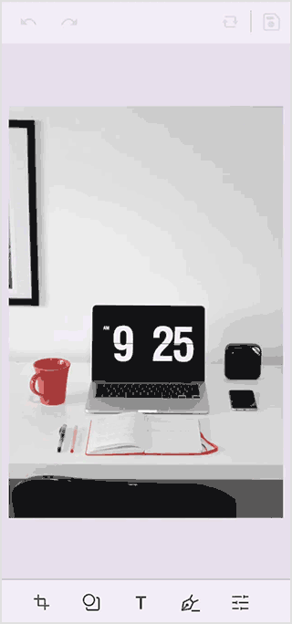

# The .NET MAUI Image Editor (SfImageEditor) Image Zooming

The image editor control in the .NET MAUI provides support for zooming and panning actions on an image.

## Allow image zooming

To enable or disable the zooming functionality, set the value of the [`AllowZoom`](https://help.syncfusion.com/cr/maui/Syncfusion.Maui.ImageEditor.SfImageEditor.html#Syncfusion_Maui_ImageEditor_SfImageEditor_AllowZoom) property to true or false. By default, the [`AllowZoom`](https://help.syncfusion.com/cr/maui/Syncfusion.Maui.ImageEditor.SfImageEditor.html#Syncfusion_Maui_ImageEditor_SfImageEditor_AllowZoom) value is set to `true`.




  <ContentPage 
            . . .
            <imageEditor:SfImageEditor Source="image.jpeg" AllowZoom="False"/>

   </ContentPage>
     



   
     SfImageEditor imageEditor = new SfImageEditor();
     imageEditor.Source = "image.jpeg";
     imageEditor.AllowZoom = false;
     this.content = imageEditor;





## Change the image zoom level

Programmatically, you can zoom the loaded image without any interaction by setting a value to the [`ZoomLevel`](https://help.syncfusion.com/cr/maui/Syncfusion.Maui.ImageEditor.SfImageEditor.html#Syncfusion_Maui_ImageEditor_SfImageEditor_ZoomLevel) property. 




  <ContentPage 
            . . .
            <imageEditor:SfImageEditor Source="image.jpeg" ZoomLevel="2"/>

   </ContentPage>
     



   
     SfImageEditor imageEditor = new SfImageEditor();
     imageEditor.Source = "image.jpeg";
     imageEditor.ZoomLevel = 2;
     this.content = imageEditor;





### Change the maximum zoom level

To define the maximum zoom level for the image, make use of the [`MaximumZoomLevel`](https://help.syncfusion.com/cr/maui/Syncfusion.Maui.ImageEditor.SfImageEditor.html#Syncfusion_Maui_ImageEditor_SfImageEditor_MaximumZoomLevel) property.




  <ContentPage 
            . . .
            <imageEditor:SfImageEditor Source="image.jpeg" MaximumZoomLevel="5"/>

   </ContentPage>
     



   
     SfImageEditor imageEditor = new SfImageEditor();
     imageEditor.Source = "image.jpeg";
     imageEditor.MaximumZoomLevel = 5;
     this.content = imageEditor;



