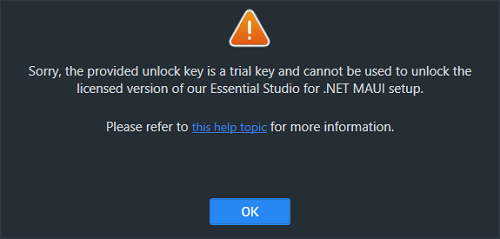
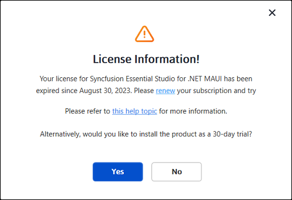
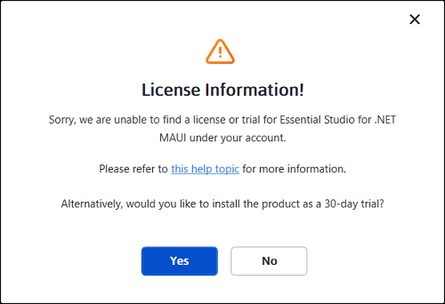
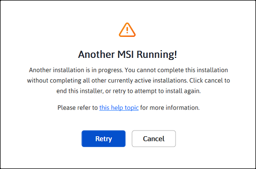
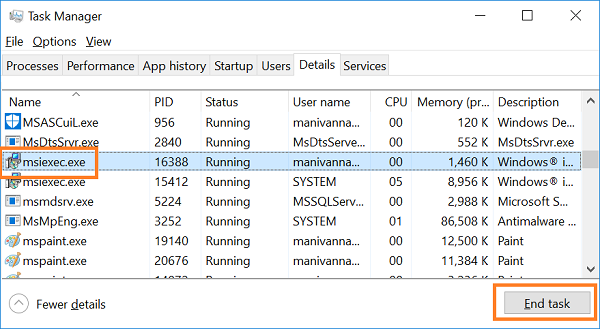
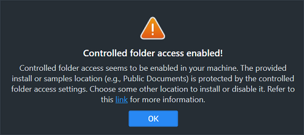
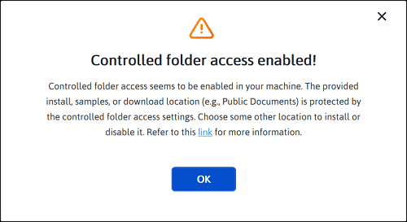

# Common Installation Errors

This article describes the most common installation errors, their causes, and solutions.

* [Unlocking the license installer using the trial key](https://help.syncfusion.com/maui/installation/installation-errors#unlocking-the-license-installer-using-the-trial-key)
* [License has expired](https://help.syncfusion.com/maui/installation/installation-errors#license-has-expired)
* [Unable to find a valid license or trial](https://help.syncfusion.com/maui/installation/installation-errors#unable-to-find-a-valid-license-or-trial)
* [Unable to install because of another installation](https://help.syncfusion.com/maui/installation/installation-errors#unable-to-install-because-of-another-installation)
* [Unable to install due to controlled folder access](https://help.syncfusion.com/maui/installation/installation-errors#unable-to-install-due-to-controlled-folder-access)

## Unlocking the license installer using the trial key

### Problem

**Error message:** Sorry, the provided unlock key is a trial unlock key and cannot be used to unlock the licensed version of our Essential Studio® for .NET MAUI installer.

### Reason

You are attempting to use a trial unlock key to unlock the licensed installer.

### Suggested solution

Only a licensed unlock key can unlock a licensed installer. So, to unlock the Licensed installer, use the Licensed unlock key. To generate the licensed unlock key, refer to this [article](https://support.syncfusion.com/kb/article/2757/how-to-generate-syncfusion-setup-unlock-key-from-syncfusion-support-account).

## License has expired

### Problem

**Error Message:** Your license for Syncfusion® Essential Studio® for .NET MAUI has been expired since {date}. Please renew your subscription and try again.

**Online installer**

### Reason

This error message will appear if your license has expired.

### Suggested solution

You can choose from the options listed below. 

1. Renew your subscription [here](https://www.syncfusion.com/account/my-renewals). 
2. Get a new license [here](https://www.syncfusion.com/sales/products). 
3. Reach out to our sales team by emailing <sales@syncfusion.com>. 
4. Extend the 30-day trial period after your trial license has expired.

## Unable to find a valid license or trial

### Problem

**Error message:** Sorry, we are unable to find a valid license or trial for Essential Studio® for .NET MAUI under your account.

<em>**Offline installer**</em>

<em>**Online installer**</em>

### Reason

The following are possible causes of this error:

* When your trial period expired
* When you don't have a license or an active trial
* You are not the license holder of your license 
* Your account administrator has not yet assigned you a license.

### Suggested solution

You can choose from the options listed below. 

1. You can get a new license [here](https://www.syncfusion.com/sales/products). 
2. Contact your account administrator. 
3. Send an email to  <clientrelations@syncfusion.com> to request a license. 
4. You can reach out to our sales team by emailing  <sales@syncfusion.com>.

## Unable to install because of another installation

### Problem

**Error message:** Another installation is in progress. You cannot start this installation without completing all other currently active installations. Click cancel to end this installer or retry after currently active installation have completed.

### Reason

You are trying to install while another installation is running on your machine.

### Suggested solution

Open and kill the msiexec process in the Task Manager and then continue to install Syncfusion®. If the problem is still present, restart the computer and try the Syncfusion® installer. 

1. Open the Windows Task Manager.

2. Browse the Details tab.

3. Select the msiexec.exe and click **End task**.

## Unable to install due to controlled folder access

### Problem

#### Offline:

**Error message:** Controlled folder access is enabled on your machine. The provided install or samples location (e.g., Public Documents) is protected by the controlled folder access settings.

#### Online:

**Error message:** Controlled folder access is enabled on your machine. The provided install, samples, or download location (e.g., Public Documents) is protected by the controlled folder access settings.

### Reason

You have enabled controlled folder access settings on your computer.

### Suggested solution

**Suggestion 1:**

1.	We will ship our demos in the public documents folder by default. 
2.	You have controlled folder access enabled on your machine, so our demos cannot be installed in the documents folder. If you need to install our demos in the Documents folder, follow the steps in this [link](https://support.microsoft.com/en-us/windows/allow-an-app-to-access-controlled-folders-b5b6627a-b008-2ca2-7931-7e51e912b034) and disable the controlled folder access.
3.	You can enable this option after the installing our Syncfusion® setup.

**Suggestion 2:**

1.	If you do not want to disable controlled folder access, install our demos in another directory.
