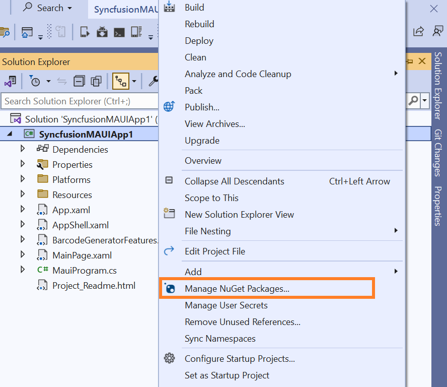
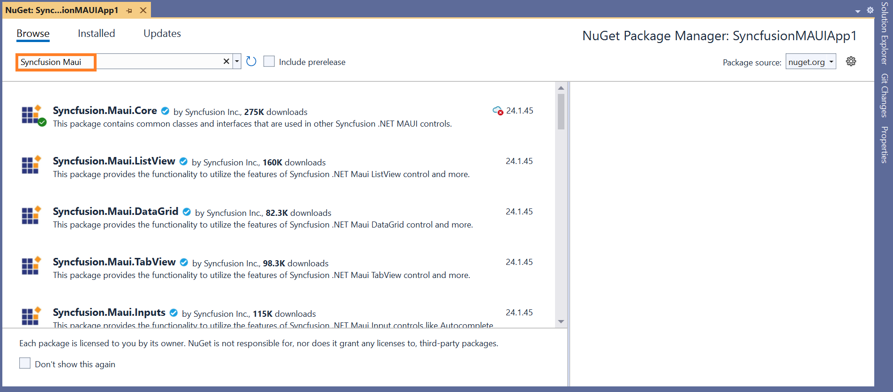
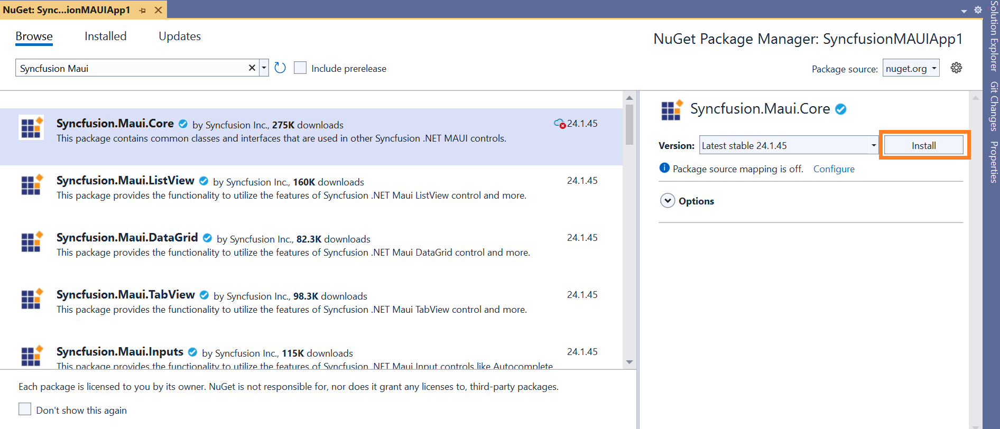
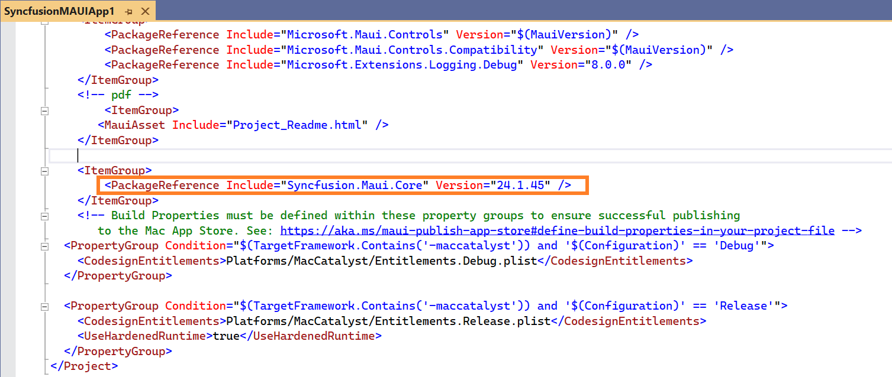
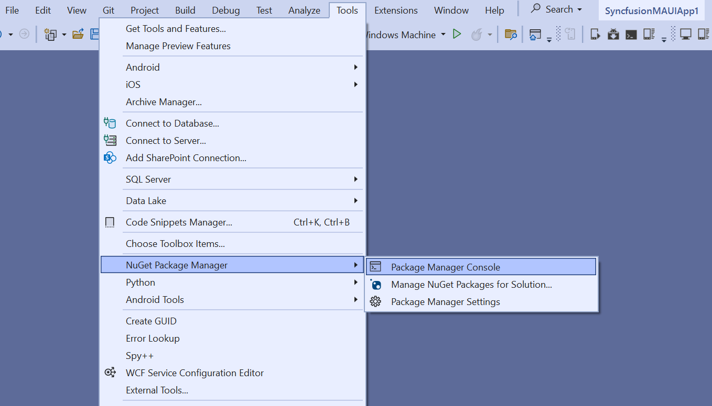
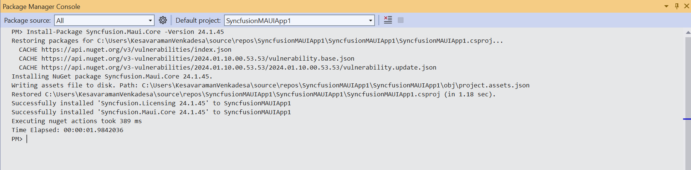

# Install Syncfusion<sup>®</sup> MAUI NuGet packages

**Applies to:** Syncfusion<sup>®</sup> Essential Studio<sup>®</sup> MAUI NuGet packages on .NET MAUI.

**NuGet** is a package management system for Visual Studio that allows you to easily add, update, and remove external libraries in your application. Syncfusion<sup>®</sup> publishes all MAUI NuGet packages on [nuget.org](https://www.nuget.org/packages?q=Tag%3A%22Maui%22+Syncfusion). The Syncfusion<sup>®</sup> MAUI NuGet packages can be used without installing the Syncfusion<sup>®</sup> installer. You can simply reference the Syncfusion<sup>®</sup> MAUI NuGet packages in your MAUI application to develop with the Syncfusion<sup>®</sup> MAUI components.

## Prerequisites

* Visual Studio 2022 (17.3 or later) with the **.NET Multi-platform App UI development** workload installed.
* A .NET MAUI project that targets a Syncfusion<sup>®</sup> MAUI-supported target framework (see the [Syncfusion MAUI system requirements](https://help.syncfusion.com/maui/system-requirements)).
* An internet connection so Visual Studio can reach the `nuget.org` package source.

## Installation using Package Manager UI

The NuGet **Package Manager UI** allows you to search, install, uninstall, and update Syncfusion<sup>®</sup> MAUI NuGet packages in your applications and solutions. To find and install the Syncfusion<sup>®</sup> MAUI NuGet packages in your Visual Studio MAUI application, follow the steps below.

1. Right-click on the MAUI application or solution in the **Solution Explorer**, and choose **Manage NuGet Packages...**

    

    Alternatively, after opening the MAUI application in Visual Studio, go to the **Tools** menu, hover over **NuGet Package Manager**, and select **Manage NuGet Packages for Solution...**

2. The **Manage NuGet Packages** window will open. Navigate to the **Browse** tab, then search for the Syncfusion<sup>®</sup> MAUI NuGet packages using a term like **"Syncfusion Maui"** and select the appropriate Syncfusion<sup>®</sup> MAUI NuGet package for your development.

    > The [nuget.org](https://api.nuget.org/v3/index.json) package source is selected by default in the **Package source** drop-down. If Visual Studio does not have `nuget.org` configured, follow the instructions in the [Microsoft documentation](https://learn.microsoft.com/en-us/nuget/consume-packages/install-use-packages-visual-studio#package-sources) to set up the nuget.org feed URL.

    

3. When you select a MAUI package, the right-side panel will provide more information about it.

4. By default, the latest version of the package is selected. You can choose the required version, click the **Install** button, and accept the license terms. The package is then added to your MAUI application.

    

5. At this point, your application has all the required Syncfusion<sup>®</sup> assemblies, and you will be ready to start building a high-performance, responsive app with [Syncfusion<sup>®</sup> MAUI components](https://www.syncfusion.com/maui-controls). You can also refer to the [MAUI help documentation](https://help.syncfusion.com/maui/introduction/overview) for development.

## Installation using the dotnet (.NET) CLI

The [dotnet Command Line Interface (CLI)](https://learn.microsoft.com/en-us/nuget/consume-packages/install-use-packages-dotnet-cli) allows you to add, restore, pack, publish, and manage packages without making any changes to your application files. [`dotnet add package`](https://learn.microsoft.com/en-us/dotnet/core/tools/dotnet-add-package?tabs=netcore2x) adds a package reference to the project file, then runs [`dotnet restore`](https://learn.microsoft.com/en-us/dotnet/core/tools/dotnet-restore?tabs=netcore2x) to install the package.

Follow the instructions below to use the dotnet CLI command to install the Syncfusion<sup>®</sup> MAUI NuGet packages.

1. Open a command prompt and navigate to the directory of your MAUI project file.
2. Run the following command to install a NuGet package.

    ```bash
    dotnet add package <PackageName>
    ```

    **For example:**

    ```bash
    dotnet add package Syncfusion.Maui.Core
    ```

    > If you do not provide a version flag, this command will upgrade to the latest version by default. To specify a version, add the `-v` parameter:
    >
    > ```bash
    > dotnet add package Syncfusion.Maui.Core -v 24.1.45
    > ```

3. Examine the MAUI project file after the command has completed to ensure that the Syncfusion<sup>®</sup> MAUI package was installed. To see the added reference, open the `.csproj` file.

    

4. Run the [`dotnet restore`](https://learn.microsoft.com/en-us/dotnet/core/tools/dotnet-restore?tabs=netcore2x) command to restore all the packages listed in the project file.

5. Your application now has all the required Syncfusion<sup>®</sup> assemblies, and you are ready to start building a high-performance, responsive app with [Syncfusion<sup>®</sup> MAUI components](https://www.syncfusion.com/maui-controls). You can also refer to the [MAUI help documentation](https://help.syncfusion.com/maui/introduction/overview) for development.

## Installation using Package Manager Console

The **Package Manager Console** saves NuGet package installation time since you do not have to search for the Syncfusion<sup>®</sup> MAUI NuGet package you want to install; you can type the installation command to install the appropriate Syncfusion<sup>®</sup> MAUI NuGet package. Follow the instructions below to use the Package Manager Console to reference the Syncfusion<sup>®</sup> MAUI component as NuGet packages in your MAUI application.

1. To show the Package Manager Console, open your MAUI application in Visual Studio and navigate to **Tools -> NuGet Package Manager -> Package Manager Console**.

    

2. The **Package Manager Console** will be shown at the bottom of the screen. You can install the Syncfusion<sup>®</sup> MAUI NuGet packages by entering the following NuGet installation commands.

    ***Install a specified Syncfusion<sup>®</sup> MAUI NuGet package.***

    The following command will install the Syncfusion<sup>®</sup> MAUI NuGet package in the default MAUI project.

    ```powershell
    Install-Package <PackageName>
    ```

    **For example:**

    ```powershell
    Install-Package Syncfusion.Maui.Grid
    ```

    > You can find the list of Syncfusion<sup>®</sup> MAUI NuGet packages published on nuget.org [here](https://www.nuget.org/packages?q=Tags%3A%22Maui%22+syncfusion).

    ***Install a specified Syncfusion<sup>®</sup> MAUI NuGet package in a specified MAUI project.***

    The following command will install the Syncfusion<sup>®</sup> MAUI NuGet package in the given MAUI project.

    ```powershell
    Install-Package <PackageName> -ProjectName <ProjectName>
    ```

    **For example:**

    ```powershell
    Install-Package Syncfusion.Maui.Grid -ProjectName SyncfusionMauiApp
    ```

3. By default, the package will be installed with the latest version. You can specify the required version with the `-Version` parameter to install the Syncfusion<sup>®</sup> MAUI NuGet packages in the appropriate version.

    ```powershell
    Install-Package Syncfusion.Maui.Core -Version 24.1.45
    ```

    

4. The NuGet Package Manager Console will install the Syncfusion<sup>®</sup> MAUI NuGet package as well as its dependencies. When the installation is complete, the console will show that your Syncfusion<sup>®</sup> MAUI package has been successfully added to the application.

5. Your application now has all the required Syncfusion<sup>®</sup> assemblies, and you are ready to start building a high-performance, responsive app with [Syncfusion<sup>®</sup> MAUI components](https://www.syncfusion.com/maui-controls). You can also refer to the [MAUI help documentation](https://help.syncfusion.com/maui/introduction/overview) for development.

## Related links

* [Syncfusion<sup>®</sup> MAUI components](https://www.syncfusion.com/maui-controls)
* [MAUI help documentation](https://help.syncfusion.com/maui/introduction/overview)
* [Syncfusion<sup>®</sup> licensing overview](https://help.syncfusion.com/common/essential-studio/licensing/overview)