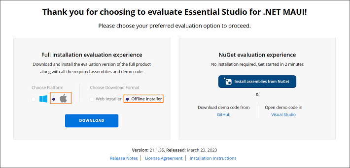
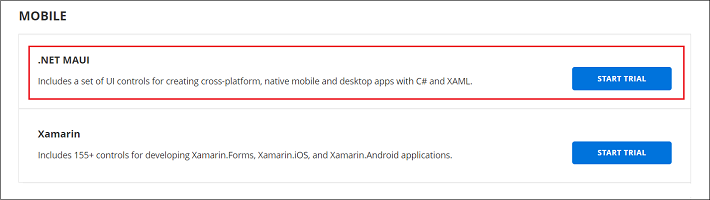
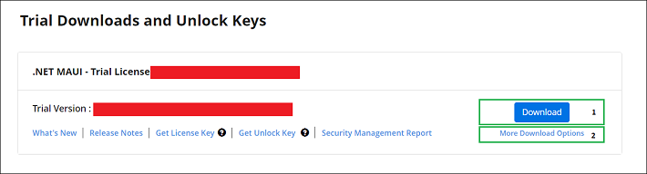

# Downloading Syncfusion® .NET MAUI Mac installer

**Applies to:** Syncfusion® Essential Studio® .NET MAUI Mac installer on macOS.

The Syncfusion® .NET MAUI Mac installer can be downloaded from the [Syncfusion website](https://www.syncfusion.com/maui-controls). You can either download the licensed installer or try our trial installer, depending on your license.

* Trial Installer
* Licensed Installer

## Download the trial version

Our 30-day trial can be downloaded in two ways:

* Download the Free Trial Setup.
* Start a trial if you are using components through [NuGet.org](https://www.nuget.org/packages?q=syncfusion).

### Download free trial setup

1. Visit the [Download Free Trial](https://www.syncfusion.com/downloads) page and select the **.NET MAUI** platform to evaluate our 30-day free trial.
2. After completing the required form or signing in with your registered Syncfusion® account, you can download the .NET MAUI trial installer from the confirmation page (as shown in the screenshot below).

   

3. With a trial license, only the latest version's trial installer can be downloaded.
4. An unlock key is not required to install the Syncfusion® .NET MAUI Mac trial installer.
5. Before the trial expires, download the trial installer at any time from your registered account's [Trials & Downloads](https://www.syncfusion.com/account/manage-trials/downloads) page (as shown in the screenshot below).

   

6. Click **More Download Options** (element 2 in the screenshot above) to get the Essential Studio® .NET MAUI Offline trial installer, which is available in DMG format.

   

### Start trials if using components through [NuGet.org](https://www.nuget.org/packages?q=syncfusion)

You should initiate an evaluation if you have already obtained our components through [NuGet.org](https://www.nuget.org/packages?q=syncfusion).

1. Start your 30-day free trial for .NET MAUI from the [Start Trial](https://www.syncfusion.com/account/manage-trials/start-trials) page in your account.

   

2. To access this page, you must sign up or sign in with your Syncfusion® account.
3. Begin your trial by selecting the .NET MAUI product.

   > If you have already used a trial for a product and it has not expired, you will not be able to start a new trial for the same product.

4. After starting the trial, go to the [Trials & Downloads](https://www.syncfusion.com/account/manage-trials/downloads) page to get the latest version trial installer. You can generate the [unlock key](https://support.syncfusion.com/kb/article/7053) and [license key](/maui/licensing/how-to-generate) at any time before the trial period expires (as shown in the screenshot below).

   

5. You can find your current active trial products on the [Trials & Downloads](https://www.syncfusion.com/account/manage-trials/downloads) page.

## Download the license version

1. Syncfusion® licensed products are available on the [License & Downloads](https://www.syncfusion.com/account/downloads) page under your registered Syncfusion® account.
2. View all the licenses (both active and expired) associated with your account.
3. Download the .NET MAUI Mac licensed installer by going to **More Download Options** (element 3 in the screenshot below).
4. An unlock key is not required to install the Syncfusion® .NET MAUI Mac licensed installer.
5. For macOS, the DMG format is available for download.

   

For step-by-step installation guidelines, see [Installing the .NET MAUI Mac installer](https://help.syncfusion.com/maui/installation/mac-installer/how-to-install).	
