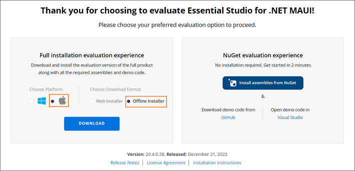
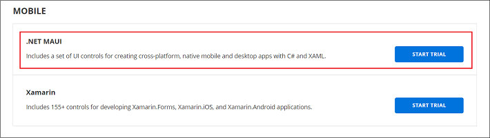

# Downloading Syncfusion® .NET MAUI Mac installer

The Syncfusion® .NET MAUI installer can be downloaded from the [Syncfusion®](https://www.syncfusion.com/maui-controls) website. You can either download the licensed installer or try our trial installer depending on your license.

   -	Trial Installer
   -	Licensed Installer

## Download the Trial Version

Our 30-day trial can be downloaded in two ways.

   * Download Free Trial Setup
   * Start Trials if using components through [NuGet.org](https://www.nuget.org/packages?q=syncfusion)

### Download Free Trial Setup

1. You can evaluate our 30-day free trial by visiting the [Download Free Trial](https://www.syncfusion.com/downloads) page and select the .NET MAUI platform.
2. After completing the required form or logging in with your registered Syncfusion® account, you can download the .NET MAUI trial installer from the confirmation page. (as shown in below screenshot.) 
   
   
   
3. With a trial license, only the latest version’s trial installer can be downloaded.
4. Unlock key is not required to install the Syncfusion® .NET MAUI Mac trial installer.
5. Before the trial expires, you can download the trial installer at any time from your registered account’s [Trials & Downloads](https://www.syncfusion.com/account/manage-trials/downloads) page (as shown in below screenshot.)

   

6. Click the More Download Options (element 2 in the above screenshot) button to get the Essential Studio® .NET MAUI Offline trial installer which is available in DMG format.

   
   
### Start Trials if using components through [NuGet.org](https://www.nuget.org/packages?q=syncfusion)

You should initiate an evaluation if you have already obtained our components through [NuGet.org](https://www.nuget.org/packages?q=syncfusion)

1. You can start your 30-day free trial for .NET MAUI from the [Start Trial](https://www.syncfusion.com/account/manage-trials/start-trials) page from your account.
   
   
   
2. To access this page, you must sign up\log in with your Syncfusion® account.
3. Begin your trial by selecting the .NET MAUI product. 

   N> If you've already used the trial products and they haven't expired, you won't be able to start the trial for the same product again.

4. After you've started the trial, go to the [Trials & Downloads](https://www.syncfusion.com/account/manage-trials/downloads) page to get the latest version trial installer. You can generate the [unlock key](https://support.syncfusion.com/kb/article/7053) and [license key](/maui/licensing/how-to-generate) here at any time before the trial period expires. (as shown in below screenshot.)

   

5. You can find your current active trial products on the [Trials & Downloads](https://www.syncfusion.com/account/manage-trials/downloads) page.
   

## Download the License Version

1. Syncfusion® licensed products will be available in the [License & Downloads](https://www.syncfusion.com/account/downloads) page under your registered Syncfusion® account.
2. You can view all the licenses (both active and expired) associated with your account.
3. You can download .NET MAUI Mac licensed installer by going to More Downloads Options (element 3 in the screenshot below).
4. Unlock key is not required to install the Syncfusion® .NET MAUI Mac trial installer.
5. For Mac OS, DMG formats is available for download.

   
	
	
You can also refer to the [**.NET MAUI Mac installer**](https://help.syncfusion.com/maui/installation/mac-installer/how-to-install) links for step-by-step installation guidelines.	
