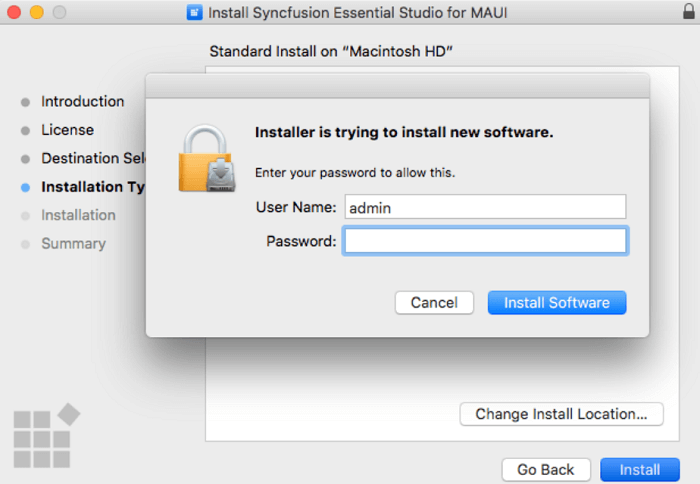
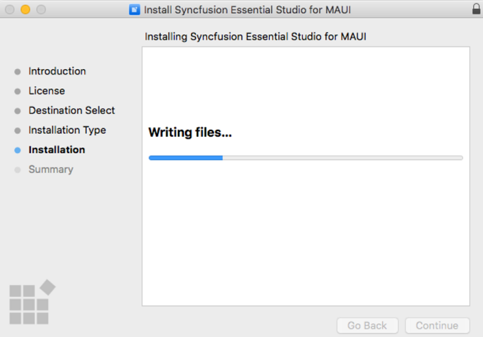
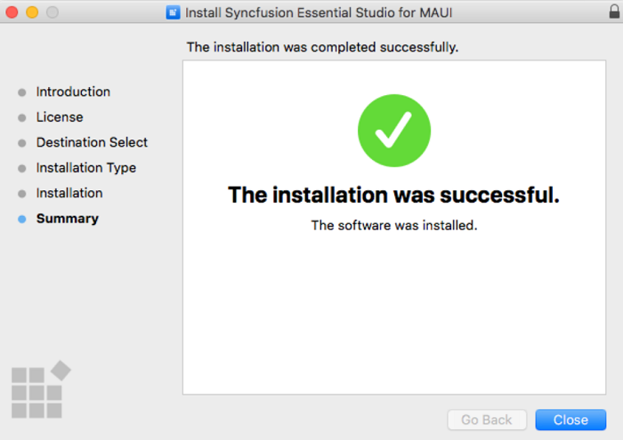
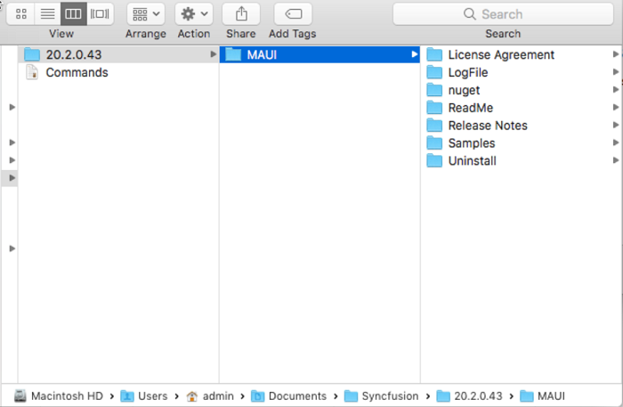

# Steps to resolve the warning message in Catalina OS or later

   While running .NET MAUI Mac Installers on Catalina MacOS or later, the below alert will be displayed.

     
     
   If you receive this alert, follow the below steps for the easiest solution.   

   1.	Right-click the downloaded pkg file.
   2.	Select the "Open With" option and choose "Installer (Default)". The following pop-up appears.

		

   3.	When you click "Open" the installer window will be opened.

## Step-by-Step Installation

The steps below show how to install .NET MAUI Mac installer. 

1. Open the Syncfusion MAUI Mac installer(.pkg) file. The installer Wizard opens. Click Continue.

   
   

2. The Software License Agreement wizard will appear. Click the Continue button.

      
   

3. The License Agreement's Confirmation window will appear. If you have read the Software License Agreement, click **Agree**.

   
   
   N> The Unlock key is not required to install the Mac installer. The Syncfusion Mac installer can be used for development purposes without registering the Unlock key.

4. The Destination select wizard will appear. You can choose which disc to install the Syncfusion .NET MAUI Mac installer on here.

   

5. The Installation Type wizard will appear. Click Install to begin the standard installation of the Syncfusion .NET MAUI Mac installer.

   

6. The Authentication window will appear. To begin the installation, enter the Mac machine's password and click **Install Software**.

   

7. The installation process will begin on your machine. 
   
   
   
8. Once the installation is complete, the completed screen will be displayed. To exit the installation wizard, click Close. 

   
   
   By default, Mac installer will install the files in following location.

   **Location:** {Documents}\Syncfusion\ {version}\ {platform}
   
   

## License key registration in samples

After the installation, the license key is required to register the demo source that is included in the Mac installer. To learn about the steps for license registration for the .NET MAUI Mac installer, please refer to this.

Register the license key in [App.xaml.cs](https://help.syncfusion.com/maui/licensing/how-to-register-in-an-application#net-maui) constructor before InitializeComponent().