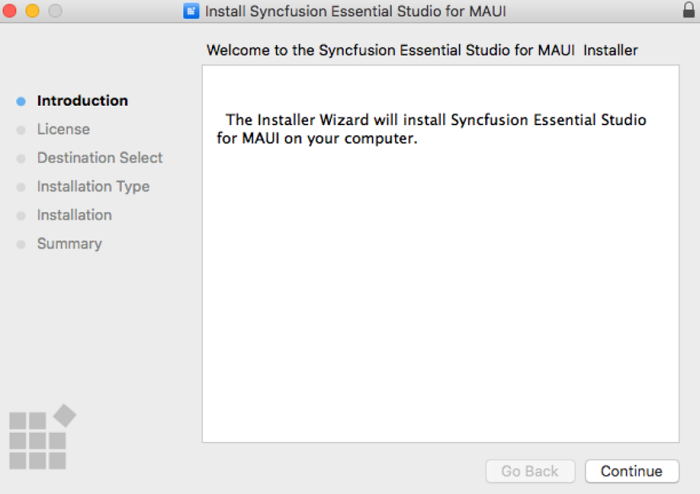
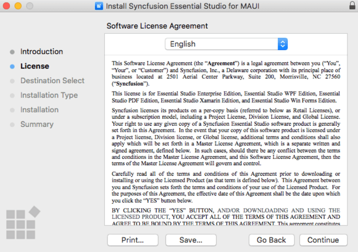
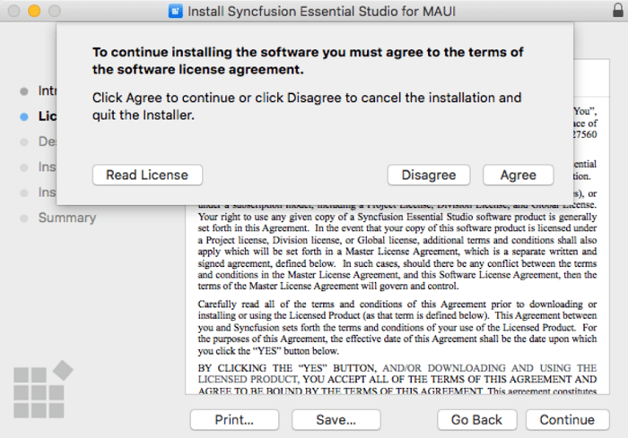
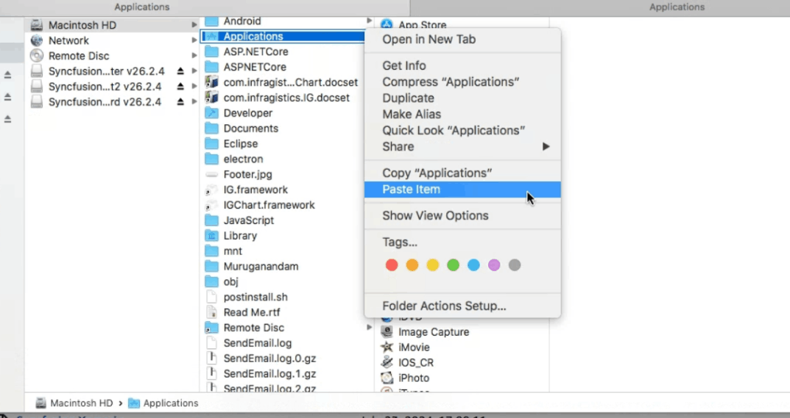
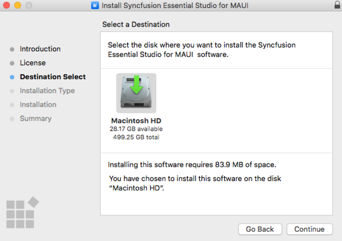
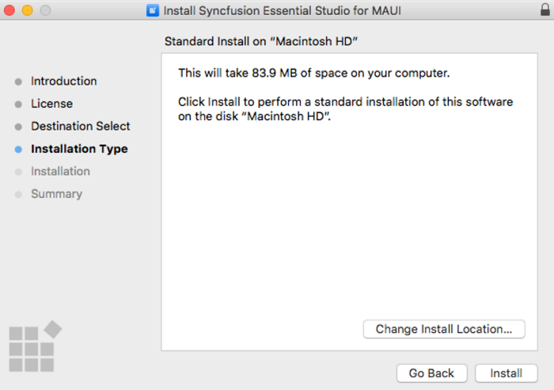

# Installing Syncfusion® .NET MAUI Mac installer

**Applies to:** Syncfusion® Essential Studio® .NET MAUI Mac installer on macOS (Catalina or later).

## Prerequisites

* A Mac running macOS Catalina (10.15) or later.
* A user account with permission to install applications (administrator password may be required).
* A current version of the Syncfusion .NET MAUI Mac DMG installer. If you do not have it, see [Downloading the Syncfusion .NET MAUI Mac installer](https://help.syncfusion.com/maui/installation/mac-installer/how-to-download).

## Steps to resolve the warning message in Catalina OS or later

When you run the .NET MAUI Mac installer on macOS Catalina or later, the alert below will be displayed.

If you receive this alert, follow the steps below for the easiest solution.

1. Right-click the downloaded DMG file.
2. Select **Open With** and choose **DiskImageMounter (Default)**. The pop-up below appears.

   

3. Click **Open** to access the installer window.

## Step-by-step installation

The steps below show how to install the .NET MAUI Mac installer.

1. Locate the downloaded DMG file and open it by double-clicking.

   

2. This action will mount the disk image and create a virtual drive on your desktop or in the Finder sidebar.

   

3. Copy the mounted disk file.

   

4. Paste it into the **Applications** folder shortcut.

   

   > An unlock key is not required to install the Mac installer. The Syncfusion® Mac installer can be used for development purposes without registering the unlock key.

5. Open the folder to explore the Syncfusion® Essential Studio® Mac installer.

   

6. To remove the DMG file, right-click the virtual drive on your desktop or in the Finder sidebar and select **Eject**. Also delete the installer file from the Applications folder.

   

## License key registration in samples

After installation, a license key is required to register the demo source included in the Mac installer. For license registration steps for the .NET MAUI Mac installer, see [How to register the Syncfusion license key in a .NET MAUI application](https://help.syncfusion.com/maui/licensing/how-to-register-in-an-application#net-maui).

Register the license key in the [`App.xaml.cs`](https://help.syncfusion.com/maui/licensing/how-to-register-in-an-application#net-maui) constructor, before `InitializeComponent()`.

## Troubleshooting

If you encounter issues during installation, see [Installation Errors](https://help.syncfusion.com/maui/installation/installation-errors) for solutions to typical problems.