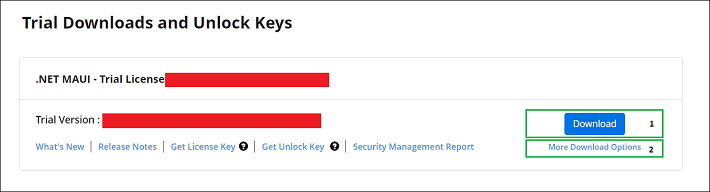
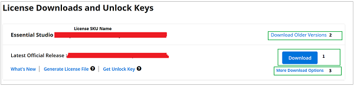

# Downloading Syncfusion® .NET MAUI Offline Installer

The Syncfusion® .NET MAUI installer can be downloaded from the [Syncfusion®](https://www.syncfusion.com/maui-controls) website. You can either download the licensed installer or try our trial installer depending on your license. 

   -	Trial Installer
   -	Licensed Installer

## Download the trial version

Our 30-day trial can be downloaded in two ways.

   * Download Free Trial Setup
   * Start Trials through [NuGet.org](https://www.nuget.org/packages?q=syncfusion)

### Download free trial setup

1. Visit the [Download Free Trial](https://www.syncfusion.com/downloads) page and select the .NET MAUI platform.
2. After completing the required form or logging in with your registered Syncfusion® account, download the .NET MAUI trial installer from the confirmation page (as shown in below screenshot). 
   
   
   
3. With a trial license, only the latest version’s trial installer can be downloaded.
4. Once downloaded, unlock the Syncfusion® .NET MAUI trial installer using either the trial unlock key or your registered login credentials. More information on generating an unlock key can be found in this [article](https://support.syncfusion.com/kb/article/7053/how-to-generate-unlock-key-for-essentials-studio-products).
5. Before the trial expires, download the trial installer anytime from your registered account’s [Trials & Downloads](https://www.syncfusion.com/account/manage-trials/downloads) page (as shown in below screenshot.)
6. Click the More Download Options (element 2 in the screenshot) to get the Essential Studio® .NET MAUI offline trial installer, available in EXE and ZIP formats.

   
   
### Start trials if using components through [NuGet.org](https://www.nuget.org/packages?q=syncfusion)

If you've accessed our components through [NuGet.org](https://www.nuget.org/packages?q=syncfusion):

1. Start your 30-day free trial for .NET MAUI from the [Start Trial](https://www.syncfusion.com/account/manage-trials/start-trials) page from your account.
   
   
   
2. Sign up/log in with your Syncfusion® account to access this page.
3. Begin your trial by selecting the .NET MAUI product. 

   N> If you've previously used the trial products and they haven't expired, you won't be able to start the trial for the same product again.

4. After starting the trial, visit the [Trials & Downloads](https://www.syncfusion.com/account/manage-trials/downloads) page to get the latest version trial installer. Generate the [unlock key](https://support.syncfusion.com/kb/article/7053/how-to-generate-unlock-key-for-essentials-studio-products) and [license key](https://help.syncfusion.com/maui/licensing/how-to-generate) at any time before the trial period expires (as shown in below screenshot).

   

5. You can find your active trial products on the [Trials & Downloads](https://www.syncfusion.com/account/manage-trials/downloads) page.
   

## Download the license version

1. Access Syncfusion® licensed products through the [License & Downloads](https://www.syncfusion.com/account/downloads) page under your registered Syncfusion® account.
2. View all licenses (both active and expired) associated with your account.
3. Click Download (element 1 in the screenshot below) to download the respective product’s installer.
4. The latest version of the installer will be downloaded from this page.
5. To download older version installers, visit [Downloads Older Versions](https://www.syncfusion.com/account/downloads/studio) (element 2 in the screenshot).
6. You can download other platform/add-on installers by selecting More Downloads Options (element 3 in the screenshot).

   

7. For Windows OS, EXE and Zip formats are available for download. They are both offline installers.

	
	
For step-by-step installation guidelines, refer to the [**Offline installer**](https://help.syncfusion.com/maui/installation/offline-installer/how-to-install) links.