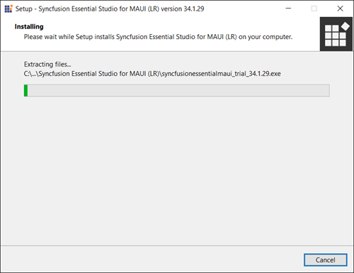
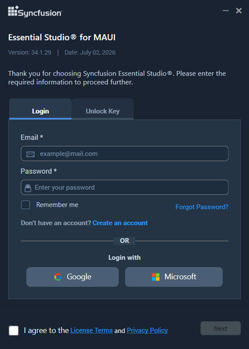
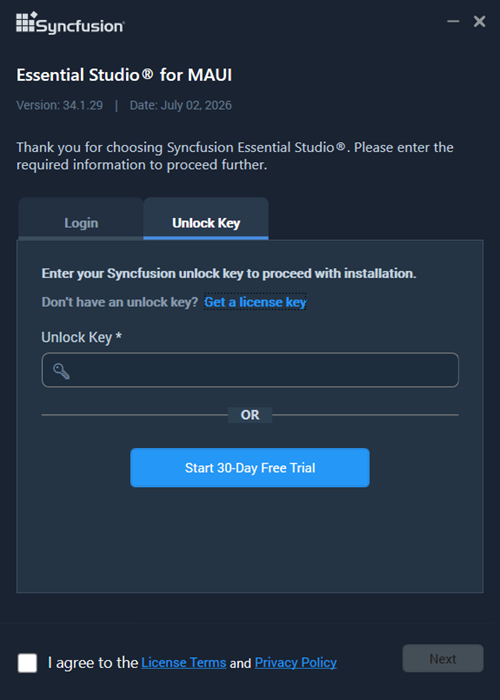
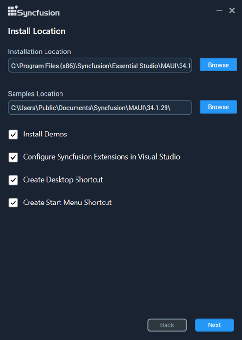
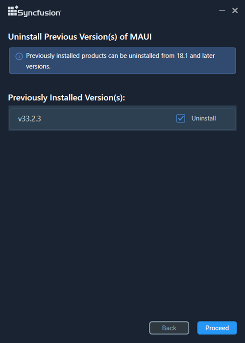
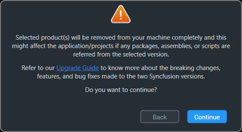
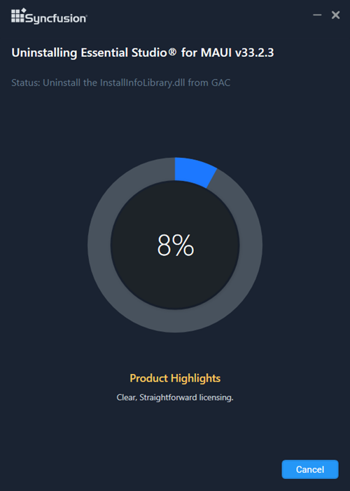
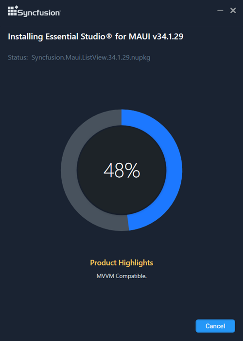
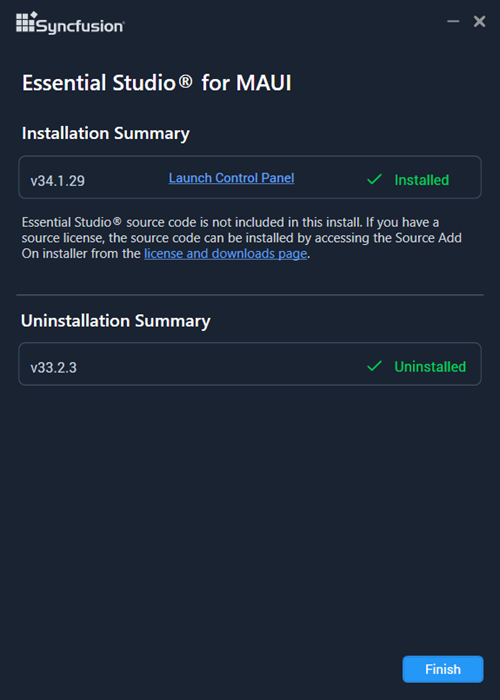

# Installing Syncfusion<sup>®</sup> .NET MAUI offline installer

**Applies to:** Syncfusion<sup>®</sup> Essential Studio<sup>®</sup> .NET MAUI Offline Installer on Windows.

## Prerequisites

* Windows 10 or later (64-bit) with the latest Windows updates.
* Administrator rights on the machine (the installer and the silent-mode steps must be run as administrator).
* .NET 6 or .NET 7 SDK installed, plus the **.NET Multi-platform App UI development** workload in Visual Studio 2022 17.3 or later.
* A current version of the Syncfusion .NET MAUI offline installer (EXE or ZIP). If you do not have it, see [Downloading the .NET MAUI Offline Installer](https://help.syncfusion.com/maui/installation/offline-installer/how-to-download).
* A valid license key, or a valid 30-day trial unlock key, depending on the installer you downloaded.

## Installing with the UI

The steps below show how to install the Essential Studio<sup>®</sup> .NET MAUI offline installer.

1. **Open the installer:** Double-click the downloaded Syncfusion<sup>®</sup> .NET MAUI offline installer file to open the Installer Wizard, which automatically extracts the package.

   

   N> The installer extracts the `syncfusionessentialmaui_(version).exe` dialog, displaying the package's unzip operation.

2. **Unlock the installer:** You have two options to unlock the Syncfusion<sup>®</sup> offline installer.

   * *Login To Install*
   * *Use Unlock Key*

   **Login to install**

   Enter your Syncfusion<sup>®</sup> email and password. Create an account if you do not have one by clicking **Create an account**. Reset your password by clicking **Forgot Password**. Click **Next** after entering your credentials.

   

   **Use unlock key**

   Unlock keys unlock the Syncfusion<sup>®</sup> offline installer, and they are platform- and version-specific. Use either a Syncfusion<sup>®</sup> licensed or trial unlock key to unlock the Syncfusion<sup>®</sup> .NET MAUI installer.

   The trial unlock key is valid for 30 days, and the installer will not accept an expired trial key.

   To learn how to generate an unlock key for both trial and licensed products, see this Knowledge Base [article](https://support.syncfusion.com/kb/article/2757/how-to-generate-syncfusion-setup-unlock-key-from-syncfusion-support-account).

   

3. **Agree to the terms:** After reading the License Terms and Privacy Policy, check the **I agree to the License Terms and Privacy Policy** check box. Click **Next**.

4. **Configure settings:** Change the install and sample locations and adjust the additional settings as needed. Click **Next**, then **Install**, to proceed with the default settings.

   

   **Additional settings**

   * Select the **Install Demos** check box to install Syncfusion<sup>®</sup> samples, or leave the check box unchecked if you do not want to install Syncfusion<sup>®</sup> samples.
   * Select the **Configure Syncfusion<sup>®</sup> controls in Visual Studio** check box to configure the Syncfusion<sup>®</sup> controls in the Visual Studio toolbox, or clear this check box when you do not want to configure the Syncfusion<sup>®</sup> controls in the Visual Studio toolbox during installation. Note that you must also select the **Register Syncfusion<sup>®</sup> assemblies in GAC** check box when you select this check box.
   * Select the **Configure Syncfusion<sup>®</sup> Extensions controls in Visual Studio** check box to configure the Syncfusion<sup>®</sup> Extensions in Visual Studio, or clear this check box when you do not want to configure the Syncfusion<sup>®</sup> Extensions in Visual Studio.
   * Check the **Create Desktop Shortcut** check box to add a desktop shortcut for the Syncfusion<sup>®</sup> Control Panel.
   * Check the **Create Start Menu Shortcut** check box to add a shortcut to the Start menu for the Syncfusion<sup>®</sup> Control Panel.

5. **Uninstall previous versions:** If a previous version of the current product is installed, the **Uninstall Previous Version(s)** wizard will open. Select the **Uninstall** check box to uninstall the previous versions and then click the **Proceed** button.

   

   N>From the 2021 Volume 1 release, Syncfusion<sup>®</sup> has added the option to uninstall previous versions from 18.1 while installing the new version.

   N>If a version is selected to uninstall, a confirmation screen appears. If you click **Continue**, the **Progress** screen displays the uninstall and install progress. If none of the versions are chosen to be uninstalled, only the installation progress is displayed.

   **Confirmation alert**

   

   **Uninstall progress**

   

   **Install progress**

   

   N>The **Completed** screen is displayed once the .NET MAUI product is installed. If a version is selected to uninstall, the **Completed** screen will display both install and uninstall status.

   

6. **Access the control panel:** After installation, click the **Launch Control Panel** link to open the Syncfusion<sup>®</sup> Control Panel.

7. Click **Finish** to finalize the installation. Your system now has Syncfusion<sup>®</sup> Essential Studio<sup>®</sup> .NET MAUI installed.

## Installing in silent mode

The Syncfusion<sup>®</sup> Essential Studio<sup>®</sup> .NET MAUI Installer supports installation and uninstallation via the command line.

### Command-line installation

To install through the command line in silent mode, follow the steps below.

1. Run the Syncfusion<sup>®</sup> .NET MAUI installer by double-clicking it. The Installer Wizard automatically opens and extracts the package.
2. The file `syncfusionessentialmaui_(version).exe` is extracted into the Temp directory.
3. Run `%temp%`. The Temp folder opens. The `syncfusionessentialmaui_(version).exe` file is located in one of the folders.
4. Copy the extracted `syncfusionessentialmaui_(version).exe` file to a local drive.
5. Exit the Wizard.
6. Run Command Prompt in administrator mode and enter the following arguments.

   **Arguments:**

   ```bat
   "installer file path\SyncfusionEssentialStudio(product)_(version).exe" /Install silent /UNLOCKKEY:"(product unlock key)" [/log "{Log file path}"] [/InstallPath:{Location to install}] [/InstallSamples:{true/false}] [/InstallAssemblies:{true/false}] [/UninstallExistAssemblies:{true/false}] [/InstallToolbox:{true/false}] [/CreateShortcut:{true/false}] [/CreateStartMenuShortcut:{true/false}]
   ```

   > Arguments inside the square brackets (`[..]`) are optional.

   **Example:**

   ```bat
   "D:\Temp\syncfusionessentialmaui_x.x.x.x.exe" /Install silent /UNLOCKKEY:"product unlock key" /log "C:\Temp\EssentialStudio_Product.log" /InstallPath:C:\Syncfusion\x.x.x.x /InstallSamples:true /InstallAssemblies:true /UninstallExistAssemblies:true /InstallToolbox:true /CreateShortcut:true /CreateStartMenuShortcut:true
   ```

7. Essential Studio<sup>®</sup> for .NET MAUI is installed.

   N> `x.x.x.x` should be replaced with the Essential Studio<sup>®</sup> version, and the **Product Unlock Key** must be replaced with the unlock key for that version.

### Command-line uninstallation

Syncfusion<sup>®</sup> Essential<sup>®</sup> .NET MAUI can be uninstalled silently using the command line.

1. Run the Syncfusion<sup>®</sup> .NET MAUI installer by double-clicking it. The Installer Wizard automatically opens and extracts the package.
2. The file `syncfusionessentialmaui_(version).exe` is extracted into the Temp directory.
3. Run `%temp%`. The Temp folder opens. The `syncfusionessentialmaui_(version).exe` file is located in one of the folders.
4. Copy the extracted `syncfusionessentialmaui_(version).exe` file to a local drive.
5. Exit the Wizard.
6. Run Command Prompt in administrator mode and enter the following arguments.

   **Arguments:**

   ```bat
   "Copied installer file path\syncfusionessentialmaui_(version).exe" /uninstall silent
   ```

   **Example:**

   ```bat
   "D:\Temp\syncfusionessentialmaui_x.x.x.x.exe" /uninstall silent
   ```

7. Essential Studio<sup>®</sup> for .NET MAUI is uninstalled.

## Troubleshooting

If you encounter issues during installation, see [Installation Errors](https://help.syncfusion.com/maui/installation/installation-errors) for solutions to typical problems such as license key mismatch, blocked installations, and controlled folder access.
