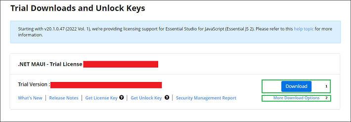
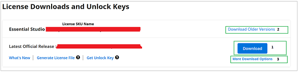

# Downloading Syncfusion® .NET MAUI Web Installer

**Applies to:** Syncfusion® Essential Studio® .NET MAUI Web Installer on Windows.

The Syncfusion® .NET MAUI web installer can be downloaded from the [Syncfusion website](https://www.syncfusion.com/maui-controls). You can either download the licensed installer or try our trial installer, depending on your license.

* Trial Installer
* Licensed Installer

## Download the trial version

Our 30-day trial can be downloaded in two ways:

* Download the Free Trial Setup.
* Start a trial if you are using components through [NuGet.org](https://www.nuget.org/packages?q=syncfusion).

### Download free trial setup

1. Visit the [Download Free Trial](https://www.syncfusion.com/downloads) page and select the **.NET MAUI** platform to evaluate our 30-day free trial.
2. After completing the required form or signing in with your registered Syncfusion® account, you can download the .NET MAUI trial installer from the confirmation page (as shown in the screenshot below).

   

3. With a trial license, only the latest version's trial installer can be downloaded.
4. After downloading, the Syncfusion® .NET MAUI trial installer can be unlocked using either the trial unlock key or the Syncfusion® registered login credentials. More information on generating an unlock key can be found in this [article](https://support.syncfusion.com/kb/article/7053/how-to-generate-unlock-key-for-essentials-studio-products).
5. Before the trial expires, you can download the trial installer at any time from your registered account's [Trials & Downloads](https://www.syncfusion.com/account/manage-trials/downloads) page (as shown in the screenshot below).
6. Click **Download** (element 1 in the screenshot below) to get the Syncfusion® Essential Studio® .NET MAUI web installer.

   

### Start trials if using components through [NuGet.org](https://www.nuget.org/packages?q=syncfusion)

If you have already obtained our components through [NuGet.org](https://www.nuget.org/packages?q=syncfusion):

1. Start your 30-day free trial for .NET MAUI from the [Start Trial](https://www.syncfusion.com/account/manage-trials/start-trials) page in your account.

   

2. To access this page, you must sign up or sign in with your Syncfusion® account.
3. Begin your trial by selecting the .NET MAUI product.

   N> If you have already used a trial for a product and it has not expired, you will not be able to start a new trial for the same product.

4. After starting the trial, go to the [Trials & Downloads](https://www.syncfusion.com/account/manage-trials/downloads) page to get the latest version trial installer. You can generate the [unlock key](https://support.syncfusion.com/kb/article/7053/how-to-generate-unlock-key-for-essentials-studio-products) and [license key](https://help.syncfusion.com/maui/licensing/how-to-generate) at any time before the trial period expires (as shown in the screenshot below).

   

5. You can find your current active trial products on the [Trials & Downloads](https://www.syncfusion.com/account/manage-trials/downloads) page.

## Download the license version

1. Syncfusion® licensed products are available on the [License & Downloads](https://www.syncfusion.com/account/downloads) page under your registered Syncfusion® account.
2. You can view all the licenses (both active and expired) associated with your account.
3. Click **Download** (element 1 in the screenshot below) to download the respective product's installer.
4. The most recent version of the installer will be downloaded from this page.
5. To download older version installers, go to [Downloads Older Versions](https://www.syncfusion.com/account/downloads/studio) (element 2 in the screenshot below).
6. You can download other platform or add-on installers by going to **More Downloads Options** (element 3 in the screenshot below).

   

7. Before the license expires, you can download the installer at any time from your registered account's [License & Downloads](https://www.syncfusion.com/account/downloads) page (see the screenshot below).

   

8. After downloading, the Syncfusion® .NET MAUI web installer can be unlocked using your Syncfusion® registered login credentials.

   N> For Syncfusion® trial and licensed products, there is no separate web installer. Based on your account license, Syncfusion® trial or licensed products will be installed via the web installer.

For step-by-step installation guidelines, see [Installing the .NET MAUI Web Installer](https://help.syncfusion.com/maui/installation/web-installer/how-to-install).	