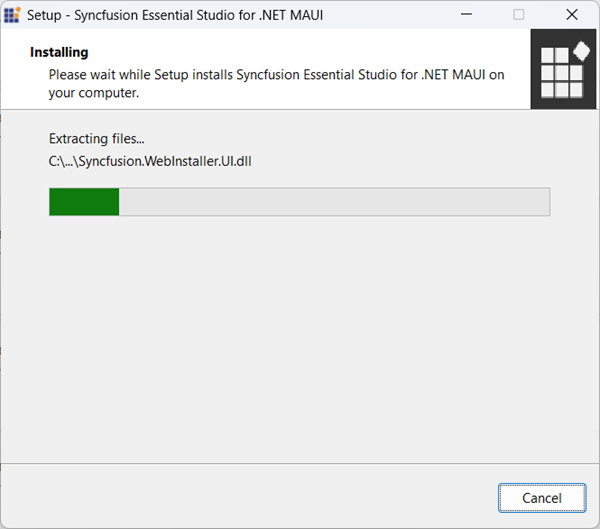
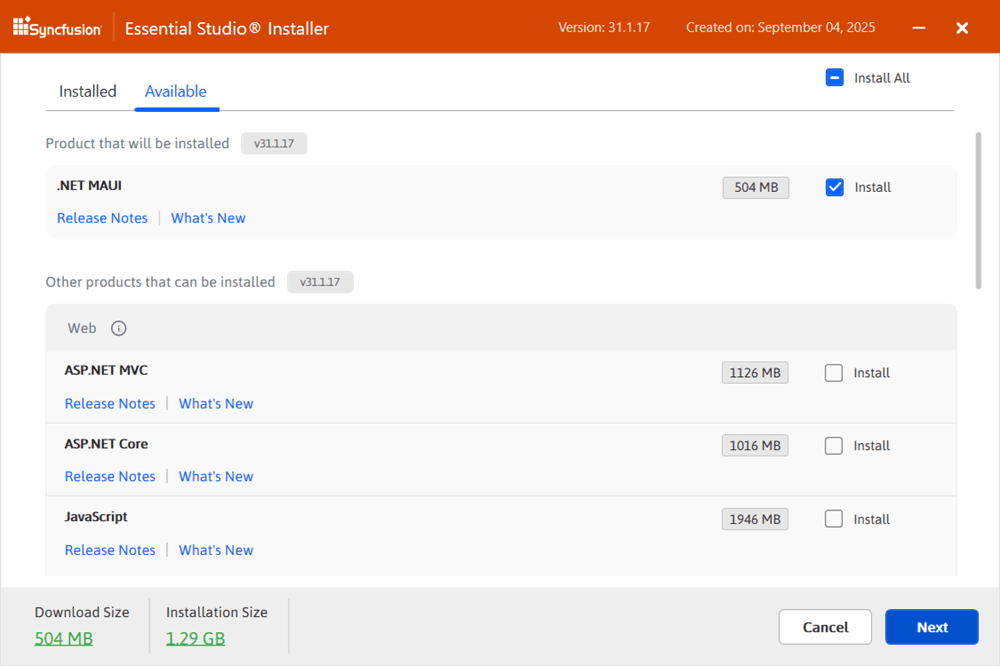
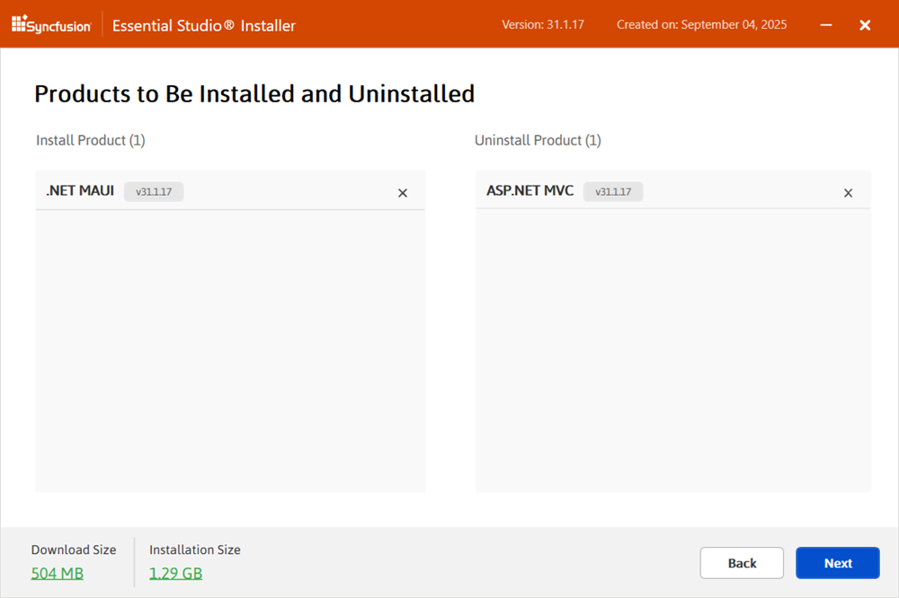
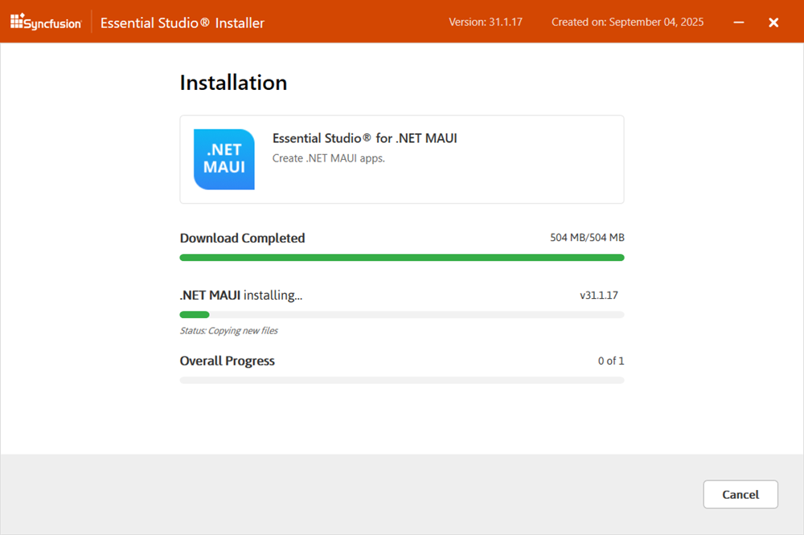
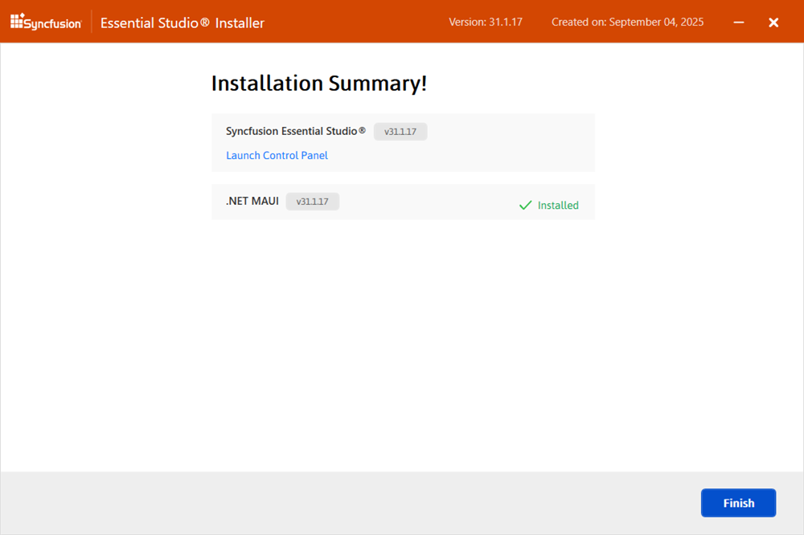
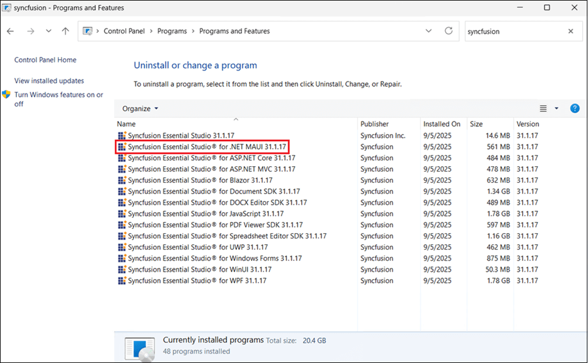
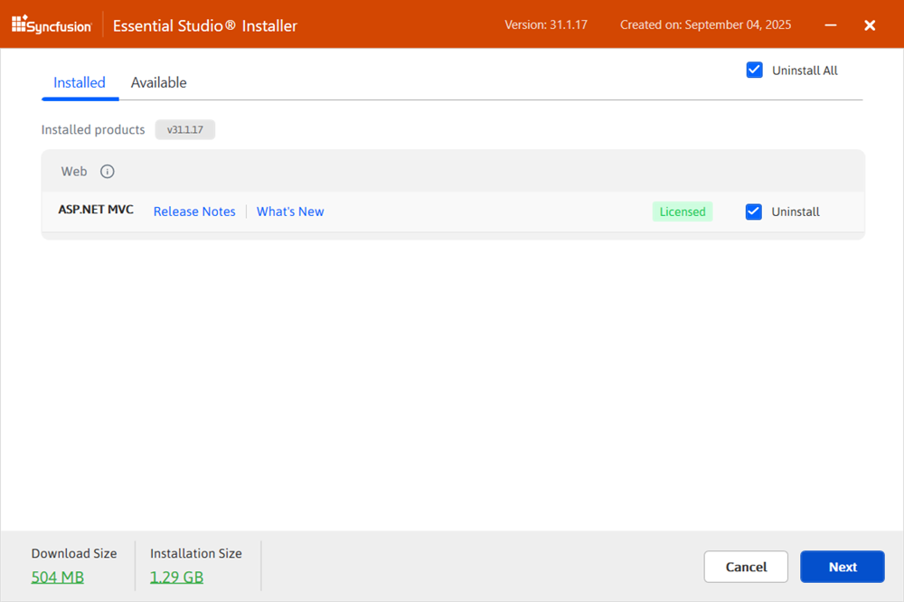
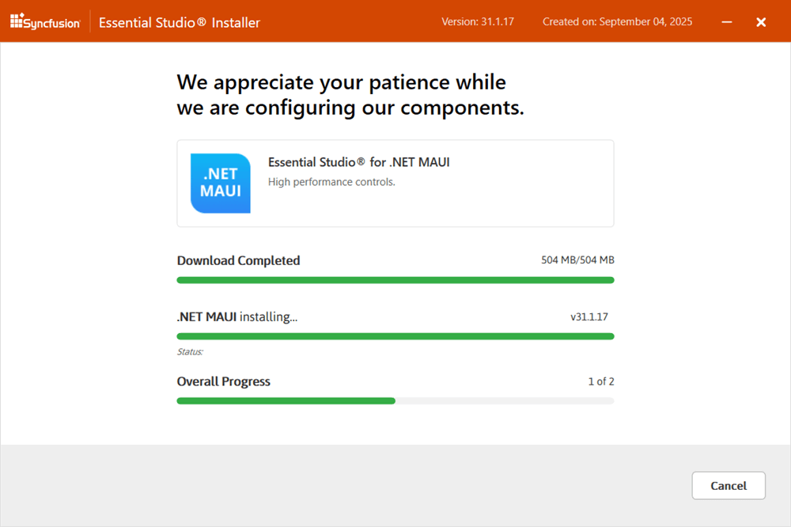

# Installing Syncfusion® .NET MAUI Web Installer

For the Essential Studio® .NET MAUI product, Syncfusion® offers a Web Installer. This installer alleviates the burden of downloading a larger installer. You can simply download and run the online installer, which will be smaller in size and will download and install the Essential Studio® products you have chosen. You can get the most recent version of Essential Studio® Web Installer [here](https://www.syncfusion.com/account/downloads). 

## Installation

Follow these steps to install the Essential Studio® .NET MAUI Web Installer:

1.  **Open installer:** Double-click the downloaded Syncfusion® Essential Studio® .NET MAUI Web Installer file to launch the Installer Wizard, which automatically extracts the package.  

    

    
    N> The installer wizard extracts the `syncfusionessentialmauiwebinstaller_{version}.exe` dialog, which displays the package's unzip operation.
    
2. 	**Welcome wizard:** The welcome dialog for the Syncfusion® .NET MAUI Web Installer will appear. Click the **Next** button.  

    

  
3.  **Platform selection wizard:** Select the products to install from the **Available** tab. Use the **Install All** checkbox to select all products.   
    
	<em>**Available**</em>
	
	
	
	If multiple products are installed in the same version, the **Installed** tab lists them. You can select which products to uninstall for the same version. Click **Next** to proceed.
	
	<em>**Installed**</em>
	
    
	
	I> If required software for the selected product isn't installed, an **Additional Software Required** alert appears. You can continue and install the necessary software later. 
	
	**Required software**
	
	
		
	
4.	**Uninstall previous versions:** If prior versions are installed for the selected products, an uninstall wizard displays a list of previously installed versions. Use the **Uninstall All** checkbox to select all versions for removal. Click **Next**.

	
	
	N> From the 2021 Volume 1 release, there is an option to uninstall previous versions from 18.1 while installing the new version.
		
5.	**Confirmation wizard:** Confirm the uninstallation of selected previous versions.  

	
	
	
6. 	**Product installation confirmation:** Modify the list of products to install/uninstall as needed and confirm.  

    
	
	N> Click the **Download Size and Installation Size** links to approximate the download and installation size.
	

7.  **Configuration wizard:** Customize download, install, and demo locations, and adjust additional settings per product. Click **Next** to install with default settings.

    
	
	**Additional settings**
	
    * Check the **Install Demos** box to install Syncfusion® samples or leave unchecked if not needed.
    * Select the **Configure Syncfusion® controls in Visual Studio** check box to configure the Syncfusion® controls in the Visual Studio toolbox, or clear this check box when you do not want to configure the Syncfusion® controls in the Visual Studio toolbox during installation. Note that you must also select the Register Syncfusion® assemblies in GAC check box when you select this check box.
    * Select the **Configure Syncfusion® Extensions controls in Visual Studio** checkbox to configure the Syncfusion® Extensions in Visual Studio or clear this check box when you do not want to configure the Syncfusion® Extensions in Visual Studio.
    * Check the **Create Desktop Shortcut** checkbox to add a desktop shortcut for Syncfusion® Control Panel.
    * Check the **Create Start Menu Shortcut** checkbox to add a shortcut to the start menu for Syncfusion® Control Panel.

8.  **License terms:** Read thoroughly and check **I agree to the License Terms and Privacy Policy**. Click **Next**.

9.  **Login:** The login wizard will appear. You must enter your Syncfusion® email address and password. If you do not already have a Syncfusion® account, you can create one by clicking on **Create an Account**. If you have forgotten your password, click **Forgot Password** to create a new one. Click the Install button. 

    
	
	I> Products will install based on your Syncfusion® License (Trial or Licensed).

10. **Progress display:** The progress of download, installation, and uninstallation will display.

    

11. **Summary wizard:** When the installation is finished, the **Summary** wizard will appear. Here you can see the list of products that have been installed successfully and those that have failed. To close the Summary wizard, click Finish. 

    
	
	* To open the Syncfusion® Control Panel, click **Launch Control Panel**.

12. **Control panel entries:** After installation, there will be two Syncfusion® control panel entries, as shown below. The Essential Studio® entry will manage all Syncfusion® products installed in the same version, while the Product entry will only uninstall the specific platform setup.

    
	
## Uninstallation

The Syncfusion® .NET MAUI installer can be uninstalled in two ways.

   * Uninstall using the Syncfusion® .NET MAUI web installer
   * Uninstall from the Windows Control Panel

Follow either option below to uninstall the Syncfusion® Essential Studio® .NET MAUI installer.
  
**Option 1: Uninstall using the Syncfusion® .NET MAUI Web installer**

Syncfusion® allows you to uninstall products of the same version directly from the Web Installer application. Select the products to be uninstalled from the list, and the Web Installer will uninstall them one by one.

	
**Option 2: Uninstall from Windows control panel**
	
You can uninstall all installed products by selecting the **Syncfusion® Essential Studio® {version}** entry (element 1 in the below screenshot) from the Windows Control Panel, or you can uninstall .NET MAUI alone by selecting the **Syncfusion® Essential Studio® for .NET MAUI {version}** entry (element 2 in the below screenshot) from the Windows Control Panel.

	
N> If the **Syncfusion® Essential Studio® for .NET MAUI {version}** entry is selected from the Windows Control Panel, only the Syncfusion® Essential Studio® .NET MAUI will be removed, and the default MSI uninstallation window will be displayed.

1.  **Welcome wizard:** The Syncfusion® .NET MAUI Web Installer's welcome wizard will be displayed. Click the **Next** button.
	
    

2.  **Platform selection wizard:** From the **Installed** tab, select the products to be uninstalled. To select all products, check the **Uninstall All** checkbox. Click the **Next** button.
    
	<em>**Installed**</em>
	
	
	
	You can also select the products to be installed from the **Available** tab.Click the Next button.
	
	<em>**Available**</em>
	
	
	
3.  If other products are selected for installation, an Uninstall previous version wizard will be displayed with previous version(s) installed for the selected products. View the list of installed previous versions for the selected products. Select the **Uninstall All** checkbox to select all versions. Click **Next**.

	
	
4.	A popup screen will be displayed to confirm the uninstallation of selected previous versions.

		
	
5.  **Confirmation wizard:** This wizard will appear with the list of products to be uninstalled/installed. You can view and modify the list of products that will be uninstalled/installed.

    
	
	N> By clicking the **Download Size and Installation** Size links, you can determine the approximate size of the download and installation
	
6.	**Configuration wizard:** Change the Download, Install, and Demos locations from here. You can also change additional settings on a product-by-product basis. Click **Next** to install with the default settings.

    
	
7.	**License terms:** After reading the License Terms and Conditions, check the **I agree to the License Terms and Privacy Policy** checkbox. Click the **Next** button.

8.	**Login wizard:** Enter your Syncfusion® email address and password. If you do not have a Syncfusion® account, you can create one by clicking on **Create an Account**. If you've forgotten your password, click **Forgot Password** to create a new one. Click the **Install** button.

    
	
	I> The products you have chosen will be installed based on your Syncfusion® License (Trial or Licensed).

9.	The download, installation, and uninstallation progress will be displayed.

    

10.	*Summary Wizard:** Once the installation is finished, the Summary wizard will appear. Here, you can see the list of products that have been successfully and unsuccessfully installed/uninstalled. Click **Finish** to close the Summary wizard.

    
	
	* To open the Syncfusion® Control Panel, click **Launch Control Panel**.