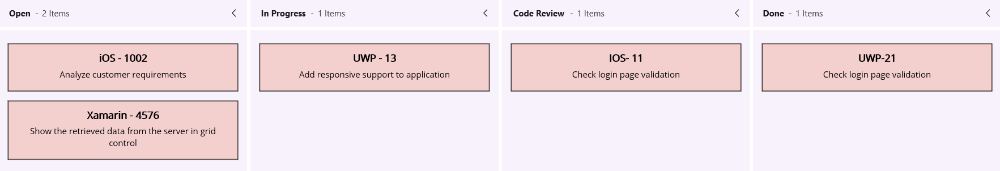

# Cards in .NET MAUI Kanban Board (SfKanban)

The default elements of a card can be customized using the following properties of [`KanbanModel`](https://help.syncfusion.com/cr/maui/Syncfusion.Maui.Kanban.KanbanModel.html).

* [`Title`](https://help.syncfusion.com/cr/maui/Syncfusion.Maui.Kanban.KanbanModel.html#Syncfusion_Maui_Kanban_KanbanModel_Title) (`string`) - Sets the title of a card.
* [`ImageURL`](https://help.syncfusion.com/cr/maui/Syncfusion.Maui.Kanban.KanbanModel.html#Syncfusion_Maui_Kanban_KanbanModel_ImageURL) (`string`) - Sets the image URL of a card. The image is displayed on the right side of the default card template.
* [`Category`](https://help.syncfusion.com/cr/maui/Syncfusion.Maui.Kanban.KanbanModel.html#Syncfusion_Maui_Kanban_KanbanModel_Category) (`object`) - Sets the category of a card. Cards are added to the corresponding column based on the category.
* [`Description`](https://help.syncfusion.com/cr/maui/Syncfusion.Maui.Kanban.KanbanModel.html#Syncfusion_Maui_Kanban_KanbanModel_Description) (`string`) - Sets the description text of a card.
* [`IndicatorFill`](https://help.syncfusion.com/cr/maui/Syncfusion.Maui.Kanban.KanbanModel.html#Syncfusion_Maui_Kanban_KanbanModel_IndicatorFill) - Used to specify the indicator color of a card.
* [`Tags`](https://help.syncfusion.com/cr/maui/Syncfusion.Maui.Kanban.KanbanModel.html#Syncfusion_Maui_Kanban_KanbanModel_Tags) (`List<string>`) - Specifies the tags of a card. Tags are displayed at the bottom of the default card template.
* [`ID`](https://help.syncfusion.com/cr/maui/Syncfusion.Maui.Kanban.KanbanModel.html#Syncfusion_Maui_Kanban_KanbanModel_ID) (`object`) - Sets the unique identifier of a card.

N> 
* The image URL can be set in two ways: using an assembly reference or a local file path. For assembly references, store the image in the `Resources/Images` folder with the `MauiImage` build action.
* When a custom data model is assigned to the [`ItemsSource`](https://help.syncfusion.com/cr/maui/Syncfusion.Maui.Kanban.SfKanban.html#Syncfusion_Maui_Kanban_SfKanban_ItemsSource) property of the [`SfKanban`](https://help.syncfusion.com/cr/maui/Syncfusion.Maui.Kanban.SfKanban.html) control, each card's `BindingContext` is set to an instance of that model. Therefore, bindings within the [`CardTemplate`](https://help.syncfusion.com/cr/maui/Syncfusion.Maui.Kanban.SfKanban.html#Syncfusion_Maui_Kanban_SfKanban_CardTemplate) must directly reference the properties defined in the custom model.
* The default card UI is not applicable when using a custom data model. To render the card content correctly, you must define a custom `DataTemplate` using the [`CardTemplate`](https://help.syncfusion.com/cr/maui/Syncfusion.Maui.Kanban.SfKanban.html#Syncfusion_Maui_Kanban_SfKanban_CardTemplate) property.



new KanbanModel()
{
    ID = 1,
    Title = "iOS - 1002",
    ImageURL = "Image1.png",
    Category = "Open",
    Description = "Analyze customer requirements",
    IndicatorFill = Colors.Red;
    Tags = new List<string> { "Incident", "Customer" }
}



## Template

You can replace the entire card template with your own design using the [`CardTemplate`](https://help.syncfusion.com/cr/maui/Syncfusion.Maui.Kanban.SfKanban.html#Syncfusion_Maui_Kanban_SfKanban_CardTemplate) property of [`SfKanban`](https://help.syncfusion.com/cr/maui/Syncfusion.Maui.Kanban.SfKanban.html). Inside the template, the `BindingContext` is the card model. The following code snippet and screenshot illustrate this.





<ContentPage xmlns="http://schemas.microsoft.com/dotnet/2021/maui"
             xmlns:x="http://schemas.microsoft.com/winfx/2009/xaml"
             xmlns:kanban="clr-namespace:Syncfusion.Maui.Kanban;assembly=Syncfusion.Maui.Kanban"
             x:Class="YourAppNamespace.MainPage">
    <kanban:SfKanban x:Name="kanban">
        <kanban:SfKanban.CardTemplate>
            <DataTemplate>
                <StackLayout WidthRequest="250" Orientation="Vertical" BackgroundColor="Gray" Padding="10,10,10,10">

                    <StackLayout Orientation="Horizontal">

                        <Label Text="{Binding Title}"
                               TextColor="Silver"
                               HorizontalOptions="StartAndExpand" />
                    </StackLayout>

                    <StackLayout Orientation="Horizontal">

                        <Label Text="{Binding Description}"
                               WidthRequest="150"
                               FontSize="14"
                               TextColor="Silver"
                               LineBreakMode="WordWrap" />
                        <Image Source="{Binding ImageURL}"
                               HeightRequest="50"
                               WidthRequest="50" />
                    </StackLayout>

                </StackLayout>
            </DataTemplate>
        </kanban:SfKanban.CardTemplate>
    </kanban:SfKanban>
</ContentPage>





var cardTemplate = new DataTemplate(() =>
{

    StackLayout root = new StackLayout()
    {
        WidthRequest = 250,
        Orientation = StackOrientation.Vertical,
        Padding = new Thickness(10),
        BackgroundColor = Colors.Gray
    };

    HorizontalStackLayout titleLayout = new HorizontalStackLayout();
    Label title = new Label()
    {
        TextColor = Colors.Silver,
        HorizontalOptions = LayoutOptions.Start
    };
    title.SetBinding(Label.TextProperty, new Binding("Title"));
    titleLayout.Children.Add(title);

    StackLayout contentLayout = new StackLayout()
    {
        Orientation = StackOrientation.Horizontal
    };
    Label desc = new Label()
    {
        WidthRequest = 150,
        FontSize = 14,
        TextColor = Colors.Silver,
        LineBreakMode = LineBreakMode.WordWrap
    };
    desc.SetBinding(Label.TextProperty, new Binding("Description"));
    Image image = new Image()
    {
        HeightRequest = 50,
        WidthRequest = 50
    };
    image.SetBinding(Image.SourceProperty, new Binding("ImageURL"));
    contentLayout.Children.Add(desc);
    contentLayout.Children.Add(image);

    root.Children.Add(titleLayout);
    root.Children.Add(contentLayout);
    return root;
});

kanban.CardTemplate = cardTemplate;





## Creating a custom model

For example, to render tasks with custom properties:

You can also map a custom data model to the Kanban control. The following steps demonstrate how to render tasks using the [.NET MAUI Kanban](https://help.syncfusion.com/cr/maui/Syncfusion.Maui.Kanban.SfKanban.html) control with corresponding custom data properties.

* **Create the data model:** Create a data model class in a new file as shown in the example below.
* **Create the view model:** Create a view model class to populate values for the properties of the model class.
* **Bind the item source:** Set the [`ItemsSource`](https://help.syncfusion.com/cr/maui/Syncfusion.Maui.Kanban.SfKanban.html#Syncfusion_Maui_Kanban_SfKanban_ItemsSource) property of [`SfKanban`](https://help.syncfusion.com/cr/maui/Syncfusion.Maui.Kanban.SfKanban.html) to the view model collection. Map the following `SfKanban` properties to the corresponding properties in `ItemsSource` when initializing the control:
  * [`ColumnMappingPath`](https://help.syncfusion.com/cr/maui/Syncfusion.Maui.Kanban.SfKanban.html#Syncfusion_Maui_Kanban_SfKanban_ColumnMappingPath) - specifies the name of the property in the data object that is used to generate columns when [`AutoGenerateColumns`](https://help.syncfusion.com/cr/maui/Syncfusion.Maui.Kanban.SfKanban.html#Syncfusion_Maui_Kanban_SfKanban_AutoGenerateColumns) is set to `true`.
* **Defining columns in the Kanban Board:** The [`Columns`](https://help.syncfusion.com/cr/maui/Syncfusion.Maui.Kanban.SfKanban.html#Syncfusion_Maui_Kanban_SfKanban_Columns) in the Kanban board are mapped based on the values of a specified property (e.g., "Status") from your custom data model. The [`ColumnMappingPath`](https://help.syncfusion.com/cr/maui/Syncfusion.Maui.Kanban.SfKanban.html#Syncfusion_Maui_Kanban_SfKanban_ColumnMappingPath) specifies the name of the property within the data object that is used to generate columns in the Kanban control when [`AutoGenerateColumns`](https://help.syncfusion.com/cr/maui/Syncfusion.Maui.Kanban.SfKanban.html#Syncfusion_Maui_Kanban_SfKanban_AutoGenerateColumns) is set to `true`.

Alternatively, you can manually define columns by setting [`AutoGenerateColumns`](https://help.syncfusion.com/cr/maui/Syncfusion.Maui.Kanban.SfKanban.html#Syncfusion_Maui_Kanban_SfKanban_AutoGenerateColumns) to `false` and adding instances of [`KanbanColumn`](https://help.syncfusion.com/cr/maui/Syncfusion.Maui.Kanban.KanbanColumn.html) to the [`Columns`](https://help.syncfusion.com/cr/maui/Syncfusion.Maui.Kanban.SfKanban.html#Syncfusion_Maui_Kanban_SfKanban_Columns) collection of [`SfKanban`](https://help.syncfusion.com/cr/maui/Syncfusion.Maui.Kanban.SfKanban.html). The Kanban control generates the columns based on the property specified in [`ColumnMappingPath`](https://help.syncfusion.com/cr/maui/Syncfusion.Maui.Kanban.SfKanban.html#Syncfusion_Maui_Kanban_SfKanban_ColumnMappingPath) and renders the corresponding cards accordingly.

The following example demonstrates this:




<ContentPage xmlns="http://schemas.microsoft.com/dotnet/2021/maui"
             xmlns:x="http://schemas.microsoft.com/winfx/2009/xaml"
             xmlns:kanban="clr-namespace:Syncfusion.Maui.Kanban;assembly=Syncfusion.Maui.Kanban"
             xmlns:local="clr-namespace:YourAppNamespace;assembly=YourAppName"
             x:Class="YourAppNamespace.MainPage">
    <ContentPage.BindingContext>
        <local:KanbanViewModel />
    </ContentPage.BindingContext>
    <kanban:SfKanban x:Name="kanban"
                     ItemsSource="{Binding TaskDetails}"
                     ColumnMappingPath="Status">
        <kanban:SfKanban.CardTemplate>
            <DataTemplate>
                <Border Stroke="Black"
                        StrokeThickness="1"
                        Background="#F3CFCE">
                    <VerticalStackLayout Margin="10">
                        <Label Text="{Binding Title}"
                               HorizontalTextAlignment="Center"
                               FontAttributes="Bold"
                               FontSize="14" />
                        <Label Text="{Binding Description}"
                               HorizontalTextAlignment="Center"
                               FontSize="12"
                               LineBreakMode="WordWrap"
                               Margin="5" />
                    </VerticalStackLayout>
                </Border>
            </DataTemplate>
        </kanban:SfKanban.CardTemplate>
    </kanban:SfKanban>
</ContentPage>




SfKanban kanban = new SfKanban();
KanbanViewModel viewModel = new KanbanViewModel();
kanban.ColumnMappingPath = "Status";
kanban.CardTemplate = new DataTemplate(() =>
{
    var titleLabel = new Label
    {
        HorizontalTextAlignment = TextAlignment.Center,
        FontAttributes = FontAttributes.Bold,
        FontSize = 14
    };

    titleLabel.SetBinding(Label.TextProperty, "Title");

    var descriptionLabel = new Label
    {
        HorizontalTextAlignment = TextAlignment.Center,
        FontSize = 12,
        LineBreakMode = LineBreakMode.WordWrap,
        Margin = new Thickness(5)
    };

    descriptionLabel.SetBinding(Label.TextProperty, "Description");

    var stackLayout = new VerticalStackLayout
    {
        Margin = new Thickness(10),
        Children = { titleLabel, descriptionLabel }
    };

    var border = new Border
    {
        Stroke = Colors.Black,
        StrokeThickness = 1,
        Background = Color.FromArgb("#F3CFCE"),
        Content = stackLayout
    };

    return border;
});

kanban.ItemsSource = viewModel.TaskDetails;
this.Content = kanban;




public class TaskDetails
{
    public string Title { get; set; }
    public string Description  { get; set; }
    public object Status { get; set; }
}




using System.Collections.ObjectModel;

public class KanbanViewModel
{
    public ObservableCollection<TaskDetails> TaskDetails { get; set; }
    public KanbanViewModel()
    {
        this.TaskDetails = this.GetTaskDetails();
    }

    private ObservableCollection<TaskDetails> GetTaskDetails()
    {
        var taskDetails = new ObservableCollection<TaskDetails>();

        TaskDetails taskDetail = new TaskDetails();
        taskDetail.Title = "UWP Issue";
        taskDetail.Description = "Sorting is not working properly in DateTimeAxis";
        taskDetail.Status = "Postponed";
        taskDetails.Add(taskDetail);

        taskDetail = new TaskDetails();
        taskDetail.Title = "WPF Issue";
        taskDetail.Description = "Crosshair label template not visible in UWP";
        taskDetail.Status = "Open";
        taskDetails.Add(taskDetail);

        taskDetail = new TaskDetails();
        taskDetail.Title = "WinUI Issue";
        taskDetail.Description = "AxisLabel cropped when rotating the axis label";
        taskDetail.Status = "In Progress";
        taskDetails.Add(taskDetail);

        taskDetail = new TaskDetails();
        taskDetail.Title = "UWP Issue";
        taskDetail.Description = "Crosshair label template not visible in UWP";
        taskDetails.Add(taskDetail);

        taskDetail = new TaskDetails();
        taskDetail.Title = "Kanban Feature";
        taskDetail.Description = "Provide drag and drop support";
        taskDetail.Status = "In Progress";
        taskDetails.Add(taskDetail);

        taskDetail = new TaskDetails();
        taskDetail.Title = "WF Issue";
        taskDetail.Description = "HorizontalAlignment for tooltip is not working";
        taskDetail.Status = "In Progress";
        taskDetails.Add(taskDetail);

        taskDetail = new TaskDetails();
        taskDetail.Title = "WPF Issue";
        taskDetail.Description = "In minimized state, first and last segments have incorrect spacing";
        taskDetail.Status = "Code Review";
        taskDetails.Add(taskDetail);

        taskDetail = new TaskDetails();
        taskDetail.Title = "WPF Issue";
        taskDetail.Description = "In minimized state, first and last segments have incorrect spacing";
        taskDetail.Status = "Code Review";
        taskDetails.Add(taskDetail);

        taskDetail = new TaskDetails();
        taskDetail.Title = "New Feature";
        taskDetail.Description = "Dragging events support for Kanban";
        taskDetail.Status = "Closed";
        taskDetails.Add(taskDetail);

        return taskDetails;
    }
}




The following screenshot illustrates the result of the above code.

N> When using a custom data model, the default card UI is not applicable. You must define a custom `DataTemplate` using the [`CardTemplate`](https://help.syncfusion.com/cr/maui/Syncfusion.Maui.Kanban.SfKanban.html#Syncfusion_Maui_Kanban_SfKanban_CardTemplate) property to render the card content appropriately.

## Data template selector

You can customize the appearance of each card with different templates based on specific constraints using [`DataTemplateSelector`](https://learn.microsoft.com/en-us/dotnet/api/microsoft.maui.controls.datatemplateselector?view=net-maui-8.0).

### Create a data template selector

Create a custom class by deriving from `DataTemplateSelector`, and override the `OnSelectTemplate` method to return the `DataTemplate` for that item. At runtime, `SfKanban` invokes the `OnSelectTemplate` method for each item, passing the data object as a parameter.





public class KanbanTemplateSelector : DataTemplateSelector
{
    private readonly DataTemplate menuTemplate;
    private readonly DataTemplate orderTemplate;
    private readonly DataTemplate readyToServeTemplate;
    private readonly DataTemplate deliveryTemplate;

    public KanbanTemplateSelector()
    {
        menuTemplate = new DataTemplate(typeof(MenuTemplate));
        orderTemplate = new DataTemplate(typeof(OrderTemplate));
        readyToServeTemplate = new DataTemplate(typeof(ReadyToServeTemplate));
        deliveryTemplate = new DataTemplate(typeof(DeliveryTemplate));
    }

    protected override DataTemplate OnSelectTemplate(object item, BindableObject container)
    {
        var data = item as CustomKanbanModel;
        if (data == null)
            return null;

        string category = data.Category?.ToString();

        return category.Equals("Menu") ? menuTemplate : 
        category.Equals("Dining") || category.Equals("Delivery") ? orderTemplate : 
        category.Equals("Ready to Serve") ? readyToServeTemplate : deliveryTemplate;
    }
}





### Applying the data template selector

Assign the custom `DataTemplateSelector` to the [`CardTemplate`](https://help.syncfusion.com/cr/maui/Syncfusion.Maui.Kanban.SfKanban.html#Syncfusion_Maui_Kanban_SfKanban_CardTemplate) of `SfKanban` in either XAML or C#.





<ContentPage xmlns="http://schemas.microsoft.com/dotnet/2021/maui"
            xmlns:x="http://schemas.microsoft.com/winfx/2009/xaml"
            x:Class="SimpleSample.MainPage"
            xmlns:kanban="clr-namespace:Syncfusion.Maui.Kanban;assembly=Syncfusion.Maui.Kanban"
            xmlns:local="clr-namespace:SimpleSample;assembly=SimpleSample">
            
    <ContentPage.Resources>
        <ResourceDictionary>
        <local:KanbanTemplateSelector x:Key="kanbanTemplateSelector" />
        </ResourceDictionary>
    </ContentPage.Resources>

    <ContentPage.BindingContext>
        <local:KanbanCustomViewModel />
    </ContentPage.BindingContext>
            
    <kanban:SfKanban x:Name="kanban" HorizontalOptions="FillAndExpand"
                    VerticalOptions="FillAndExpand" ItemsSource="{Binding Cards}"
                    CardTemplate="{StaticResource kanbanTemplateSelector}" >
                
    ...
                
    </kanban:SfKanban>

</ContentPage>





SfKanban kanban = new SfKanban();
KanbanViewModel viewModel = new KanbanViewModel();
kanban.ItemsSource = viewModel.Cards;
kanban.CardTemplate = new KanbanTemplateSelector();
this.Content = kanban;





N> When using a custom data model, the default card UI is not applicable. To render the card content, you must define a custom `DataTemplate` using the [`CardTemplate`](https://help.syncfusion.com/cr/maui/Syncfusion.Maui.Kanban.SfKanban.html#Syncfusion_Maui_Kanban_SfKanban_CardTemplate) property. For the `DataTemplateSelector` example above, define the `MenuTemplate`, `OrderTemplate`, `ReadyToServeTemplate`, `DeliveryTemplate`, and `CustomKanbanModel` classes in your project.
