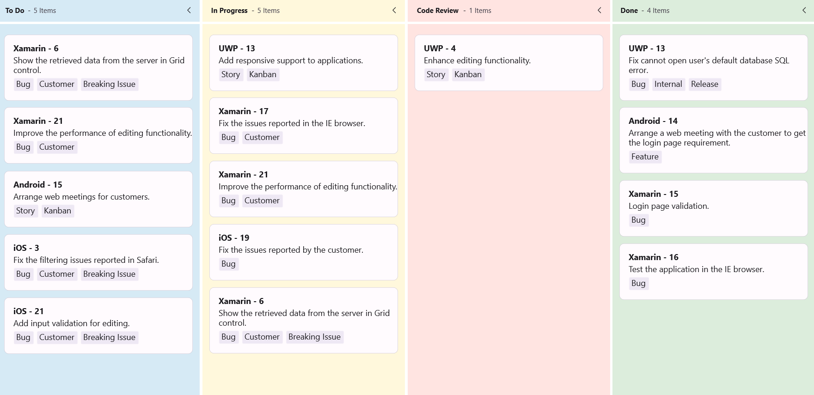
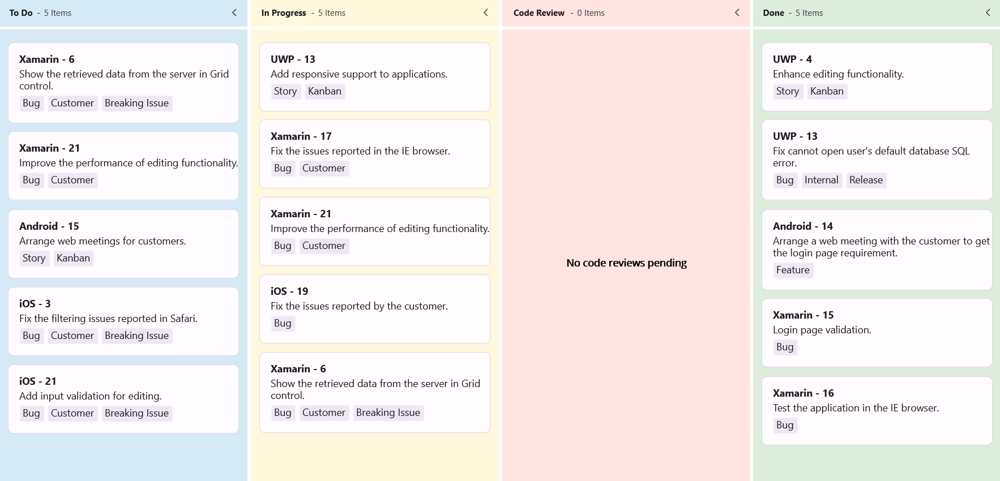
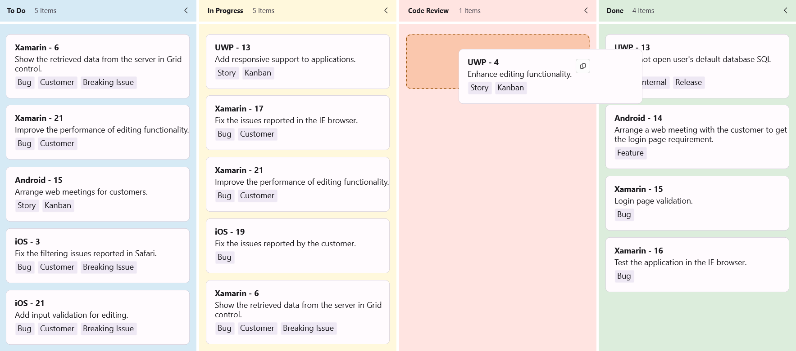

# Column in .NET MAUI Kanban Board (SfKanban)

## Customizing Column Size

By default, columns are sized automatically to present the default card elements with good readability. You can adjust this behavior using the [`MinimumColumnWidth`](https://help.syncfusion.com/cr/maui/Syncfusion.Maui.Kanban.SfKanban.html#Syncfusion_Maui_Kanban_SfKanban_MinimumColumnWidth) and [`MaximumColumnWidth`](https://help.syncfusion.com/cr/maui/Syncfusion.Maui.Kanban.SfKanban.html#Syncfusion_Maui_Kanban_SfKanban_MaximumColumnWidth) properties to define the allowable column width range.





<ContentPage xmlns="http://schemas.microsoft.com/dotnet/2021/maui"
             xmlns:x="http://schemas.microsoft.com/winfx/2009/xaml"
             xmlns:kanban="clr-namespace:Syncfusion.Maui.Kanban;assembly=Syncfusion.Maui.Kanban"
             x:Class="YourAppNamespace.MainPage">
    <kanban:SfKanban x:Name="kanban"
                     MinimumColumnWidth="300"
                     MaximumColumnWidth="340" />
</ContentPage>





using Syncfusion.Maui.Kanban;
using Microsoft.Maui.Controls;

var kanban = new SfKanban
{
    MinimumColumnWidth = 300,
    MaximumColumnWidth = 340
};
this.Content = kanban;





You can also define the exact column width using [`ColumnWidth`](https://help.syncfusion.com/cr/maui/Syncfusion.Maui.Kanban.SfKanban.html#Syncfusion_Maui_Kanban_SfKanban_ColumnWidth) property of [`SfKanban`](https://help.syncfusion.com/cr/maui/Syncfusion.Maui.Kanban.SfKanban.html).





<kanban:SfKanban x:Name="kanban" ColumnWidth="250" />





this.kanban.ColumnWidth = 250;





## Categorizing Columns

To categorize columns based on a specific property, you must explicitly define the property path using the [`ColumnMappingPath`](https://help.syncfusion.com/cr/maui/Syncfusion.Maui.Kanban.SfKanban.html#Syncfusion_Maui_Kanban_SfKanban_ColumnMappingPath) property. However, only the properties of [`KanbanModel`](https://help.syncfusion.com/cr/maui/Syncfusion.Maui.Kanban.KanbanModel.html) can be assigned to [`ColumnMappingPath`](https://help.syncfusion.com/cr/maui/Syncfusion.Maui.Kanban.SfKanban.html#Syncfusion_Maui_Kanban_SfKanban_ColumnMappingPath). By default, [`SfKanban`](https://help.syncfusion.com/cr/maui/Syncfusion.Maui.Kanban.SfKanban.html) will categorize the items using the Category property of KanbanModel.





<kanban:SfKanban x:Name="kanban" ColumnMappingPath="ID"/>





this.kanban.ColumnMappingPath = "ID";





### Category for a column

You can assign a specific category to a column by setting the [Categories](https://help.syncfusion.com/cr/maui/Syncfusion.Maui.Kanban.KanbanColumn.html#Syncfusion_Maui_Kanban_KanbanColumn_Categories) property of the [`KanbanColumn`](https://help.syncfusion.com/cr/maui/Syncfusion.Maui.Kanban.KanbanColumn.html). This will display cards with the specified category under the corresponding column. For example, to map the `In Progress` category to the `In Progress` column





<kanban:KanbanColumn x:Name="progressColumn" Categories="In Progress" />





this.progressColumn.Categories = new List<object>() { "In Progress" };





## Headers

The header displays the column [`Title`](https://help.syncfusion.com/cr/maui/Syncfusion.Maui.Kanban.KanbanColumn.html#Syncfusion_Maui_Kanban_KanbanColumn_Title) (`string`), [`ItemsCount`](https://help.syncfusion.com/cr/maui/Syncfusion.Maui.Kanban.KanbanColumn.html#Syncfusion_Maui_Kanban_KanbanColumn_ItemsCount) (`int`), [`MinimumLimit`](https://help.syncfusion.com/cr/maui/Syncfusion.Maui.Kanban.KanbanColumn.html#Syncfusion_Maui_Kanban_KanbanColumn_MinimumLimit), and [`MaximumLimit`](https://help.syncfusion.com/cr/maui/Syncfusion.Maui.Kanban.KanbanColumn.html#Syncfusion_Maui_Kanban_KanbanColumn_MaximumLimit). Use [`HeaderTemplate`](https://help.syncfusion.com/cr/maui/Syncfusion.Maui.Kanban.SfKanban.html#Syncfusion_Maui_Kanban_SfKanban_HeaderTemplate) to replace the header UI entirely. Inside the template, the `BindingContext` is the column instance. The following code snippet and screenshot illustrate this.





<kanban:SfKanban x:Name="kanban">
    <kanban:SfKanban.HeaderTemplate>
        <DataTemplate>
            <StackLayout WidthRequest="300" HeightRequest="40" BackgroundColor="Silver">
                <Label Margin="10"
                       Text="{Binding Title}"
                       TextColor="Purple"
                       HorizontalOptions="Start" />
            </StackLayout>
        </DataTemplate>
    </kanban:SfKanban.HeaderTemplate>
</kanban:SfKanban>





var kanban = new SfKanban();
var headerTemplate = new DataTemplate(() =>
{
    var root = new StackLayout
    {
        WidthRequest = 300,
        HeightRequest = 40,
        BackgroundColor = Color.Silver
    };
    var label = new Label
    {
        Margin = new Thickness(10),
        TextColor = Color.Purple,
        HorizontalOptions = LayoutOptions.Start
    };
    label.SetBinding(Label.TextProperty, new Binding("Title"));
    root.Children.Add(label);
    return root;
});

kanban.HeaderTemplate = headerTemplate;
this.Content = kanban;





## Expand/Collapse Column

Tap the toggle button in the top-right corner of a column header to expand or collapse the column. Use the [`IsExpanded`](https://help.syncfusion.com/cr/maui/Syncfusion.Maui.Kanban.KanbanColumn.html#Syncfusion_Maui_Kanban_KanbanColumn_IsExpanded) property (`bool`, default `true`) of [`KanbanColumn`](https://help.syncfusion.com/cr/maui/Syncfusion.Maui.Kanban.KanbanColumn.html) to programmatically expand or collapse the column. The property is bindable and reflects the current toggle state. The following code example shows this behavior.





<kanban:SfKanban x:Name="kanban" AutoGenerateColumns="False">
    <kanban:SfKanban.Columns>
        <kanban:KanbanColumn x:Name="column1" Title="To Do" IsExpanded="False" />
        <kanban:KanbanColumn x:Name="column2" Title="In Progress" IsExpanded="False" />
    </kanban:SfKanban.Columns>
</kanban:SfKanban>





var kanban = new SfKanban { AutoGenerateColumns = false };
KanbanColumn column1 = new KanbanColumn { Title = "To Do", IsExpanded = false };
KanbanColumn column2 = new KanbanColumn { Title = "In Progress", IsExpanded = false };
kanban.Columns.Add(column1);
kanban.Columns.Add(column2);
this.Content = kanban;





## Enable/Disable Drag & Drop

Enable or disable drag-and-drop operations for a particular column using the [`AllowDrag`](https://help.syncfusion.com/cr/maui/Syncfusion.Maui.Kanban.KanbanColumn.html#Syncfusion_Maui_Kanban_KanbanColumn_AllowDrag) and [`AllowDrop`](https://help.syncfusion.com/cr/maui/Syncfusion.Maui.Kanban.KanbanColumn.html#Syncfusion_Maui_Kanban_KanbanColumn_AllowDrop) properties (`bool`, default `true`) of [`KanbanColumn`](https://help.syncfusion.com/cr/maui/Syncfusion.Maui.Kanban.KanbanColumn.html).

The following code disables the drag operation from the `In Progress` column:





<kanban:SfKanban x:Name="kanban" AutoGenerateColumns="False">
    <kanban:SfKanban.Columns>
        <kanban:KanbanColumn Tittle="In Progress" AllowDrag="False" />
    </kanban:SfKanban.Columns>
</kanban:SfKanban>





var kanban = new SfKanban { AutoGenerateColumns = false };
var progressColumn = new KanbanColumn { Title = "In Progress", AllowDrag = false };
kanban.Columns.Add(progressColumn);
this.Content = kanban;





The following code disables the drop operation of cards into the `In Progress` column:





<kanban:SfKanban x:Name="kanban" AutoGenerateColumns="False">
    <kanban:SfKanban.Columns>
        <kanban:KanbanColumn Title="In Progress" AllowDrop="False" />
    </kanban:SfKanban.Columns>
</kanban:SfKanban>





var kanban = new SfKanban { AutoGenerateColumns = false };
var progressColumn = new KanbanColumn { Title = "In Progress", AllowDrop = false };
kanban.Columns.Add(progressColumn);
this.Content = kanban;





## Items Count

Use the [`ItemsCount`](https://help.syncfusion.com/cr/maui/Syncfusion.Maui.Kanban.KanbanColumn.html#Syncfusion_Maui_Kanban_KanbanColumn_ItemsCount) property (`int`) to get the total number of cards in a column. The value updates as cards are added, removed, or moved between columns.



int count = todoColumn.ItemsCount;



## Work In-Progress Limit

Use the [`MinimumLimit`](https://help.syncfusion.com/cr/maui/Syncfusion.Maui.Kanban.KanbanColumn.html#Syncfusion_Maui_Kanban_KanbanColumn_MinimumLimit) and [`MaximumLimit`](https://help.syncfusion.com/cr/maui/Syncfusion.Maui.Kanban.KanbanColumn.html#Syncfusion_Maui_Kanban_KanbanColumn_MaximumLimit) properties (`int`, default `0` meaning "no limit") to define the minimum and maximum number of items in a column. If the number of items exceeds `MaximumLimit` or falls below `MinimumLimit`, error bars indicate the violation. The following properties of [`ErrorBarSettings`](https://help.syncfusion.com/cr/maui/Syncfusion.Maui.Kanban.KanbanColumn.html#Syncfusion_Maui_Kanban_KanbanColumn_ErrorBarSettings) customize the appearance of the error bar:

* [Fill](https://help.syncfusion.com/cr/maui/Syncfusion.Maui.Kanban.KanbanErrorBarSettings.html#Syncfusion_Maui_Kanban_KanbanErrorBarSettings_Fill), of type `Brush`, used to change the default color of the error bar.
* [MaxValidationFill](https://help.syncfusion.com/cr/maui/Syncfusion.Maui.Kanban.KanbanErrorBarSettings.html#Syncfusion_Maui_Kanban_KanbanErrorBarSettings_MaxValidationFill), of type `Brush`, used to change the maximum validation color of the error bar.
* [MinValidationFill](https://help.syncfusion.com/cr/maui/Syncfusion.Maui.Kanban.KanbanErrorBarSettings.html#Syncfusion_Maui_Kanban_KanbanErrorBarSettings_MinValidationFill), of type `Brush`, used to change the minimum validation color of the error bar.
* [Height](https://help.syncfusion.com/cr/maui/Syncfusion.Maui.Kanban.KanbanErrorBarSettings.html#Syncfusion_Maui_Kanban_KanbanErrorBarSettings_Height),of type `double`, used to change the height of the error bar.





<kanban:KanbanColumn x:Name="todoColumn" Title="To Do" MinimumLimit="3" MaximumLimit="5" />





todoColumn.MinimumLimit = 3;
todoColumn.MaximumLimit = 5;
kanban.Columns.Add(todoColumn);









<kanban:KanbanColumn x:Name="todoColumn" Title="To Do" MinimumLimit="3" MaximumLimit="5">
    <kanban:KanbanColumn.ErrorBarSettings>
        <kanban:KanbanErrorBarSettings Fill="Green" MinValidationFill="Orange" MaxValidationFill="Red" Height="4" />
    </kanban:KanbanColumn.ErrorBarSettings>
</kanban:KanbanColumn>





KanbanColumn todoColumn = new KanbanColumn
{
    Title = "To Do",
    MaximumLimit = 5,
    MinimumLimit = 3
};
KanbanErrorBarSettings kanbanErrorBarSettings = new KanbanErrorBarSettings
{
    Fill = Colors.Green,
    MaxValidationFill = Colors.Red,
    MinValidationFill = Colors.Orange,
    Height = 4,
};
todoColumn.ErrorBarSettings = kanbanErrorBarSettings;
kanban.Columns.Add(todoColumn);





## Customize column appearance

Use the following options to customize the appearance of each column: the column background, the placeholder style, and the UI shown when no cards are present.

### Customize the column background

To change the background color of a column, use the [`Background`](https://help.syncfusion.com/cr/maui/Syncfusion.Maui.Kanban.KanbanColumn.html#Syncfusion_Maui_Kanban_KanbanColumn_Background) property of the [`KanbanColumn`](https://help.syncfusion.com/cr/maui/Syncfusion.Maui.Kanban.KanbanColumn.html) class. This allows you to visually differentiate columns based on their status.




<ContentPage xmlns="http://schemas.microsoft.com/dotnet/2021/maui"
             xmlns:x="http://schemas.microsoft.com/winfx/2009/xaml"
             xmlns:kanban="clr-namespace:Syncfusion.Maui.Kanban;assembly=Syncfusion.Maui.Kanban"
             xmlns:local="clr-namespace:YourAppNamespace;assembly=YourAppName"
             x:Class="YourAppNamespace.MainPage">
    <ContentPage.BindingContext>
        <local:KanbanViewModel />
    </ContentPage.BindingContext>
    <kanban:SfKanban x:Name="kanban"
                     AutoGenerateColumns="False"
                     ItemsSource="{Binding Cards}">
        <kanban:SfKanban.Columns>
            <kanban:KanbanColumn Title="To Do"
                                 Categories="Open,Postponed"
                                 Background="#D6EAF5" />
            <kanban:KanbanColumn Title="In Progress"
                                 Categories="In Progress"
                                 Background="#FFF8DC" />
            <kanban:KanbanColumn Title="Code Review"
                                 Categories="Code Review"
                                 Background="#FFE4E1" />
            <kanban:KanbanColumn Title="Done"
                                 Categories="Closed"
                                 Background="#DCEDDC" />
        </kanban:SfKanban.Columns>
    </kanban:SfKanban>
</ContentPage>




using Syncfusion.Maui.Kanban;
using Microsoft.Maui.Controls;
using Microsoft.Maui.Graphics;

var kanban = new SfKanban
{
    AutoGenerateColumns = false,
    ItemsSource = new KanbanViewModel().Cards
};

kanban.Columns.Add(new KanbanColumn
{
    Title = "To Do",
    Categories = new List<object> { "Open", "Postponed" },
    Background = Color.FromArgb("#D6EAF5")
});

kanban.Columns.Add(new KanbanColumn
{
    Title = "In Progress",
    Categories = new List<object> { "In Progress" },
    Background = Color.FromArgb("#FFF8DC")
});

kanban.Columns.Add(new KanbanColumn
{
    Title = "Code Review",
    Categories = new List<object> { "Code Review" },
    Background = Color.FromArgb("#FFE4E1")
});

kanban.Columns.Add(new KanbanColumn
{
    Title = "Done",
    Categories = new List<object> { "Closed" },
    Background = Color.FromArgb("#DCEDDC")
});

this.Content = kanban;




using System.Collections.ObjectModel;
using Syncfusion.Maui.Kanban;

public class KanbanViewModel
{
    public KanbanViewModel()
    {
        this.Cards = this.GetCardDetails();
    }

    public ObservableCollection<KanbanModel> Cards { get; set; }
    private ObservableCollection<KanbanModel> GetCardDetails()
    {
        var cardsDetails = new ObservableCollection<KanbanModel>();
        cardsDetails.Add(new KanbanModel()
        {
            ID = 6,
            Title = "Xamarin - 6",
            Category = "Open",
            Description = "Show the retrieved data from the server in Grid control.",
            IndicatorFill = Colors.Red,
            Tags = new List<string> { "Bug", "Customer", "Breaking Issue" }
        });

        cardsDetails.Add(new KanbanModel()
        {
            ID = 21,
            Title = "Xamarin - 21",
            Category = "Open",
            Description = "Improve the performance of editing functionality.",
            IndicatorFill = Colors.Purple,
            Tags = new List<string> { "Bug", "Customer" }
        });

        cardsDetails.Add(new KanbanModel()
        {
            ID = 3,
            Title = "iOS - 3",
            Category = "Postponed",
            Description = "Fix the filtering issues reported in Safari.",
            IndicatorFill = new SolidColorBrush(Colors.Red),
            Tags = new List<string> { "Bug", "Customer", "Breaking Issue" }
        });

        cardsDetails.Add(new KanbanModel()
        {
            ID = 11,
            Title = "iOS - 21",
            Category = "Postponed",
            Description = "Add input validation for editing.",
            IndicatorFill = new SolidColorBrush(Colors.Red),
            Tags = new List<string> { "Bug", "Customer", "Breaking Issue" }
        });

        cardsDetails.Add(new KanbanModel()
        {
            ID = 15,
            Title = "Android - 15",
            Category = "Open",
            Description = "Arrange web meetings for customers.",
            IndicatorFill = Colors.Red,
            Tags = new List<string> { "Story", "Kanban" }
        });

        cardsDetails.Add(new KanbanModel()
        {
            ID = 4,
            Title = "UWP - 4",
            Category = "Code Review",
            Description = "Enhance editing functionality.",
            IndicatorFill = Colors.Brown,
            Tags = new List<string> { "Story", "Kanban" }
        });

        cardsDetails.Add(new KanbanModel()
        {
            ID = 13,
            Title = "UWP - 13",
            Category = "In Progress",
            Description = "Add responsive support to applications.",
            IndicatorFill = Colors.Brown,
            Tags = new List<string> { "Story", "Kanban" }
        });

        cardsDetails.Add(new KanbanModel()
        {
            ID = 17,
            Title = "Xamarin - 17",
            Category = "In Progress",
            Description = "Fix the issues reported in the IE browser.",
            IndicatorFill = Colors.Brown,
            Tags = new List<string> { "Bug", "Customer" }
        });

        cardsDetails.Add(new KanbanModel()
        {
            ID = 21,
            Title = "Xamarin - 21",
            Category = "In Progress",
            Description = "Improve the performance of editing functionality.",
            IndicatorFill = Colors.Purple,
            Tags = new List<string> { "Bug", "Customer" }
        });

        cardsDetails.Add(new KanbanModel()
        {
            ID = 19,
            Title = "iOS - 19",
            Category = "In Progress",
            Description = "Fix the issues reported by the customer.",
            IndicatorFill = Colors.Purple,
            Tags = new List<string> { "Bug" }
        });

        cardsDetails.Add(new KanbanModel()
        {
            ID = 6,
            Title = "Xamarin - 6",
            Category = "In Progress",
            Description = "Show the retrieved data from the server in Grid control.",
            IndicatorFill = Colors.Red,
            Tags = new List<string> { "Bug", "Customer", "Breaking Issue" }
        });

        cardsDetails.Add(new KanbanModel()
        {
            ID = 13,
            Title = "UWP - 13",
            Category = "Closed",
            Description = "Fix cannot open user's default database SQL error.",
            IndicatorFill = Colors.Purple,
            Tags = new List<string> { "Bug", "Internal", "Release" }
        });

        cardsDetails.Add(new KanbanModel()
        {
            ID = 14,
            Title = "Android - 14",
            Category = "Closed",
            Description = "Arrange a web meeting with the customer to get the login page requirement.",
            IndicatorFill = Colors.Red,
            Tags = new List<string> { "Feature" }
        });

        cardsDetails.Add(new KanbanModel()
        {
            ID = 15,
            Title = "Xamarin - 15",
            Category = "Closed",
            Description = "Login page validation.",
            IndicatorFill = Colors.Red,
            Tags = new List<string> { "Bug" }
        });

        cardsDetails.Add(new KanbanModel()
        {
            ID = 16,
            Title = "Xamarin - 16",
            Category = "Closed",
            Description = "Test the application in the IE browser.",
            IndicatorFill = Colors.Purple,
            Tags = new List<string> { "Bug" }
        });

        return cardsDetails;
    }
}




### Customize no card appearance using DataTemplate

Use the [`NoCardTemplate`](https://help.syncfusion.com/cr/maui/Syncfusion.Maui.Kanban.KanbanColumn.html#Syncfusion_Maui_Kanban_KanbanColumn_NoCardTemplate) property of [`KanbanColumn`](https://help.syncfusion.com/cr/maui/Syncfusion.Maui.Kanban.KanbanColumn.html) to define a custom UI for empty columns. The template is rendered only when the column's `ItemsCount` equals `0`. This feature helps you display meaningful messages or visuals when a column is empty, improving the user experience.

The following example shows how to define a custom **no card** template using a `DataTemplate`.




<kanban:SfKanban x:Name="kanban"
                 AutoGenerateColumns="False"
                 ItemsSource="{Binding Cards}">
    <kanban:SfKanban.BindingContext>
        <local:KanbanViewModel />
    </kanban:SfKanban.BindingContext>
    <kanban:KanbanColumn Title="To Do"
                         Categories="Open,Postponed"
                         Background="#D6EAF5"/>
    <kanban:KanbanColumn Title="In Progress"
                         Categories="In Progress"
                         Background="#FFF8DC"/>
    <kanban:KanbanColumn Title="Code Review"
                         Categories="Code Review"
                         Background="#FFE4E1">
        <kanban:KanbanColumn.NoCardTemplate>
            <DataTemplate>
                <VerticalStackLayout VerticalOptions="Center">
                    <Label Text="No code reviews pending"
                           Margin="0,8,0,0"
                           HorizontalOptions="Center"
                           VerticalOptions="Center"
                           FontSize="14"
                           FontAttributes="Bold"
                           TextColor="#000000" />
                </VerticalStackLayout>
            </DataTemplate>
        </kanban:KanbanColumn.NoCardTemplate>
    </kanban:KanbanColumn>
    <kanban:KanbanColumn Title="Done"
                         Categories="Closed"
                         Background="#DCEDDC"/>
</kanban:SfKanban>




SfKanban kanban = new SfKanban();
KanbanViewModel viewModel = new KanbanViewModel();
kanban.AutoGenerateColumns = false;

kanban.Columns.Add(new KanbanColumn
{
    Title = "To Do",
    Categories = new List<object> { "Open", "Postponed" },
    Background = Color.FromArgb("#D6EAF5")
});

kanban.Columns.Add(new KanbanColumn
{
    Title = "In Progress",
    Categories = new List<object> { "In Progress" },
    Background = Color.FromArgb("#FFF8DC")
});

kanban.Columns.Add(new KanbanColumn
{
    Title = "Code Review",
    Categories = new List<object> { "Code Review" },
    Background = Color.FromArgb("#FFE4E1"),
    NoCardTemplate = new DataTemplate(() =>
    {
        return new VerticalStackLayout
        {
            VerticalOptions = LayoutOptions.Center,
            Children =
            {
                new Label
                {
                    Text = "No code reviews pending",
                    Margin = new Thickness(0, 8, 0, 0),
                    HorizontalOptions = LayoutOptions.Center,
                    VerticalOptions = LayoutOptions.Center,
                    FontSize = 14,
                    FontAttributes = FontAttributes.Bold,
                    TextColor = Colors.Black
                }
            }
        };
    })
});

kanban.Columns.Add(new KanbanColumn
{
    Title = "Done",
    Categories = new List<object> { "Closed" },
    Background = Color.FromArgb("#DCEDDC")
});

kanban.ItemsSource = viewModel.Cards;
this.Content = kanban;




public class KanbanViewModel
{
    public KanbanViewModel()
    {
        this.Cards = this.GetCardDetails();
    }

    public ObservableCollection<KanbanModel> Cards { get; set; }
    private ObservableCollection<KanbanModel> GetCardDetails()
    {
        var cardsDetails = new ObservableCollection<KanbanModel>();
        cardsDetails.Add(new KanbanModel()
        {
            ID = 6,
            Title = "Xamarin - 6",
            Category = "Open",
            Description = "Show the retrieved data from the server in Grid control.",
            IndicatorFill = Colors.Red,
            Tags = new List<string> { "Bug", "Customer", "Breaking Issue" }
        });

        cardsDetails.Add(new KanbanModel()
        {
            ID = 21,
            Title = "Xamarin - 21",
            Category = "Open",
            Description = "Improve the performance of editing functionality.",
            IndicatorFill = Colors.Purple,
            Tags = new List<string> { "Bug", "Customer" }
        });

        cardsDetails.Add(new KanbanModel()
        {
            ID = 3,
            Title = "iOS - 3",
            Category = "Postponed",
            Description = "Fix the filtering issues reported in Safari.",
            IndicatorFill = Colors.Red,
            Tags = new List<string> { "Bug", "Customer", "Breaking Issue" }
        });

        cardsDetails.Add(new KanbanModel()
        {
            ID = 11,
            Title = "iOS - 21",
            Category = "Postponed",
            Description = "Add input validation for editing.",
            IndicatorFill = Colors.Red,
            Tags = new List<string> { "Bug", "Customer", "Breaking Issue" }
        });

        cardsDetails.Add(new KanbanModel()
        {
            ID = 15,
            Title = "Android - 15",
            Category = "Open",
            Description = "Arrange web meetings for customers.",
            IndicatorFill = Colors.Red,
            Tags = new List<string> { "Story", "Kanban" }
        });

        cardsDetails.Add(new KanbanModel()
        {
            ID = 4,
            Title = "UWP - 4",
            Category = "Code Review",
            Description = "Enhance editing functionality.",
            IndicatorFill = Colors.Brown,
            Tags = new List<string> { "Story", "Kanban" }
        });

        cardsDetails.Add(new KanbanModel()
        {
            ID = 13,
            Title = "UWP - 13",
            Category = "In Progress",
            Description = "Add responsive support to applications.",
            IndicatorFill = Colors.Brown,
            Tags = new List<string> { "Story", "Kanban" }
        });

        cardsDetails.Add(new KanbanModel()
        {
            ID = 17,
            Title = "Xamarin - 17",
            Category = "In Progress",
            Description = "Fix the issues reported in the IE browser.",
            IndicatorFill = Colors.Brown,
            Tags = new List<string> { "Bug", "Customer" }
        });

        cardsDetails.Add(new KanbanModel()
        {
            ID = 21,
            Title = "Xamarin - 21",
            Category = "In Progress",
            Description = "Improve the performance of editing functionality.",
            IndicatorFill = Colors.Purple,
            Tags = new List<string> { "Bug", "Customer" }
        });

        cardsDetails.Add(new KanbanModel()
        {
            ID = 19,
            Title = "iOS - 19",
            Category = "In Progress",
            Description = "Fix the issues reported by the customer.",
            IndicatorFill = Colors.Purple,
            Tags = new List<string> { "Bug" }
        });

        cardsDetails.Add(new KanbanModel()
        {
        	ID = 6,
            Title = "Xamarin - 6",
            Category = "In Progress",
            Description = "Show the retrieved data from the server in Grid control.",
            IndicatorFill = Colors.Red,
            Tags = new List<string> { "Bug", "Customer", "Breaking Issue" }
        });

        cardsDetails.Add(new KanbanModel()
        {
            ID = 13,
            Title = "UWP - 13",
            Category = "Closed",
            Description = "Fix cannot open user's default database SQL error.",
            IndicatorFill = Colors.Purple,
            Tags = new List<string> { "Bug", "Internal", "Release" }
        });

        cardsDetails.Add(new KanbanModel()
        {
            ID = 14,
            Title = "Android - 14",
            Category = "Closed",
            Description = "Arrange a web meeting with the customer to get the login page requirement.",
            IndicatorFill = Colors.Red,
            Tags = new List<string> { "Feature" }
        });

        cardsDetails.Add(new KanbanModel()
        {
            ID = 15,
            Title = "Xamarin - 15",
            Category = "Closed",
            Description = "Login page validation.",
            IndicatorFill = Colors.Red,
            Tags = new List<string> { "Bug" }
        });

        cardsDetails.Add(new KanbanModel()
        {
            ID = 16,
            Title = "Xamarin - 16",
            Category = "Closed",
            Description = "Test the application in the IE browser.",
            IndicatorFill = Colors.Purple,
            Tags = new List<string> { "Bug" }
        });

        return cardsDetails;
    }
}




### Customize the placeholder style

The .NET MAUI Kanban control supports styling the placeholder area, where cards can be dropped during drag-and-drop operations using the [`PlaceholderStyle`](https://help.syncfusion.com/cr/maui/Syncfusion.Maui.Kanban.KanbanColumn.html#Syncfusion_Maui_Kanban_KanbanColumn_PlaceholderStyle) property of the [`KanbanColumn`](https://help.syncfusion.com/cr/maui/Syncfusion.Maui.Kanban.KanbanColumn.html). This customization enhances visual clarity and improves the user experience during interactions.




<ContentPage xmlns="http://schemas.microsoft.com/dotnet/2021/maui"
             xmlns:x="http://schemas.microsoft.com/winfx/2009/xaml"
             xmlns:kanban="clr-namespace:Syncfusion.Maui.Kanban;assembly=Syncfusion.Maui.Kanban"
             xmlns:local="clr-namespace:YourAppNamespace;assembly=YourAppName"
             x:Class="YourAppNamespace.MainPage">
    <ContentPage.BindingContext>
        <local:KanbanViewModel />
    </ContentPage.BindingContext>
    <kanban:SfKanban x:Name="kanban"
                     AutoGenerateColumns="False"
                     ItemsSource="{Binding Cards}">
        <kanban:SfKanban.Resources>
            <kanban:KanbanPlaceholderStyle x:Key="PlaceholderStyle"
                                           Background="#FAC7AD"
                                           SelectionIndicatorBackground="#FAC7AD"
                                           SelectionIndicatorStroke="#914C00">
                <kanban:KanbanPlaceholderStyle.SelectionIndicatorTextStyle>
                    <kanban:KanbanTextStyle TextColor="#914C00" />
                </kanban:KanbanPlaceholderStyle.SelectionIndicatorTextStyle>
            </kanban:KanbanPlaceholderStyle>
        </kanban:SfKanban.Resources>
        <kanban:SfKanban.Columns>
            <kanban:KanbanColumn Title="To Do"
                                 Categories="Open,Postponed"
                                 Background="#D6EAF5"
                                 PlaceholderStyle="{StaticResource PlaceholderStyle}" />
            <kanban:KanbanColumn Title="In Progress"
                                 Categories="In Progress"
                                 Background="#FFF8DC"
                                 PlaceholderStyle="{StaticResource PlaceholderStyle}" />
            <kanban:KanbanColumn Title="Code Review"
                                 Categories="Code Review"
                                 Background="#FFE4E1"
                                 PlaceholderStyle="{StaticResource PlaceholderStyle}" />
            <kanban:KanbanColumn Title="Done"
                                 Categories="Closed"
                                 Background="#DCEDDC"
                                 PlaceholderStyle="{StaticResource PlaceholderStyle}" />
        </kanban:SfKanban.Columns>
    </kanban:SfKanban>
</ContentPage>




using Syncfusion.Maui.Kanban;
using Microsoft.Maui.Controls;
using Microsoft.Maui.Graphics;

var kanban = new SfKanban
{
    AutoGenerateColumns = false,
    ItemsSource = new KanbanViewModel().Cards
};

var placeholderStyle = new KanbanPlaceholderStyle
{
    Background = Color.FromArgb("#FAC7AD"),
    SelectionIndicatorBackground = Color.FromArgb("#FAC7AD"),
    SelectionIndicatorStroke = Color.FromArgb("#914C00"),
    SelectionIndicatorTextStyle = new KanbanTextStyle
    {
        TextColor = Color.FromArgb("#914C00")
    }
};

kanban.Columns.Add(new KanbanColumn
{
    Title = "To Do",
    Categories = new List<object> { "Open", "Postponed" },
    Background = Color.FromArgb("#D6EAF5"),
    PlaceholderStyle = placeholderStyle
});

kanban.Columns.Add(new KanbanColumn
{
    Title = "In Progress",
    Categories = new List<object> { "In Progress" },
    Background = Color.FromArgb("#FFF8DC"),
    PlaceholderStyle = placeholderStyle
});

kanban.Columns.Add(new KanbanColumn
{
    Title = "Code Review",
    Categories = new List<object> { "Code Review" },
    Background = Color.FromArgb("#FFE4E1"),
    PlaceholderStyle = placeholderStyle
});

kanban.Columns.Add(new KanbanColumn
{
    Title = "Done",
    Categories = new List<object> { "Closed" },
    Background = Color.FromArgb("#DCEDDC"),
    PlaceholderStyle = placeholderStyle
});

this.Content = kanban;




using System.Collections.ObjectModel;
using Syncfusion.Maui.Kanban;

public class KanbanViewModel
{
    public ObservableCollection<KanbanModel> Cards { get; set; }
    public KanbanViewModel()
    {
        Cards = new ObservableCollection<KanbanModel>();
        Cards.Add(new KanbanModel()
        {
            ID = 1,
            Title = "iOS - 1002",
            Category = "Open",
            Description = "Analyze customer requirements",
            IndicatorFill = Colors.Red,
            Tags = new List<string> { "Incident", "Customer" }
        });

        Cards.Add(new KanbanModel()
        {
            ID = 6,
            Title = "Xamarin - 4576",
            Category = "Open",
            Description = "Show the retrieved data from the server in grid control",
            IndicatorFill = Colors.Green,
            Tags = new List<string> { "Story", "Customer" }
        });

        Cards.Add(new KanbanModel()
        {
            ID = 13,
            Title = "UWP - 13",
            Category = "In Progress",
            Description = "Add responsive support to application",
            IndicatorFill = Colors.Brown,
            Tags = new List<string> { "Story", "Customer" }
        });

        Cards.Add(new KanbanModel()
        {
            ID = 2543,
            Title = "IOS- 11",
            Category = "Code Review",
            Description = "Check login page validation",
            IndicatorFill = Colors.Brown,
            Tags = new List<string> { "Story", "Customer" }
        });

        Cards.Add(new KanbanModel()
        {
            ID = 123,
            Title = "UWP-21",
            Category = "Done",
            Description = "Check login page validation",
            IndicatorFill = Colors.Brown,
            Tags = new List<string> { "Story", "Customer" }
        });
    }
}




