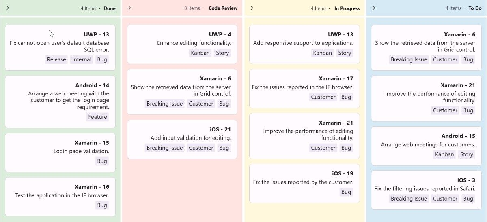

# FlowDirection in .NET MAUI Kanban

The `SfKanban` control supports customizing the layout direction using the `FlowDirection` property. This allows you to display the Kanban board in either `LeftToRight` or `RightToLeft` flow direction based on your application needs. By default, the FlowDirection is set to LeftToRight.

The following example illustrates how to apply the RightToLeft flow direction to the Kanban control.




<kanban:SfKanban x:Name="kanban"
                 AutoGenerateColumns="False"
                 ItemsSource="{Binding Cards}"
                 FlowDirection="RightToLeft" >
    <kanban:SfKanban.BindingContext>
        <local:KanbanViewModel />
    </kanban:SfKanban.BindingContext>
    <kanban:KanbanColumn Title="To Do"
                         Categories="Open,Postponed"
                         Background="#D6EAF5"/>
    <kanban:KanbanColumn Title="In Progress"
                         Categories="In Progress"
                         Background="#FFF8DC"/>
    <kanban:KanbanColumn Title="Code Review"
                         Categories="Code Review"
                         Background="#FFE4E1"/>
    <kanban:KanbanColumn Title="Done"
                         Categories="Closed"
                         Background="#DCEDDC"/>
</kanban:SfKanban>




SfKanban kanban = new SfKanban();
KanbanViewModel viewModel = new KanbanViewModel();
kanban.AutoGenerateColumns = false;
kanban.FlowDirection = FlowDirection.RightToLeft; 

kanban.Columns.Add(new KanbanColumn
{
    Title = "To Do",
    Categories = new List<object> { "Open", "Postponed" },
    Background = Color.FromArgb("#D6EAF5")
});

kanban.Columns.Add(new KanbanColumn
{
    Title = "In Progress",
    Categories = new List<object> { "In Progress" },
    Background = Color.FromArgb("#FFF8DC")
});

kanban.Columns.Add(new KanbanColumn
{
    Title = "Code Review",
    Categories = new List<object> { "Code Review" },
    Background = Color.FromArgb("#FFE4E1")
});

kanban.Columns.Add(new KanbanColumn
{
    Title = "Done",
    Categories = new List<object> { "Closed" },
    Background = Color.FromArgb("#DCEDDC")
});

kanban.ItemsSource = viewModel.Cards;
this.Content = kanban;




public class KanbanViewModel
{
    public KanbanViewModel()
    {
        this.Cards = this.GetCardDetails();
    }

    public ObservableCollection<KanbanModel> Cards { get; set; }
    private ObservableCollection<KanbanModel> GetCardDetails()
    {
        var cardsDetails = new ObservableCollection<KanbanModel>();
        cardsDetails.Add(new KanbanModel()
        {
            ID = 6,
            Title = "Xamarin - 6",
            Category = "Open",
            Description = "Show the retrieved data from the server in Grid control.",
            IndicatorFill = Colors.Red,
            Tags = new List<string> { "Bug", "Customer", "Breaking Issue" }
        });

        cardsDetails.Add(new KanbanModel()
        {
            ID = 21,
            Title = "Xamarin - 21",
            Category = "Open",
            Description = "Improve the performance of editing functionality.",
            IndicatorFill = Colors.Purple,
            Tags = new List<string> { "Bug", "Customer" }
        });

        cardsDetails.Add(new KanbanModel()
        {
            ID = 3,
            Title = "iOS - 3",
            Category = "Postponed",
            Description = "Fix the filtering issues reported in Safari.",
            IndicatorFill = Colors.Red,
            Tags = new List<string> { "Bug", "Customer", "Breaking Issue" }
        });

        cardsDetails.Add(new KanbanModel()
        {
            ID = 11,
            Title = "iOS - 21",
            Category = "Code Review",
            Description = "Add input validation for editing.",
            IndicatorFill = Colors.Red,
            Tags = new List<string> { "Bug", "Customer", "Breaking Issue" }
        });

        cardsDetails.Add(new KanbanModel()
        {
            ID = 15,
            Title = "Android - 15",
            Category = "Open",
            Description = "Arrange web meetings for customers.",
            IndicatorFill = Colors.Red,
            Tags = new List<string> { "Story", "Kanban" }
        });

        cardsDetails.Add(new KanbanModel()
        {
            ID = 4,
            Title = "UWP - 4",
            Category = "Code Review",
            Description = "Enhance editing functionality.",
            IndicatorFill = Colors.Brown,
            Tags = new List<string> { "Story", "Kanban" }
        });

        cardsDetails.Add(new KanbanModel()
        {
            ID = 13,
            Title = "UWP - 13",
            Category = "In Progress",
            Description = "Add responsive support to applications.",
            IndicatorFill = Colors.Brown,
            Tags = new List<string> { "Story", "Kanban" }
        });

        cardsDetails.Add(new KanbanModel()
        {
            ID = 17,
            Title = "Xamarin - 17",
            Category = "In Progress",
            Description = "Fix the issues reported in the IE browser.",
            IndicatorFill = Colors.Brown,
            Tags = new List<string> { "Bug", "Customer" }
        });

        cardsDetails.Add(new KanbanModel()
        {
            ID = 21,
            Title = "Xamarin - 21",
            Category = "Code Review",
            Description = "Improve the performance of editing functionality.",
            IndicatorFill = Colors.Purple,
            Tags = new List<string> { "Bug", "Customer" }
        });

        cardsDetails.Add(new KanbanModel()
        {
            ID = 19,
            Title = "iOS - 19",
            Category = "In Progress",
            Description = "Fix the issues reported by the customer.",
            IndicatorFill = Colors.Purple,
            Tags = new List<string> { "Bug" }
        });

        cardsDetails.Add(new KanbanModel()
        {
            ID = 6,
            Title = "Xamarin - 6",
            Category = "Code Review",
            Description = "Show the retrieved data from the server in Grid control.",
            IndicatorFill = Colors.Red,
            Tags = new List<string> { "Bug", "Customer", "Breaking Issue" }
        });

        cardsDetails.Add(new KanbanModel()
        {
            ID = 13,
            Title = "UWP - 13",
            Category = "Closed",
            Description = "Fix cannot open user's default database SQL error.",
            IndicatorFill = Colors.Purple,
            Tags = new List<string> { "Bug", "Internal", "Release" }
        });

        cardsDetails.Add(new KanbanModel()
        {
            ID = 14,
            Title = "Android - 14",
            Category = "Closed",
            Description = "Arrange a web meeting with the customer to get the login page requirement.",
            IndicatorFill = Colors.Red,
            Tags = new List<string> { "Feature" }
        });

        cardsDetails.Add(new KanbanModel()
        {
            ID = 15,
            Title = "Xamarin - 15",
            Category = "Closed",
            Description = "Login page validation.",
            IndicatorFill = Colors.Red,
            Tags = new List<string> { "Bug" }
        });

        cardsDetails.Add(new KanbanModel()
        {
            ID = 16,
            Title = "Xamarin - 16",
            Category = "Closed",
            Description = "Test the application in the IE browser.",
            IndicatorFill = Colors.Purple,
            Tags = new List<string> { "Bug" }
        });

        return cardsDetails;
    }
}




