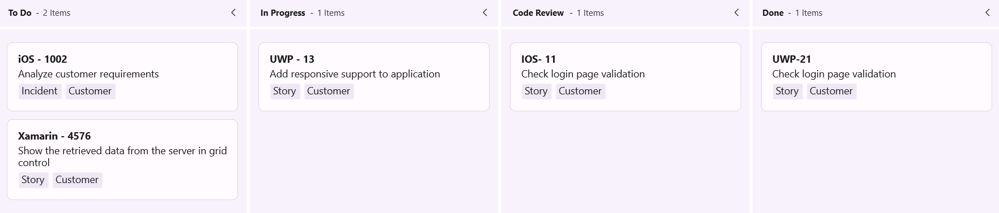
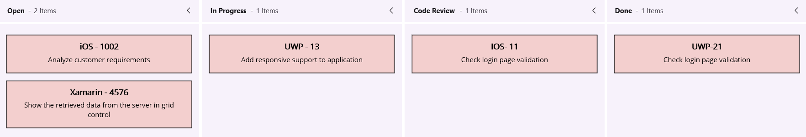

# Getting Started with .NET MAUI Kanban Board (SfKanban)

This section provides a quick overview for working with Essential® Kanban for .NET MAUI. It is an efficient way to visualize the workflow at each stage along its path to completion.

To get start quickly with our [.NET MAUI Kanban Board](https://help.syncfusion.com/cr/maui/Syncfusion.Maui.Kanban.SfKanban.html), you can check the below video.






## Prerequisites

Before proceeding, ensure that the following are set up:

1. Install [.NET 8 SDK](https://dotnet.microsoft.com/en-us/download/dotnet/8.0) or later is installed.
2. Set up a .NET MAUI environment with Visual Studio 2022 (v17.8 or later).

## Step 1: Create a new .NET MAUI project

1. Go to **File > New > Project** and choose the **.NET MAUI App** template.
2. Name the project and choose a location. Click **Next**.
3. Select the .NET framework version and click **Create**.

## Step 2: Install the Syncfusion® .NET MAUI Kanban Board NuGet Package

1. In **Solution Explorer**, right-click the project and choose **Manage NuGet Packages**.
2. Search for [Syncfusion.Maui.Kanban](https://www.nuget.org/packages/Syncfusion.Maui.Kanban/) and install the latest version.
3. Ensure the necessary dependencies are installed correctly, and the project is restored.

## Step 3: Register the handler

[Syncfusion.Maui.Core](https://www.nuget.org/packages/Syncfusion.Maui.Core) nuget is a dependent package for all Syncfusion® controls of .NET MAUI. In the **MauiProgram.cs** file, register the handler for Syncfusion® core.




using Microsoft.Maui;
using Microsoft.Maui.Hosting;
using Microsoft.Maui.Controls.Compatibility;
using Microsoft.Maui.Controls.Hosting;
using Microsoft.Maui.Controls.Xaml;
using Syncfusion.Maui.Core.Hosting;

namespace KanbanGettingStarted
{
    public static class MauiProgram
    {
        public static MauiApp CreateMauiApp()
        {
            var builder = MauiApp.CreateBuilder();
            builder
            .UseMauiApp<App>()
            .ConfigureSyncfusionCore()
            .ConfigureFonts(fonts =>
            {
                fonts.AddFont("OpenSans-Regular.ttf", "OpenSansRegular");
            });

            return builder.Build();
        }
    }
}




## Step 4: Add .NET MAUI Kanban Board Control

1. To initialize the control, import the `Syncfusion.Maui.Kanban` namespace into your code.
2. Initialize [SfKanban](https://help.syncfusion.com/cr/maui/Syncfusion.Maui.Kanban.SfKanban.html).

 


<ContentPage
    . . .    
    xmlns:kanban="clr-namespace:Syncfusion.Maui.Kanban;assembly=Syncfusion.Maui.Kanban">
    
    <kanban:SfKanban/>
    
</ContentPage>
 



You can also create the kanban board programmatically in the MainPage.xaml.cs file:

 


using Syncfusion.Maui.Kanban;
namespace KanbanGettingStarted
{
    public partial class MainPage : ContentPage
    {
        public MainPage()
        {
            InitializeComponent();           
            SfKanban kanban = new SfKanban(); 
            this.Content = kanban;
        }
    }   
}








## Prerequisites

Before proceeding, ensure that the following are set up:

1. Install [.NET 8 SDK](https://dotnet.microsoft.com/en-us/download/dotnet/8.0) or later is installed.
2. Set up a .NET MAUI environment with Visual Studio Code.
3. Ensure that the .NET MAUI extension is installed and configured as described [here.](https://learn.microsoft.com/en-us/dotnet/maui/get-started/installation?view=net-maui-8.0&tabs=visual-studio-code)

## Step 1: Create a new .NET MAUI project

1. Open the command palette by pressing `Ctrl+Shift+P` and type **.NET:New Project** and enter.
2. Choose the **.NET MAUI App** template.
3. Select the project location, type the project name and press **Enter.**
4. Then choose **Create project.**

## Step 2: Install the Syncfusion® .NET MAUI Kanban Board NuGet Package

1. Press <kbd>Ctrl</kbd> + <kbd>`</kbd> (backtick) to open the integrated terminal in Visual Studio Code.
2. Ensure you're in the project root directory where your .csproj file is located.
3. Run the command `dotnet add package Syncfusion.Maui.Kanban` to install the Syncfusion® .NET MAUI Kanban Board NuGet package.
4. To ensure all dependencies are installed, run `dotnet restore`.

## Step 3: Register the handler

[Syncfusion.Maui.Core](https://www.nuget.org/packages/Syncfusion.Maui.Core) nuget is a dependent package for all Syncfusion® controls of .NET MAUI. In the **MauiProgram.cs** file, register the handler for Syncfusion® core.




using Microsoft.Maui;
using Microsoft.Maui.Hosting;
using Microsoft.Maui.Controls.Compatibility;
using Microsoft.Maui.Controls.Hosting;
using Microsoft.Maui.Controls.Xaml;
using Syncfusion.Maui.Core.Hosting;

namespace KanbanGettingStarted
{
    public static class MauiProgram
    {
        public static MauiApp CreateMauiApp()
        {
            var builder = MauiApp.CreateBuilder();
            builder
            .UseMauiApp<App>()
            .ConfigureSyncfusionCore()
            .ConfigureFonts(fonts =>
            {
                fonts.AddFont("OpenSans-Regular.ttf", "OpenSansRegular");
            });

            return builder.Build();
        }
    }
}




## Step 4: Add .NET MAUI Kanban Board Control

1. To initialize the control, import the `Syncfusion.Maui.Kanban` namespace into your code.
2. Initialize [SfKanban](https://help.syncfusion.com/cr/maui/Syncfusion.Maui.Kanban.SfKanban.html).

 


<ContentPage
    . . .    
    xmlns:kanban="clr-namespace:Syncfusion.Maui.Kanban;assembly=Syncfusion.Maui.Kanban">
    
    <kanban:SfKanban/>
    
</ContentPage>
 



You can also create the kanban board programmatically in the **MainPage.xaml.cs** file:

 


using Syncfusion.Maui.Kanban;
namespace KanbanGettingStarted
{
    public partial class MainPage : ContentPage
    {
        public MainPage()
        {
            InitializeComponent();           
            SfKanban kanban = new SfKanban(); 
            this.Content = kanban;
        }
    }   
}








## Prerequisites

Before proceeding, ensure the following are set up:

1. Ensure you have the latest version of JetBrains Rider.
2. Install [.NET 8 SDK](https://dotnet.microsoft.com/en-us/download/dotnet/8.0) or later is installed.
3. Make sure the MAUI workloads are installed and configured as described [here.](https://www.jetbrains.com/help/rider/MAUI.html#before-you-start)

## Step 1: Create a new .NET MAUI Project

1. Go to **File > New Solution,** Select .NET (C#) and choose the .NET MAUI App template.
2. Enter the Project Name, Solution Name, and Location.
3. Select the .NET framework version and click Create.

## Step 2: Install the Syncfusion® MAUI Kanban NuGet Package

1. In **Solution Explorer,** right-click the project and choose **Manage NuGet Packages.**
2. Search for [Syncfusion.Maui.Kanban](https://www.nuget.org/packages/Syncfusion.Maui.Kanban/) and install the latest version.
3. Ensure the necessary dependencies are installed correctly, and the project is restored. If not, Open the Terminal in Rider and manually run: `dotnet restore`

## Step 3: Register the handler

[Syncfusion.Maui.Core nuget](https://www.nuget.org/packages/Syncfusion.Maui.Core) is a dependent package for all Syncfusion® controls of .NET MAUI. In the **MauiProgram.cs** file, register the handler for Syncfusion® core.




using Microsoft.Maui;
using Microsoft.Maui.Hosting;
using Microsoft.Maui.Controls.Compatibility;
using Microsoft.Maui.Controls.Hosting;
using Microsoft.Maui.Controls.Xaml;
using Syncfusion.Maui.Core.Hosting;

namespace KanbanGettingStarted
{
    public static class MauiProgram
    {
        public static MauiApp CreateMauiApp()
        {
            var builder = MauiApp.CreateBuilder();
            builder
            .UseMauiApp<App>()
            .ConfigureSyncfusionCore()
            .ConfigureFonts(fonts =>
            {
                fonts.AddFont("OpenSans-Regular.ttf", "OpenSansRegular");
            });

            return builder.Build();
        }
    }
}




## Step 4: Add .NET MAUI Kanban Board Control

1. To initialize the control, import the `Syncfusion.Maui.Kanban` namespace into your code.
2. Initialize [SfKanban](https://help.syncfusion.com/cr/maui/Syncfusion.Maui.Kanban.SfKanban.html).

 


<ContentPage
    . . .    
    xmlns:kanban="clr-namespace:Syncfusion.Maui.Kanban;assembly=Syncfusion.Maui.Kanban">
    
    <kanban:SfKanban/>
    
</ContentPage>
 



You can also create the kanban board programmatically in the MainPage.xaml.cs file:

 


using Syncfusion.Maui.Kanban;
namespace KanbanGettingStarted
{
    public partial class MainPage : ContentPage
    {
        public MainPage()
        {
            InitializeComponent();           
            SfKanban kanban = new SfKanban(); 
            this.Content = kanban;
        }
    }   
}







## Populate .NET MAUI Kanban item source

This section explains how to populate the .NET MAUI Kanban control's `ItemsSource` by creating and binding both default and custom task data models.

### Creating the default model tasks

* **Define the View Model:** Create a view model class to set values for the properties listed in the [`KanbanModel`](https://help.syncfusion.com/cr/maui/Syncfusion.Maui.Kanban.KanbanModel.html) class as shown in the following example code. Each [`KanbanModel`](https://help.syncfusion.com/cr/maui/Syncfusion.Maui.Kanban.KanbanModel.html) instance represents a card in Kanban control.

* **Bind item source for Kanban:** To populate the Kanban card items, utilize the [`ItemsSource`](https://help.syncfusion.com/cr/maui/Syncfusion.Maui.Kanban.SfKanban.html#Syncfusion_Maui_Kanban_SfKanban_ItemsSource) property of [`SfKanban`](https://help.syncfusion.com/cr/maui/Syncfusion.Maui.Kanban.SfKanban.html).

* **Defining columns in the Kanban Board:** The columns are generated automatically based on the different values of [`Category`](https://help.syncfusion.com/cr/maui/Syncfusion.Maui.Kanban.KanbanModel.html#Syncfusion_Maui_Kanban_KanbanModel_Category) in the [`KanbanModel`](https://help.syncfusion.com/cr/maui/Syncfusion.Maui.Kanban.KanbanModel.html) class from [`ItemsSource`](https://help.syncfusion.com/cr/maui/Syncfusion.Maui.Kanban.SfKanban.html#Syncfusion_Maui_Kanban_SfKanban_ItemsSource). However, you can manually define the columns by setting the [`AutoGenerateColumns`](https://help.syncfusion.com/cr/maui/Syncfusion.Maui.Kanban.SfKanban.html#Syncfusion_Maui_Kanban_SfKanban_AutoGenerateColumns) property to `false` and adding [`KanbanColumn`](https://help.syncfusion.com/cr/maui/Syncfusion.Maui.Kanban.KanbanColumn.html) instances to the [`Columns`](https://help.syncfusion.com/cr/maui/Syncfusion.Maui.Kanban.SfKanban.html#Syncfusion_Maui_Kanban_SfKanban_Columns) property of [`SfKanban`](https://help.syncfusion.com/cr/maui/Syncfusion.Maui.Kanban.SfKanban.html). Define the categories of column using the [`Categories`](https://help.syncfusion.com/cr/maui/Syncfusion.Maui.Kanban.KanbanColumn.html#Syncfusion_Maui_Kanban_KanbanColumn_Categories) property of [`KanbanColumn`](https://help.syncfusion.com/cr/maui/Syncfusion.Maui.Kanban.KanbanColumn.html), and cards will be added to the respective columns.

The following sample code demonstrates this process in action:





<kanban:SfKanban x:Name="kanban"
                 AutoGenerateColumns="False"
                 ItemsSource="{Binding Cards}">
    <kanban:SfKanban.Columns>
        <kanban:KanbanColumn Title="To Do"
                             Categories="Open">
        </kanban:KanbanColumn>
        <kanban:KanbanColumn Title="In Progress"
                             Categories="In Progress">
        </kanban:KanbanColumn>
        <kanban:KanbanColumn Title="Code Review"
                             Categories="Code Review">
        </kanban:KanbanColumn>
        <kanban:KanbanColumn Title="Done"
                             Categories="Done">
        </kanban:KanbanColumn>
    </kanban:SfKanban.Columns>
    <kanban:SfKanban.BindingContext>
        <local:KanbanViewModel />
    </kanban:SfKanban.BindingContext>
</kanban:SfKanban>




using Syncfusion.Maui.Kanban;

SfKanban kanban = new SfKanban();
KanbanViewModel viewModel = new KanbanViewModel();
kanban.AutoGenerateColumns = false; 

kanban.Columns.Add(new KanbanColumn
{
    Title = "To Do",
    Categories = new List<object>() { "Open" },
});

kanban.Columns.Add(new KanbanColumn
{
    Title = "In Progress",
    Categories = new List<object>() { "In Progress" },
});

kanban.Columns.Add(new KanbanColumn
{
    Title = "Code Review",
    Categories = new List<object>() { "Code Review" },
});

kanban.Columns.Add(new KanbanColumn
{
    Title = "Done",
    Categories = new List<object>() { "Done" },
});

kanban.ItemsSource = viewModel.Cards;
this.Content = kanban;




using Syncfusion.Maui.Kanban;

public class KanbanViewModel
{
    public ObservableCollection<KanbanModel> Cards { get; set; }
    public KanbanViewModel()
    {
        this.Cards = new ObservableCollection<KanbanModel>();
        this.Cards.Add(new KanbanModel()
        {
            ID = 1,
            Title = "iOS - 1002",
            Category = "Open",
            Description = "Analyze customer requirements",
            IndicatorFill = Colors.Red,
            Tags = new List<string> { "Incident", "Customer" }
        });

        this.Cards.Add(new KanbanModel()
        {
            ID = 6,
            Title = "Xamarin - 4576",
            Category = "Open",
            Description = "Show the retrieved data from the server in grid control",
            IndicatorFill = Colors.Green,
            Tags = new List<string> { "Story", "Customer" }
        });

        this.Cards.Add(new KanbanModel()
        {
            ID = 13,
            Title = "UWP - 13",
            Category = "In Progress",
            Description = "Add responsive support to application",
            IndicatorFill = Colors.Brown,
            Tags = new List<string> { "Story", "Customer" }
        });

        this.Cards.Add(new KanbanModel()
        {
            ID = 2543,
            Title = "IOS- 11",
            Category = "Code Review",
            Description = "Check login page validation",
            IndicatorFill = Colors.Brown,
            Tags = new List<string> { "Story", "Customer" }
        });

        this.Cards.Add(new KanbanModel()
        {
            ID = 123,
            Title = "UWP-21",
            Category = "Done",
            Description = "Check login page validation",
            IndicatorFill = Colors.Brown,
            Tags = new List<string> { "Story", "Customer" }
        });
    }
}




### Creating the custom model tasks with data mapping

You can also map a custom data model to the Kanban control. The following steps demonstrate how to render tasks using the [.NET MAUI Kanban](https://help.syncfusion.com/cr/maui/Syncfusion.Maui.Kanban.SfKanban.html) control with corresponding custom data properties.

* **Create a data model for Kanban:** Create a simple data model in a new class file as shown in the following example code.

* **Create view model:** Create a view model class to set values for the properties listed in the model class as shown in the following example code.

* **Bind item source for Kanban:** To populate the Kanban card items, utilize the [`ItemsSource`](https://help.syncfusion.com/cr/maui/Syncfusion.Maui.Kanban.SfKanban.html#Syncfusion_Maui_Kanban_SfKanban_ItemsSource) property of the [`SfKanban`](https://help.syncfusion.com/cr/maui/Syncfusion.Maui.Kanban.SfKanban.html) control. Additionally, ensure that the following properties of `SfKanban` are mapped from corresponding properties in the `ItemsSource` while initializing the Kanban control. 

The [`ColumnMappingPath`](https://help.syncfusion.com/cr/maui/Syncfusion.Maui.Kanban.SfKanban.html#Syncfusion_Maui_Kanban_SfKanban_ColumnMappingPath) specifies the name of the property within the data object that is used to generate columns in the Kanban control when [`AutoGenerateColumns`](https://help.syncfusion.com/cr/maui/Syncfusion.Maui.Kanban.SfKanban.html#Syncfusion_Maui_Kanban_SfKanban_AutoGenerateColumns) is set to `true`.

* **Defining columns in the Kanban Board:** The [`Columns`](https://help.syncfusion.com/cr/maui/Syncfusion.Maui.Kanban.SfKanban.html#Syncfusion_Maui_Kanban_SfKanban_Columns) in the Kanban board are mapped based on the values of a specified property (e.g., "Status") from your custom data model. The [`ColumnMappingPath`](https://help.syncfusion.com/cr/maui/Syncfusion.Maui.Kanban.SfKanban.html#Syncfusion_Maui_Kanban_SfKanban_ColumnMappingPath) specifies the name of the property within the data object that is used to generate columns in the Kanban control when [`AutoGenerateColumns`](https://help.syncfusion.com/cr/maui/Syncfusion.Maui.Kanban.SfKanban.html#Syncfusion_Maui_Kanban_SfKanban_AutoGenerateColumns) is set to `true`.

Alternatively, you can manually define columns by setting [`AutoGenerateColumns`](https://help.syncfusion.com/cr/maui/Syncfusion.Maui.Kanban.SfKanban.html#Syncfusion_Maui_Kanban_SfKanban_AutoGenerateColumns) to `false` and adding instances of [`KanbanColumn`](https://help.syncfusion.com/cr/maui/Syncfusion.Maui.Kanban.KanbanColumn.html) to the [`Columns`](https://help.syncfusion.com/cr/maui/Syncfusion.Maui.Kanban.SfKanban.html#Syncfusion_Maui_Kanban_SfKanban_Columns) collection of the [`SfKanban`](https://help.syncfusion.com/cr/maui/Syncfusion.Maui.Kanban.SfKanban.html) control. Based on the property specified in [`ColumnMappingPath`](https://help.syncfusion.com/cr/maui/Syncfusion.Maui.Kanban.SfKanban.html#Syncfusion_Maui_Kanban_SfKanban_ColumnMappingPath), the Kanban control will generate the columns and render the corresponding cards accordingly.

Let’s look at the practical code example:




<kanban:SfKanban ItemsSource="{Binding TaskDetails}"
                 ColumnMappingPath="Status">
    <kanban:SfKanban.CardTemplate>
        <DataTemplate>
            <Border Stroke="Black"
                    StrokeThickness="1"
                    Background="#F3CFCE">
                <VerticalStackLayout Margin="10">
                    <Label Text="{Binding Title}"
                           HorizontalTextAlignment="Center"
                           FontAttributes="Bold"
                           FontSize="14" />
                    <Label Text="{Binding Description}"
                           HorizontalTextAlignment="Center"
                           FontSize="12"
                           LineBreakMode="WordWrap"
                           Margin="5" />
                </VerticalStackLayout>
            </Border>
        </DataTemplate>
    </kanban:SfKanban.CardTemplate>
    <kanban:SfKanban.BindingContext>
        <local:KanbanViewModel />
    </kanban:SfKanban.BindingContext>
</kanban:SfKanban>




SfKanban kanban = new SfKanban();
KanbanViewModel viewModel = new KanbanViewModel();
kanban.ColumnMappingPath = "Status";
kanban.CardTemplate = new DataTemplate(() =>
{
    var titleLabel = new Label
    {
        HorizontalTextAlignment = TextAlignment.Center,
        FontAttributes = FontAttributes.Bold,
        FontSize = 14
    };

    titleLabel.SetBinding(Label.TextProperty, "Title");

    var descriptionLabel = new Label
    {
        HorizontalTextAlignment = TextAlignment.Center,
        FontSize = 12,
        LineBreakMode = LineBreakMode.WordWrap,
        Margin = new Thickness(5)
    };

    descriptionLabel.SetBinding(Label.TextProperty, "Description");

    var stackLayout = new VerticalStackLayout
    {
        Margin = new Thickness(10),
        Children = { titleLabel, descriptionLabel }
    };

    var border = new Border
    {
        Stroke = Colors.Black,
        StrokeThickness = 1,
        Background = Color.FromArgb("#F3CFCE"),
        Content = stackLayout
    };

    return border;
});

kanban.ItemsSource = viewModel.TaskDetails;
this.Content = kanban;




public class TaskDetails
{
    public string Title { get; set; }
    public string Description  { get; set; }
    public object Status { get; set; }
}




public class KanbanViewModel
{
    public ObservableCollection<TaskDetails> TaskDetails { get; set; }
    public KanbanViewModel()
    {
        this.TaskDetails = this.GetTaskDetails();
    }

    private ObservableCollection<TaskDetails> GetTaskDetails()
    {
        var taskDetails = new ObservableCollection<TaskDetails>();

        TaskDetails taskDetail = new TaskDetails();
        taskDetail.Title = "UWP Issue";
        taskDetail.Description = "Sorting is not working properly in DateTimeAxis";
        taskDetail.Status = "Postponed";
        taskDetails.Add(taskDetail);

        taskDetail = new TaskDetails();
        taskDetail.Title = "WPF Issue";
        taskDetail.Description = "Crosshair label template not visible in UWP";
        taskDetail.Status = "Open";
        taskDetails.Add(taskDetail);

        taskDetail = new TaskDetails();
        taskDetail.Title = "WinUI Issue";
        taskDetail.Description = "AxisLabel cropped when rotating the axis label";
        taskDetail.Status = "In Progress";
        taskDetails.Add(taskDetail);

        taskDetail = new TaskDetails();
        taskDetail.Title = "UWP Issue";
        taskDetail.Description = "Crosshair label template not visible in UWP";
        taskDetails.Add(taskDetail);

        taskDetail = new TaskDetails();
        taskDetail.Title = "Kanban Feature";
        taskDetail.Description = "Provide drag and drop support";
        taskDetail.Status = "In Progress";
        taskDetails.Add(taskDetail);

        taskDetail = new TaskDetails();
        taskDetail.Title = "WF Issue";
        taskDetail.Description = "HorizontalAlignment for tooltip is not working";
        taskDetail.Status = "In Progress";
        taskDetails.Add(taskDetail);

        taskDetail = new TaskDetails();
        taskDetail.Title = "WPF Issue";
        taskDetail.Description = "In minimized state, first and last segments have incorrect spacing";
        taskDetail.Status = "Code Review";
        taskDetails.Add(taskDetail);

        taskDetail = new TaskDetails();
        taskDetail.Title = "WPF Issue";
        taskDetail.Description = "In minimized state, first and last segments have incorrect spacing";
        taskDetail.Status = "Code Review";
        taskDetails.Add(taskDetail);

        taskDetail = new TaskDetails();
        taskDetail.Title = "New Feature";
        taskDetail.Description = "Dragging events support for Kanban";
        taskDetail.Status = "Closed";
        taskDetails.Add(taskDetail);

        return taskDetails;
    }
}




N> When using a custom data model, the default card UI is not applicable. You must define a custom `DataTemplate` using the [`CardTemplate`](https://help.syncfusion.com/cr/maui/Syncfusion.Maui.Kanban.SfKanban.html#Syncfusion_Maui_Kanban_SfKanban_CardTemplate) property to render the card content appropriately.

N> [View sample in GitHub](https://github.com/SyncfusionExamples/GettingStarted_Kanban_MAUI)

## Running the Application
Press **F5** to build and run the application. Once compiled, the Kanban board will display with the data provided.