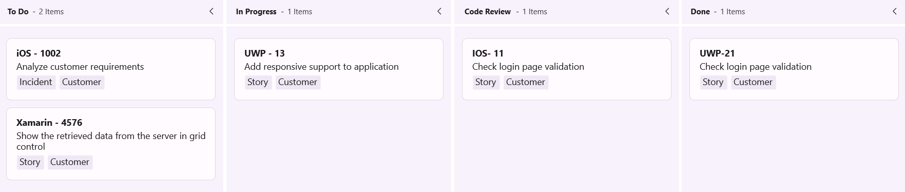

# Getting Started with .NET MAUI Kanban Board (SfKanban)

This section provides a quick overview for working with Essential® Kanban for .NET MAUI. It is an efficient way to visualize the workflow at each stage along its path to completion.

To get start quickly with our [.NET MAUI Kanban Board](https://help.syncfusion.com/cr/maui/Syncfusion.Maui.Kanban.SfKanban.html), you can check the below video.






## Prerequisites

Before proceeding, ensure the following are set up:

1. Install [.NET 9 SDK](https://dotnet.microsoft.com/en-us/download/dotnet/9.0) or later.
2. Set up a .NET MAUI environment with Visual Studio 2022 v17.12 or later.

## Step 1: Create a New MAUI Project

1. Go to **File > New > Project** and choose the **.NET MAUI App** template.
2. Name the project and choose a location. Then, click **Next**.
3. Select the .NET framework version and click **Create**.

## Step 2: Install the Syncfusion® MAUI Kanban NuGet Package

1. In **Solution Explorer**, right-click the project and choose **Manage NuGet Packages**.
2. Search for [Syncfusion.Maui.Kanban](https://www.nuget.org/packages/Syncfusion.Maui.Kanban/) and install the latest version.
3. Ensure the necessary dependencies are installed correctly, and the project is restored.




## Prerequisites

Before proceeding, ensure the following are set up:

1. Install [.NET 9 SDK](https://dotnet.microsoft.com/en-us/download/dotnet/9.0) or later.
2. Set up a .NET MAUI environment with Visual Studio Code.
3. Ensure that the .NET MAUI workloads are installed and configured as described [here](https://learn.microsoft.com/en-us/dotnet/maui/get-started/installation?view=net-maui-9.0&tabs=visual-studio-code).

## Step 1: Create a New .NET MAUI Project

1. Open the Command Palette by pressing **Ctrl+Shift+P** and type **.NET:New Project** and press Enter.
2. Choose the **.NET MAUI App** template.
3. Select the project location, type the project name and press Enter.
4. Then choose **Create project**

## Step 2: Install the Syncfusion® MAUI Kanban NuGet Package

1. Press <kbd>Ctrl</kbd> + <kbd>`</kbd> (backtick) to open the integrated terminal in Visual Studio Code.
2. Ensure you're in the project root directory where your .csproj file is located.
3. Run the command `dotnet add package Syncfusion.Maui.Kanban` to install the Syncfusion® .NET MAUI Kanban package.
4. To ensure all dependencies are installed, run `dotnet restore`.




## Prerequisites

Before proceeding, ensure the following are set up:

1. Install [.NET 9 SDK](https://dotnet.microsoft.com/en-us/download/dotnet/9.0) or later.
2. Set up a .NET MAUI environment with JetBrains Rider 2024.3 or later.
3. Make sure the MAUI workloads are installed and configured as described [here.](https://www.jetbrains.com/help/rider/MAUI.html#before-you-start)

## Step 1: Create a new .NET MAUI Project

1. Go to **File > New Solution,** Select .NET (C#) and choose the .NET MAUI App template.
2. Enter the Project Name, Solution Name, and Location.
3. Select the .NET framework version and click Create.

## Step 2: Install the Syncfusion® MAUI Kanban NuGet Package

1. In **Solution Explorer,** right-click the project and choose **Manage NuGet Packages.**
2. Search for [Syncfusion.Maui.Kanban](https://www.nuget.org/packages/Syncfusion.Maui.Kanban/) and install the latest version.
3. Ensure the necessary dependencies are installed correctly, and the project is restored. If not, Open the Terminal in Rider and manually run: `dotnet restore`




## Step 3: Register Syncfusion handler

Make sure to add the namespace.
 


using Syncfusion.Maui.Core.Hosting;


 
Register the Syncfusion core handler in your `CreateMauiApp` method of `MauiProgram.cs` file to use Syncfusion controls.
 


builder.ConfigureSyncfusionCore();



## Step 4: Import the Kanban namespace
 
Add the following namespace in your XAML or C#.
 


 
xmlns:kanban="clr-namespace:Syncfusion.Maui.Kanban;assembly=Syncfusion.Maui.Kanban"
 


 
using Syncfusion.Maui.Kanban;
 



## Step 5: Populate .NET MAUI Kanban item source

Initialize the .NET MAUI [`SfKanban`](https://help.syncfusion.com/cr/maui/Syncfusion.Maui.Kanban.SfKanban.html) control and populate its `ItemsSource` by creating and binding task data models.

### Creating the default model tasks

* **Define the View Model:** Create a view model class to set values for the properties listed in the [`KanbanModel`](https://help.syncfusion.com/cr/maui/Syncfusion.Maui.Kanban.KanbanModel.html) class as shown in the following example code. Each [`KanbanModel`](https://help.syncfusion.com/cr/maui/Syncfusion.Maui.Kanban.KanbanModel.html) instance represents a card in Kanban control.

* **Bind item source for Kanban:** To populate the Kanban card items, utilize the [`ItemsSource`](https://help.syncfusion.com/cr/maui/Syncfusion.Maui.Kanban.SfKanban.html#Syncfusion_Maui_Kanban_SfKanban_ItemsSource) property of [`SfKanban`](https://help.syncfusion.com/cr/maui/Syncfusion.Maui.Kanban.SfKanban.html).

* **Defining columns in the Kanban Board:** The columns are generated automatically based on the different values of [`Category`](https://help.syncfusion.com/cr/maui/Syncfusion.Maui.Kanban.KanbanModel.html#Syncfusion_Maui_Kanban_KanbanModel_Category) in the [`KanbanModel`](https://help.syncfusion.com/cr/maui/Syncfusion.Maui.Kanban.KanbanModel.html) class from [`ItemsSource`](https://help.syncfusion.com/cr/maui/Syncfusion.Maui.Kanban.SfKanban.html#Syncfusion_Maui_Kanban_SfKanban_ItemsSource). However, you can manually define the columns by setting the [`AutoGenerateColumns`](https://help.syncfusion.com/cr/maui/Syncfusion.Maui.Kanban.SfKanban.html#Syncfusion_Maui_Kanban_SfKanban_AutoGenerateColumns) property to `false` and adding [`KanbanColumn`](https://help.syncfusion.com/cr/maui/Syncfusion.Maui.Kanban.KanbanColumn.html) instances to the [`Columns`](https://help.syncfusion.com/cr/maui/Syncfusion.Maui.Kanban.SfKanban.html#Syncfusion_Maui_Kanban_SfKanban_Columns) property of [`SfKanban`](https://help.syncfusion.com/cr/maui/Syncfusion.Maui.Kanban.SfKanban.html). Define the categories of column using the [`Categories`](https://help.syncfusion.com/cr/maui/Syncfusion.Maui.Kanban.KanbanColumn.html#Syncfusion_Maui_Kanban_KanbanColumn_Categories) property of [`KanbanColumn`](https://help.syncfusion.com/cr/maui/Syncfusion.Maui.Kanban.KanbanColumn.html), and cards will be added to the respective columns.

The following sample code demonstrates this process in action:





<kanban:SfKanban x:Name="kanban"
                 AutoGenerateColumns="False"
                 ItemsSource="{Binding Cards}">
    <kanban:SfKanban.Columns>
        <kanban:KanbanColumn Title="To Do"
                             Categories="Open">
        </kanban:KanbanColumn>
        <kanban:KanbanColumn Title="In Progress"
                             Categories="In Progress">
        </kanban:KanbanColumn>
        <kanban:KanbanColumn Title="Code Review"
                             Categories="Code Review">
        </kanban:KanbanColumn>
        <kanban:KanbanColumn Title="Done"
                             Categories="Done">
        </kanban:KanbanColumn>
    </kanban:SfKanban.Columns>
    <kanban:SfKanban.BindingContext>
        <local:KanbanViewModel />
    </kanban:SfKanban.BindingContext>
</kanban:SfKanban>




SfKanban kanban = new SfKanban();
KanbanViewModel viewModel = new KanbanViewModel();
kanban.AutoGenerateColumns = false; 

kanban.Columns.Add(new KanbanColumn
{
    Title = "To Do",
    Categories = new List<object>() { "Open" },
});

kanban.Columns.Add(new KanbanColumn
{
    Title = "In Progress",
    Categories = new List<object>() { "In Progress" },
});

kanban.Columns.Add(new KanbanColumn
{
    Title = "Code Review",
    Categories = new List<object>() { "Code Review" },
});

kanban.Columns.Add(new KanbanColumn
{
    Title = "Done",
    Categories = new List<object>() { "Done" },
});

kanban.ItemsSource = viewModel.Cards;
this.Content = kanban;




public class KanbanViewModel
{
    public ObservableCollection<KanbanModel> Cards { get; set; }
    public KanbanViewModel()
    {
        this.Cards = new ObservableCollection<KanbanModel>();
        this.Cards.Add(new KanbanModel()
        {
            ID = 1,
            Title = "iOS - 1002",
            Category = "Open",
            Description = "Analyze customer requirements",
            IndicatorFill = Colors.Red,
            Tags = new List<string> { "Incident", "Customer" }
        });

        this.Cards.Add(new KanbanModel()
        {
            ID = 6,
            Title = "Xamarin - 4576",
            Category = "Open",
            Description = "Show the retrieved data from the server in grid control",
            IndicatorFill = Colors.Green,
            Tags = new List<string> { "Story", "Customer" }
        });

        this.Cards.Add(new KanbanModel()
        {
            ID = 13,
            Title = "UWP - 13",
            Category = "In Progress",
            Description = "Add responsive support to application",
            IndicatorFill = Colors.Brown,
            Tags = new List<string> { "Story", "Customer" }
        });

        this.Cards.Add(new KanbanModel()
        {
            ID = 2543,
            Title = "IOS- 11",
            Category = "Code Review",
            Description = "Check login page validation",
            IndicatorFill = Colors.Brown,
            Tags = new List<string> { "Story", "Customer" }
        });

        this.Cards.Add(new KanbanModel()
        {
            ID = 123,
            Title = "UWP-21",
            Category = "Done",
            Description = "Check login page validation",
            IndicatorFill = Colors.Brown,
            Tags = new List<string> { "Story", "Customer" }
        });
    }
}




You can download the Kanban Board Getting Started sample from [GitHub](https://github.com/SyncfusionExamples/GettingStarted_Kanban_MAUI)