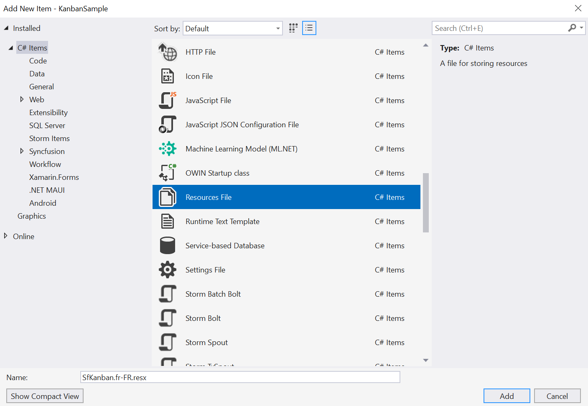
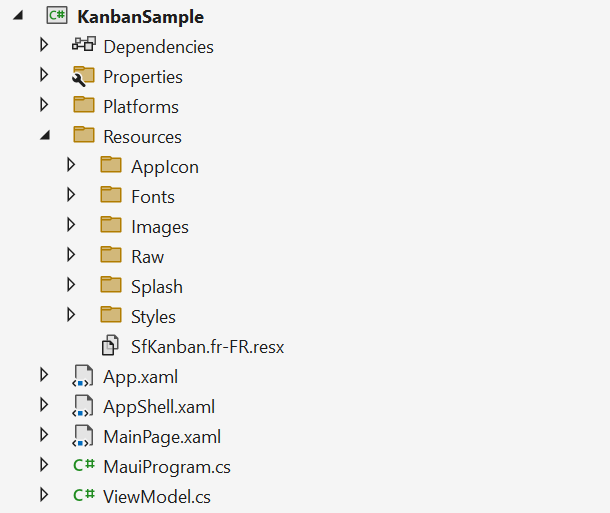
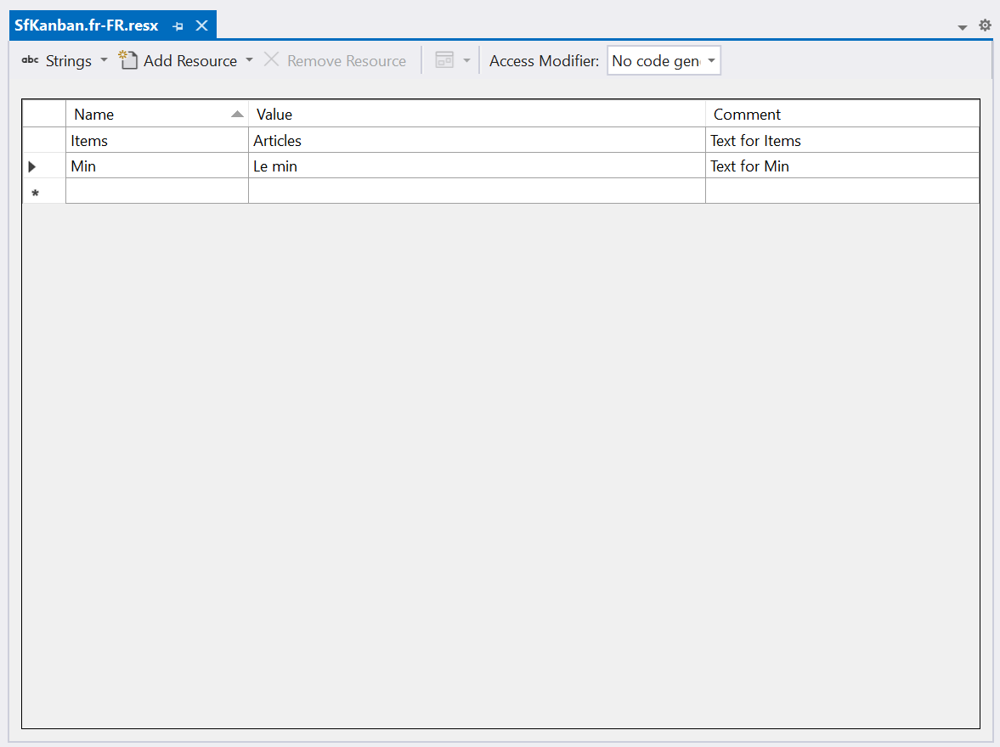
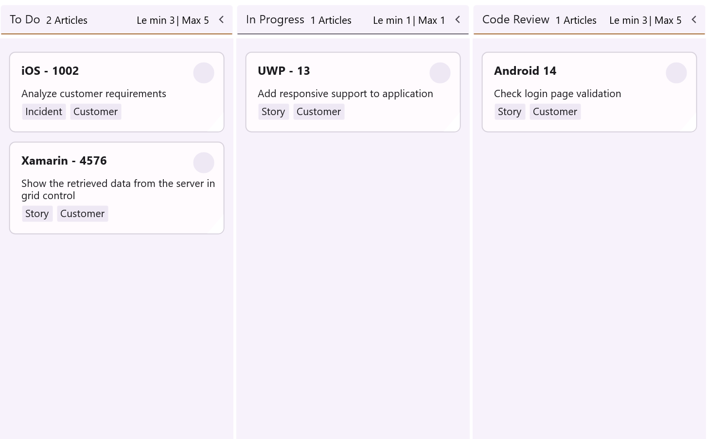

# Localization in .NET MAUI Kanban (SfKanban)

Localization is the process of translating the application resources into different language for the specific cultures. The [SfKanban](https://help.syncfusion.com/cr/maui/Syncfusion.Maui.Kanban.SfKanban.html) can be localized by adding `resource` file. 

## Setting CurrentUICulture to the application

Application culture can be changed by setting `CurrentUICulture.` in `App.xaml.cs` file.




using Syncfusion.Maui.Kanban;
using System.Globalization;
using System.Resources;

public partial class App : Application
{
	public App()
	{
            InitializeComponent();
            CultureInfo.CurrentUICulture = new CultureInfo("fr-FR");
            // ResXPath => Full path of the resx file; For example : 
            // SfKanbanResources.ResourceManager = new ResourceManager
            // ("KanbanSample.Resources.SfKanban", Application.Current.GetType().Assembly);

            var ResXPath = "KanbanSample.Resources.SfKanban";
            SfKanbanResources.ResourceManager = new ResourceManager(ResXPath, Application.Current.GetType().Assembly);
            MainPage = new AppShell();
	}
}




N> The required `resx` files with `Build Action` as `EmbeddedResource` (File name should contain culture code) into the `Resources` folder.

## Localize application level

To localize the `Kanban` based on `CurrentUICulture` using `resource` files, follow the below steps.

   1. Right-click on the `Resources` folder, select `Add` and then `NewItem.`

   2. In Add New Item, select the Resource File option and name the filename as `SfKanban.<culture name>.resx.` For example, give the name as `SfKanban.fr-FR.resx` for French culture.

   3. The culture name indicates the name of the language and country.

   

   4. Now, select `Add` option to add the resource file in **Resources** folder.

   

   5. Add the Name/Value pair in Resource Designer of `SfKanban.fr-FR.resx` file and change its corresponding value to corresponding culture.

   

Here, you can see how localization was performed for the Items and Min.
   
