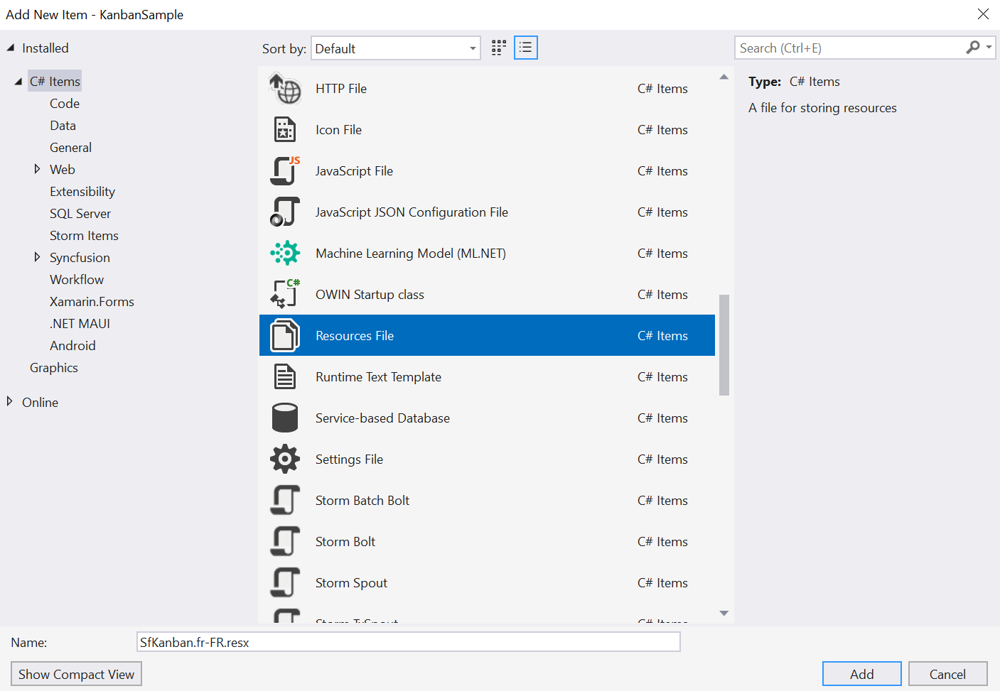
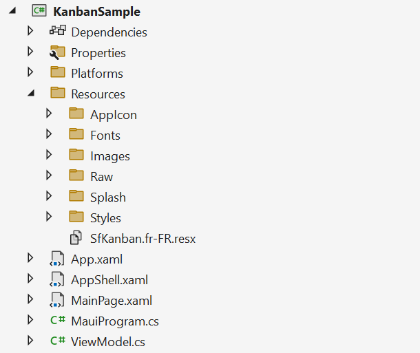
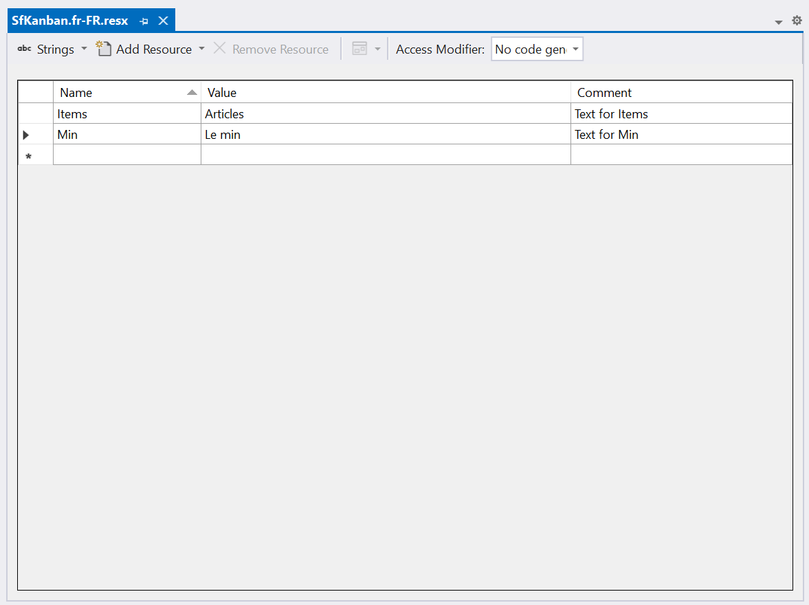
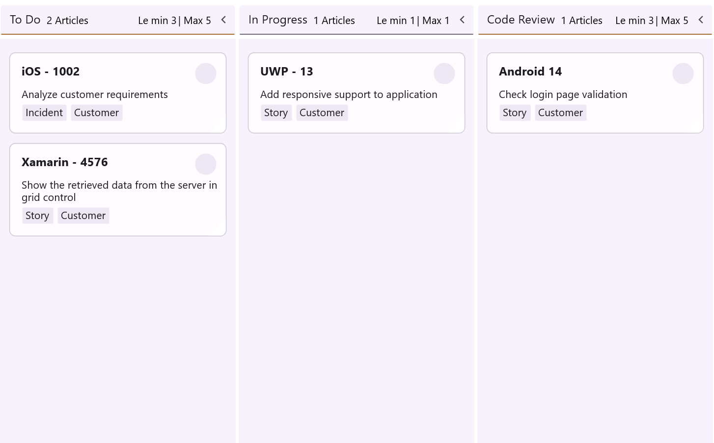

# Localization in .NET MAUI Kanban (SfKanban)

Localization is the process of translating application resources for specific cultures. The [SfKanban](https://help.syncfusion.com/cr/maui/Syncfusion.Maui.Kanban.SfKanban.html) can be localized by adding `.resx` resource files.

## Setting the CurrentUICulture

Set `CurrentUICulture` in `App.xaml.cs` to change the application culture.




using Syncfusion.Maui.Kanban;
using System.Globalization;
using System.Resources;

public partial class App : Application
{
	public App()
	{
            InitializeComponent();
            CultureInfo.CurrentUICulture = new CultureInfo("fr-FR");
            // ResXPath => Full path of the resx file; For example : 
            // SfKanbanResources.ResourceManager = new ResourceManager
            // ("KanbanSample.Resources.SfKanban", Application.Current.GetType().Assembly);

            var ResXPath = "KanbanSample.Resources.SfKanban";
            SfKanbanResources.ResourceManager = new ResourceManager(ResXPath, Application.Current.GetType().Assembly);
            MainPage = new AppShell();
	}
}




N> Add the required `.resx` files (with the culture code in the file name, for example `SfKanban.fr-FR.resx`) to the `Resources` folder, and set their build action to `EmbeddedResource` in the `.csproj`:

## Localize application level

## Localize application level

To localize the Kanban Board based on `CurrentUICulture`, follow these steps:

   1. Right-click the `Resources` folder, then select **Add > New Item**.

   2. In the **Add New Item** dialog, select **Resource File** and name the file `SfKanban.<culture name>.resx` (for example, `SfKanban.fr-FR.resx` for French). The culture name combines the language and country codes.

   

   4. Click **Add** to add the resource file to the **Resources** folder.

   

   5. In the Resource Designer of `SfKanban.fr-FR.resx`, add a Name/Value pair and set the Value to the corresponding culture-specific string.

   

Here, you can see how localization was performed for the Items and Min.
   
