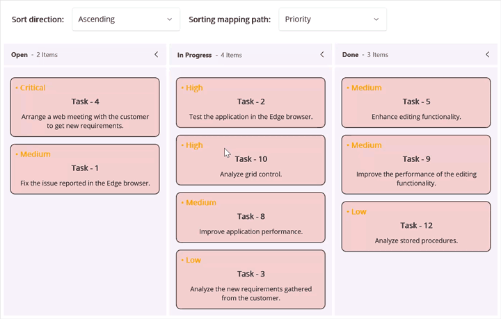
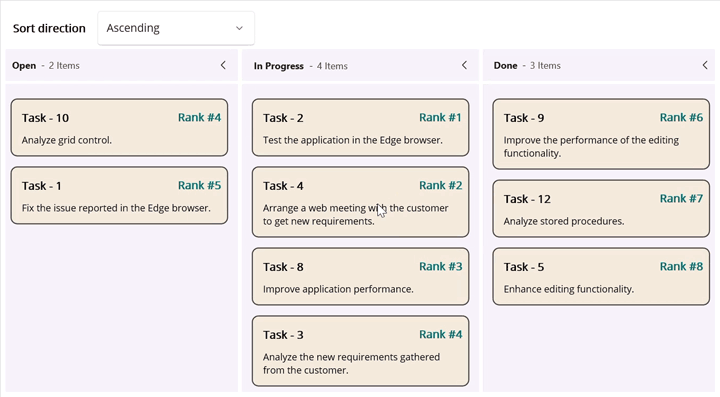

# Card Item Sorting in .NET MAUI Kanban (SfKanban)

The Kanban control supports customizable card sorting within columns based on specific data fields such as `Priority`, `DueDate`, or `Status`. Sorting can be configured programmatically and updated dynamically at runtime using the following properties:

* [SortingMappingPath](https://help.syncfusion.com/cr/maui/Syncfusion.Maui.Kanban.SfKanban.html#Syncfusion_Maui_Kanban_SfKanban_SortingMappingPath) - Used to map the sorting field to a property name in the [KanbanModel](https://help.syncfusion.com/cr/maui/Syncfusion.Maui.Kanban.KanbanModel.html) or `CustomModel`. The default value is `string.Empty`, in which case the cards will not be sorted.
* [SortingOrder](https://help.syncfusion.com/cr/maui/Syncfusion.Maui.Kanban.SfKanban.html#Syncfusion_Maui_Kanban_SfKanban_SortingOrder) - Used to define the direction of cards sorting within each column.
   * [Ascending](https://help.syncfusion.com/cr/maui/Syncfusion.Maui.Kanban.KanbanSortingOrder.html#Syncfusion_Maui_Kanban_KanbanSortingOrder_Ascending) - Cards with lower values appear first.
   * [Descending](https://help.syncfusion.com/cr/maui/Syncfusion.Maui.Kanban.KanbanSortingOrder.html#Syncfusion_Maui_Kanban_KanbanSortingOrder_Descending) - Cards with higher values appear first. 

N> The [SortingOrder](https://help.syncfusion.com/cr/maui/Syncfusion.Maui.Kanban.SfKanban.html#Syncfusion_Maui_Kanban_SfKanban_SortingOrder) property is applicable only when a valid value is assigned to [SortingMappingPath](https://help.syncfusion.com/cr/maui/Syncfusion.Maui.Kanban.SfKanban.html#Syncfusion_Maui_Kanban_SfKanban_SortingMappingPath).

## Customize card order with sorting configuration

Sorting in the Kanban control can be implemented using the following approaches.

   * Custom
   * Index

### Custom Field Sorting

To enable custom sorting behavior, a valid property name from the [ItemsSource](https://help.syncfusion.com/cr/maui/Syncfusion.Maui.Kanban.SfKanban.html#Syncfusion_Maui_Kanban_SfKanban_ItemsSource) must be mapped using the [SortingMappingPath](https://help.syncfusion.com/cr/maui/Syncfusion.Maui.Kanban.SfKanban.html#Syncfusion_Maui_Kanban_SfKanban_SortingMappingPath) property. This mapping ensures that cards are loaded and repositioned based on the corresponding property value, allowing consistent sorting during both initialization and drag-and-drop operations.

This example demonstrates how card positions are updated based on sorting configurations and property mappings.




<kanban:SfKanban x:Name="kanban"
                 SortingMappingPath="Index"
                 SortingOrder="Ascending"
                 ItemsSource="{Binding Cards}"
                 ColumnMappingPath="Category">
    <kanban:SfKanban.CardTemplate>
        <DataTemplate>
            <Border Stroke="Black"
                    StrokeThickness="1"
                    StrokeShape="RoundRectangle 8"
                    Background="#F3CFCE">
                <Grid RowDefinitions="Auto,Auto,Auto"
                      ColumnDefinitions="Auto,*"
                      ColumnSpacing="8"
                      Padding="8">
                    <HorizontalStackLayout Grid.Row="0"
                                           Grid.ColumnSpan="2"
                                           Spacing="4"
                                           VerticalOptions="Center"
                                           HeightRequest="20">
                        <Label Grid.Row="0"
                               Grid.ColumnSpan="2"
                               Text="{Binding Priority, StringFormat='• {0}'}"
                               FontSize="14"
                               FontAttributes="Bold"
                               TextColor="Orange"
                               VerticalOptions="Center"
                               VerticalTextAlignment="Center"
                               HeightRequest="20"/>
                    </HorizontalStackLayout>
                    <Label Grid.Row="1"
                           Grid.ColumnSpan="2"
                           Text="{Binding Title}"
                           FontAttributes="Bold"
                           FontSize="14"
                           HorizontalTextAlignment="Center"
                           VerticalTextAlignment="Center"
                           Margin="5"/>
                    <Label Grid.Row="2"
                           Grid.ColumnSpan="2"
                           Text="{Binding Description}"
                           FontSize="12"
                           HorizontalTextAlignment="Center"
                           LineBreakMode="WordWrap"
                           Margin="5"/>
                </Grid>
            </Border>
        </DataTemplate>
    </kanban:SfKanban.CardTemplate>
    <kanban:KanbanColumn Title="Open"
                         Categories="Open"/>
    <kanban:KanbanColumn Title="In Progress"
                         Categories="In Progress"/>
    <kanban:KanbanColumn Title="Done"
                         Categories="Done"
                         AllowDrag="False"/>
    <kanban:SfKanban.BindingContext>
        <local:SortingViewModel/>
    </kanban:SfKanban.BindingContext>
</kanban:SfKanban>




this.kanban.ItemsSource = new SortingViewModel().Cards;
this.kanban.DragEnd += this.OnCardDragEnd;

private void OnCardDragEnd(object? sender, KanbanDragEndEventArgs e)
{
    this.kanban.RefreshKanbanColumn();
}




public class CardDetails
{
    public string? Title { get; set; }
    public string? Description { get; set; }
    public string? Priority { get; set; }
    public string? Category { get; set; }
}




public class SortingViewModel
{
    public SortingViewModel()
    {
        this.Cards = new ObservableCollection<CardDetails>()
        {
            new CardDetails() { Title = "Task - 1", Priority = "Medium", Category = "Open", Description = "Fix the issue reported in the Edge browser." },
            new CardDetails() { Title = "Task - 3", Priority = "Low", Category = "In Progress", Description = "Analyze the new requirements gathered from the customer." },
            new CardDetails() { Title = "Task - 4", Priority = "Critical", Category = "Open", Description = "Arrange a web meeting with the customer to get new requirements." },
            new CardDetails() { Title = "Task - 2", Priority = "High", Category = "In Progress", Description = "Test the application in the Edge browser." },
            new CardDetails() { Title = "Task - 5", Priority = "Medium", Category = "Done", Description = "Enhance editing functionality." },
            new CardDetails() { Title = "Task - 8", Priority = "Medium", Category = "In Progress", Description = "Improve application performance." },
            new CardDetails() { Title = "Task - 9", Priority = "Medium", Category = "Done", Description = "Improve the performance of the editing functionality." },
            new CardDetails() { Title = "Task - 10", Priority = "High", Category = "Open", Description = "Analyze grid control." },
            new CardDetails() { Title = "Task - 12", Priority = "Low", Category = "Done", Description = "Analyze stored procedures." }
        };
    }

    public ObservableCollection<CardDetails> Cards { get; set; }
}




N>
[View sample in GitHub](https://github.com/SyncfusionExamples/maui-kanban-examples/tree/master/CustomFieldSorting)

N> 
 * To apply sorting after a drop operation, handle the [DragEnd](https://help.syncfusion.com/cr/maui/Syncfusion.Maui.Kanban.SfKanban.html#Syncfusion_Maui_Kanban_SfKanban_DragEnd) event and explicitly call the [RefreshKanbanColumn](https://help.syncfusion.com/cr/maui/Syncfusion.Maui.Kanban.SfKanban.html#Syncfusion_Maui_Kanban_SfKanban_RefreshKanbanColumn) method. This ensures the column updates to reflect the new card order based on the defined sorting logic.
 * When using a custom data model, the default card UI is not applicable. To render the card content, you must define a custom `DataTemplate` using the [CardTemplate](https://help.syncfusion.com/cr/maui/Syncfusion.Maui.Kanban.SfKanban.html#Syncfusion_Maui_Kanban_SfKanban_CardTemplate) property.

### Index-Based Sorting

The index-based approach in the Kanban control allows cards to be dropped at precise positions within a column. Upon dropping, the card's index is updated based on the index of the previous card. Additionally, the index of the next card is incremented relative to the drop position to maintain continuous ordering.

N> The [SortingMappingPath](https://help.syncfusion.com/cr/maui/Syncfusion.Maui.Kanban.SfKanban.html#Syncfusion_Maui_Kanban_SfKanban_SortingMappingPath) property must be mapped to a valid numeric property name from the [ItemsSource](https://help.syncfusion.com/cr/maui/Syncfusion.Maui.Kanban.SfKanban.html#Syncfusion_Maui_Kanban_SfKanban_ItemsSource) to enable index-based sorting updates.

The following code example illustrates how cards numeric property is updated using the index-based sorting approach.




<kanban:SfKanban x:Name="kanban"
                 SortingMappingPath="Index"
                 SortingOrder="Ascending"
                 ItemsSource="{Binding Cards}"
                 ColumnMappingPath="Category">
    <kanban:SfKanban.CardTemplate>
        <DataTemplate>
            <Border Stroke="Black"
                    StrokeThickness="1"
                    StrokeShape="RoundRectangle 8"
                    Background="#F3EADC">
                <Grid RowDefinitions="Auto,Auto,Auto"
                      ColumnDefinitions="Auto,*"
                      ColumnSpacing="8"
                      Padding="8">
                    <HorizontalStackLayout Grid.Row="0"
                                           Grid.ColumnSpan="2"
                                           Spacing="4"
                                           VerticalOptions="Center"
                                           HeightRequest="20"
                                           HorizontalOptions="End">
                        <Label Text="{Binding Index, StringFormat='Rank #{0}'}"
                               FontSize="14"
                               FontAttributes="Bold"
                               TextColor="#026B6E"
                               VerticalOptions="Center"
                               VerticalTextAlignment="Center"
                               HeightRequest="20"/>
                    </HorizontalStackLayout>
                    <Label Grid.Row="1"
                           Grid.ColumnSpan="2"
                           Text="{Binding Title}"
                           FontAttributes="Bold"
                           FontSize="14"
                           HorizontalTextAlignment="Center"
                           VerticalTextAlignment="Center"
                           Margin="5"/>
                    <Label Grid.Row="2"
                           Grid.ColumnSpan="2"
                           Text="{Binding Description}"
                           FontSize="12"
                           HorizontalTextAlignment="Center"
                           LineBreakMode="WordWrap"
                           Margin="5"/>
                </Grid>
            </Border>
        </DataTemplate>
    </kanban:SfKanban.CardTemplate>
    <kanban:KanbanColumn Title="Open"
                         Categories="Open"/>
    <kanban:KanbanColumn Title="In Progress"
                         Categories="In Progress"/>
    <kanban:KanbanColumn Title="Done"
                         Categories="Done"
                         AllowDrag="False"/>
    <kanban:SfKanban.BindingContext>
        <local:SortingViewModel/>
    </kanban:SfKanban.BindingContext>
</kanban:SfKanban>




this.kanban.ItemsSource = new SortingViewModel().Cards;
this.kanban.DragEnd += this.OnCardDragEnd;

private void OnCardDragEnd(object? sender, KanbanDragEndEventArgs e)
{
    if (this.kanban == null)
    {
        return;
    }

    this.ApplySortingWithoutPositionChange(e);
    this.kanban.RefreshKanbanColumn();
}

private void ApplySortingWithoutPositionChange(KanbanDragEndEventArgs eventArgs)
{
    if (this.kanban == null || eventArgs.Data == null || eventArgs.TargetColumn?.Items == null || eventArgs.SourceColumn == null || (eventArgs.SourceColumn == eventArgs.TargetColumn && eventArgs.SourceIndex == eventArgs.TargetIndex))
    {
        return;
    }

    // Retrieve sorting configuration
    var sortMappingPath = kanban.SortingMappingPath;
    var sortingOrder = kanban.SortingOrder;

    // Extract and cast items from the target column
    var targetColumnItems = eventArgs.TargetColumn.Items is IList<object> items
        ? items.Cast<object>().ToList() : new List<object>();

    // Proceed only if sorting path is defined
    if (string.IsNullOrEmpty(sortMappingPath))
    {
        return;
    }

    // Sort items based on the sorting order
    if (targetColumnItems.Count > 0)
    {
        Func<object, object?> keySelector = item => this.GetPropertyInfo(item.GetType(), sortMappingPath);

        targetColumnItems = sortingOrder == KanbanSortingOrder.Ascending
            ? targetColumnItems.OrderBy(item => keySelector(item) ?? 0).ToList()
            : targetColumnItems.OrderByDescending(item => keySelector(item) ?? 0).ToList();
    }

    // Determine the index to insert the dragged card.
    int currentCardIndex = eventArgs.TargetIndex;
    if (currentCardIndex >= 0 && currentCardIndex <= targetColumnItems.Count)
    {
        targetColumnItems.Insert(currentCardIndex, eventArgs.Data);
    }
    else
    {
        targetColumnItems.Add(eventArgs.Data);
        currentCardIndex = targetColumnItems.Count - 1;
    }

    // Update index property of all items using smart positioning logic
    this.ApplySmartIndexUpdate(targetColumnItems, sortingOrder, currentCardIndex);
}

private void ApplySmartIndexUpdate(List<object> items, KanbanSortingOrder sortingOrder, int currentCardIndex)
{
    if (items == null || items.Count == 0)
    {
        return;
    }

    if (sortingOrder == KanbanSortingOrder.Ascending)
    {
        this.HandleAscendingIndexSorting(items, currentCardIndex);
        return;
    }

    this.HandleDescendingIndexSorting(items, currentCardIndex);
}

private void HandleAscendingIndexSorting(List<object> items, int currentCardIndex)
{
    int afterCardIndex = -1;
    int lastItemIndex = -1;

    // Get the index of the card after the insertion point
    if (currentCardIndex < items.Count - 1)
    {
        var afterCard = items[currentCardIndex + 1];
        afterCardIndex = GetCardIndex(afterCard) ?? -1;
    }

    for (int i = 0; i < items.Count; i++)
    {
        var item = items[i];
        if (item == null)
        {
            continue;
        }

        PropertyInfo? propertyInfo = this.GetPropertyInfo(item.GetType(), "Index");
        if (propertyInfo == null)
        {
            continue;
        }

        int itemIndex = Convert.ToInt32(propertyInfo.GetValue(item) ?? 0);
        bool isFirstItem = i == 0;
        if (isFirstItem)
        {
            // If the inserted card is at the beginning, assign a smart index
            if (currentCardIndex == 0)
            {
                lastItemIndex = afterCardIndex > 1 ? afterCardIndex - 1 : 1;
                propertyInfo.SetValue(item, lastItemIndex);
            }
            else
            {
                lastItemIndex = itemIndex;
            }
        }
        else
        {
            // Increment index for subsequent items
            lastItemIndex++;
            propertyInfo.SetValue(item, lastItemIndex);
        }
    }
}

private void HandleDescendingIndexSorting(List<object> items, int currentCardIndex)
{
    int beforeCardIndex = -1;
    int lastItemIndex = -1;

    // Get the index of the card before the insertion point
    if (currentCardIndex > 0 && currentCardIndex < items.Count)
    {
        var cardBefore = items[currentCardIndex - 1];
        beforeCardIndex = GetCardIndex(cardBefore) ?? -1;
    }

    for (int i = items.Count - 1; i >= 0; i--)
    {
        var item = items[i];
        if (item == null)
        {
            continue;
        }

        PropertyInfo? propertyInfo = this.GetPropertyInfo(item.GetType(), "Index");
        if (propertyInfo == null)
        {
            continue;
        }

        int itemIndex = Convert.ToInt32(propertyInfo.GetValue(item) ?? 0);
        bool isLastItem = i == items.Count - 1;
        if (isLastItem)
        {
            // If the inserted card is at the end, assign a smart index
            if (currentCardIndex == items.Count - 1)
            {
                lastItemIndex = beforeCardIndex > 1 ? beforeCardIndex - 1 : 1;
                propertyInfo.SetValue(item, lastItemIndex);
            }
            else
            {
                lastItemIndex = itemIndex;
            }
        }
        else
        {
            lastItemIndex++;
            propertyInfo.SetValue(item, lastItemIndex);
        }
    }
}

private int? GetCardIndex(object cardDetails)
{
    if (cardDetails == null)
    {
        return null;
    }

    PropertyInfo? propertyInfo = this.GetPropertyInfo(cardDetails.GetType(), "Index");
    if (propertyInfo == null)
    {
        return null;
    }

    var indexValue = propertyInfo.GetValue(cardDetails);
    if (indexValue != null)
    {
        return Convert.ToInt32(indexValue);
    }

    return null;
}

private PropertyInfo? GetPropertyInfo(Type type, string key)
{
    return this.GetPropertyInfoCustomType(type, key);
}

private PropertyInfo? GetPropertyInfoCustomType([DynamicallyAccessedMembers(DynamicallyAccessedMemberTypes.PublicProperties)] Type type, string key)
{
    return type.GetProperty(key);
}




public class CardDetails
{
    public string? Title { get; set; }
    public string? Description { get; set; }
    public int? Index { get; set; }
    public string? Category { get; set; }
}




public class SortingViewModel
{
    public SortingViewModel()
    {
        this.Cards = new ObservableCollection<CardDetails>()
        {
            new CardDetails() { Title = "Task - 1", Index = 5, Category = "Open", Description = "Fix the issue reported in the Edge browser." },
            new CardDetails() { Title = "Task - 3", Index = 9, Category = "In Progress", Description = "Analyze the new requirements gathered from the customer." },
            new CardDetails() { Title = "Task - 4", Index = 2, Category = "Open", Description = "Arrange a web meeting with the customer to get new requirements." },
            new CardDetails() { Title = "Task - 2", Index = 1, Category = "In Progress", Description = "Test the application in the Edge browser." },
            new CardDetails() { Title = "Task - 5", Index = 8, Category = "Done", Description = "Enhance editing functionality." },
            new CardDetails() { Title = "Task - 8", Index = 3, Category = "In Progress", Description = "Improve application performance." },
            new CardDetails() { Title = "Task - 9", Index = 6, Category = "Done", Description = "Improve the performance of the editing functionality." },
            new CardDetails() { Title = "Task - 10", Index = 4, Category = "Open", Description = "Analyze grid control." },
            new CardDetails() { Title = "Task - 12", Index = 7, Category = "Done", Description = "Analyze stored procedures." }
        };
    }
    
    public ObservableCollection<CardDetails> Cards { get; set; }
}




N>
[View sample in GitHub](https://github.com/SyncfusionExamples/maui-kanban-examples/tree/master/IndexBasedSorting)

N> 
 * The Index-based sorting can be achieved at the sample level after a drag-and-drop action. To implement this handle the [DragEnd](https://help.syncfusion.com/cr/maui/Syncfusion.Maui.Kanban.SfKanban.html#Syncfusion_Maui_Kanban_SfKanban_DragEnd) event, access the items in the target column using [e.TargetColumn.Items](https://help.syncfusion.com/cr/maui/Syncfusion.Maui.Kanban.KanbanColumn.html#Syncfusion_Maui_Kanban_KanbanColumn_Items), and update the numeric field used for sorting to maintain a continuous order. Finally, call [RefreshKanbanColumn](https://help.syncfusion.com/cr/maui/Syncfusion.Maui.Kanban.SfKanban.html#Syncfusion_Maui_Kanban_SfKanban_RefreshKanbanColumn) method to update the UI with the new order.
 * To disable sorting logic, avoid assigning a value to the [SortingMappingPath](https://help.syncfusion.com/cr/maui/Syncfusion.Maui.Kanban.SfKanban.html#Syncfusion_Maui_Kanban_SfKanban_SortingMappingPath) property. This ensures that card positions remain static and reflect the order of the [ItemsSource](https://help.syncfusion.com/cr/maui/Syncfusion.Maui.Kanban.SfKanban.html#Syncfusion_Maui_Kanban_SfKanban_ItemsSource) collection, making it suitable for scenarios where sorting is not required or is managed externally.
