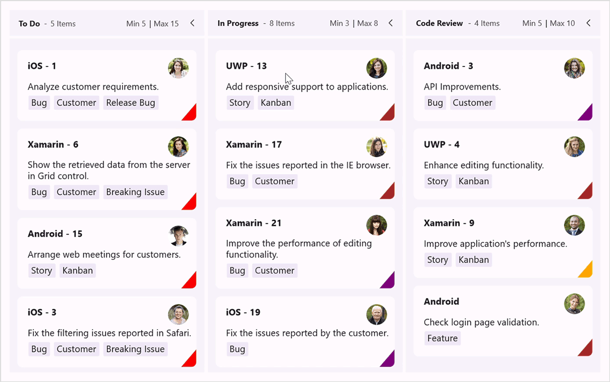

# Workflows in .NET MAUI Kanban Board (SfKanban)

This feature is used to define the flow of cards between columns, offering restrictions when moving cards from one column to another. It also supports preventing drag-and-drop actions on specific columns.

To define the flow of card transitions between different states, create an instance of the [KanbanWorkflow](https://help.syncfusion.com/cr/maui/Syncfusion.Maui.Kanban.KanbanWorkflow.html) class and add it to the [Workflows](https://help.syncfusion.com/cr/maui/Syncfusion.Maui.Kanban.SfKanban.html#Syncfusion_Maui_Kanban_SfKanban_Workflows) property of the [SfKanban](https://help.syncfusion.com/cr/maui/Syncfusion.Maui.Kanban.SfKanban.html) to define the workflow for each column. The [KanbanWorkflow](https://help.syncfusion.com/cr/maui/Syncfusion.Maui.Kanban.KanbanWorkflow.html) class contains the following properties to specify the source and target categories.

* [`Category`](https://help.syncfusion.com/cr/maui/Syncfusion.Maui.Kanban.KanbanWorkflow.html#Syncfusion_Maui_Kanban_KanbanWorkflow_Category) - Used to define the source category/state.
* [`AllowedTransitions`](https://help.syncfusion.com/cr/maui/Syncfusion.Maui.Kanban.KanbanWorkflow.html#Syncfusion_Maui_Kanban_KanbanWorkflow_AllowedTransitions) - Used to define the list of categories/states, the card with the state specified in KanbanWorkflow. Category is allowed to transit.

The following code example describes the workflow functionality.





<kanban:SfKanban x:Name="kanban"
                 AutoGenerateColumns="False"
                 ItemsSource="{Binding Cards}">
    <kanban:SfKanban.BindingContext>
        <local:ViewModel />
    </kanban:SfKanban.BindingContext>
    
    <kanban:KanbanColumn Title="To Do"
                         Categories="Open,Postponed"
                         MinimumLimit="5"
                         MaximumLimit="15" />
    <kanban:KanbanColumn Title="In Progress"
                         Categories="In Progress"
                         MinimumLimit="3"
                         MaximumLimit="8" />
    <kanban:KanbanColumn Title="Code Review"
                         Categories="Code Review"
                         MinimumLimit="5"
                         MaximumLimit="10" />
    <kanban:KanbanColumn Title="Done"
                         Categories="Closed,Closed No Changes,Won't Fix"
                         MinimumLimit="8" />
</kanban:SfKanban>





this.kanban.Workflows = new List<KanbanWorkflow>()
{
    new KanbanWorkflow("Open", new List<object>() { "In Progress", "Closed", "Closed No Changes", "Won't Fix" }),
    new KanbanWorkflow("Postponed", new List<object>() { "Open", "In Progress", "Closed", "Closed No Changes", "Won't Fix" }),
    new KanbanWorkflow("Code Review", new List<object>() { "In Progress", "Closed", "Postponed" }),
    new KanbanWorkflow("In Progress", new List<object>() { "Code Review", "Postponed" }),
};





public class ViewModel
{
    #region Constructor

    /// 

    /// Initializes a new instance of the <see cref="ViewModel"/> class.
    /// 

    public ViewModel()
    {
        this.Cards = this.GetCardDetails();
    }

    #endregion

    #region Properties

    /// 

    /// Gets or sets the collection of <see cref="KanbanModel"/> objects representing cards in various stages.
    /// 

    public ObservableCollection<KanbanModel> Cards { get; set; }

    #endregion

    #region Private methods

    /// 

    /// Represents the retrieval of a collection of predefined Kanban task cards.
    /// 

    /// <returns>An observable collection of <see cref="KanbanModel"/> instances.</returns>
    private ObservableCollection<KanbanModel> GetCardDetails()
    {
        Assembly assemblyName = typeof(SfImageSourceConverter).GetTypeInfo().Assembly;
        var cardsDetails = new ObservableCollection<KanbanModel>();

        cardsDetails.Add(new KanbanModel()
        {
            ID = 1,
            Title = "iOS - 1",
            ImageURL = assemblyName + ".people_circle1.png",
            Category = "Open",
            Description = "Analyze customer requirements.",
            IndicatorFill = Colors.Red,
            Tags = new List<string> { "Bug", "Customer", "Release Bug" }
        });

        cardsDetails.Add(new KanbanModel()
        {
            ID = 6,
            Title = "Xamarin - 6",
            ImageURL = assemblyName + ".people_circle2.png",
            Category = "Open",
            Description = "Show the retrieved data from the server in Grid control.",
            IndicatorFill = Colors.Red,
            Tags = new List<string> { "Bug", "Customer", "Breaking Issue" }
        });

        cardsDetails.Add(new KanbanModel()
        {
            ID = 3,
            Title = "iOS - 3",
            ImageURL = assemblyName + ".people_circle3.png",
            Category = "Postponed",
            Description = "Fix the filtering issues reported in Safari.",
            IndicatorFill = Colors.Red,
            Tags = new List<string> { "Bug", "Customer", "Breaking Issue" }
        });

        cardsDetails.Add(new KanbanModel()
        {
            ID = 11,
            Title = "iOS - 21",
            ImageURL = assemblyName + ".people_circle4.png",
            Category = "Postponed",
            Description = "Add input validation for editing.",
            IndicatorFill = Colors.Red,
            Tags = new List<string> { "Bug", "Customer", "Breaking Issue" }
        });

        cardsDetails.Add(new KanbanModel()
        {
            ID = 15,
            Title = "Android - 15",
            Category = "Open",
            ImageURL = assemblyName + ".people_circle5.png",
            Description = "Arrange web meetings for customers.",
            IndicatorFill = Colors.Red,
            Tags = new List<string> { "Story", "Kanban" }
        });

        cardsDetails.Add(new KanbanModel()
        {
            ID = 3,
            Title = "Android - 3",
            Category = "Code Review",
            ImageURL = assemblyName + ".people_circle6.png",
            Description = "API Improvements.",
            IndicatorFill = Colors.Purple,
            Tags = new List<string> { "Bug", "Customer" }
        });

        cardsDetails.Add(new KanbanModel()
        {
            ID = 4,
            Title = "UWP - 4",
            ImageURL = assemblyName + ".people_circle7.png",
            Category = "Code Review",
            Description = "Enhance editing functionality.",
            IndicatorFill = Colors.Brown,
            Tags = new List<string> { "Story", "Kanban" }
        });

        cardsDetails.Add(new KanbanModel()
        {
            ID = 9,
            Title = "Xamarin - 9",
            ImageURL = assemblyName + ".people_circle8.png",
            Category = "Code Review",
            Description = "Improve application's performance.",
            IndicatorFill = Colors.Orange,
            Tags = new List<string> { "Story", "Kanban" }
        });

        cardsDetails.Add(new KanbanModel()
        {
            ID = 13,
            Title = "UWP - 13",
            ImageURL = assemblyName + ".people_circle9.png",
            Category = "In Progress",
            Description = "Add responsive support to applications.",
            IndicatorFill = Colors.Brown,
            Tags = new List<string> { "Story", "Kanban" }
        });

        cardsDetails.Add(new KanbanModel()
        {
            ID = 17,
            Title = "Xamarin - 17",
            Category = "In Progress",
            ImageURL = assemblyName + ".people_circle10.png",
            Description = "Fix the issues reported in the IE browser.",
            IndicatorFill = Colors.Brown,
            Tags = new List<string> { "Bug", "Customer" }
        });

        cardsDetails.Add(new KanbanModel()
        {
            ID = 21,
            Title = "Xamarin - 21",
            Category = "In Progress",
            ImageURL = assemblyName + ".people_circle11.png",
            Description = "Improve the performance of editing functionality.",
            IndicatorFill = Colors.Purple,
            Tags = new List<string> { "Bug", "Customer" }
        });

        cardsDetails.Add(new KanbanModel()
        {
            ID = 19,
            Title = "iOS - 19",
            Category = "In Progress",
            ImageURL = assemblyName + ".people_circle12.png",
            Description = "Fix the issues reported by the customer.",
            IndicatorFill = Colors.Purple,
            Tags = new List<string> { "Bug" }
        });

        cardsDetails.Add(new KanbanModel()
        {
            ID = 8,
            Title = "Android",
            Category = "Code Review",
            ImageURL = assemblyName + ".people_circle13.png",
            Description = "Check login page validation.",
            IndicatorFill = Colors.Brown,
            Tags = new List<string> { "Feature" }
        });

        cardsDetails.Add(new KanbanModel()
        {
            ID = 24,
            Title = "UWP - 24",
            ImageURL = assemblyName + ".people_circle14.png",
            Category = "In Progress",
            Description = "Test editing functionality.",
            IndicatorFill = Colors.Orange,
            Tags = new List<string> { "Feature", "Customer", "Release" }
        });

        cardsDetails.Add(new KanbanModel()
        {
            ID = 20,
            Title = "iOS - 20",
            Category = "In Progress",
            ImageURL = assemblyName + ".people_circle15.png",
            Description = "Fix the issues reported in data binding.",
            IndicatorFill = Colors.Red,
            Tags = new List<string> { "Feature", "Release" }
        });

        cardsDetails.Add(new KanbanModel()
        {
            ID = 12,
            Title = "Xamarin - 12",
            Category = "In Progress",
            ImageURL = assemblyName + ".people_circle16.png",
            Description = "Test editing functionality.",
            IndicatorFill = Colors.Red,
            Tags = new List<string> { "Feature", "Release" }
        });

        cardsDetails.Add(new KanbanModel()
        {
            ID = 11,
            Title = "iOS - 11",
            Category = "In Progress",
            ImageURL = assemblyName + ".people_circle17.png",
            Description = "Check filtering validation.",
            IndicatorFill = Colors.Red,
            Tags = new List<string> { "Feature", "Release" }
        });

        cardsDetails.Add(new KanbanModel()
        {
            ID = 13,
            Title = "UWP - 13",
            ImageURL = assemblyName + ".people_circle18.png",
            Category = "Closed",
            Description = "Fix cannot open user's default database SQL error.",
            IndicatorFill = Colors.Purple,
            Tags = new List<string> { "Bug", "Internal", "Release" }
        });

        cardsDetails.Add(new KanbanModel()
        {
            ID = 14,
            Title = "Android - 14",
            Category = "Closed",
            ImageURL = assemblyName + ".people_circle19.png",
            Description = "Arrange a web meeting with the customer to get the login page requirement.",
            IndicatorFill = Colors.Red,
            Tags = new List<string> { "Feature" }
        });

        cardsDetails.Add(new KanbanModel()
        {
            ID = 15,
            Title = "Xamarin - 15",
            Category = "Closed",
            ImageURL = assemblyName + ".people_circle20.png",
            Description = "Login page validation.",
            IndicatorFill = Colors.Red,
            Tags = new List<string> { "Bug" }
        });

        cardsDetails.Add(new KanbanModel()
        {
            ID = 16,
            Title = "Xamarin - 16",
            ImageURL = assemblyName + ".people_circle21.png",
            Category = "Closed",
            Description = "Test the application in the IE browser.",
            IndicatorFill = Colors.Purple,
            Tags = new List<string> { "Bug" }
        });

        cardsDetails.Add(new KanbanModel()
        {
            ID = 20,
            Title = "UWP - 20",
            ImageURL = assemblyName + ".people_circle22.png",
            Category = "Closed",
            Description = "Analyze stored procedure.",
            IndicatorFill = Colors.Brown,
            Tags = new List<string> { "CustomSample", "Customer", "Incident" }
        });

        cardsDetails.Add(new KanbanModel()
        {
            ID = 21,
            Title = "Android - 21",
            Category = "Closed",
            ImageURL = assemblyName + ".people_circle23.png",
            Description = "Arrange a web meeting with the customer to get editing requirements.",
            IndicatorFill = Colors.Orange,
            Tags = new List<string> { "Story", "Improvement" }
        });

        return cardsDetails;
    }

    #endregion
}





By following the code snippet, you will notice that the card picked from the `In Progress` state is not allowed to be dropped in the `Open` state because we have defined that the card can only move from the `In Progress` state to the `Code Review`, and `Postponed` states, and not to any other states.